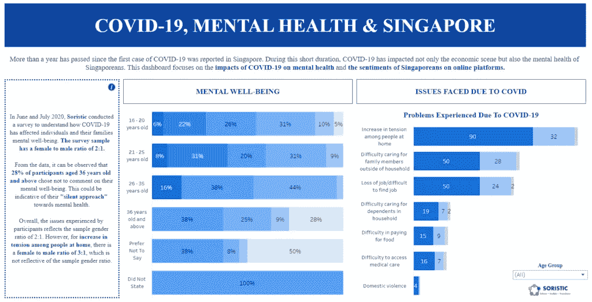
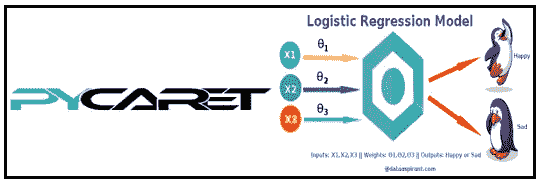

# 人工智能驱动的新冠肺炎精神健康影响的风险预测

> 原文：<https://medium.com/mlearning-ai/an-ai-driven-risk-predictor-for-mental-health-impacts-due-to-covid-19-4aa368842371?source=collection_archive---------7----------------------->

**[Image Source: CNN]**

> 我们已经为新冠肺炎造成的精神影响建立了一个风险预测模型，在本文中，我们将描述我们的新加坡奥姆德纳之旅。

**作者** : **安库尔·舒克拉**和**马内尔·贝哈吉**

为了直观地展示这些发现，请查看[我们的 Tableau 仪表盘](https://public.tableau.com/app/profile/claudia.chan/viz/OmdenaFinalv2/Dashboard3?publish=yes)。

# 问题陈述

如何识别和预测心理健康问题高风险用户的社交媒体帖子/推文/视频。

首先，我们必须评估这两个问题来进行我们的检查:

*   我们需要什么样的数据？
*   我们怎样才能访问它？

我们已经知道我们的问题是关于新加坡的 covid 精神健康影响，所以这是一个很好的开始，帮助我们最小化我们的搜索圈。但是具体收集什么呢？

# 数据源

因为我们是根据社交平台上个人用户的推文、帖子和视频来预测影响的，所以我们决定使用三个重要的数据源:

*   推特
*   Reddit
*   油管（国外视频网站）

我们的第一个目标是从 covid 开始评估是否对人们有重大影响。

我们的第二个目标是从这些影响中收集有意义的数据，以探索如何改进风险预测 ML 模型的新思路。

我们决定使用混合方法来收集定量和定性数据。

*   定量数据用数字和图表表示，并通过统计方法进行分析。
*   定性数据用文字表达，并通过解释和分类进行分析。

现在对于第二个问题，当一个数据分析师/科学家想要在短时间内收集一些数据时，首先要做的就是 Kaggle！对吗？

当数据可以像在 Kaggle 上一样容易地被访问时，这有多棒？数据收集？只需访问 Kaggle，找到合适的数据集，不到 5 分钟就能下载完毕。

*   提示:使用 Kaggle 数据集是不够的。

在大量的“谷歌搜索”之后，我们决定从第三方那里找到我们需要的数据。

# 简而言之，我们是如何勉强度日的:

*   理解并检查网页，找到与我们想要的信息相关的 HTML 标记。
*   使用 snscrape，twint -Python 库来抓取 twitter tweets。
*   使用 YouTube API 收集评论
*   处理收集到的数据，使其成为我们需要的形式。(CSV 格式)

**注**:每个数据源的数据采集和准备工作由不同的采集任务团队完成。每个团队合作并提供来自上述数据源的干净数据。

# 方法学

基于来自社交平台的不同特征作为数据源，进行关于精神影响的用户级风险预测，我们提出了以下用于建模的 ML 方法:

*监督学习-* 分类模型

# 为什么我们使用有监督的学习分类模型而不是无监督的方法？

监督学习分类算法用于预测目标变量的概率。在这种情况下，目标或因变量的性质是二分法的，这意味着只有两种可能的类别，因此用户是否受到心理影响将是“是”或“否”。

# 使用的工具和编程语言:

*   巨蟒领航员
*   Jupyter 笔记本
*   大蟒
*   Google Colab

# 算法

*   Pycaret 自动 ML
*   逻辑回归

# Pycaret 是什么？

Pycaret 是一个用 Python 编写的开源、低代码的机器学习库，允许您在自己选择的笔记本环境中，在几分钟内从准备数据到部署模型。

# 为什么选择 Pycaret 以及它如何帮助我们？

*   提高生产率:Pycaret 是一个低代码库，使您的生产率更高。随着花在编码上的时间减少，我们的团队现在可以将更多的精力放在业务问题上。
*   易于使用:Pycaret 是一个简单易用的机器学习库，它将帮助您用更少的代码行执行端到端的 ML 实验。
*   业务就绪:Pycaret 是一个业务就绪的解决方案。它允许我们从我们选择的笔记本电脑环境中快速高效地进行原型制作。

# 逻辑回归

逻辑回归是解决二元和多标签分类问题的最常见、最简单和最有效的方法之一。[除了 Pycaret 方法之外，我们还使用了这种算法，只是为了传统的方法，并查看结果差异(如果有)。

# 模型结构

***解决方案—*** 最后，我们开发了一个风险预测 ML 模型来识别在此期间具有精神影响的用户，然后训练该模型，以便将来可以使用该模型来预测用户以及与其相关联的精神影响的风险。

*   建立模型以预测来自不同社交平台的用户因 2019 年底开始的 covid 情况而产生的心理影响。
*   根据该模型，目标变量是具有负面或非常负面情绪并且包含 covid 的所有特征的用户，并且预测心理健康关键词。
*   该模型是根据我们从不同来源获得的疫情的现有数据进行训练和测试的，我们确定了目标用户。
*   该模型的目的是，它可以用于未来的数据，并查看用户在后疫情时期是否有影响，这将有助于社会组织和非政府组织识别和预测精神受到影响的人，以便提供更好的支持和帮助。

# 特征重要性

# 什么是特征重要性？

要素重要性是一种为预测模型的输入要素分配分数的方法，可在进行预测时指示每个要素的相对重要性。它帮助我们消除不重要的特征(变量)，并提高分类模型的整体准确性和性能。

# 我们如何在模型中使用特征重要性？

我们回顾了一些重要的特征，它们帮助我们建立了精确的模型。Covid、心理健康、相关性和消极性是最重要的特征。后来，当使用 pycaret 时，我们在看不见的数据上评估了具有良好准确性的模型。

# 模型的总结和推论

*   来自 Twitter、Reddit 和 Omdena 的用户总数超过 8 万。
*   结果-在总共 80，000 多名用户中，Has_Mental_Impact -4720 名用户
*   模型的准确性通常是真实结果(真阳性+真阴性)在总结果中的比例。

准确度= (TP+TN)/(TP+FP+FN+TN)

对于我们的模型，我们得到了 100%的准确性，理论上这意味着我们的模型在测试/看不见的数据上有效地预测。这里满分的原因是因为我们没有做出任何假阳性和假阴性的预测。

与上述理论相反，有限数据的准确度分数为 1(100%)对我们训练的数据提出了一些问题，以及我们是否使用了足够或正确的预测器，这些预测器可以给我们不完美但至少很少现实的准确度。

也许我们用于训练和测试的数据是好的，但不足以给预测者带来多样性。例如，如果我们考虑了一些预测因素，如使用社交平台的用户的年龄、性别和职业，或任何其他可以探索的重要列，并可以用于提高功能重要性部分的效率，然后它可能会改变真阳性和真阴性的值，最终会对模型准确性产生影响。

# 数据泄露问题

在我们的模型中，我们试图预测的目标结果似乎已经存在于我们的训练数据中，然后包含在测试/看不见的数据中，这在数据科学语言中称为数据泄漏。

在部署模型后，这通常会导致现实世界场景中的预测结果不可靠。

# 模型中数据泄漏的可能原因

1.  将目标变量作为一个特征包括在内，在某种程度上破坏了我们预测模型的目标，因为它与另一组特征没有什么不同。
2.  **赠品特征** —这些是暴露关于目标变量的信息的特征，并且一旦模型被部署到真实世界场景，它将是不可用的。我们的模型解释了赠送功能的一些情况:
3.  在我们的模型中，我们根据不同的特征预测心理影响。现在，假设我们有一个特征，表明用户已经显示出除了目标变量之外的精神影响的迹象，那么我们永远不应该将它作为一个特征包括在训练数据中。如果我们已经知道一个用户有一个基于特定特征的明确的心理影响，那么我们可能不需要一个预测模型。
4.  我们模型中的另一个例子是基于当前疫情数据的训练模型。一旦部署了模型，我们必须评估对用户的影响——让我们说后疫情时间，因为在这种情况下，包括暴露后疫情时间信息的功能将导致泄漏。因此，我们应该只使用在模型被部署和用于未来数据之后才可用的特性

# 我们如何避免数据泄露问题呢？

*   在我们的模型中，我们使用相同的数据集来划分成训练集，然后使用其中的一部分作为测试/未知数据，但如果包含一组验证数据会更好。这将作为一个真实的场景来测试你的模型并最终验证它。
*   在 EDA 过程中，应探索高度相关的特性，因为它会导致模型中的偏差。
*   训练后，应检查数据是否有非常高的权重，因为可能会出现泄漏
*   应用预处理步骤来探索或清理数据，如移除异常值、估计缺失值等。应该在训练数据而不是整个数据集上单独完成，如果我们在整个数据集上使用，将会发生数据泄漏，并且我们都知道该数据不会是预测模型的新的看不见的数据。

# 部署和未来增强

*   在未来，我们可以使用更多的疫情大流行前和大流行后的数据，然后运行模型来预测目标用户。
*   我们可以探索更多的功能(例如，帖子中的文本或任何其他具有更多健康关键词的列)以获得更好的模型。
*   更多地利用健康专家的专业知识来理解心理健康的构成因素，并更多地探索数据。
*   我们将使用 flask 应用程序将我们的模型部署到生产中。

# 经验教训

*   使用 Pycaret 探索自动 ML 的机会。
*   探索了合并数据与独立数据源的模型。
*   特征重要性在确定用于模型构建的最佳预测器时起着至关重要的作用。
*   了解数据泄漏问题以及如何从预处理和探索性数据分析的最初阶段避免数据泄漏的经验教训。

# 源代码:GitHub

****【风险预测器】****

# **Github 简介:**

**[**https://github.com/ankurshukla4589**](https://github.com/ankurshukla4589)**

** [## belhajManel -概述

### 此时您不能执行该操作。您已使用另一个标签页或窗口登录。您已在另一个选项卡中注销，或者…

github.com](https://github.com/belhajManel)  [## Mlearning.ai 提交建议

### 如何成为 Mlearning.ai 上的作家

medium.com](/mlearning-ai/mlearning-ai-submission-suggestions-b51e2b130bfb)**