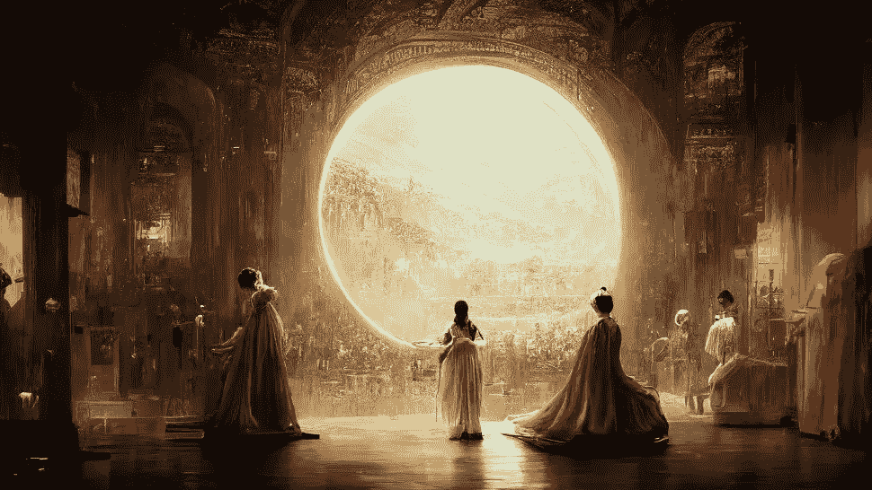
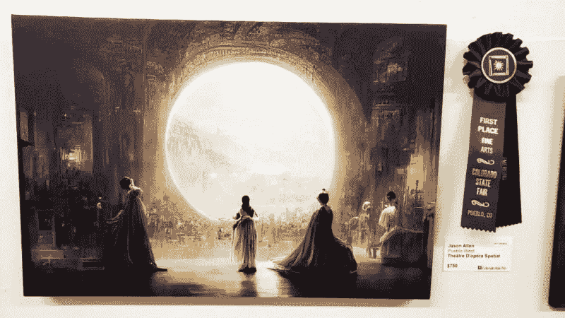

# 人工智能生成的绘画赢得艺术比赛，惹恼艺术家

> 原文：<https://medium.com/mlearning-ai/an-ai-generated-painting-wins-art-contest-annoys-artists-f3f7c98e3088?source=collection_archive---------0----------------------->

Théâtre d’Opéra Spatial (Image credit: Jason Allen)

Jason M. Allen 先生将其人工智能生成的艺术作品参加了科罗拉多州博览会的艺术比赛，并赢得了数字艺术/数字操纵摄影类别的第一名。这种情况正在 Twitter 上引发关于人工智能和艺术的激烈辩论。

他的艺术作品“Thétre d ' opéra Spatial”是由一个名为**的人工智能生成的。正如他们网站上所说，Midjourney 是一个独立的研究实验室，探索新的思维媒介，拓展人类的想象力。**

*Midjourney 基本上是一个研究实验室，生产一个人工智能程序，从文本描述中创建图像。*

*他用它创作了 100 多幅图像，经过几周的改进过程，他选择了前三幅。然后，他使用 [*GigaPixel AI*](https://www.topazlabs.com/gigapixel-ai) 对它们进行升级，将它们打印在画布上，并在 8 月初提交给比赛。*

*但是当艾伦在 midway Discord 服务器上发布获胜消息，并在 Twitter、Reddit 和 midway Discord 服务器上引发热烈讨论时。*

**

*(Image credit: Jason Allen)*

> *TL；DR——有人用人工智能生成的作品参加了一场艺术比赛，并获得了一等奖。是啊，这真他妈的糟糕——Genel ju malon 在推特上说*

*艺术家 Genel Jumalon 在一条关于艾伦获奖的推特上说。*

> *我们正目睹艺术的死亡在我们眼前展开——如果创造性的工作在机器面前不安全，那么即使是高技能的工作也有被淘汰的危险，那么我们会有什么呢？Twitter 上的 OmniMorpho*

*一些人回复了推特[认为人类的艺术将因人工智能而毁灭，所有的艺术家都注定会被机器取代。](https://twitter.com/OmniMorpho/status/1564782875072872450?s=20&t=9-5sCdmSD4yYl4Ttvanm3Q)*

> *借助 NordVPN，您可以在任何地方安全地观看您最喜爱的体育节目或流媒体内容。无论你是在美国还是在国外，你都可以访问你最喜欢的流媒体服务，如网飞、Hulu、BBC iPlayer 等。不要让地理限制妨碍你的娱乐。我们的威胁防护功能可以阻止恶意软件、广告、恶意网站和追踪器，让您安全地观看喜爱的节目。*

*👉 [**了解更多关于 NordVPN**](https://go.nordvpn.net/aff_c?offer_id=15&aff_id=75170&url_id=2661) **🛡***

*讨论是关于艺术的本质和作为一名艺术家意味着什么。*

*根据艾伦的说法，在创作这幅获奖画作时，他的意见非常重要。他在创作作品的过程中一直在探索特殊的提示。*

*竞赛提交指南没有直接提到人工智能生成的艺术，但他们将数字艺术定义为“*使用数字技术作为创意或展示过程的一部分的艺术实践。*”*

*艾伦的作品是人工智能或机器学习如何进步的一个明显例子。在数百万张网络图片上接受训练。但不要忘记，如果没有互联网上真实的人类艺术品，这些人工智能工具就不可能实现。*

*像 DALLE-E 2 和 Midjourney 这样的现代人工智能工具是人工智能中最热门的话题之一，因为它们的能力越来越令人印象深刻，尽管这些工具仍处于研究阶段。*

*类似地，19 世纪晚期照相机的发明也带来了类似的结果，因为照相机不用任何画笔和铅笔，更重要的是绘画技巧，就能以几百倍的速度完成这项工作——但是人类画家今天仍然存在，因为他们手工艺术的真实性和独特性。*

*摄影成为了一种不同的媒介，尽管事实上它产生了相似的结果，而且摄影师需要完全不同的技能来掌握这种新发明的工具。*

*我的观点是，人工智能生成的艺术应该被视为一种不同的艺术创作媒介或类别，因为它是一种新的工具，需要掌握新的技术技能。我仍然相信我们人类创造的艺术将仍然存在，因为手工价值创造了杰作。事实上，如果有人在没有任何自动化工具的情况下创作出一幅杰作，那就更夸张了，因为这是 100%的大脑和身体。*

****披露*** *:本文中的部分链接可能是附属链接，如果您决定购买付费计划，可以免费向我提供补偿。**

* [## Mlearning.ai 提交建议

### 如何成为 Mlearning.ai 上的作家

medium.com](/mlearning-ai/mlearning-ai-submission-suggestions-b51e2b130bfb)*