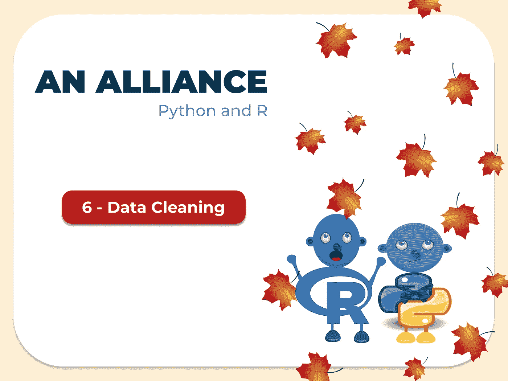
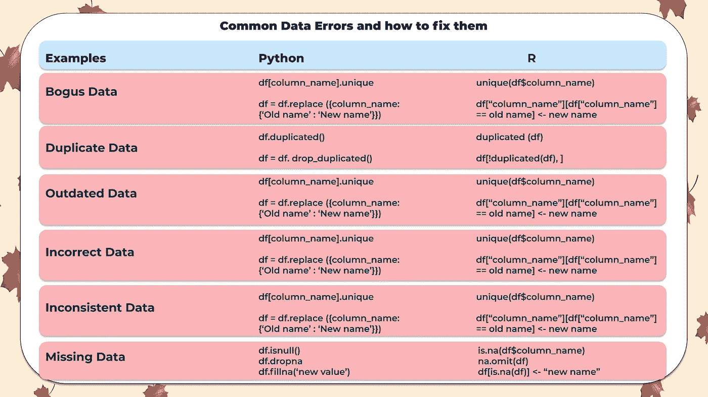
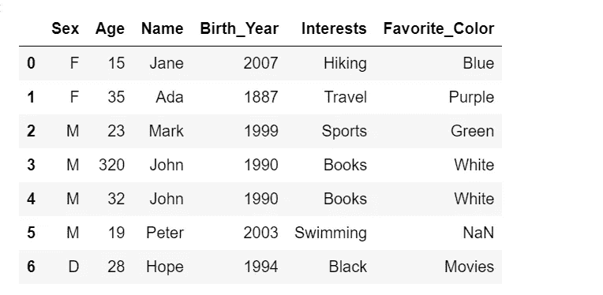
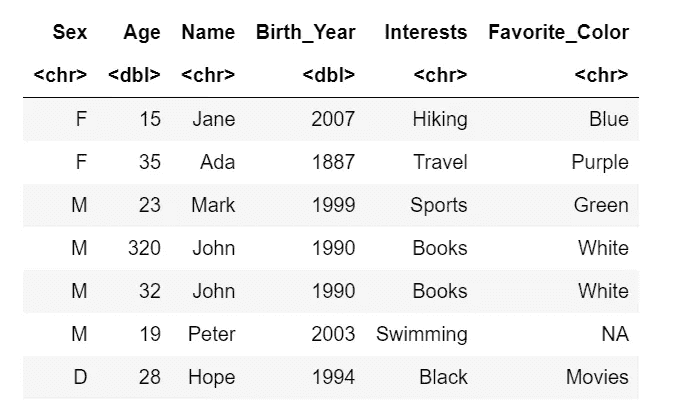
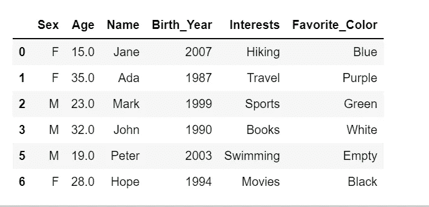

# 一个联盟:Python 和 R(数据清理)

> 原文：<https://medium.com/mlearning-ai/an-alliance-python-and-r-data-cleaning-b9b6213f78ac?source=collection_archive---------1----------------------->

脏数据会给数据分析带来问题，必须在进入下一阶段之前处理好。这些数据包含不正确的信息。

有时，在大型数据集中，从源中完全删除脏数据是不可能的，因此我们的目标是清理至少 80–90%的数据。为了进行良好的数据预测并创建更好的数据可视化，必须清理获取的原始数据，因为不干净的数据会影响数据结果。

数据清理是数据预处理阶段的一部分。replace 函数是在数据清理过程中替换错误值的最常用方法。

为此，我们将创建一个包含不同类型错误的数据框架，识别并修复它们。

**用 2022 年的人的条目创建一个数据框架**

**巨蟒**

**R**

**虚假数据**

这是您在变量中遇到的不真实或不真实的数据类型，尤其是当值应该遵循特定范围时。这种数据可能是由于键入错误造成的。我们可以通过用我们估计的实际值来替换这些数据，或者如果这些数据是私有数据，我们可以要求所有者确认错误。在数据集中，假数据在年龄列中，年龄是 320。这显然是一个打字错误，所以我们把年龄改为 32。

**Python 和 R**

**重复数据**

顾名思义，当数据输入两次时就会遇到这个数据。这可以通过检查数据帧中的重复项并删除重复值来解决。在数据帧中，我们看到 John 的条目是重复的，因此我们删除了一个条目。

**Python 和 R**

**过期数据**

当我们期望特定期间的数据，并且发现值低于或高于特定期间时，就会出现这种类型的数据。我们可以通过估计数据是否在范围内来检查数据是否是由打字错误引起的。但是，如果值超出了范围，我们可以将其从数据集中删除。在数据框中，我们看到 1887 年的出生年份，这个数据是从 2022 年的人那里生成的。我们根据年龄计算实际年份，并加上正确的值。

**Python 和 R**

**数据不正确**

不正确的数据是输入到错误列的数据。例如，当在文本列中输入数字数据时，反之亦然，或者当应该在另一列中的值被输入到另一列中时。在数据框中，兴趣栏中输入黑色，最喜欢的颜色栏中输入电影，因此我们替换这些值。

**Python 和 R**

**数据不一致**

当输入的数据采用数据的形状但不是相同的形状时，就会遇到这种数据。这些数据通常是由打字错误引起的。在性别栏中，我们看到输入了 D，字母 D 接近键盘上的 F，所以我们将其改为 F。

**Python 和 R**

**缺失数据**

这是一种作为空值返回的数据类型。我们可以在数据帧中找到空值，删除它们或者用任意值替换它们。“favorite color”列中缺少一个值，因此我们可以将其更改为空，这表明它没有被填充。

**最终结果**

既然已经成功清理了数据帧，我们可以继续使用它进行分析。

**用 Python 清理数据**

**用 R 清理数据**

数据清理是数据分析最重要的方面，这将帮助我们生成更好的数据报告，并更好地解释我们的数据发现。

 [## Mlearning.ai 提交建议

### 如何成为 Mlearning.ai 上的作家

medium.com](/mlearning-ai/mlearning-ai-submission-suggestions-b51e2b130bfb)