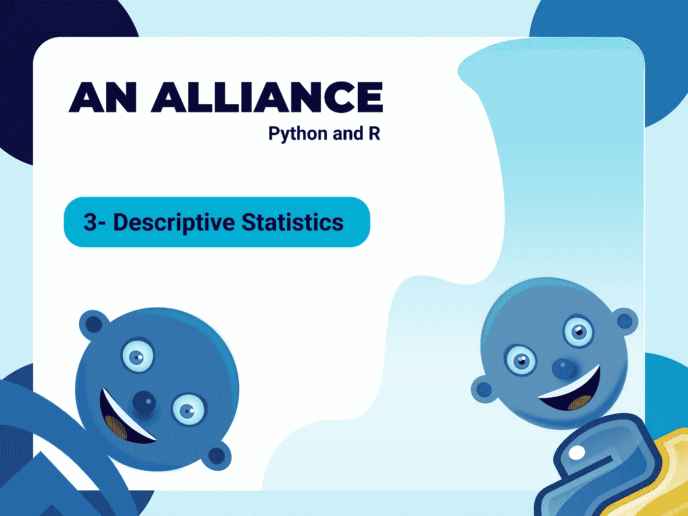

# 一个联盟:Python 和 R(描述统计)

> 原文：<https://medium.com/mlearning-ai/an-alliance-python-and-r-descriptive-statistics-5efa1196e77a?source=collection_archive---------4----------------------->

描述性统计或汇总统计帮助我们用单一的唯一函数来描述值，这在我们第一次开始数据分析时很重要。这些统计数据有助于我们更精确地理解数据，并且只有一个代表值。描述性统计要么是正态分布的度量，要么是变异的度量。

**正态分布的测量**

**1。平均值**:用观察总数除以累计观察值计算得出。它也称为平均值，定义为总和除以计数。

**2。中位数:**是数据集的中间值，将数据分为两部分。如果数据集中的元素个数为奇数，则中位数为中间两个数的平均值；如果是偶数，中位数就是中间两个数的平均值。

**3。Mode:** 在一组数据中，出现次数最多的值。如果所有数据集的重现都相同，则数据集可能没有模式。此外，如果我们遇到具有相同递归的多个数据集，我们可以有多个模式。在 R 中，模式功能是用户定义的，这可以使用[适度](https://cran.r-project.org/web/packages/modest/index.html)封装来完成。

**4。Min:** 定义为数据集中的最小值。

**5。Max:** 定义为一个数据集中的最大值。

**变异的测量。**

**1。范围:**范围是数据集最大和最小样本点之间的差值。

**2。方差:**描述为均值的均方差。它的计算方法是将每组数据和平均值之间的差值平方，将它们相加，然后除以数据集中的数据点数。

**3。标准差:**方差的平方根定义为标准差。计算方法是首先确定平均值，从平均值中减去每个数字，然后将结果平方。将所有值相加，然后除以项数，最后求平方根。

上面提到的大多数函数可以作为单个函数应用，但是如果您需要同时显示特定数据集或数据子集的所有函数，那么我们使用 **summary** 函数。

**汇总:**汇总功能可用于显示单个变量或整个数据帧的多个统计汇总。

在解释数据集中的数据时，描述性统计很重要。它可以表示为数值，也可以表示为图表。一些显示描述性统计数据的图表有条形图(平均值)、饼图(百分比平均值)、圆环图(百分比平均值)、箱线图(中位数、四分位距)等。

 [## Mlearning.ai 提交建议

### 如何成为 Mlearning.ai 上的作家

medium.com](/mlearning-ai/mlearning-ai-submission-suggestions-b51e2b130bfb) 

🟠在 MLearning.ai 成为 [**作家**](/mlearning-ai/mlearning-ai-submission-suggestions-b51e2b130bfb)