# 一个联盟:Python 和 R (EDA)

> 原文：<https://medium.com/mlearning-ai/an-alliance-python-and-r-eda-9336e66fc65c?source=collection_archive---------2----------------------->

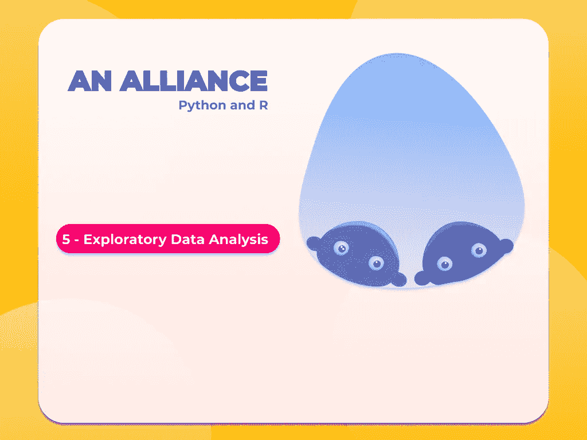

探索性数据分析(EDA)在您需要快速浏览数据集以发现变量并获得洞察力时使用。

在描述性统计和可视化的帮助下，探索性数据分析主要关注对数据进行初步调查的能力，以检测模式、识别问题领域、测试假设和验证假设。当您遇到大小不一的数据集时，可能会有点不知所措，EDA 可以帮助您快速浏览数据，为您提供实际的见解，帮助您决定如何转换数据以进行分析。

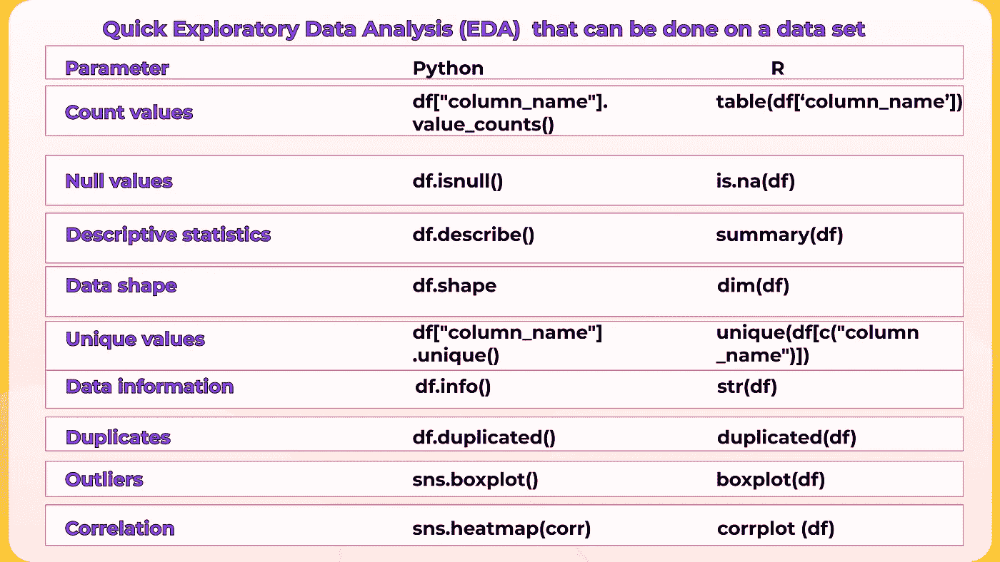

为此，我将使用虹膜数据集。根据[维基百科](https://en.wikipedia.org/wiki/Iris_flower_data_set)，鸢尾花数据集是收集的数据，用于量化三个相关物种的鸢尾花的形态变异。它由每个物种的 50 个样本组成，并对四个特征进行采样。使用 EDA，我们将探索数据中的一些重要特征，并比较变量之间的关系。

1.  **加载包和库**

**Python**

```
import numpy as np
import pandas as pd
import matplotlib.pyplot as plt
import seaborn as sns
```

**R**

```
library(ggplot2)
library(dplyr)
library(ggplot2)
library(corrplot)
library(readr)
library(heatmaply)
library(RColorBrewer)
library(tidyverse)
library(GGally)
library(ISLR)
library(pheatmap)
```

令人印象深刻的是，在 Python 中，这种分析所需的包很少，但是在 r 中却需要大量的库。

**2。** **导入并查看数据集**

**Python**

```
df1 = pd.read_csv('Iris.csv')
df1.head()
```

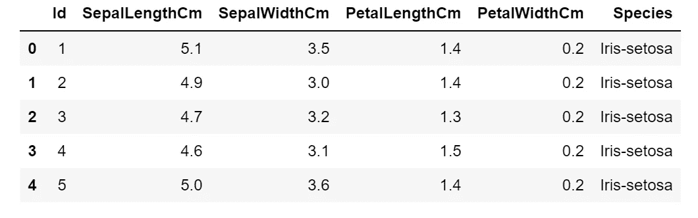

**R**

```
df1 = read_csv('Iris.csv')
head(df1)
```

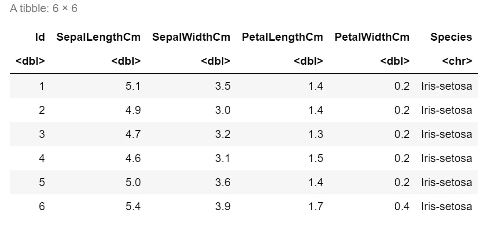

**3。** **检查空值**

**Python**

为了查看数据帧中缺失的值，我们使用了`df1.isnull()`函数。我们还可以使用下面的函数可视化数据集中的空值:

```
sns.heatmap(df1.isnull(), yticklabels = False, cbar = False, cmap = 'viridis')
```

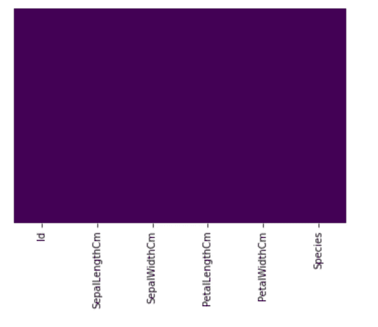

**R**

为了查看数据帧中缺失的值，我们使用了`is.na(df1)`函数。我们还可以使用下面的函数可视化数据集中的空值:

```
heatmaply_na(df1)
```

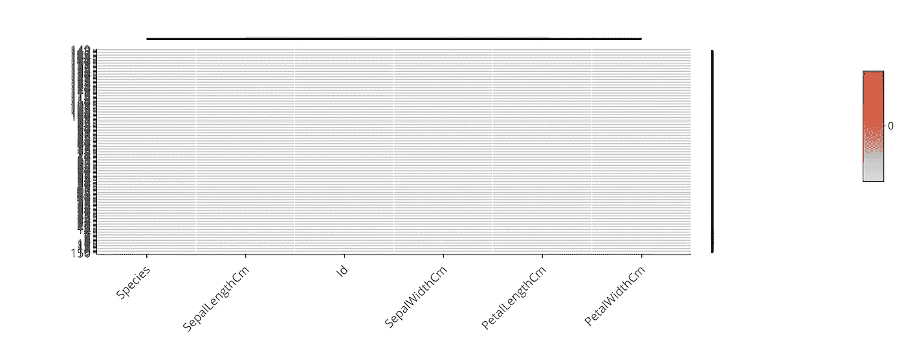

这证明数据集中没有缺失值。

**4。描述性统计**

**Python**

```
df1.describe(include='all')
```

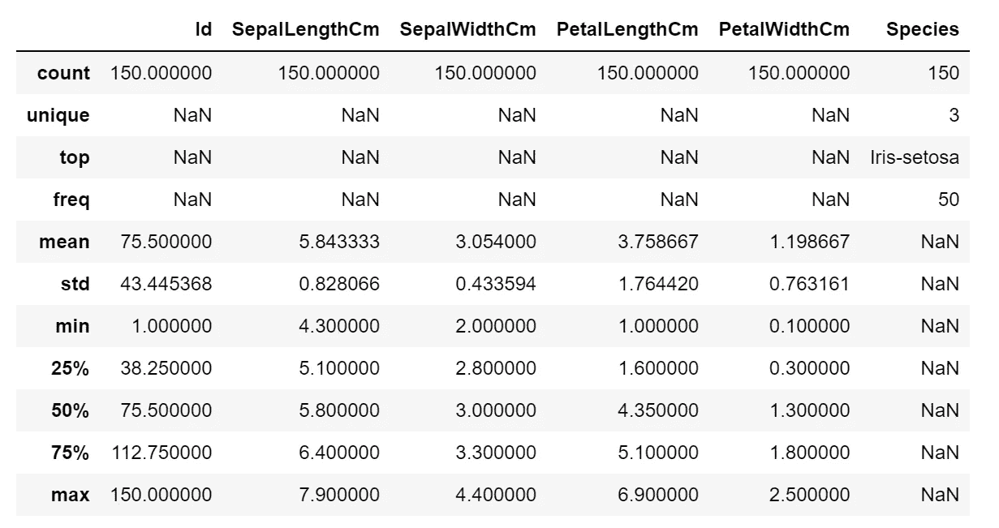

**R**

```
summary(df1)
```

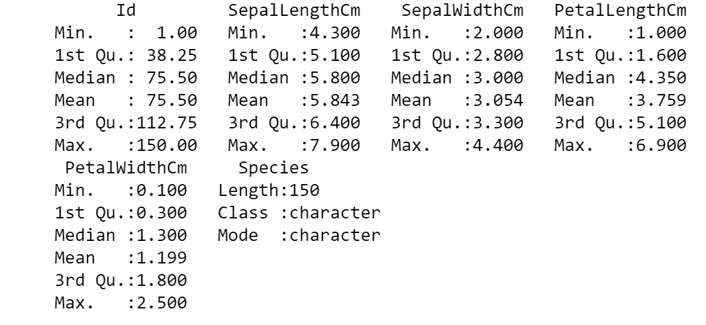

**5。数据形状**

**Python**

```
df1.shape
```

**R**

```
dim(df1)
```

该形状显示数据帧由 150 行和 6 列组成。

**6** 。**数据集信息**

**巨蟒**

```
df1.info()
```

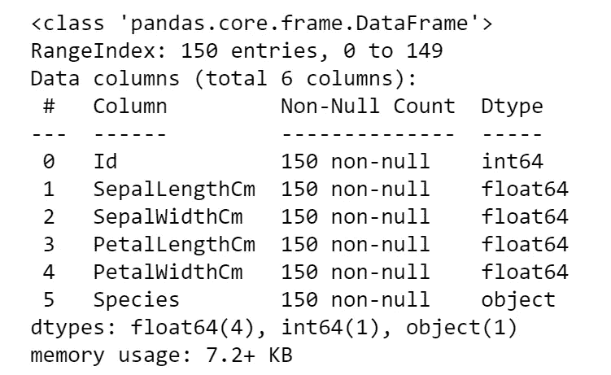

**R**

```
str(df1)
```

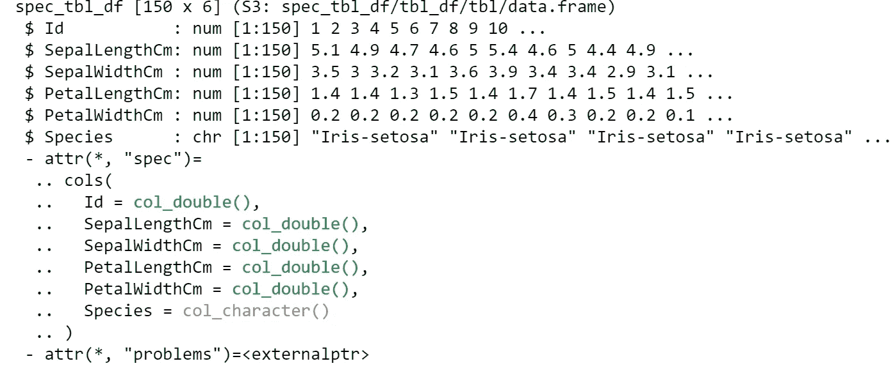

**7。副本**

**Python**

```
df1.duplicated()
```

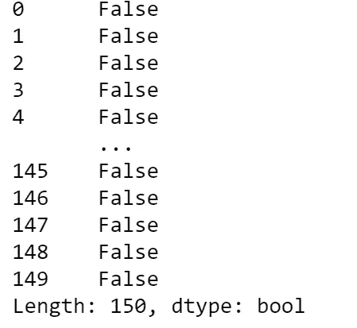

**R**

```
duplicated(df1)
```

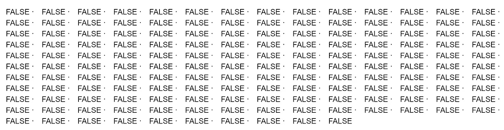

这表明数据集中没有重复的值。

**8。异常值**

使用箱线图可以最好地显示数据集中的异常值。

**Python**

```
#sepal length
sns.boxplot(df1['SepalLengthCm'], color='purple')
#sepal width
sns.boxplot(df1['SepalWidthCm'], color='purple')
#petal width
sns.boxplot(df1['PetalWidthCm'], color='purple')
#petal length
sns.boxplot(df1['PetalLengthCm'], color='purple')
```

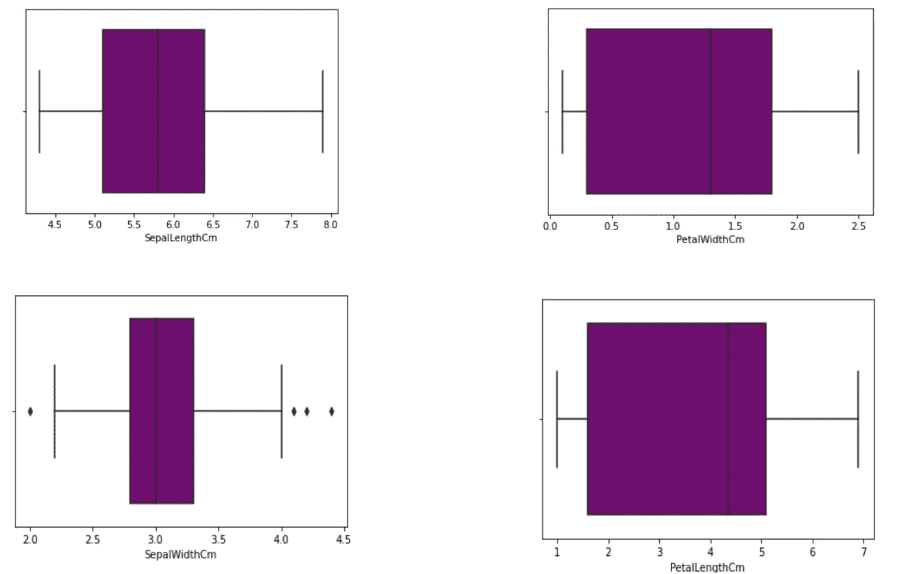

**R**

```
#sepal length
boxplot(df1$SepalLengthCm, col="purple",
  ylab = "SepalLengthCm")
#sepal width
boxplot(df1$SepalWidthCm, col="purple",
  ylab = "SepalWidthCm")
#petal width
boxplot(df1$PetalWidthCm, col="purple",
  ylab = "PetalWidthCm")
#petal length
boxplot(df1$PetalLengthCm, col="purple",
  ylab = "PetalLengthCm")
```

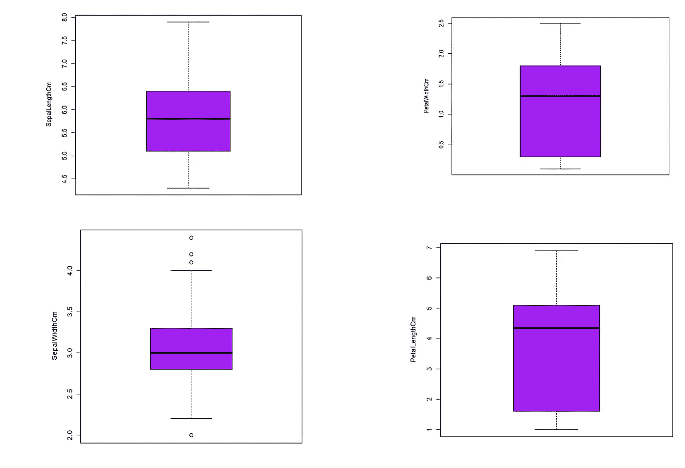

对于所有列变量，不存在需要删除或设置为该范围的值的极限范围。异常值会在数据的最终可视化阶段产生问题，最好将这些值设置为与数据中的其他值一致，或者将它们从数据中过滤掉。

**9。相关性**

这可用于检查变量之间的关系，并可使用热图来表示。

**巨蟒**

```
# Calculate the correlation matrix
corr = df1.iloc[:, 1:5].corr(method="pearson")# Generate a mask for the upper triangle
mask = np.triu(corr)# Set up the matplotlib figure
fig, ax = plt.subplots(figsize=(12,12))# Draw the heatmap with 'sns.heatmap()'
sns.heatmap(corr, linewidths=1, annot=True, square=True, mask=mask, fmt=".2f", center=0.08,cbar_kws={"shrink":0.5}, cmap='rocket')
```

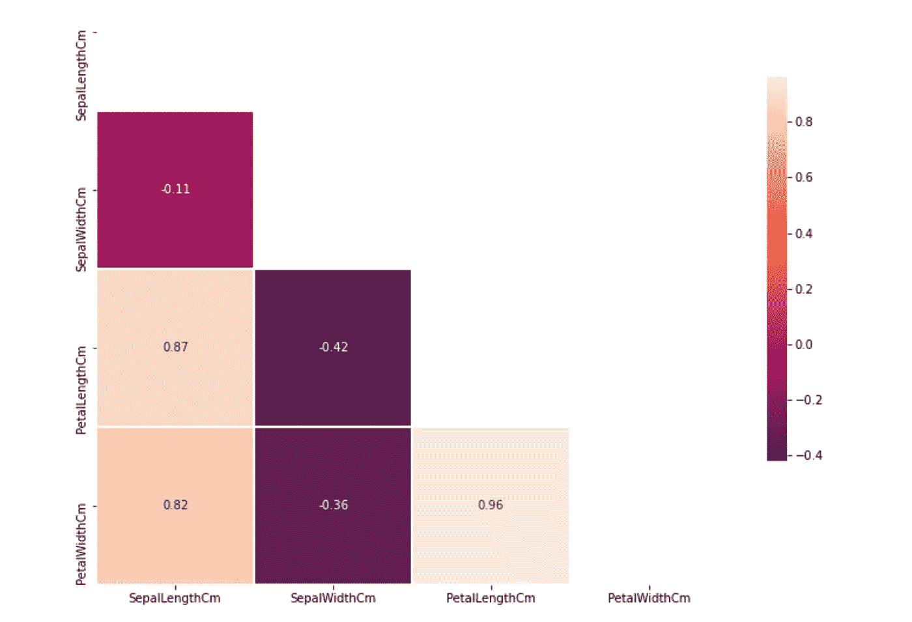

**R**

```
res <- df1[2:5]
res <- cor(res, method = "pearson")
#plot
corrplot(res, method = "number", tl.cex = 0.5, tl.col = 'black',
         order = "hclust", diag = TRUE, type="lower", col=brewer.pal(n=8, name="RdPu"))
```

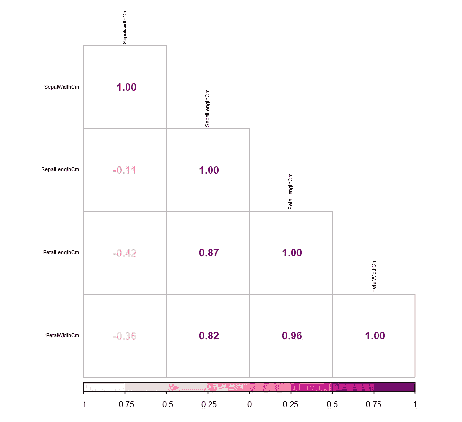

我们将比较变量的正相关和负相关。低于+0.30 和-0.30 的相关性很弱，变量之间没有很强的关系。

**正相关**

在正相关性中，关系越接近+1，相关性越高。正相关表明，随着一个变量的增加，另一个变量也会增加。以下变量显示了正相关性:

*   萼片长度:花瓣长度，花瓣宽度
*   花瓣长度:花瓣宽度

**负相关**

在负相关性中，关系越接近-1，相关性越高。负相关表明当一个变量增加时，另一个变量减少。以下变量显示负相关:

*   萼片宽度:花瓣长度，花瓣宽度

**附加数据可视化**

**1。配对图**

成对图也可用于成对查看变量之间的关系。它创建了一个轴网格，显示数据中的每个变量。配对图显示了内核密度图和散点图。

**Python**

```
#use pairplot to show the relationship between all variables
pair = df1.iloc[:, 1:6]
sns.pairplot(pair, hue='Species', palette='rocket')
plt.savefig("pairplotiris.svg")
```

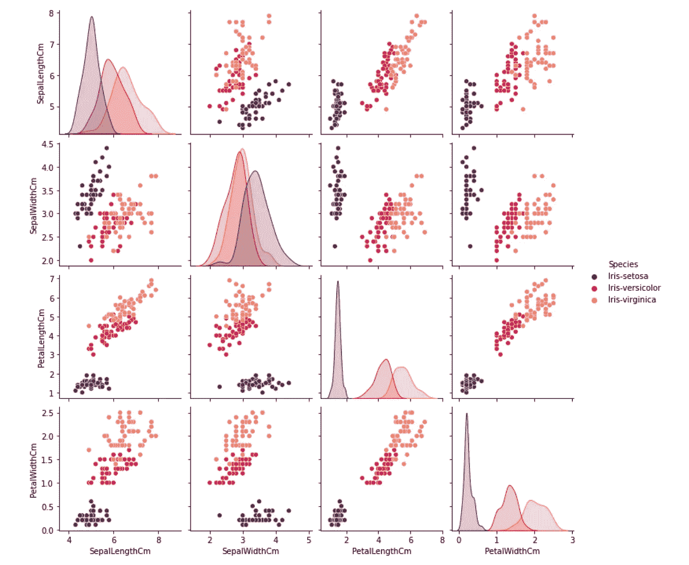

**R**

在 R 中，pairplot 显示了核密度图、R 平方值、箱线图、散点图和直方图。

```
pair <- df1[2:6]
ggpairs(pair, aes(color = Species)) + theme_bw()+scale_fill_brewer(palette = "RdPu")
```

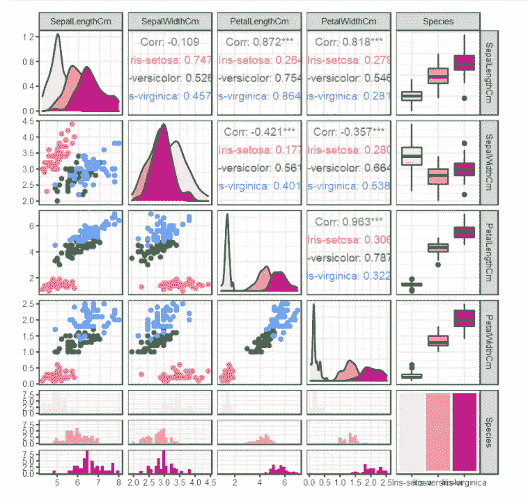

**2。小提琴剧情**

我们可以用小提琴图来展示不同物种的分布。

**巨蟒**

```
#Sepallength
sns.catplot(x='Species', y='SepalLengthCm', kind='violin', data=df1, palette='rocket')
#Sepal Width
sns.catplot(x='Species', y='SepalWidthCm', kind='violin', data=df1, palette='rocket')
#Petal length
sns.catplot(x='Species', y='PetalLengthCm', kind='violin', data=df1, palette='rocket')
#Petal width
sns.catplot(x='Species', y='PetalWidthCm', kind='violin', data=df1, palette='rocket')
```

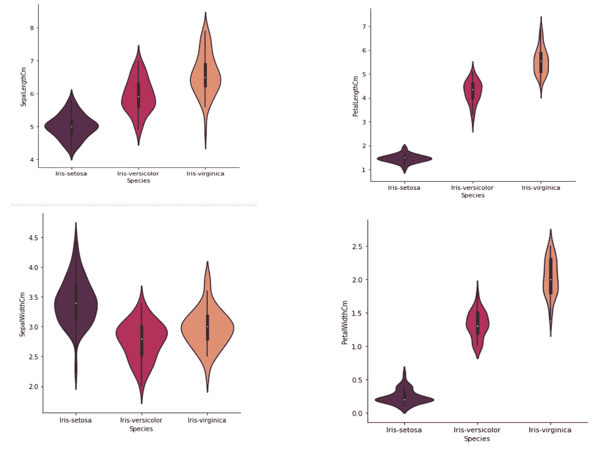

**R**

```
#Sepal length
ggplot(df1, aes(x=Species, y=SepalLengthCm, fill=Species)) + 
  geom_violin()+scale_fill_brewer(palette = "RdPu")+theme_bw()
#Sepal width
ggplot(df1, aes(x=Species, y=SepalWidthCm, fill=Species)) + 
  geom_violin()+scale_fill_brewer(palette = "RdPu")+theme_bw()
#Petal length
ggplot(df1, aes(x=Species, y=PetalLengthCm, fill=Species)) + 
  geom_violin()+scale_fill_brewer(palette = "RdPu")+theme_bw()
#Petal length
ggplot(df1, aes(x=Species, y=PetalWidthCm, fill=Species)) + 
  geom_violin()+scale_fill_brewer(palette = "RdPu")+theme_bw()
```

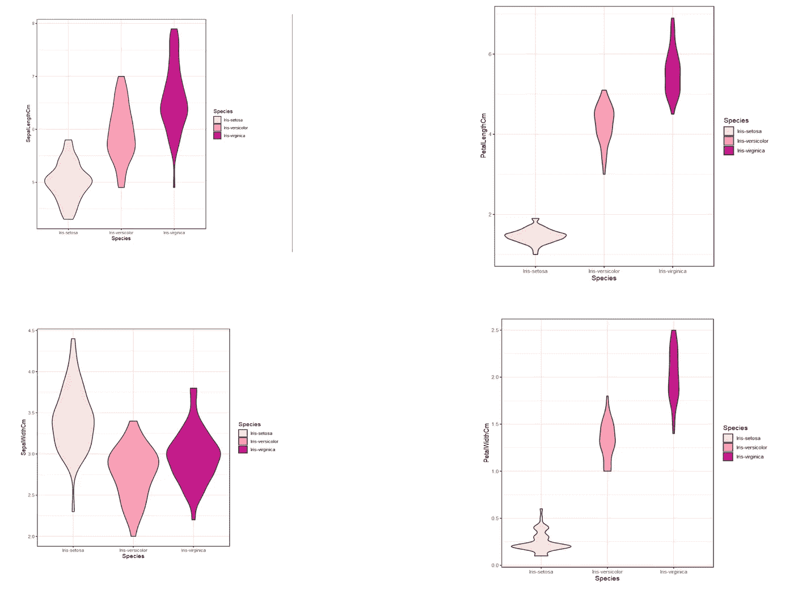

小提琴的情节表明:

*   海滨鸢尾的萼片长度最长，而刚毛鸢尾的最短。
*   刚毛鸢尾的萼片宽度最宽，而杂色鸢尾的萼片宽度最窄。
*   海滨鸢尾的花瓣长度最长，而刚毛鸢尾的花瓣长度最短，
*   海滨鸢尾的花瓣宽度最宽，而刚毛鸢尾的花瓣宽度最窄。

**3。聚类**

聚类是分等级进行的，密切相关的物种聚在一起。这可以通过显示聚类树状图的热图来可视化。

**Python**

```
iris = sns.load_dataset("iris")
species = iris.pop("species")
clust = dict(zip(species.unique(), "rbg"))
row_colors = species.map(clust)
g = sns.clustermap(iris, row_colors=row_colors)
#import
from matplotlib.patches import Patch
handles = [Patch(facecolor=clust[name]) for name in clust]
plt.legend(handles, clust, title='Species',
           bbox_to_anchor=(1, 1), bbox_transform=plt.gcf().transFigure, loc='upper right')
plt.savefig("clusteriris.svg")
```

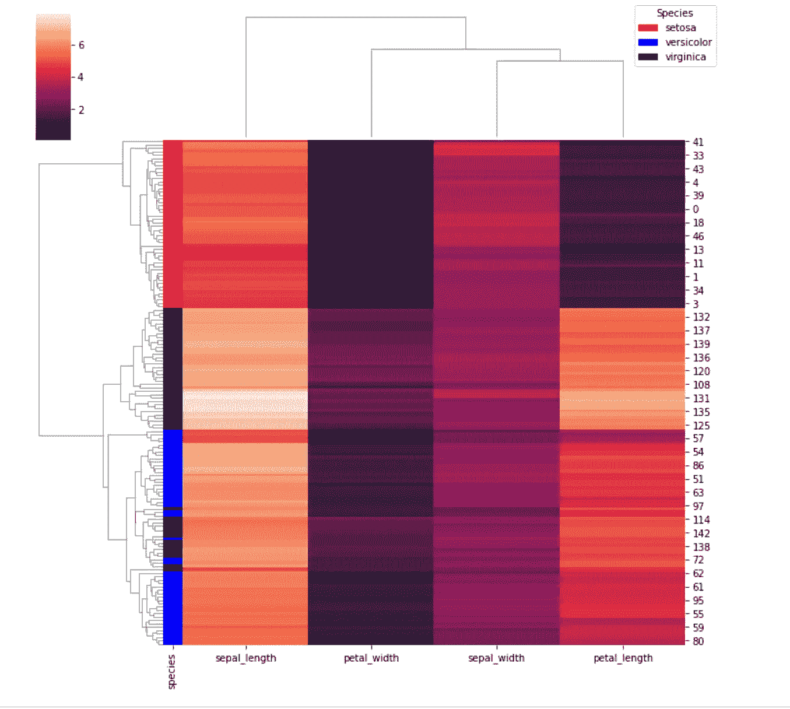

**R**

```
clust <- as.matrix(iris[, 1:4]) # convert to matrix
row.names(clust) <- row.names(iris) # assign row names in the matrix
pheatmap(clust, 
         scale = "column",
         clustering_method = "average", # average linkage
         annotation_row = iris[, 5, drop=FALSE],
         show_rownames = FALSE )
```

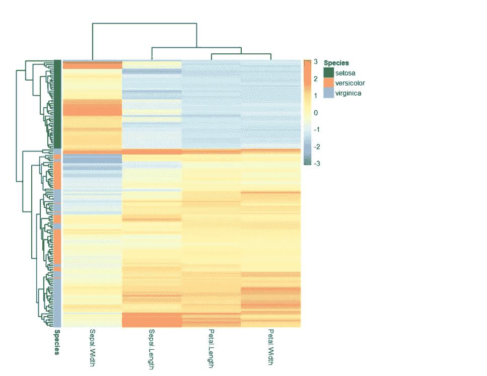

在这里我们可以看到，有一个更强的关系，鸢尾和海滨鸢尾花。

探索性数据分析不仅能让你了解你所拥有的数据类型，还能帮助你围绕这些数据形成一个故事，这个故事可以用图片和文字来呈现。

[](/mlearning-ai/mlearning-ai-submission-suggestions-b51e2b130bfb) [## Mlearning.ai 提交建议

### 如何成为 Mlearning.ai 上的作家

medium.com](/mlearning-ai/mlearning-ai-submission-suggestions-b51e2b130bfb)