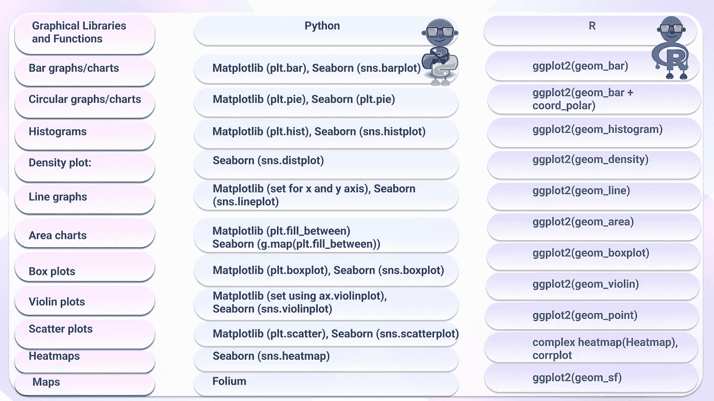

# 一个联盟:Python 和 R(图形表示)

> 原文：<https://medium.com/mlearning-ai/an-alliance-python-and-r-graphical-representation-88226e41e2d6?source=collection_archive---------7----------------------->

数据集中的数值通常表示为图形，以传达含义和展示洞察力。具有几百万行的数据集可能很难浏览，但是当这些值用适当的图表以图形方式表示时，没有见过实际数据集的人就更容易理解了。图形表示也称为数据可视化，可以定义为一种数值数据分析方法。它有助于使用易于理解的图表来显示数据、想法、信息和概念之间的关系。

Graphical Packages and their functions. Image created using Figma.

一些常见的例子有:

**条形图/图表**:条形图使用高度或长度大约等于它们所代表的值的矩形条来对数据进行分类。条形图可以水平或垂直绘制。当条形图垂直绘制时，也可以称为柱形图。条形图适用于表示多于五个的分类数据。

**圆形图/图表**:圆形图是一种球形统计图形，它被分割成若干片以显示数字比例。图表中每个切片的弧长与其代表的数量成比例。这些图表的示例有饼图和圆环图，它们可用于显示少于 5 个类别的分析。

**直方图**:直方图是一种图形表示，它将一组数据点分成用户定义的范围。直方图在外观上类似于条形图，它通过将许多数据点分组到逻辑范围或箱中，将数据系列组合成一个易于理解的图形。

**密度图:**使用密度图显示连续时间间隔或周期内的数据分布。此图是使用核平滑绘制值的直方图的变体，它通过平滑噪声来实现更平滑的数据分布。密度图的峰值有助于显示数值随时间变化的中心位置。它在确定分布形状方面比直方图更好，也称为核密度图。

**线形图**:这是一种图表，用于可视化随时间变化的信息。表示时间序列分析总是最好的。

**面积图**:面积图也称为面积图，是基于折线图构建的定量数据的图形表示。颜色、纹理和影线经常用来强调轴和线之间的区域。面积图通常用于比较两个或多个数量。

**箱线图**:箱线图是数据集分布和中心的可视化表示。数据集的四分位距和平均值是两个扩散度量的例子，而平均值和中值是中心(数据集的中间)度量的例子。它也被称为盒须图。箱线图是直观显示数据集中异常值的快速方法。

**Violin plots** :一般来说，Violin plots 是一种数字数据图，可以被认为是盒子图和内核密度图的结合。箱线图中出现的相同信息，如四分位距、中位数、平均值等，也出现在小提琴图中。

**散点图**:散点图是一种图表，用来直观地显示和观察两个数值变量之间的关系。变量值用点表示。散点图使用笛卡尔坐标来显示数据集中变量的值，因为点在垂直轴和水平轴上的位置显示了相应数据点的值。散点图也称为散点图、散点图或散点图，是散点图的一种。

**热图**:热图是一种数据的图形表示，其中的值用颜色表示，使复杂的数据一目了然，易于可视化和理解。热图可以表示数据帧或关联矩阵中的一系列值。

**地图**:地图可视化是一种分析和可视化地理相关数据并将其显示为地图的技术。这种类型的数据表示更加直接和直观。可以直观地看到每个区域的数据分布或比例。

从以上关于图形表示或数据可视化的信息中，我们可以看到，为了更好地表示数据，这些图/图表中的大多数都进行了相互修改。了解数据分析过程中使用的最佳图将指导您进行数据解释并更好地展示数据结果。

 [## Mlearning.ai 提交建议

### 如何成为 Mlearning.ai 上的作家

medium.com](/mlearning-ai/mlearning-ai-submission-suggestions-b51e2b130bfb) 

🔵 [**成为作家**](/mlearning-ai/mlearning-ai-submission-suggestions-b51e2b130bfb)