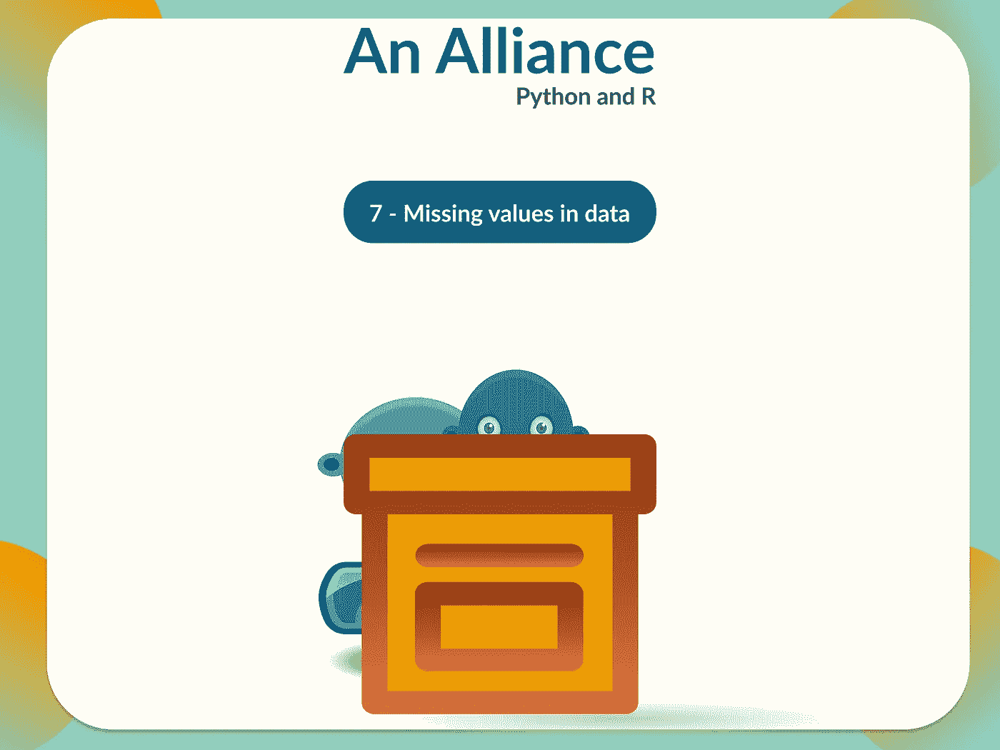
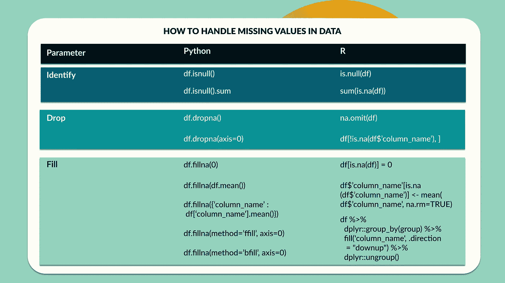

# 一个联盟:Python 和 R(数据中的缺失值)

> 原文：<https://medium.com/mlearning-ai/an-alliance-python-and-r-missing-values-in-data-5091a5ef6221?source=collection_archive---------3----------------------->



作为初学者，为了成功地构建数据分析或数据科学组合，我们依赖于我们自己的来源数据，并为此需要数据集。像 [Kaggle](https://www.kaggle.com/) 这样的开源网站允许我们使用这些可用的数据集来提高我们的数据技能。

大多数情况下，所提供的这些数据集都有缺失值，部分挑战是找到一种方法来处理这些缺失值，而不会影响数据分析、产生偏差和进一步复杂化您的数据发现。当我们发现 30–60%的检索分析数据有很多缺失值时，这就成了一件令人烦恼的事情，但如果能以最好的方式解决这个问题，那就太好了。

数据冗余会导致各种问题。首先，数据的缺乏降低了统计的有效性，并可能妨碍研究的分析。这些虚假陈述中的任何一个都可能危及有效性并导致错误的结论。

我们如何管理丢失的数据以充分利用我们的数据？



Handling missing values created in Figma

1.  **识别缺失值**

我们可以检查我们的数据集中有多少缺失值，以及它们为什么会出现。我们可以使用以下命令来检查丢失的值:

**巨蟒**

```
df.isnull() #returns boolean valuesdf.isnull().sum  #returns total number of missing values
```

**R**

```
is.null(df) #returns boolean valuessum(is.na(df)) #returns total number of missing values
```

**2。丢弃丢失的值**

通过应用以下函数，我们可以轻松地删除丢失的值:

**Python**

```
df.dropna() #drops all nas in all columnsdf.dropna(axis=0) #drops na in specified columns
```

**R**

```
na.omit(df) #removes all nasdf[!is.na(df$'column_name'), ] #removes nas for a specified column
```

有时，删除空值可能会使我们丢失很大一部分数据集。避免丢失重要信息的最好方法是检查我们需要分析的列，选择它们，看看我们是否可以保留至少 80%的数据。如果我们需要的列中还有更多缺失的值，我们可以继续下一步。

**3。填写缺失的值**

要替换缺失值，我们可以使用 0 或样本平均值，甚至是最接近的值。用 0 替换丢失的值更安全，因为它不会引入偏差，但这只适用于大于 0 的值。对于较小的值，我们可以用样本平均值或最接近的值来填充。可以为遵循逻辑顺序的样本填充最接近的值。

**Python**

```
df.fillna(0) #fills nas with 0df.fillna(df.mean()) #fills nas with the mean of the entire datasetdf.fillna({'column_name':df['column_name'].mean()}) #fills nas with the mean of the particular columndf.fillna(method='ffill', axis=0) #forward fills the na value with the closest valuedf.fillna(method='bfill', axis=0) #backward fills the na value with the closest value
```

**R**

```
df[is.na(df)] = 0 #fills nas with 0df$'column_name'[is.na(df$'column_name')] <- mean(df$'column_name', na.rm =TRUE) #fills na with the mean of the specified column.df %>%
  dplyr::group_by(group) %>%
  fill('column_name', .direction = "downup") %>%
  dplyr::ungroup() #fills na with forward and backward values
```

请记住，对缺失值的处理完全取决于为您提供的数据集。如果缺失值的数量较少，您可以删除它们并继续进行分析，但如果它们占数据的 50%，我们可以考虑用 0 填充它们，即平均值或最接近的值。

[](/mlearning-ai/mlearning-ai-submission-suggestions-b51e2b130bfb) [## Mlearning.ai 提交建议

### 如何成为 Mlearning.ai 上的作家

medium.com](/mlearning-ai/mlearning-ai-submission-suggestions-b51e2b130bfb)