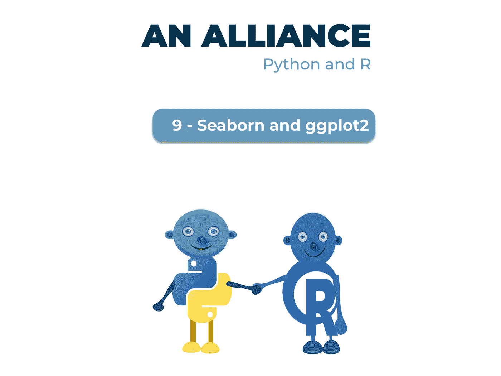
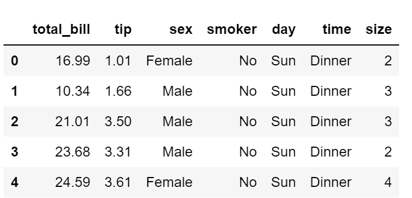
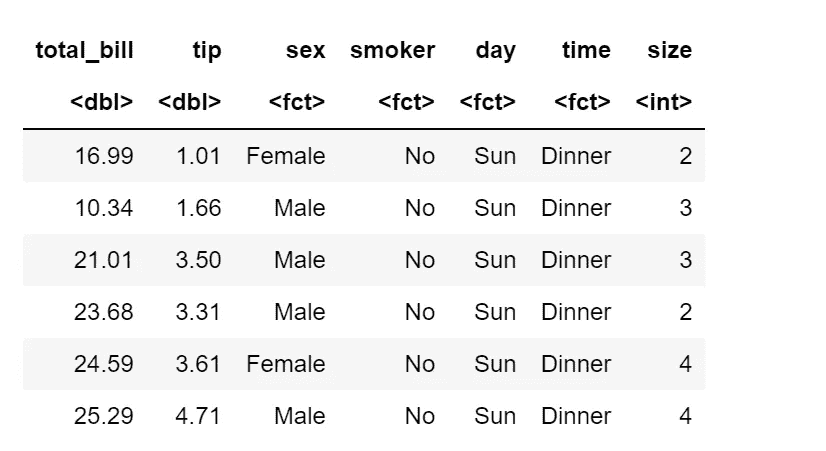
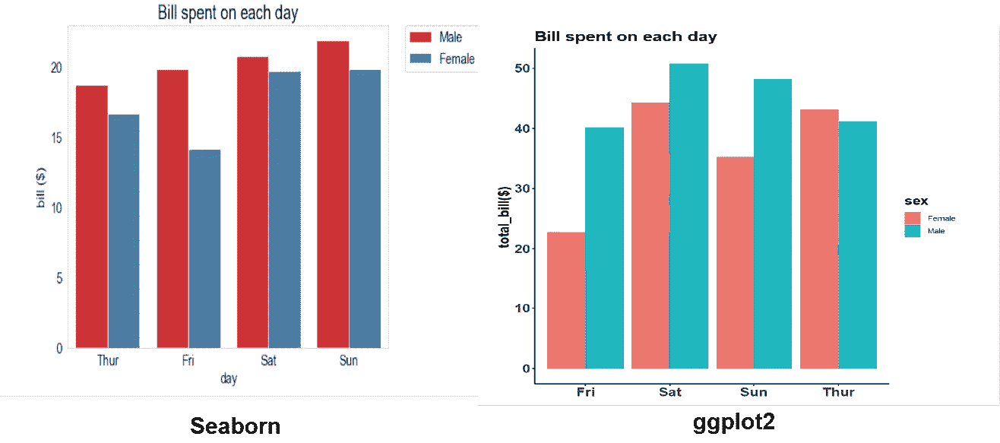
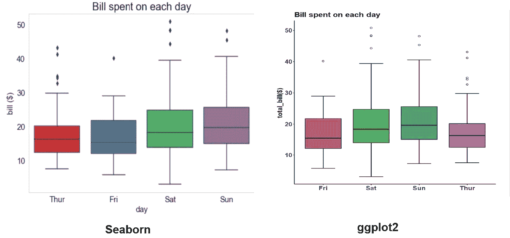
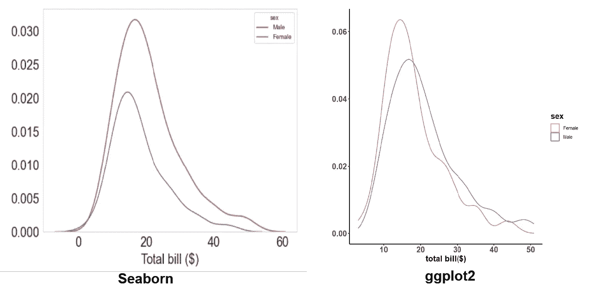
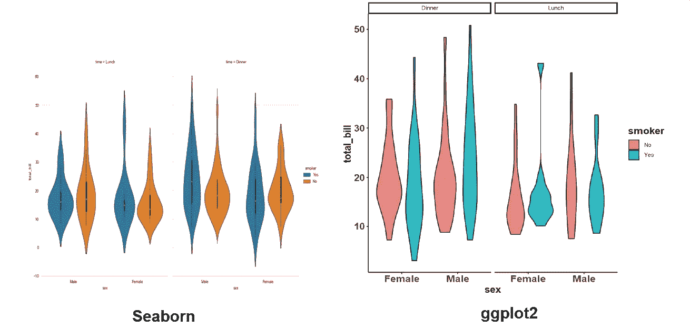
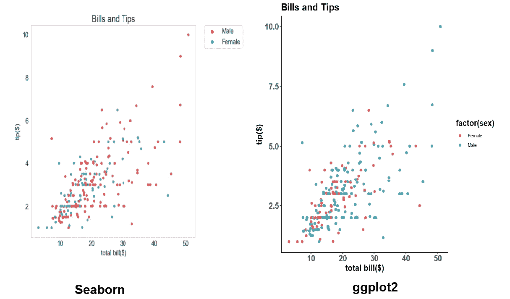
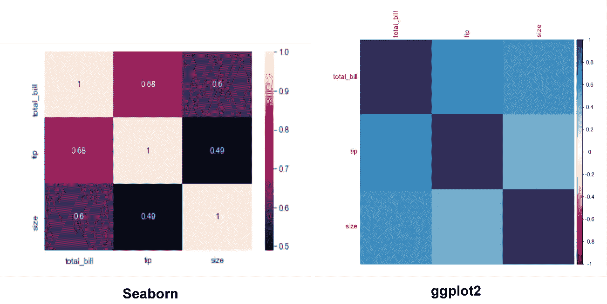

# 一个联盟:Python 和 R (Seaborn 和 ggplot2)

> 原文：<https://medium.com/mlearning-ai/an-alliance-python-and-r-seaborn-and-ggplot2-233864b77bc4?source=collection_archive---------3----------------------->



处理数据意味着在大多数情况下，你的数据将被可视化，以将信息传达给目标受众。python 和 R 编程语言内置了有助于数据可视化的库。两个流行的库是 seaborn 和 ggplot2，前者是基于 python 的 Matplotlib 库构建的，后者是基于 r。

*在 python 中加载 seaborn*

```
import seaborn as sns
import matplotlib.pyplot as plt
%matplotlib inline
```

*加载 R 中的 gg plot 2*

```
library(ggplot2)
```

在我的[文章中，](/mlearning-ai/data-tales-art-in-data-visualization-a07d3e5562e7)我写了一些库的默认语法对数据可视化没有帮助，但是有一些参数可以通过添加额外的语法来调整。在 python 中，这些语法没有分割地连接在一起，编程语言一起读取它们，但在 R 中，这些语法必须用+号连接，程序才能将它们一起识别为完整的命令，否则它只读取第一个语法。

一些需要额外语法的参数有:

1.  **风格:**风格是剧情的背景主题，决定了剧情的外观。在 seaborn 中，使用`sns.set_style()`命令设置风格，而在 R 中，通过选择`theme_classic()`、`theme_void()`、`theme_bw()`等设置背景主题。

**2。大小:**图的大小有助于捕捉可能丢失的信息，尤其是在创建包含大量分类变量的图时。调整地块的宽度和高度有助于透视一切。在 ggplot2 中，尺寸被自动设置以适应绘图，而在 seaborn 中，尺寸可以通过应用`plt.subplots(figsize=( , ))`来设置

**3。方向:**设置绘图方向为垂直或水平。在 seaborn 中，使用 R 中的`orient='h'/ orient='v'`设置方向，可以使用`coordflip()`设置方向，当方向设置为水平时，分类 x 轴成为 y 轴，数字 y 轴成为 x 轴。

**4。颜色:**绘图的颜色可以改变，以遵循特定的调色板或设置为特定的颜色。当填充或色调设置为变量时，也可以手动设置颜色，而不是使用调色板。

**5。轴样式:**轴样式调整轴标签和轴刻度。

6。图例:图例用于显示填充的分类变量。在大多数绘图中，图例放在绘图网格之外会更好看。

7 .**。剧情标题:**在某些情况下，添加剧情标题有助于读者理解剧情的脉络。

**用图书馆创造情节**

让我们并排比较一下这些库，看看使用 tips 数据集时这些图是什么样子。

*巨蟒*

```
df = sns.load_dataset("tips")
df.head()
```



*R*

```
df <- tbl_df(tips)
head(df)
```



**条形图**

*海风码*

```
sns.set_style("whitegrid")
bar,ax = plt.subplots(figsize=(8,6))
ax = sns.barplot(x='day', y='total_bill', hue= 'sex', data=df, ci=None, palette='Set1',orient='v')
ax.set_title("Bill spent on each day", fontsize=20)
ax.set_xlabel ("day", fontsize=15)
ax.set_ylabel ("bill ($)", fontsize=15)
ax.tick_params(axis='x', labelsize=15)
ax.tick_params(axis='y', labelsize=15)
plt.legend(bbox_to_anchor=(1.05, 1), loc=2, borderaxespad=0., fontsize=15)
ax.grid(False)
```

*ggplot2 代码*

```
ggplot(df, aes(x= day, y = total_bill, fill=sex))+
scale_colour_brewer(palette = 2)+
  geom_bar(stat = "identity", position = position_dodge(.9),  width = 0.9)+theme_classic()+ggtitle("Bill spent on each day")+
  xlab(NULL)+ylab("total_bill($)")+theme(title=element_text(size=15, face='bold'), axis.text.x = element_text(size = 15, face = "bold"), axis.text.y = element_text(size = 15, face = "bold"), axis.title.y = element_text(size=15, face='bold'))
```



比较这些图，seaborn 图固定在一个网格框中，而 ggplot2 图只有 x 和 y 轴线。seaborn 的 x 轴上的分类变量是根据一周中的天数排列的，而 ggplot2 是按字母顺序排列的。

**箱线图**

*seaborn*

```
sns.set_style("whitegrid")
bar,ax = plt.subplots(figsize=(8,6))
ax = sns.boxplot(x="day", y="total_bill", data=df, palette='Set1')
ax.set_title("Bill spent on each day", fontsize=20)
ax.set_xlabel ("day", fontsize=15)
ax.set_ylabel ("bill ($)", fontsize=15)
ax.tick_params(axis='x', labelsize=15)
ax.tick_params(axis='y', labelsize=15)
ax.grid(False)
```

*ggplot2*

```
ggplot(df, aes(day, total_bill, fill=day))+
  stat_boxplot(aes(day, total_bill), geom='errorbar', linetype=1, width=0.5)+ggtitle("Bill spent on each day")+
 geom_boxplot( aes(day, total_bill),outlier.shape=1)+theme_classic()+xlab(NULL)+ylab("total_bill($)")+theme(legend.text = element_blank(), legend.title = element_blank(),
        legend.key = element_blank(), legend.position = "none", title=element_text(size=15, face='bold'), axis.text.x = element_text(size = 15, face = "bold"), axis.text.y = element_text(size = 15, face = "bold"), axis.title.y = element_text(size=15, face='bold'))
```



**内核密度图**

*seaborn*

```
bar,ax = plt.subplots(figsize=(8,6))
ax=sns.kdeplot(data=df, x="total_bill", hue='sex', palette='Set1')
ax.set_ylabel ('', fontsize=20)
ax.set_xlabel ('Total bill ($)', fontsize=20)
ax.tick_params(axis='x', labelsize=20)
ax.tick_params(axis='y', labelsize=20)
ax.grid(False)
```

*ggplot2*

```
ggplot(df, aes(total_bill, col=sex)) +
  geom_density()+theme_classic()+xlab('total bill($)')+ylab(NULL)+
  theme(title=element_text(size=15, face='bold'), axis.text.x = element_text(size = 15, face = "bold"), 
        axis.text.y = element_text(size = 15, face = "bold"), axis.title.y = element_text(size=15, face='bold'))
```



seaborn 的 y 轴刻度 KDE 图有三个小数位，而 ggplot2 的 y 轴刻度有两个小数位。

**小提琴剧情**

*seaborn*

```
sns.set_style("whitegrid")
g=sns.catplot(x="sex", y="total_bill",
                hue="smoker", col="time",
                data=df, kind="violin",
                height=7, aspect=.8);
```

*ggplot2*

```
ggplot(df, aes(x = sex, y= total_bill, fill=smoker))+facet_grid(~time)+
  geom_violin(alpha= 0.9) +
  theme_classic()+theme(title=element_text(size=15, face='bold'), axis.text.x = element_text(size = 15, face = "bold"), 
        axis.text.y = element_text(size = 15, face = "bold"), axis.title.y = element_text(size=15, face='bold'))
```



**散点图**

*seaborn*

```
sns.set_style("whitegrid")
bar,ax = plt.subplots(figsize=(8,8))
sns.scatterplot(data=df, x="total_bill", y="tip", hue='sex', palette='Set1')
ax.set_title("Bills and Tips", fontsize=20)
ax.set_xlabel ("total bill($)", fontsize=15)
ax.set_ylabel ("tip($)", fontsize=15)
ax.tick_params(axis='x', labelsize=15)
ax.tick_params(axis='y', labelsize=15)
plt.legend(bbox_to_anchor=(1.05, 1), loc=2, borderaxespad=0., fontsize=15)
ax.grid(False)
```

*ggplot2*

```
ggplot(df, aes(x = total_bill, y = tip)) +
    geom_point(aes(color = factor(sex)))+theme_classic()+ggtitle("Bills and Tips")+ylab('tip($)')+xlab('total bill($)')+
theme(title=element_text(size=15, face='bold'), axis.text.x = element_text(size = 15, face = "bold"), 
        axis.text.y = element_text(size = 15, face = "bold"), axis.title.y = element_text(size=15, face='bold'))
```



**Corrplot**

*seaborn*

```
#compute correlation
corr_matrix = df.corr()
corr_matrix
sns.heatmap(corr_matrix, annot=True)
plt.show()
```

*ggplot2*

```
#calculate pairwise
res <- cor(df1, method = "pearson")
corrplot(res, method="color")
```



当 ggplot2 corrplot 从-1 到+1 读取时，seaborn corrplot 保持数字标度上的坡向相关值。

不同图书馆制作的这些图有许多相似之处，也有许多不同之处。总的来说，ggplot2 的剧情图形在视觉上比 seaborn 更清晰。这两个图书馆提供了很多，这完全取决于个人风格和偏好。

[](/mlearning-ai/mlearning-ai-submission-suggestions-b51e2b130bfb) [## Mlearning.ai 提交建议

### 如何成为 Mlearning.ai 上的作家

medium.com](/mlearning-ai/mlearning-ai-submission-suggestions-b51e2b130bfb)