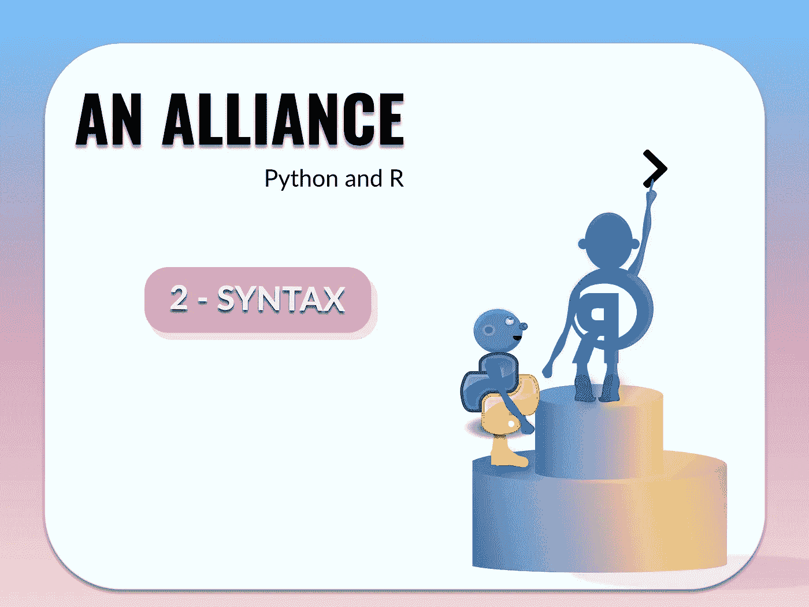
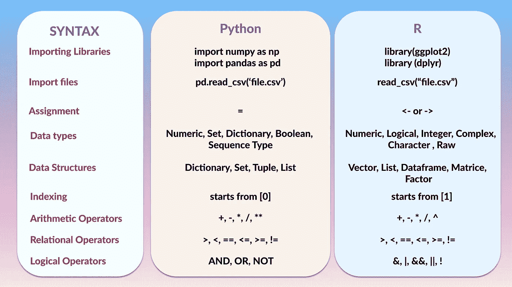

# 一个联盟:Python 和 R(语法)

> 原文：<https://medium.com/mlearning-ai/an-alliance-python-and-r-syntax-49d48ff9a1c1?source=collection_archive---------3----------------------->

就像每一种语言一样，都有规则。编程语言中的这些规则被称为语法，没有它们，你的代码就无法工作。想象一下，去一个新的国家，你试着用你的母语和当地人说话，他们不会明白你说的任何东西，除非你用他们能理解的语言说话。Python 和 R 编程语言也是如此。如果你对 Python 说 R 语言，它不会理解，反之亦然。

python 和 R 编程中的语法包括导入库/包、将数据集分配给新的数据帧、数据结构、数据类型等。下面是一些不同语法的快速分类。

**导入库/包:**要分析数据、清理数据或可视化数据，您需要将这些库/包导入 IDE。

**Python**

`import numpy as np`

`import pandas as pd`

**R**

`library(ggplot2)`

`library(dplyr)`

**导入文件**:要将数据集导入 IDE，数据集可能是 CSV 文件或 excel 文件，您必须读取这些文件。导入 CSV 文件的标准方法是使用以下代码行:

**巨蟒**

`pd.read_csv('file.csv')`

**R**

`read_csv("file.csv")`

**赋值**:在编程中，assign 语句用来给变量名设置一个值。例如，当您将文件导入 IDE 时，您需要将其分配给一个数据帧。当您想要从现有数据帧创建新的数据帧时，尤其是当您不想更改现有数据帧的结构或内容时，或者当您想要向数据帧添加一组值时，也可以进行赋值。

**Python**

`df = pd.read_csv('file.csv')`

`df1 = df`

`df2 = 1+2+5`

**R**

`df <- read_csv("file.csv")`

`df1 <- df`

`df -> df`

`df2 <- 1+2+5`

**数据类型:**数据类型是数据表征的一种形式，它决定了程序员打算如何使用数据。R 和 python 的不同数据类型有所不同，例如，True/False 在 python 中称为布尔型，在 R 中称为逻辑型。Python 中的整数是 1、4、5、100 等单个整数，而 R 中的整数是包含 4L、1L、100L 等字符的数字。python 中的数值表示整数、浮点数和复数，而 R 中的数值是带小数的数字，如 2.89、3.006。

**数据结构:**数据结构是用于组织、处理、检索和存储数据的特定模板。有许多基本到高级类型的数据结构，所有这些数据结构都是为了特定的目的来组织数据。数据结构使用户访问和处理他们需要的数据变得简单。最重要的是，数据结构组织信息，以便机器和人类都能理解它。python 中的数据结构可以是字典、集合、元组或列表，而 R 中的数据结构是向量、列表、数据帧、矩阵。

**索引:**编程中的索引是一种访问数组或数据帧中元素的方式。在 python 中，索引从 0 开始，而在 R 中索引从 1 开始。

**算术运算符**:在编程中用来进行数学计算。对于 Python 和 r，加法(+)、减法(-)、乘法(*)和除法(/)使用相同的运算符，除了对 python 使用**和对 r 使用^

**关系运算符:**这些是评估或表征两个单元之间关系的编程运算符。这些可能是比较数字上的平等和不平等。大于(>)、小于(<)、等于(==)和不等于(！=)可用于 python 和 r。

**逻辑运算符:**当我们需要组合不同的关系表达式来产生单个值时，我们使用逻辑或布尔运算符。在 python 中，逻辑运算符是逻辑 AND、逻辑 OR 和逻辑 NOT，而在 R 中，逻辑运算符是逻辑 NOT(！)、基于元素的逻辑 AND ( &)、逻辑 AND ( & &)、基于元素的逻辑 OR (|)和逻辑 OR (||)。

 [## Mlearning.ai 提交建议

### 如何成为 Mlearning.ai 上的作家

medium.com](/mlearning-ai/mlearning-ai-submission-suggestions-b51e2b130bfb) 

[成为 ML 写手](/mlearning-ai/mlearning-ai-submission-suggestions-b51e2b130bfb)