# 一个联盟:Python 和 R(网络抓取的基础知识)

> 原文：<https://medium.com/mlearning-ai/an-alliance-python-and-r-the-abcs-of-web-scraping-3a6a4aef8e0e?source=collection_archive---------3----------------------->

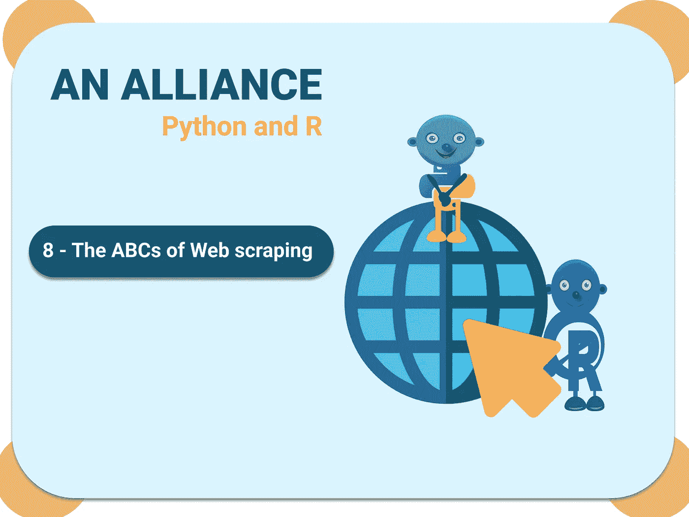

作为数据分析师、数据工程师和数据科学家，您总是需要数据来解决问题和提供解决方案。现在，作为一个初学者，当你需要来自一个还没有被管理的网站的数据时，你会怎么做呢？例如，您需要来自流媒体网络的数据来分析最受欢迎的电影，您需要来自评论的数据，您需要来自电子商务网站的数据，等等。，以表格形式进行数据分析。

本质上，获取这些数据的过程被称为网络抓取。网络抓取是使用命令从网站提取数据和信息的方法。它提取底层 HTML 代码和数据库中的数据。

注意:HTML 和 CSS 的额外知识将是网页抓取的额外优势，因为它将帮助你在检查网站内容时识别元素。

为此，我将简单地从烂番茄网站提取 [2021](https://editorial.rottentomatoes.com/guide/2021-best-movies/) 电影分级数据，使用网络抓取的基础知识，这是我创造的一个术语，代表:

A-采集
B-分解
C-编译

**获取**
在这一阶段，你心中有一个网站，你需要从其中收集数据。要获得这些数据，你需要借助一些工具来获取。以下是您需要的一些工具的示例:

**Python**

**1。请求:**这个库用于获取网站的 URL

**2。Selenium:** 这个库也用于获取网站 URL。如果您使用 chrome，selenium 的工作方式是启动 chrome web 驱动程序并在 chrome 浏览器上运行 URL。

**3。漂亮的汤:**这个库用来解析站点的 HTML 内容。

对于本教程，我们将使用请求和美丽的汤

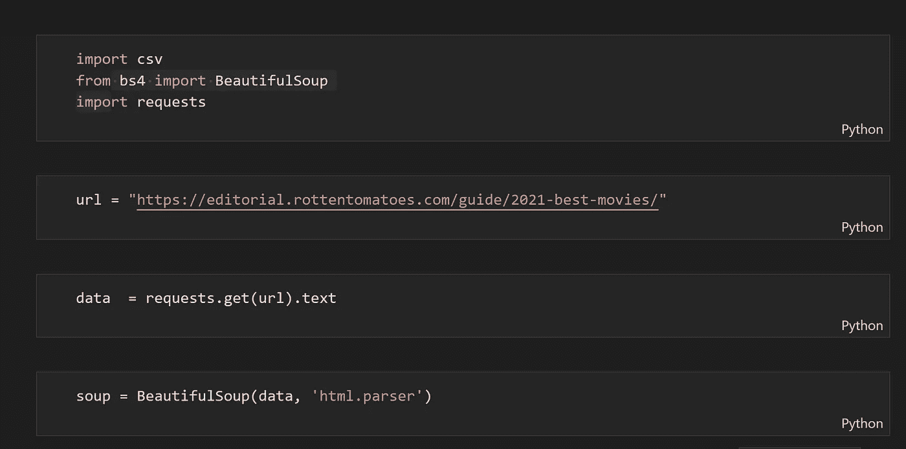

**R**

1.  **Rvest:** 这个库用于 r。

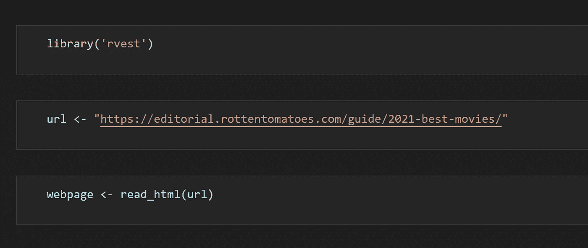

**哗**

在此阶段，您需要从网页中找到所需的元素，并指定数据集所需的必要参数。在某些情况下，find.all 元素可能无法获得网站上显示的所有数据，这是因为其中一些数据可能是使用不同的 HTML 元素保存的。要做到这一点，只需右键单击网页上的数据并检查该数据的元素。确保找到包含内容的独特标签(例如

标签)。

**Python**

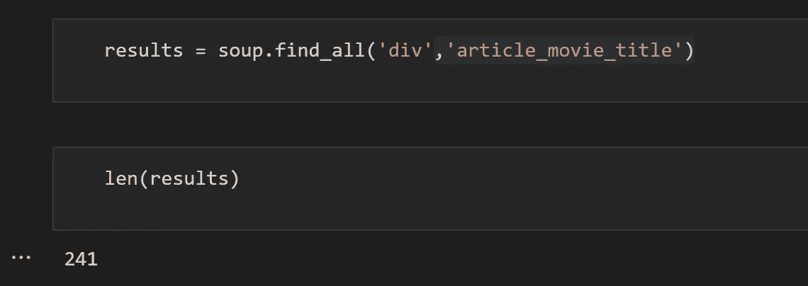

输出返回 241，查看该站点，我们看到分级的电影数量为 241。

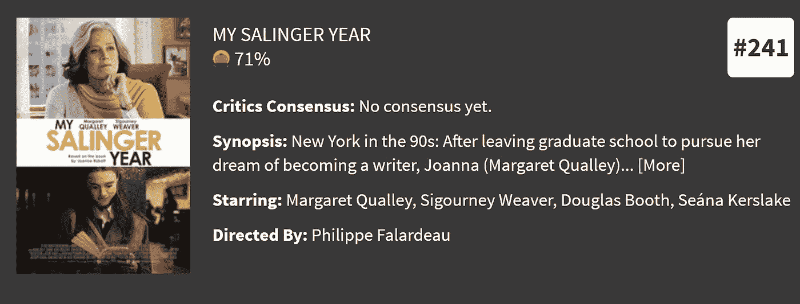

我们进一步创建了一个函数，只需右键单击内容并检查 HTML 元素来识别它，就可以保存变量电影标题和等级。

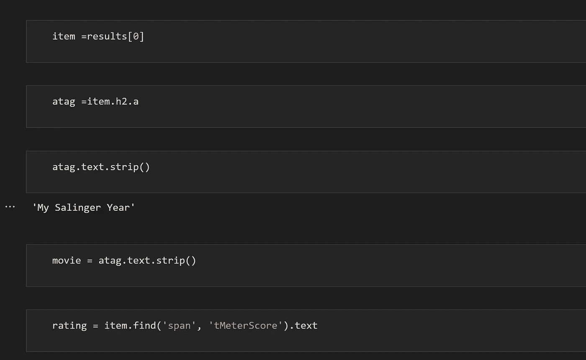

这些代码行作为提取所有记录的原型，首先提取第一个记录。我们可以用它为所有记录创建一个函数。

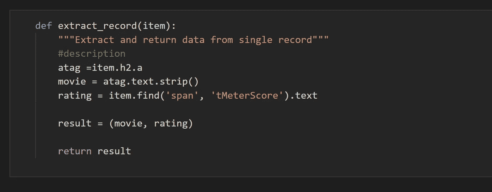

**R**

在 R 中，您提取不同列所需的信息，而不需要创建函数。

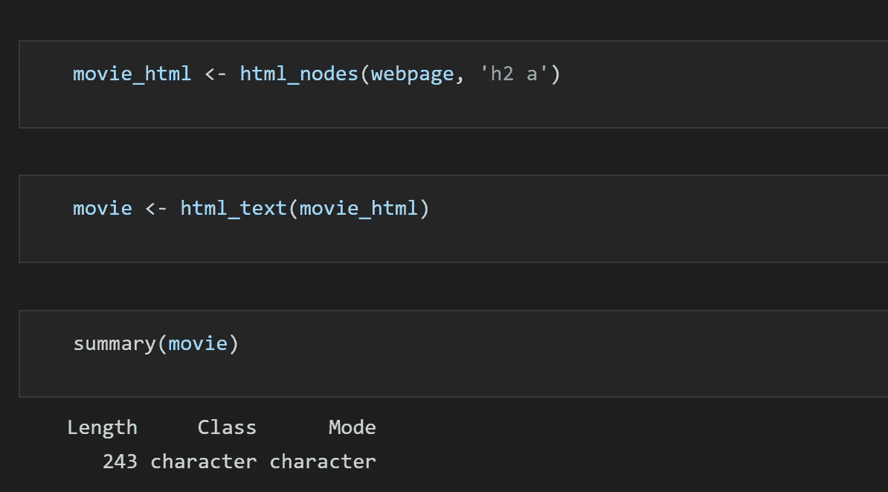

因为电影有两个不需要的文本，我们将把它转换成 dataframe 并删除它们。

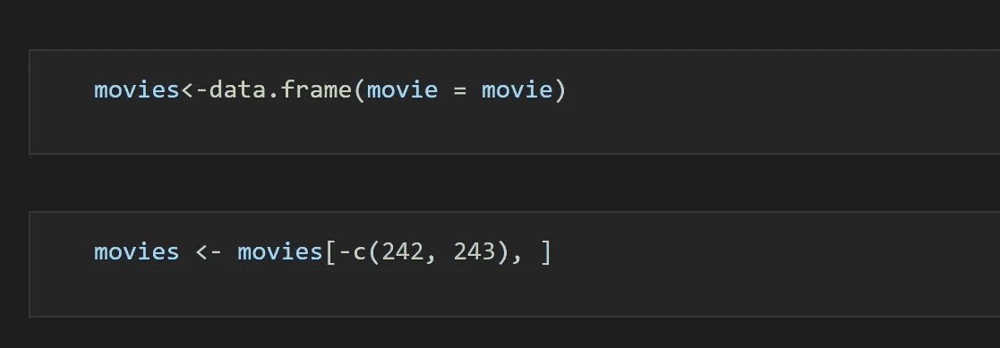

创建第二列

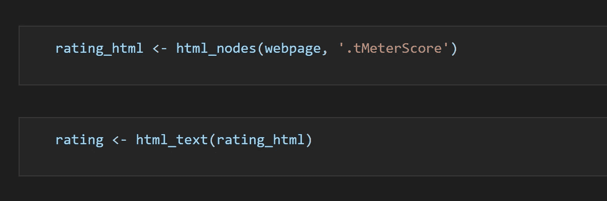

**编译**

为了进行编译，我们只需保存所有记录并将它们导出为 CSV 文件。

**巨蟒**

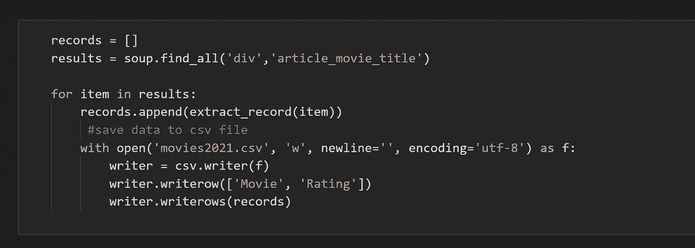

**R**

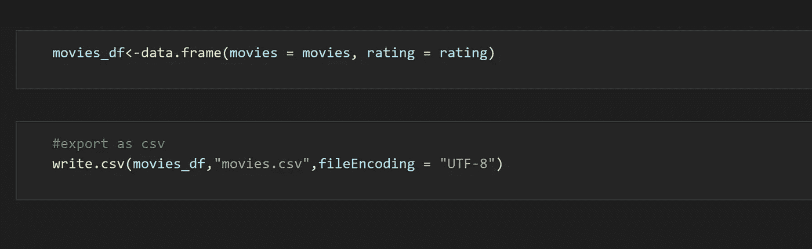

让我们查看保存的数据帧。

**Python**

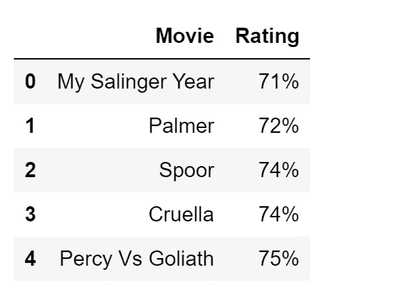

**R**

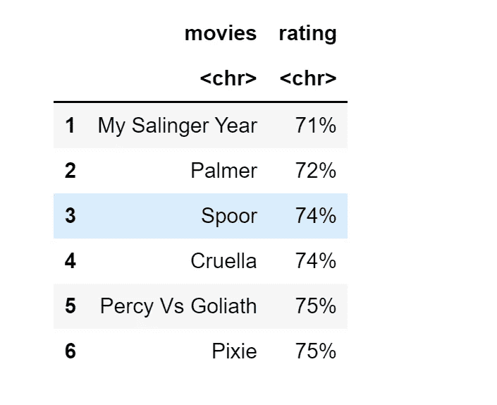

重要的是要注意，当网页抓取时，你应该确保你没有违反任何法律，因为数据可用并不意味着你应该抓取它。当 web 报废时，始终应用数据伦理。

**参考文献**

1.  [https://career foundry . com/en/blog/data-analytics/web-scraping-guide/](https://careerfoundry.com/en/blog/data-analytics/web-scraping-guide/)
2.  [https://www . analyticsvidhya . com/blog/2017/03/beginners-guide-on-web-scraping-in-r-using-rvest-with-hands-on-knowledge/](https://www.analyticsvidhya.com/blog/2017/03/beginners-guide-on-web-scraping-in-r-using-rvest-with-hands-on-knowledge/)
3.  [https://www.youtube.com/watch?v=_AeudsbKYG8](https://www.youtube.com/watch?v=_AeudsbKYG8)

 [## Mlearning.ai 提交建议

### 如何成为 Mlearning.ai 上的作家

medium.com](/mlearning-ai/mlearning-ai-submission-suggestions-b51e2b130bfb)