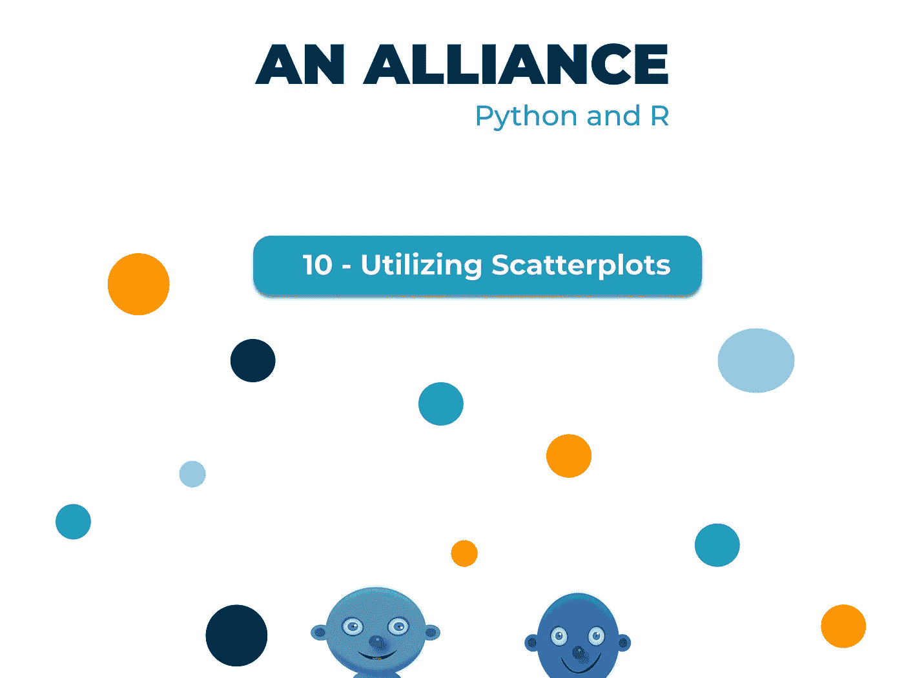
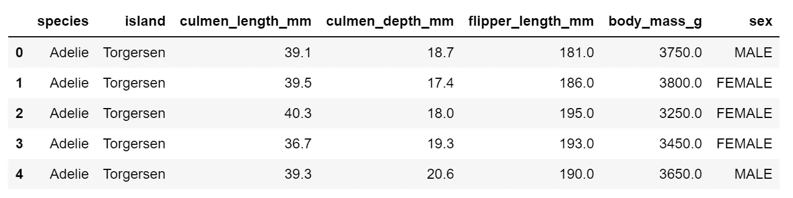
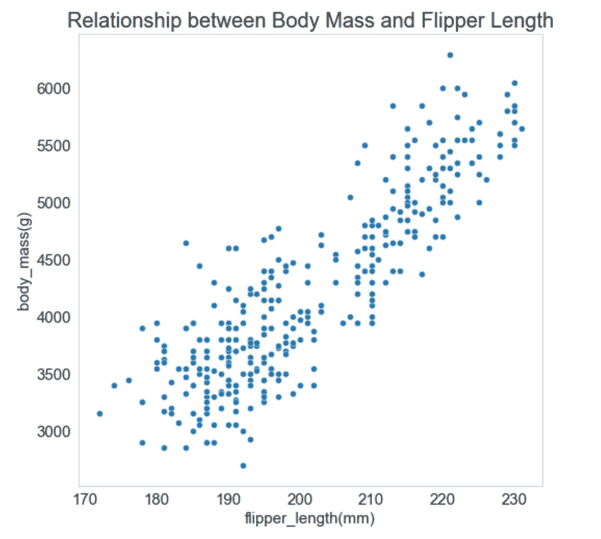
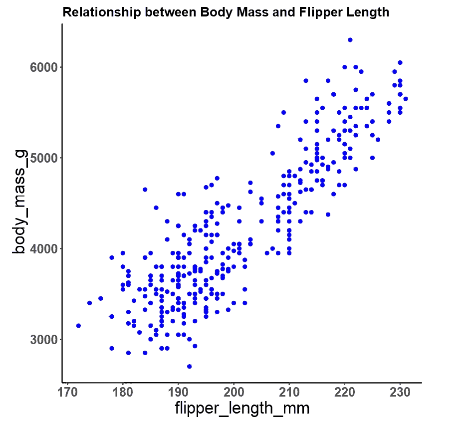
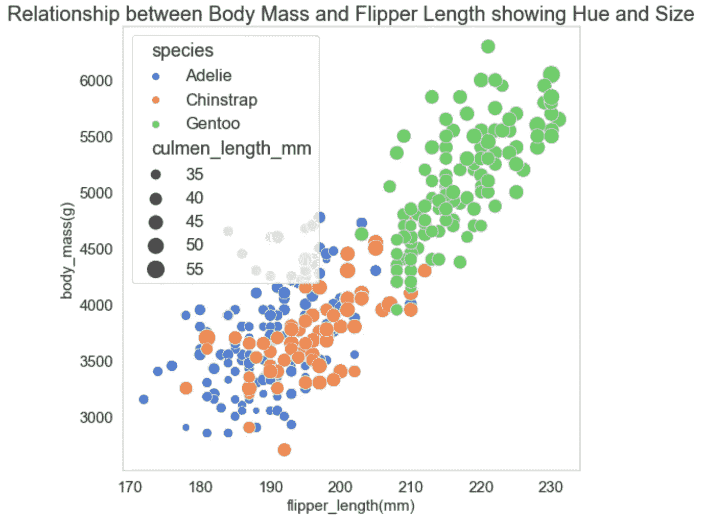
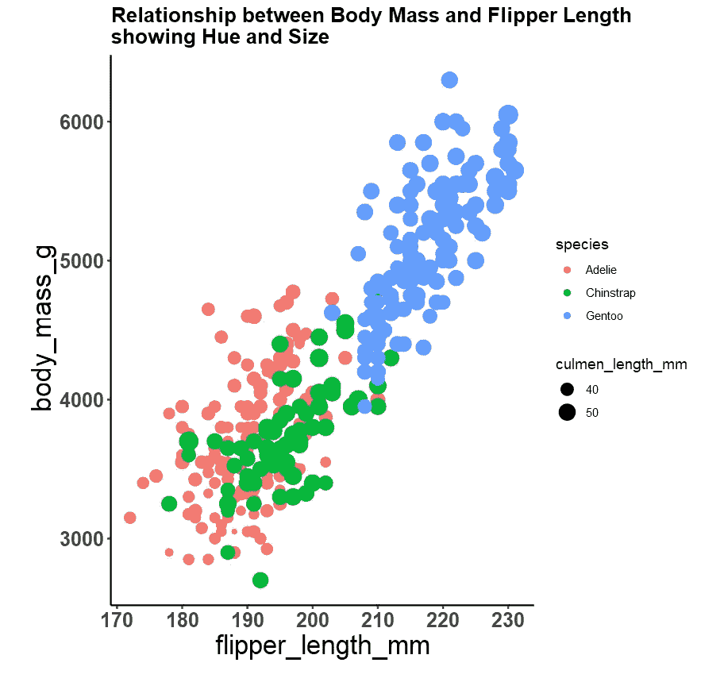
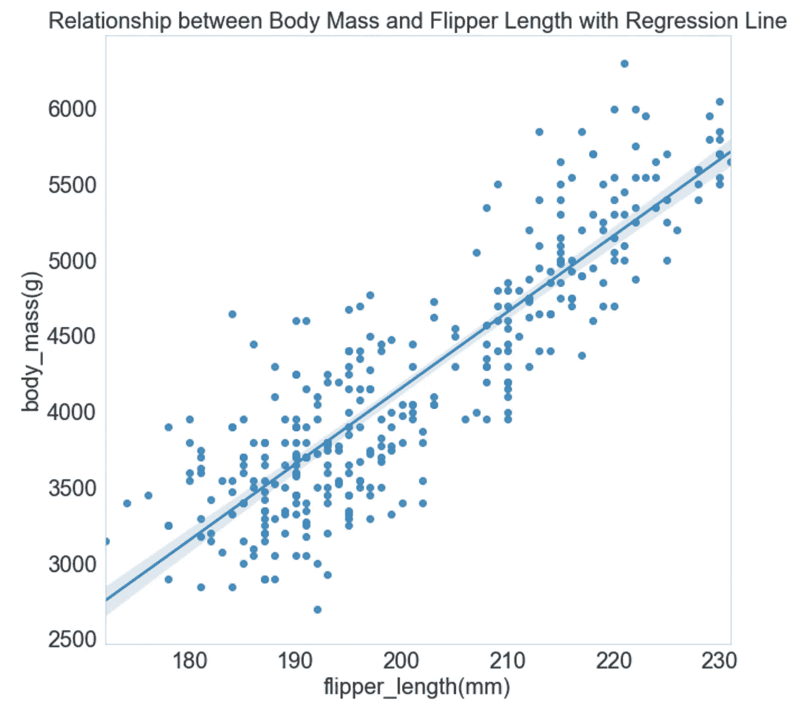
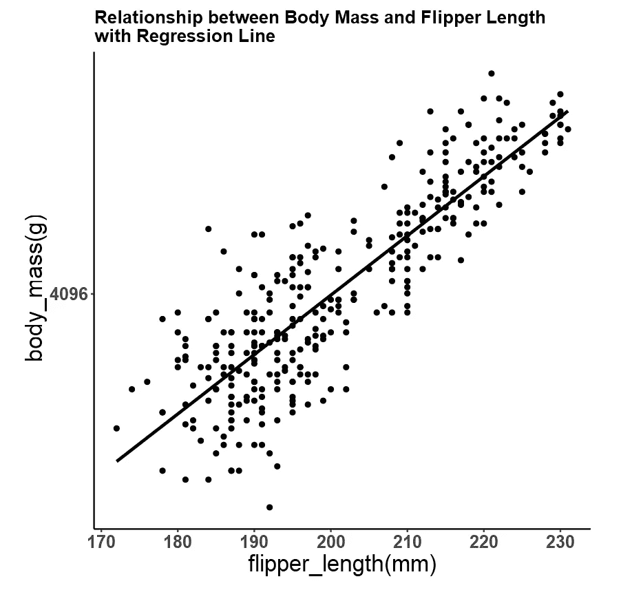
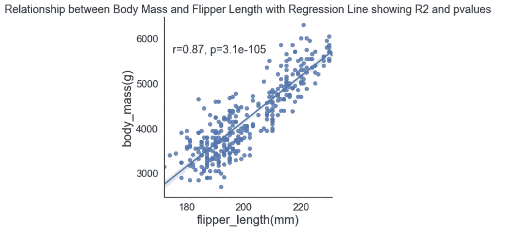
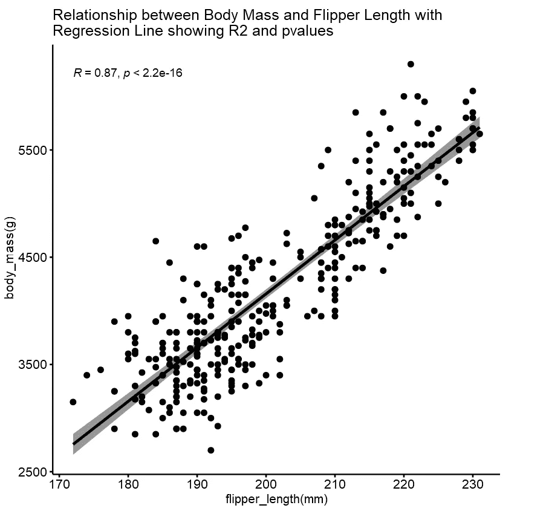

# 一个联盟:Python 和 R(利用散点图)

> 原文：<https://medium.com/mlearning-ai/an-alliance-python-and-r-utilizing-scatterplots-ef617a528dfe?source=collection_archive---------5----------------------->



数值变量是数据集中最简单也是最复杂的信息。他们可以独立地定义数据，共享关系，并帮助推动我们的数据集中的点。数字变量(也称为定量变量)是一种具有数值的可测量特征。它们可以是连续或离散的数值变量。如果一个变量在给定的区间内可以取无穷多个实值，就说它是连续的。与连续变量相反，离散变量在给定的区间内只能有有限数量的实数值。

在数据分析和可视化中，这些数值变量可以相互作用形成关系或者根本不共享任何关系。要确定这一点，散点图是揭示这一点的最佳方式。散点图绘制数字数据对，每个轴上一个数据点，以展示它们的相关性。现在每个人都想知道什么时候使用散点图。

它们用于以下情况:

1.  当有成对的数字数据时。
2.  当单个自变量的因变量的值很多时。
3.  在某些情况下，如识别潜在的潜在问题，评估两个看起来有联系的项目是否都是由相同的确切原因引起的，等等。

在 Python 和 R 中利用散点图有不同的方式:

1.  它可以是显示两个数值变量的相关性的简单可视化。
2.  它可以是显示两个数值变量以及分类变量与大小和色调的相关性的图。
3.  它可以是一个显示两个数值变量的相关性的图，用一条回归线来衡量这种关系是正还是负。

为了解释这一点，我将使用企鹅的数据集。在这个数据集中，我们将研究体重(g)和鳍肢长度(mm)之间的关系。我将使用一个额外的语法来定制这个图，以便清晰地可视化。



The penguins' dataset and variables

**简单散点图**

1.  计算机编程语言

```
sns.set_style("whitegrid")
bar,ax = plt.subplots(figsize=(8,8))
sns.scatterplot(data=df, x="flipper_length_mm", y="body_mass_g")
ax.set_title("Relationship between Body Mass and Flipper Length", fontsize=20)
ax.set_xlabel ("flipper_length(mm)", fontsize=15)
ax.set_ylabel ("body_mass(g)", fontsize=15)
ax.tick_params(axis='x', labelsize=15)
ax.tick_params(axis='y', labelsize=15)
ax.grid(False)
```



2.稀有

```
ggplot(df, aes(x = flipper_length_mm, y = body_mass_g))+
  theme_classic()+geom_point(col='blue')+
  theme(axis.text.y = element_text(size = 15, face='bold'), 
        axis.text.x = element_text(size = 15, face='bold'), axis.title.y = element_text(size = 20), 
        axis.title.x = element_text(size = 20), plot.title = element_text(face = "bold", size = 15))+
ggtitle("Relationship between Body Mass and Flipper Length")
```



从散点图中，我们看到鳍状肢长度和身体质量之间有关系，因为随着鳍状肢长度的增加，身体质量也增加。所以我们可以说，对于企鹅来说，脚蹼长度越长，体重越高。

**带色调和尺寸变量的散点图**

1.  计算机编程语言

```
sns.set_style("whitegrid")
bar,ax = plt.subplots(figsize=(8,8))
sns.scatterplot(data=df, x="flipper_length_mm", y="body_mass_g", hue='species', palette='muted', size="culmen_length_mm",
    sizes=(50, 300))
ax.set_title("Relationship between Body Mass and Flipper Length with Hue and Size", fontsize=20)
ax.set_xlabel ("flipper_length(mm)", fontsize=15)
ax.set_ylabel ("body_mass(g)", fontsize=15)
ax.tick_params(axis='x', labelsize=15)
ax.tick_params(axis='y', labelsize=15)
ax.grid(False)
```



2.稀有

```
ggplot(df, aes(x = flipper_length_mm, y = body_mass_g, col=species))+
  theme_classic()+geom_point(aes(size = culmen_length_mm)) +
  theme(axis.text.y = element_text(size = 15, face='bold'), 
        axis.text.x = element_text(size = 15, face='bold'), axis.title.y = element_text(size = 20), 
        axis.title.x = element_text(size = 20), plot.title = element_text(face = "bold", size = 15))+
ggtitle("Relationship between Body Mass and Flipper Length with Hue and Size")
```



用这个物种的颜色和长度来表示点的大小，巴布亚人有更长的鳍状肢和更高的身体质量。他们也有更长的秆。当看着这些点的尺寸时，下颚带物种也有很长的秆。

**带回归线的散点图**

要查看这两个变量之间的关系，我们可以使用线性回归线。

1.  计算机编程语言

```
fig, ax = plt.subplots(figsize=(10, 10))
sns.regplot(x="flipper_length_mm", y="body_mass_g", data=df, ax=ax)
ax.set_title("Relationship between Body Mass and Flipper Length with Regression Line", fontsize=20)
ax.set_xlabel ('flipper_length(mm)', fontsize=20)
ax.set_ylabel ('body_mass(g)', fontsize=20)
ax.tick_params(axis='x', labelsize=20)
ax.tick_params(axis='y', labelsize=20)
ax.grid(False)
```



2.稀有

```
ggplot(df, aes(x = flipper_length_mm, y = body_mass_g))+
  theme_classic()+geom_point()+
  geom_smooth(method = "lm", se = F, color="black")+
  xlab("flipper_length(mm)")+ylab("body_mass(g)")+scale_y_continuous(trans = 'log2')+
  theme(axis.text.y = element_text(size = 15, face='bold'), 
        axis.text.x = element_text(size = 15, face='bold'), axis.title.y = element_text(size = 20), 
        axis.title.x = element_text(size = 20), plot.title = element_text(face = "bold", size = 15))+
ggtitle("Relationship between Body Mass and Flipper Length with Regression Line")
```



回归线显示变量之间的正关系。该回归还可以在图上显示 r 平方值和 p 值。

1.  计算机编程语言

```
sns.set(font_scale=1.5,style="white")
g= sns.lmplot(x="flipper_length_mm", y="body_mass_g", data=df)def annotate(data, **kws):
    r, p = sp.stats.pearsonr(data['flipper_length_mm'], data['body_mass_g'])
    ax = plt.gca()
    ax.text(.05, .8, 'r={:.2f}, p={:.2g}'.format(r, p),
            transform=ax.transAxes)g.map_dataframe(annotate)
g = (g.set_axis_labels("flipper_length(mm)", "body_mass(g)", size=20))
ax = plt.gca()ax.set_title("Relationship between Body Mass and Flipper Length with Regression Line showing R2 and pvalues")
```



2.稀有

```
ggscatter(df, x = "flipper_length_mm", y = "body_mass_g", 
          add = "reg.line", conf.int = TRUE, conf.int.level = 0.95,
          cor.coef = TRUE, cor.method = "pearson",
          xlab = "flipper_length(mm)", ylab = "body_mass(g)", title='Relationship between Body Mass and Flipper Length with 
Regression Line showing R2 and pvalues')
```



两个图的 R 平方值显示值为 0.87，表明变量之间有很强的正线性相关性。pvalues 还表明变量之间没有显著差异。

散点图的输出完全取决于数据集的类型。通过遵循这些简单的步骤，您可以利用散点图充分利用您的数据分析和可视化。

[](/mlearning-ai/mlearning-ai-submission-suggestions-b51e2b130bfb) [## Mlearning.ai 提交建议

### 如何成为 Mlearning.ai 上的作家

medium.com](/mlearning-ai/mlearning-ai-submission-suggestions-b51e2b130bfb)