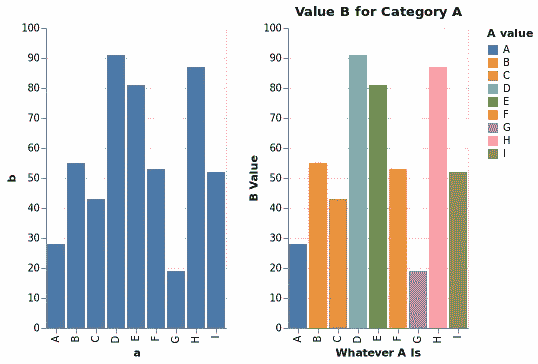
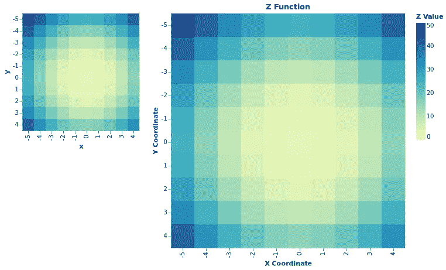
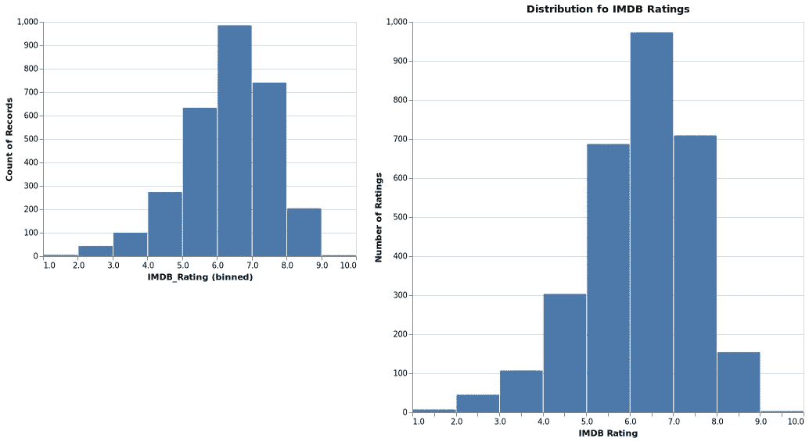
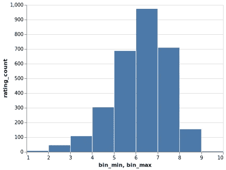
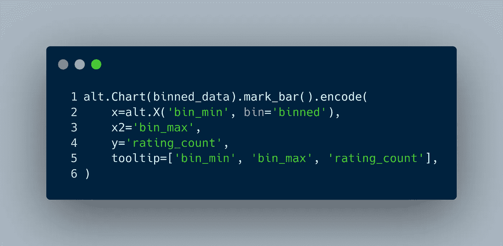
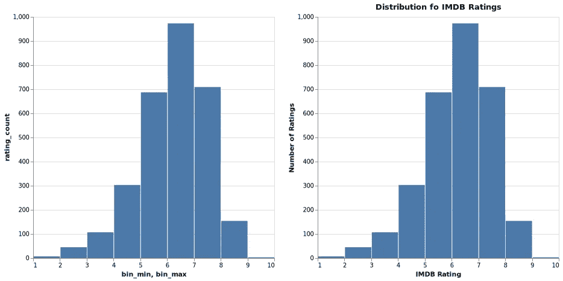
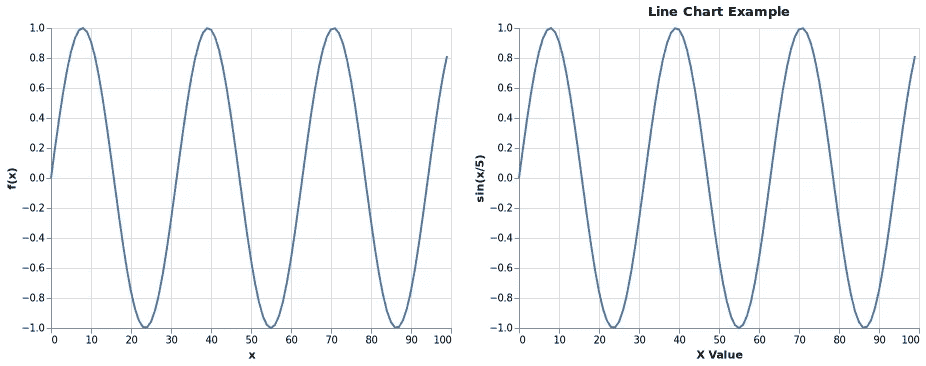
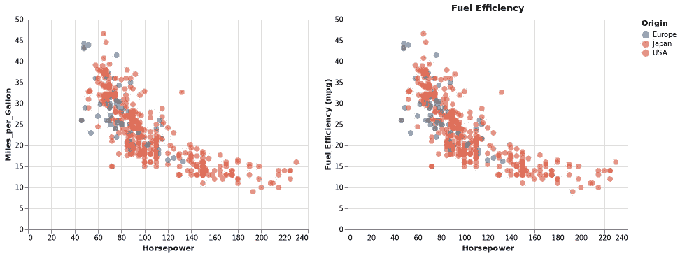
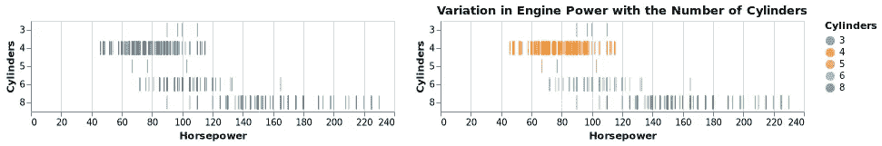

# 牛郎星绘图的另一种介绍

> 原文：<https://medium.com/mlearning-ai/an-alternative-introduction-to-altair-plotting-c7c5a7ee4bde?source=collection_archive---------0----------------------->

## 常见选项和最佳实践

Photo by [Stephen Phillips — Hostreviews.co.uk](https://unsplash.com/@hostreviews?utm_source=unsplash&utm_medium=referral&utm_content=creditCopyText) on [Unsplash](https://unsplash.com/s/photos/charts?utm_source=unsplash&utm_medium=referral&utm_content=creditCopyText)

# 范围

本文面向至少对一个绘图库有些熟悉的读者，并且在`python`生态系统中，很可能是`matplotlib`。因此，当引入一个新的绘图库时，除了基本的语法之外，大多数人想知道如何启用公共选项，并在设置标题、定义用户友好的工具提示以及将转换从绘图元素中分离出来时应用基本的最佳实践。

这篇文章不是介绍一个新的数据集，而是基于 [altair](https://altair-viz.github.io/gallery/index.html) 的*示例库*，但是应用了这些通用选项和最佳实践。本文展示了原始和修改后的图，以产生一个易于浏览的参考。

Welcome to Data Science Guides by [Ashraf Miah](https://aero-data-science.medium.com/) | Image by the Author

# 简单条形图

对比显示原始的(在*左侧*上)和修改后的*图*(在*右侧*上)。plot 是最简单的例子，但是它缺少一些基本的最佳实践，比如 plot 和 axes 标题。增加了条形的颜色编码，以产生更大的对比度。

A Simple Bar Chart Comparison by [Ashraf Miah](https://aero-data-science.medium.com/) | Image by the Author

下面的代码直接来自*牛郎星*的开发者:

`source` *数据框*中的数据如下:

使用以下内容制作了*新的*修改图:

三大变化:

*   使用`alt.X`类给轴赋予了更有意义的`title`。
*   使用`alt.Tootlip`类再次添加了自定义`title`。
*   为整个图添加了一个`title`，以反映使用`Chart`的`properties`元素的最佳实践。

# 简单热图

*原版*和*改进型*的对比如下:

Simple Heatmap Comparison by [Ashraf Miah](https://aero-data-science.medium.com/) | Image by the Author

来自 *Altair* 开发者的代码使用`x`、`y`和`z`之间的简单关系生成`source`数据:

下面是源数据的预览:

修改后的*图表*由以下代码生成:

相对于之前的图，`color`通道已经使用`alt.Color`类进行了定制。图表*的其余部分*反映了最佳实践:轴、图例和绘图使用类似的模式`alt.X('x:O', title='X Coodinate')`提供给`title`。图的大小也改变了——注意使用了整数*而不是字符串*。

# 简单直方图

*原始*和*新*图表之间的对比隐藏了显著的变化。 *Altair* 使用单线(`bin=True`)执行转换以创建直方图，而使用`pandas`操作数据需要更多的工作:

A Simple Histogram Comparison by [Ashraf Miah](https://aero-data-science.medium.com/) | Image by the Author

原始代码包含一个关键字参数，用`bin=True`转换数据:

数据来自 IMDb，包括许多电影事实:

直方图是`IMDB_Rating`的直方图，通过`altair`使用`bin=True`选项使其变得简单。相比之下，手动宁滨数据并以直方图的形式呈现需要一行以上的时间！

这个例子有助于说明如何使用`spark`、`dask`、`vaex`等将包含 1000 万行的大数据集轻松转换为只有 10 行的`pandas Series`，而`altair`通常会很困难。以下步骤改编自`altair`团队的[问题#1691](https://github.com/altair-viz/altair/issues/1691) 。

使用`pd.read_json()`功能将`url`中的数据存储为*数据帧* ( `df`)。然后，第一步是创建容器类别(或边缘),然后相应地划分数据:

检查的输出确认分类是正确的:

接下来的步骤是:

*   使用`groupby`汇总数据
*   为每个类别的最低和最高评分创建标签列
*   删除不再需要的索引

在整个*数据框架*中，只有`IMDB_Rating`列是必需的，并使用宁滨类别、`count`编辑、转换和重命名为*数据框架*进行聚合(`groupby`)。然后使用`list`索引到单独的列中提取每个箱的范围，并移除现有的`index`。数据现在是这样的格式:

下面的例子是在*图库*中找到的**而不是**，并且没有明确说明，但是下面的代码是用**预入库**数据创建*图表*的最小代码:

Pre-binned Histogram by [Ashraf Miah](https://aero-data-science.medium.com/) | Image by the Author

注意关键字参数`bin=’binned’` 是必需的，它允许使用`x2`(或`y2`)编码通道来定义 bin 范围的上限:

Image by the Author

`tooltip`包含每个箱的上限和下限；这可以通过使用 *Vega 表达式*和`altair`的`transform_calculate`函数来改善:

Image by the Author

代码一次显示多个`altair`特性；数据被转换以创建一个名为`rating_range`的新参数。使用 *Vega* 表达式将这两个标签列转换成字符串，然后使用 *JavaScript* 语法组合起来，创建一个格式为`6–7`的标签。这显示为`tooltip`。*图表*也被分配了稍大的尺寸，以便于比较。

但是，该图没有反映最佳实践，如下文的并排比较所示:

Comparison with Best Practice by [Ashraf Miah](https://aero-data-science.medium.com/) | Image by the Author

修改后的图表(右侧)的代码如下所示:

由于使用了*预先入库的*数据，因此`altair`行的数量增加了一倍。生成新参数的`transform_calculate`功能已经介绍过了。要删除第二个轴标题，必须明确设置为`None`，即`alt.X2('bin_max', title=None)`。使用`title`参数添加带有格式良好的标签的工具提示，作为绘图标题。

# 简单折线图

*原始*和*新*图之间的比较如下所示，其中有一些反映最佳实践的微小变化:

Simple Line Chart Comparison by [Ashraf Miah](https://aero-data-science.medium.com/) | Image by the Author

用于生成*原始*图的代码是一个非常简单的*正弦*图示例:

该数据的格式如下:

对*原始*图的修改较小，使用更明确的轴`titles`和总体图的`title`:

# 带工具提示的简单散点图

下面使用静态图像简单散布在*原始*和*新*之间，隐藏了使用`Tooltips`的一些变化以及最佳实践的应用:

Simple Scatter Chart Comparison by [Ashraf Miah](https://aero-data-science.medium.com/) | Image by the Author

*原始*代码使用来自*织女星*的 cars 数据集，并显示圆圈的修改尺寸:

该数据的格式如下:

修改后的图包含许多最佳实践，使其更易于阅读和理解:

增加了一个剧情`title`和`y`频道的明确标题，因为它反映了燃油效率。`Tooltip`现在包含了`Miles_per_Gallon`编码的缩写，以便在交互查看时减少对*图表*的阻碍。

# 简单堆积面积图

*原*与*修改后*的对比

Simple Stacked Area Chart Comparison by [Ashraf Miah](https://aero-data-science.medium.com/) | Image by the Author

原始代码使用*美国爱荷华州*能源生产数据集和区域`mark`:

数据在*长*表格中:

修改后的代码反映了之前讨论的最佳实践，对所有通道使用显式标题:

# 简单带状图

*原*与*改装*的对比:

Simple Strip Chart Comparison by [Ashraf Miah](https://aero-data-science.medium.com/) | Image by the Author

数据同样基于来自*织女星*的 cars 数据集；请注意编码数据类型的显式使用:

*   `Q`:定量
*   `O`:序数

该数据的格式如下:

修改后的图表增加了`color`通道以增加对比度:

该图反映了添加`color`通道作为*标称*数据类型的最佳实践。

# 摘要

来自 *Altair* 示例图库的第一组绘图已尽可能以最佳实践再现，但也通过从绘图组件中分离转换。修改后的图显示了以下附加特征:

*   添加情节`title`
*   用`alt.X(<column>, title='Meaningful Axis')`明确标记轴
*   明确标注其他频道和*工具提示*
*   出于显示目的，使用`transform_calculate`生成新的补充数据。
*   用`altair`宁滨数据生成聚合，用于随后的绘图。

因此，通过使用几个展示常见选项和最佳实践的示例，对 *Altair* 进行了另一种介绍，这些示例在 *Altair* 用户指南的*示例库*中没有。

## 属性

所有`gists`，笔记本，终端演员表均为作者。所有作品都是基于明确的 [CC0、公共领域](https://creativecommons.org/share-your-work/public-domain/cc0/)许可或[SIL of](https://scripts.sil.org/cms/scripts/page.php?item_id=OFL_web)的资产，因此不侵权。主题灵感来自并基于我最喜欢的`vim`主题:[grubbox](https://github.com/morhetz/gruvbox)。

## 连接

请随时在 LinkedIn 上与我联系。

 [## Mlearning.ai 提交建议

### 如何成为 Mlearning.ai 上的作家

medium.com](/mlearning-ai/mlearning-ai-submission-suggestions-b51e2b130bfb)