# 一个人工智能的代笔人

> 原文：<https://medium.com/mlearning-ai/an-artificially-intelligent-ghost-writer-51ee08cd55f7?source=collection_archive---------3----------------------->

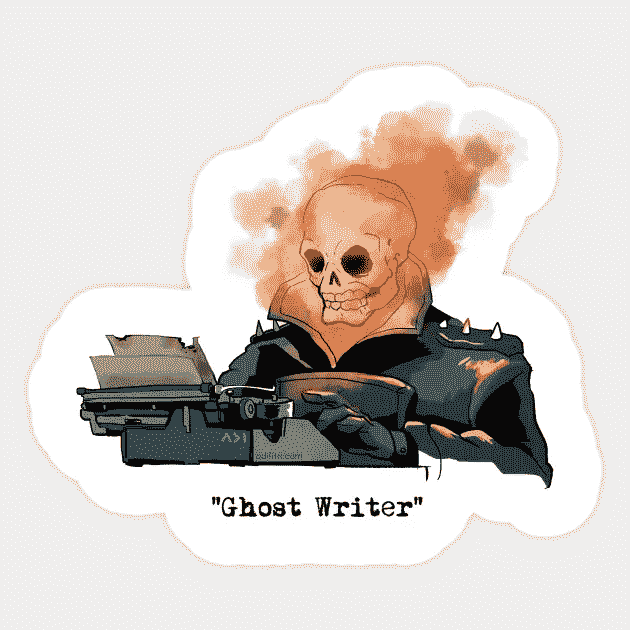

Sorry, can’t fight crimes | Have a burning desire to write songs

*项目由* [*阿克沙特·乔哈里*](/@akshatjohari) *、Rohitashwa Chakraborty、本·沙利文、贾里德·胡维特、杰克·约翰逊*

# 摘要

截至 2021 年 3 月，Spotify 平均每天有 6 万首歌曲被上传到其平台*。不是每个人都可以成为鲍勃·迪伦(他曾声称他在 [15 分钟](https://www.orpheusaudioacademy.com/songwriting-time/)中写了他的热门歌曲《我和我》)，出版一首歌的过程通常需要几个星期。*

> *这个项目的目标是节省艺术家的时间和金钱，同时简化歌曲创作过程。*

*我们整合了各种模型来观察每个模型在这项任务中的表现。这个博客总结了我们的项目管道。*

# *简介和背景*

*代笔人是指为艺人写歌但却躲在幕后的人。发现你最喜欢的艺术家没有自己创作这首歌，对许多流行音乐迷来说是一个艰难的现实考验。这种代笔的文化现象已经在音乐行业广泛传播了一段时间——事实上，*

> *[自 2014 年法瑞尔·威廉姆斯发布热门单曲《Happy 》(请跟着鼓掌)以来，还没有一位歌手凭借自己演唱和创作的热门单曲登上公告牌前 10 名。)](https://www.rollingstone.com/music/music-features/hardly-anyone-in-the-pop-charts-writes-their-own-music-alone-anymore-815333/)*

*Clap Along, please! No seriously, hit that clap icon*

*在当前这个行业，每天都有关于歌曲起源和其他知识产权问题的法律诉讼，这个惊人的统计数据真正凸显了完全独自创作一首热门歌曲是多么困难。正如你所料，这只会增加雇佣代笔人的需求。*

*Spotify 发布的数据显示，在该平台总共 800 万名艺术家中，57，000 名艺术家占了 90%的流媒体。2020 年，Spotify 支付给艺人的总收入为 50 亿美元，而 99.3%的艺人收入仅占其中的 10%，这又如何呢？*

*发布音乐是一个错综复杂的过程——它涉及到歌曲创作、编曲、跟踪、编辑、混音和母带制作。这些费用迅速增加，可能会阻止较小的新兴艺术家，很容易理解，他们宁愿不放弃自己的收入，向多人支付歌曲创作积分。*

*[公告牌百强单曲榜第一名的歌曲作者平均数量从 2009 年的 4.77 人上升到 2018 年的 10.09 人。](https://www.billboard.com/music/pop/billboard-songwriting-guide-2019-songwriters-8515698/)*

*除了少数艺术家之外，这对所有人来说都是一个昂贵的提议。如今，音乐创意者之间有一个越来越大的难题。*

*因此，为了解决这个问题，我们决定尝试使用每个人最喜欢的工具——T2 机器学习来自动化整个过程。本项目专注于流程的第一阶段-***自动写歌*** 。*

# *项目总结*

## ***目标***

*为艺术家创作逼真、有趣、朗朗上口的歌词，通过创作与之前热门歌曲相似的歌曲，为他们节省时间、金钱并增加成功的可能性。*

## *数据*

*我们使用了 Kaggle 数据集，包含不同时期和流派的 57000 多首歌词；报道了从乐观的街舞组合五唐门到古老的后街男孩的一切。*

*它可以在卡格尔网站上找到。*

## *方法和模型*

*我们在这个项目中使用了三个模型-*

*   *生成性对抗网络 **(GANs)***
*   *长短期记忆网络**(lstm)***
*   *创成式预训练变压器 **(GPT-II)***

## *应用程序和结果:*

*这个项目背后的想法是使用机器学习来创建我们的代笔人，以此来满足许多歌曲作者对艺术家的需求。这将为他们节省时间和金钱。这也让任何有抱负的艺术家更容易创作流行歌曲。我们的模型输出的歌词确实需要一些调整，但它们是创作过程中有帮助的指导路径。*

## *Github 链接:*

* [## git hub-rohitashwachaks/ghost-writer

### 您现在不能执行该操作。您使用另一个选项卡或窗口登录。您在另一个选项卡上注销，或者…

github.com](https://github.com/rohitashwachaks/ghost-writer)* 

# *数据收集/描述*

*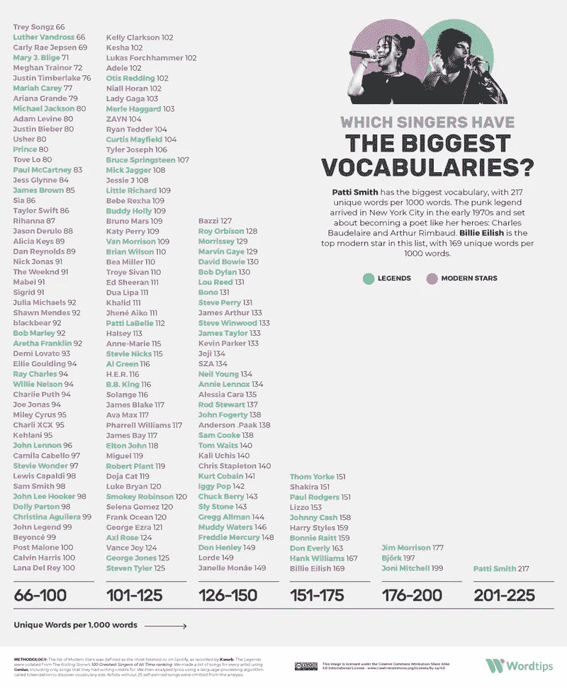*

*Range of Artists with Different Vocabularies*

*为了让我们的模型产生期望的输出，他们需要对先前写的歌词数据集进行强化训练。在我们的方法中使用的第一个模型在数据集的歌词中的关键字上进行训练。为了从训练中获得最好的结果，我们希望我们的歌词语料库是多样和有趣的。因此，我们对最啰嗦的艺术家做了一些研究，试图收集一个丰富多彩的数据集。[我们发现帕蒂·史密斯和吉姆·莫里森在这个意义上是最多产的国家之一](https://word.tips/singers-vocabularies/)。*

*我们最初的计划是使用 web[-刮板](https://github.com/rohitashwachaks/ghost-writer/blob/genius_scraper/Lyrics%20Scraper.ipynb)从 Genius 网站上抓取数据。*

*Genius to our scrapper: You’re kinda sus, bro*

*然而，Genius 似乎已经抓住了人们使用他们的网站收集数据的机会，并将你一次可以收集的歌曲数量限制在 100 首以内，并且有可能完全屏蔽这个收集器。因此，我们去了 Kaggle，找到了一个包含大约 57，000 首歌词数据的数据集，用于训练我们的模型。*

# *数据预处理和探索*

*Kaggle 数据集的歌词是歌曲的逐字转录，非常非常乱。我们从删除停用词、过滤非英语字母、清除引号等符号开始。*

*我们的探索性数据分析证实，大多数艺术家的词汇量非常有限。他们要么使用非常简单的语言，要么使用虚构的词语。无论如何，从我们的数据库中删除大量词汇而不影响歌曲的全面性是可能的。*

*为了识别这些“重要”/“频繁”的词，我们利用了 **IDF 分数**。*

> *IDF 或逆文档频率分数反映了一个单词对于集合或语料库中的文档有多重要。分数越低，这个词出现的频率越高。*

*我们将最终词汇限制在 IDF 得分最低的 10%。随后通过使用[计数矢量器](https://scikit-learn.org/stable/modules/generated/sklearn.feature_extraction.text.CountVectorizer.html)将句子转换成矢量。这些向量随后被**甘**和 **LSTM** 模型用来生成假歌。*

*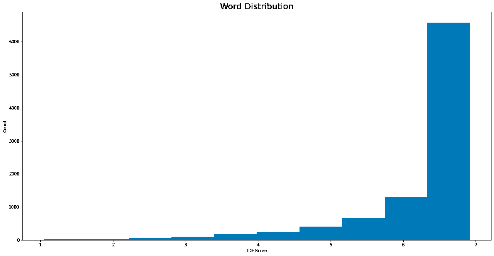*

*Distribution of IDF score in the lyrics Dataset*

*下图显示了我们语料库的 IDF 得分分布，正如预期的那样，它遵循 [Zipf 定律。](https://en.wikipedia.org/wiki/Zipf%27s_law)这个定律说明，任何一个词的出现频率都与其在频率表中的排名成反比。一般来说，有几个词在数据集中出现的频率很高，而大多数我们不常使用的词的出现频率会呈指数下降。*

**

*Word Cloud from our Dataset*

# ***建模和结果***

*在这个项目中，我们使用了三种不同的模型，每一种都使用了不同的架构，并对之前的模型进行了改进。*

# *生成对抗网络*

*当我们想到生成假数据，俗称[深度假数据](https://en.wikipedia.org/wiki/Deepfake)时，首先要考虑的模型是像[甘斯](https://en.wikipedia.org/wiki/Generative_adversarial_network)这样的生成模型。这些模型已经在一些任务中取得了成功，比如生成深度假脸或者[生成假手写数字](https://github.com/rohitashwachaks/ghost-writer/blob/text-generation-tutorial/pytorch-vgan.ipynb)。*

*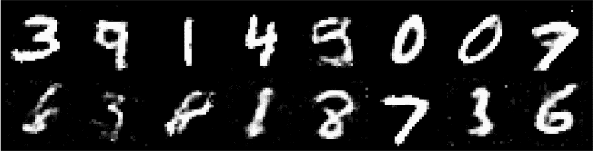*

*Generating Fake Digits using GANs*

*对于我们的项目，我们从模型的基本实现开始。我们创建了一个完全连接的 GAN(通常称为香草 GAN)。*

*一个 GAN 包括两个模型在一个[零和游戏](https://en.wikipedia.org/wiki/Zero-sum_game)中相互竞争。*

*本质上，零和游戏是发生器与鉴别器之间的游戏，其中:*

*   *如果生成器可以用它的深度假货“愚弄”鉴别器，它就赢了。*
*   *如果鉴别器检测到深层假货，它就赢了。*

*为了实现我们这个项目的目标，为艺术家生成现实、有趣和朗朗上口的歌词，作为数据科学家，我们希望生成器获胜，因为这意味着我们可以生成无法从热门歌曲歌词中辨别出来的歌词。*

*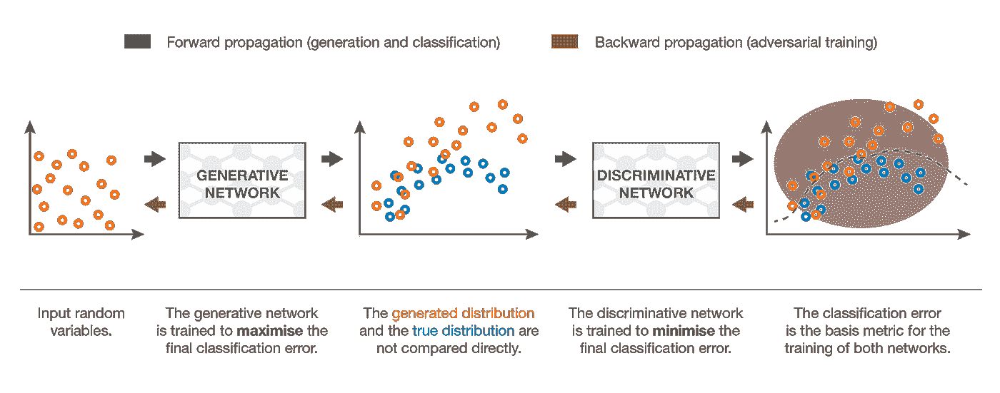*

*How do GANs work?*

## **发电机**

*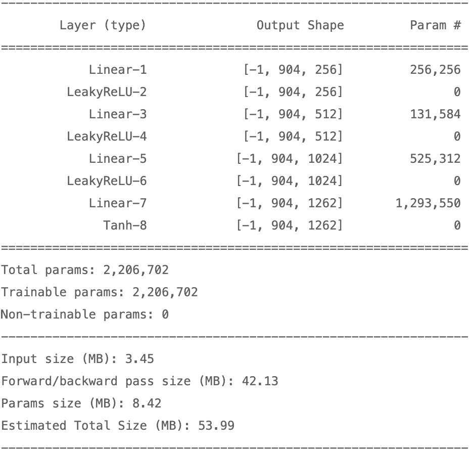*

*Generator Architecture*

*对于生成器，我们从具有 3 个隐藏层的基本网络开始，具有 ReLU 激活，最后是具有 Tanh 激活的输出层。*

*由于这是一个完全连接的神经网络，在输出层，我们需要一个向量来编码歌曲/句子中关于世界的所有信息。*

*在输入端，它接受一个随机噪声向量作为输入。*

## ****鉴别器****

*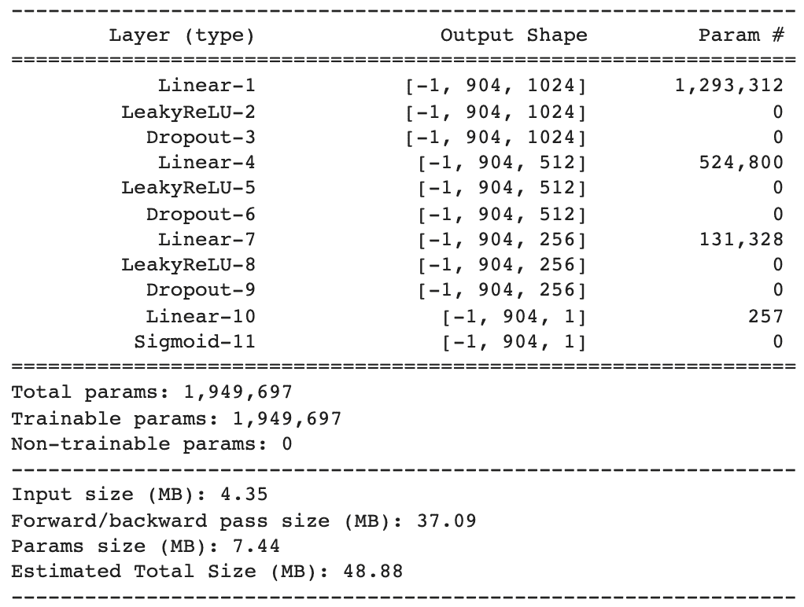*

*Discriminator Architecture*

*鉴别器的架构在很大程度上与生成器的架构相反；具有 3 个完全连接的隐藏层。它接受一个输入，一个“一个热编码”向量，词汇表的大小，并将其分类为真或假(输出大小= 1)。已经实现了偶然丢弃层，以确保我们的模型不会过度拟合训练数据。*

*DiscriminatorNet on Tensorflow*

## **输出**

*在允许我们的模型训练 200 个时代之后，以下是我们的模型生成的假歌曲的几个例子:*

*Keywords in a song. Spatial Information*

*鉴于目标是创作“新”歌曲，结果虽然不错，但对寻找代笔人的人来说不是最有用的。我们在上面看到的只是一个包含在歌曲中的关键词的提示。*

## **限制**

*在歌词生成的环境中，vanilla GAN 的缺点是生成的输出包含空间信息(关键字列表)，而不是时间信息(随时间推移的关键字序列)！*

# *长短期记忆网络*

*为了克服 V-GAN 的缺点，我们试图寻找一种能够“记住”过去的输入并相应地改变其输出的模型。**[**【LSTM】**或长短期记忆网络](https://towardsdatascience.com/lstm-networks-a-detailed-explanation-8fae6aefc7f9)是建立在**[**【RNN】**(递归神经网络)](https://en.wikipedia.org/wiki/Recurrent_neural_network)架构之上的模型，并做了一些调整(主要是在内存方面)。*****

*****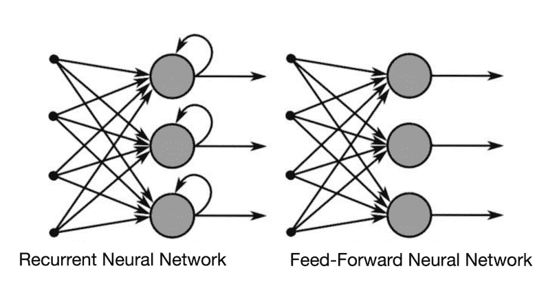*****

*****RNN 的力量来自于它“记住”过去的输入并以此影响当前预测的能力。代替简单的前馈网络，RNN 实现了模拟这种存储器操作的反馈回路。*****

*****然而，简单的 RNN 存在*[*消失渐变*](https://www.superdatascience.com/blogs/recurrent-neural-networks-rnn-the-vanishing-gradient-problem)*的问题，这阻碍了有效的学习。*******

*******为了克服这些挑战，并使模型能够更好地记忆，LSTM 单元被添加到模型中，这实质上是一种可以在更长时间内保留信息的记忆单元。对于我们的模型，我们使用了一个只有一层的浅层 LSTM 网络。*******

*******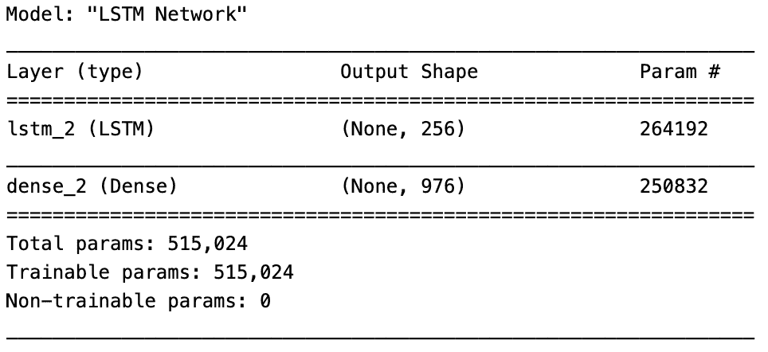*******

*******LSTM Model Architecture with 1 lstm layer*******

## ********输出********

*******与 GAN 相比，LSTM 模型的一个重大改进是，现在我们的模型可以生成句子，而不仅仅是关键字。*******

*******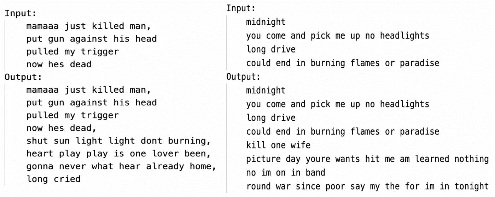*******

*******Now Serving, Fresh Songs: Taylor-made*******

*******然而，生成的句子是不连贯的，它没有考虑到语言概念，如押韵方案或上下文。*******

# *******生成式预训练变压器 **(GPT-II)*********

*******LSTM 在这个领域的主要劣势是他们无法理解一长串单词的上下文。例如，以下面两句话为例:*******

*   *******这只动物没有穿过马路，因为它太累了。*******
*   *******这只动物没有穿过马路，因为马路太宽了。*******

*******人类可以毫无问题地区分这两个句子。然而，一个 RNN/LSTM 人不知道“它”指的是动物还是道路。LSTMs 无法提高长字符串中的模型性能。为了解决这些问题，OpenAI 的一个团队开发了一个全新的模型。他们完全抛弃了 RNNs，转而实现了一个 transformer 架构。*******

> *******transformer 体系结构试图整合单词之间的力量——它获取单词的单个实例的上下文，以及它如何与前后的其他单词相关联。*******

*******每个单词都被查看，并且密切关注序列中最重要的元素——这是其他模型无法做到的——它们只能做其中的一个。这样，基于变压器的模型有两个主要优势:*******

*   *******更准确，因为它们理解彼此相距很远的顺序元素之间的关系。*******
*   *******他们处理序列的速度很快，因为他们更关注最重要的部分。*******

*******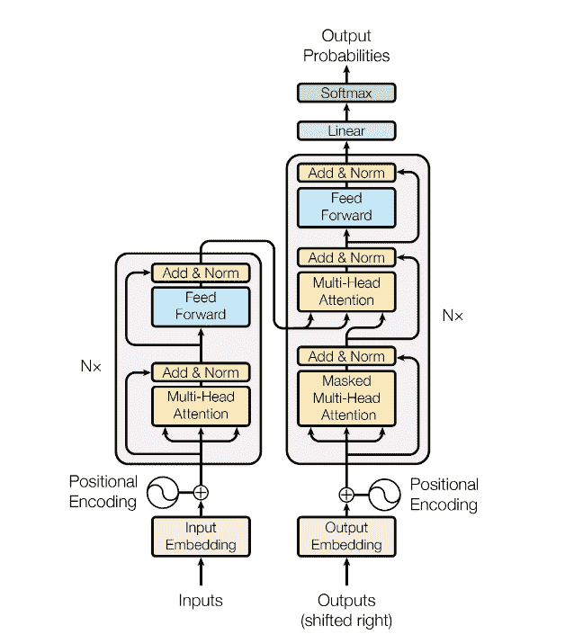*******

*******Transformer Architecture*******

*******变压器架构涉及编码器-解码器序列。在 GPT-II 中，编码器和解码器都是 6 层的堆栈，分别具有两个和三个子层。编码器有一个多头自关注机制，它使用缩放的[点积关注](https://arxiv.org/pdf/1706.03762.pdf)来创建序列中单词的位置编码。这个输出然后被馈送到一个全连接的神经网络，该网络具有两个线性变换和它们之间的一个 RELU 函数。然后将这些的输出相加并归一化，产生维数为 d = 512 的输出。*******

*******解码器由与编码器相同的模型组成，只有一个不同——它有另一个多头自我关注层，它从编码器和另一个多头关注层获得输出，将它们组合起来，然后将它们传递给完全连接的神经网络。这样做的好处是可以防止模型使用未来头寸的数据。位置 *i* 的预测因此只能依赖于直到位置 *i-1* 的数据。变压器架构的示意图如下所示:*******

******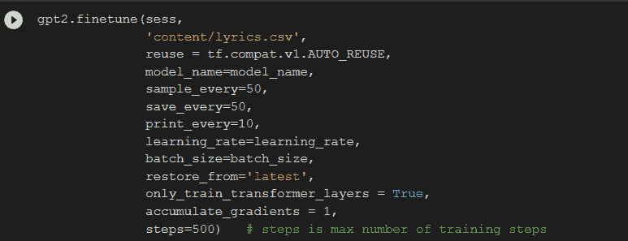******

******Implementing GPT-2******

******为了进一步提高我们在 LSTM 的结果，我们尝试使用 GPT-II 迁移学习。如果你不知道**迁移学习**是什么，这里有一个很好的总结[。本质上，迁移学习是将你在一个环境中学到的东西应用到另一个环境中。GPT-II 被设计用来翻译不同的语言。我们用它来产生新的歌词。使用 GPT 存在一些问题——open ai 没有公开源代码，因为他们担心恶意行为者出于邪恶目的使用(令人难以置信的逼真)模型。](https://towardsdatascience.com/a-comprehensive-hands-on-guide-to-transfer-learning-with-real-world-applications-in-deep-learning-212bf3b2f27a)******

## *********输出*********

******GPT-II 模型是我们表现最好的模型，成功地在短诗节中生成了歌词，如下所示。******

******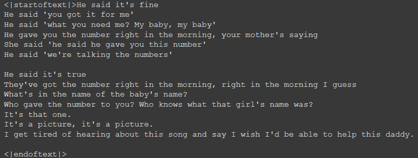******

******Is this…the next big hit?******

*******GPT-II 生成的歌词示例*******

******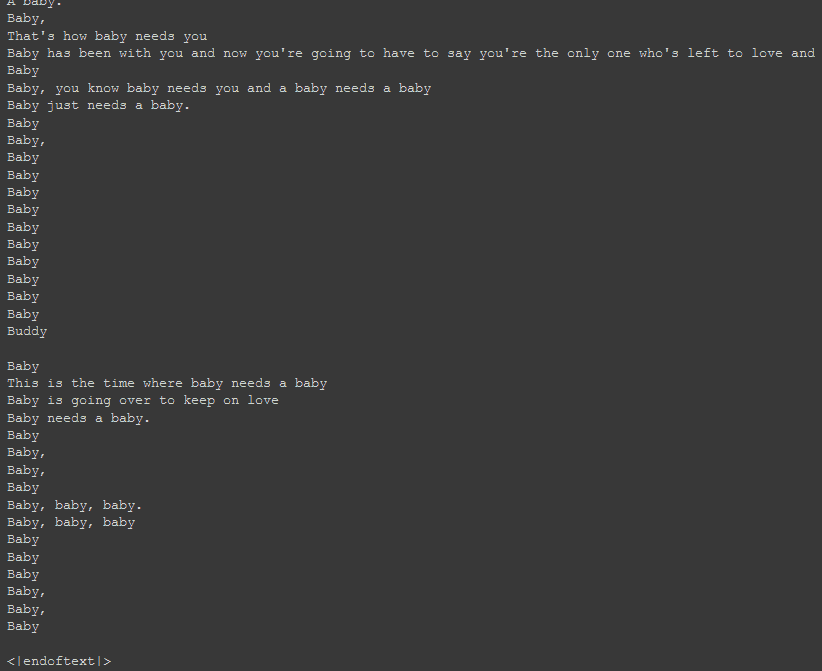******

******Not sure if AI or Justin Beiber******

******GPT 的一个问题是，它本质上是一个黑箱——没有太多的方式来解释为什么一个特定的输出会产生。******

# ********总结********

******我们这个项目的目标是创造一个 ML 代笔人，以节省艺术家创作歌曲的时间和成本，并使有抱负的艺术家更容易创作歌曲。******

******我们通过在 57，650 首完整创作的歌曲的数据集上训练三个不同的模型来解决这个问题。******

******我们使用的三个模型是生成性对抗网络、长短期记忆网络和生成性预训练转换器。******

******GAN 能够输出一个关键词列表，也许有助于给艺术家灵感，但在代笔方面并不理想。******

******为了改进我们的结果，我们使用了 LSTM 网络，该网络通过记住过去的输入并将其用作当前预测的因素来改进 GAN 模型。从 LSTM，我们现在能够得到句子，但它们仍然缺乏连贯的顺序和结构。这对于让艺术家们知道谈论什么仍然是有用的，但并不理想。******

******然后我们转向 GPT-II 模式，它表现最好，能够产生由短诗节组成的好歌词。它改进了 LSTM 模型，在一长串单词中增加了上下文。通过这一点，它可以更好地捕捉句子结构和歌词结构。******

# ********挑战&外卖********

******人类语言有很多我们很难注意到的细微差别，但这使得 ML 模型很难快速学习和复制，特别是歌词有节奏和模式。******

******我们的主要挑战之一是训练数据样本大小和计算能力，这两者都是让这些模型输出高质量歌词所需的。******

> ******我们面临的另一个挑战是量化模型的结果。******

******任何模型的损失函数都被定义为输入和输出之差。******

******然而，我们的要求是新鲜和朗朗上口的歌词。*没有预定义的输出，我们可以与模型输出进行比较来衡量性能。*******

******这个项目的主要收获是理解这些模型在我们的应用程序中是如何运行的，以及它们是如何相互改进的。******

******单词生成是棘手的，因为句子中的顺序问题和模型需要理解单词之间的关系才能成功。******

******LSTM 通过将先前的输出反馈到模型中来改进学习，从而改进了简单的 GAN。GPT-II 模型通过识别单词的上下文并关注最重要的单词，进一步改进了这一点。******

# ********未来工作********

******首先，正如我们提到的，我们项目的主要挑战之一是计算能力。******

******我们不同模型的所有输出都可以用更高的计算能力来改进。即使是我们性能最好的 GPT-II 模型也有两个更先进的模型，分别有 3.55 亿和 7.74 亿个参数，需要比我们现有的更多的 GPU 能力。******

******找到一种方法来访问更多的存储和处理能力，以运行具有更多参数的这些模型，将会提高性能。******

******其次，我们可以在不同的和更多的数据集上训练我们的模型，以潜在地提高我们的性能。使用的一个流行数据集是[古腾堡数据集](https://www.kaggle.com/mateibejan/15000-gutenberg-books)，这是一个通过从古腾堡项目数字图书馆搜集超过 15，000 本书的文本、作者和标题创建的语料库。像这样从更大的数据集学习将有助于模型更好地学习句子的结构。数据集的另一个潜在来源是诗歌。诗歌的结构与歌词相似，在歌词和诗歌上训练我们的模型可以提高性能。******

******最后，我们已经开始研究一种结合甘和的模式，这种模式可以产生更好的歌词。GAN 模型的优势在于它能够生成逼真的假货！而 LSTM 网络在产生时态数据的领域蓬勃发展。**“LSTM-甘”**背后的动机是使用甘生成句子，并将其与使用甘的真实歌词进行对比******

# ******参考******

1.  ******[流行音乐排行榜上几乎没有人再写歌了](https://www.rollingstone.com/music/music-features/hardly-anyone-in-the-pop-charts-writes-their-own-music-alone-anymore-815333/)******
2.  ******有多少艺术家在 Spotify 上赚钱？******
3.  ******[当今热门歌曲作者面临的所有重大问题的答案](https://www.billboard.com/music/pop/billboard-songwriting-guide-2019-songwriters-8515698/)******
4.  ******[哪些歌手词汇量最大？](https://word.tips/singers-vocabularies/)******
5.  ******[卡格尔](https://www.kaggle.com/)******
6.  ******[了解 GANs](http://www.gatsby.ucl.ac.uk/~balaji/Understanding-GANs.pdf)******
7.  ******[深度卷积生成对抗网络的无监督表示学习](https://arxiv.org/pdf/1511.06434.pdf)******
8.  ******[注意力是你所需要的一切](https://arxiv.org/pdf/1706.03762.pdf)******
9.  ******让我们开始吧——托马斯·弗兰肯******
10.  ******[python 中的递归神经网络](https://www.activestate.com/blog/how-to-build-a-lyrics-generator-with-python-recurrent-neural-networks/)******
11.  ******[音乐数据集](https://marianaossilva.github.io/DSW2019/index.html#tables)******
12.  ******[诗歌基金会诗歌数据集](https://www.kaggle.com/tgdivy/poetry-foundation-poems)******

****** [## Mlearning.ai 提交建议

### 如何成为 Mlearning.ai 上的作家

medium.com](/mlearning-ai/mlearning-ai-submission-suggestions-b51e2b130bfb)******