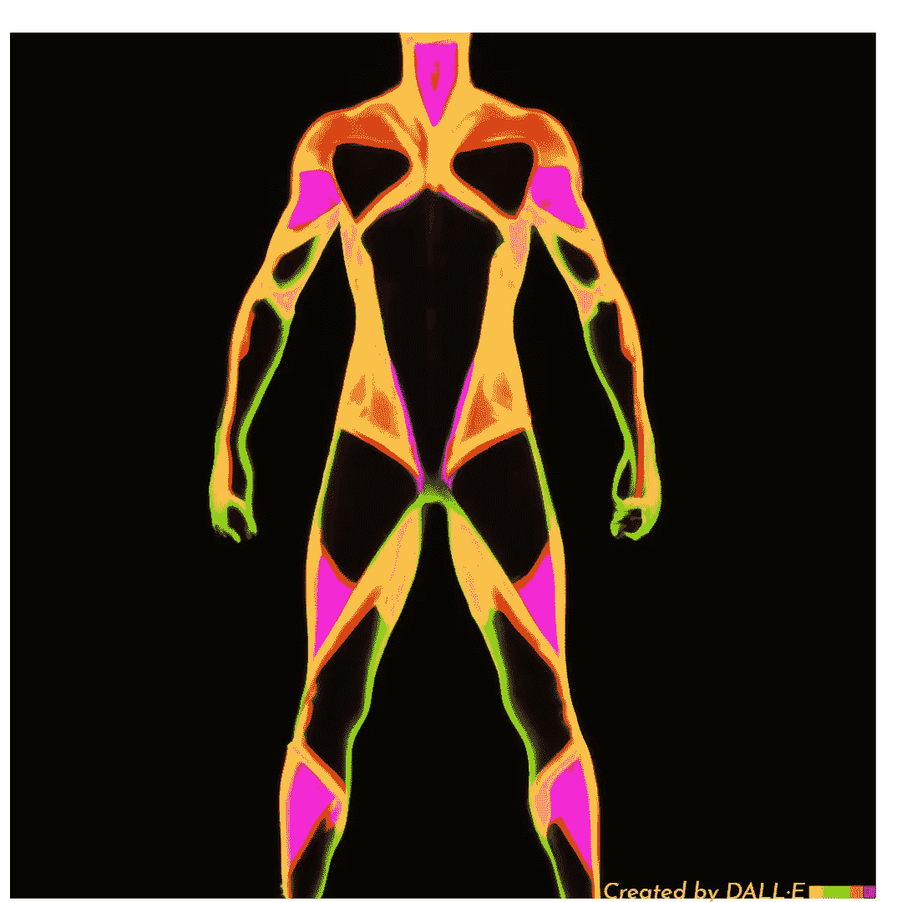
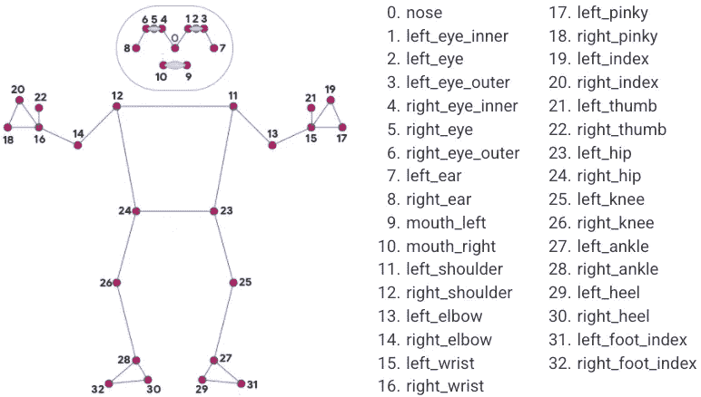

# 姿势先生:一个简单的谷歌媒体管道姿势估计指南

> 原文：<https://medium.com/mlearning-ai/an-easy-guide-for-pose-estimation-with-googles-mediapipe-a7962de0e944?source=collection_archive---------1----------------------->

> 学习使用谷歌的 MediaPipe 来估计人体姿势



Image of a human pose generated by DALL.E

嗨，让我们来看一篇简短的关于使用 Google 的 Mediapipe 库进行姿势估计的信息。这篇文章是为对深度学习和计算机视觉感兴趣的开发人员或者想要将姿态估计解决方案集成到他们的项目中的开发人员写的。这篇文章不会深入 Mediapipe 库背后的数学、架构和研究。如果您有兴趣了解详细信息，链接附在参考资料部分。

# 介绍📜

在本文中，我们将介绍一个名为“[姿势先生](https://github.com/Logeswaran123/MrPose)”的姿势估计解决方案，它利用 MediaPipe 库和数学算法来估计锻炼。

Pose 先生是一个视觉分析应用程序，可以帮助人类跟踪锻炼的准确性，并计算重复次数或预测所进行的锻炼。MediaPipe lib 提供了一个地标模型“BlazePose”，可以预测人体内 33 个地标的位置。Pose 先生使用视频帧中标志的位置和移动，并使用估计算法来预测和跟踪锻炼。

由于 Pose 先生完全利用锻炼算法，而没有任何训练过的 ML 模型用于锻炼预测，所以它提供了高吞吐量性能和存储效率。这一优势确保了低功耗和低内存硬件中的高帧速率。

Mr. Pose 应用程序支持如下四种不同的锻炼预测和测量，

*   俯卧撑
*   政纲条目
*   蹲着的
*   跳跃千斤顶

## 谷歌的媒体管道

MediaPipe 是一个跨平台的开源库，由 Google 开发，提供尖端的 ML 解决方案。该库旨在跨平台工作，如 iOS、Linux、Windows 和 Android，以及高到低功率的硬件，如 Raspberry Pi。该库提供的一些解决方案包括人脸检测、虹膜检测、人体姿态估计和即时运动跟踪。请参考 [MediaPipe 页面](https://google.github.io/mediapipe/#:~:text=MediaPipe%20offers%20cross%2Dplatform%2C%20customizable,desktop%2Fcloud%2C%20web%20and%20IoT)了解支持不同语言和平台的解决方案。

初始化姿势模型并获得结果的简单 python 代码片段，

```
import mediapipe as mpmp_pose = mp.solutions.pose
pose = mp_pose.Pose(min_detection_confidence=0.5, min_tracking_confidence=0.5)
results = pose.process(image)
```



33 pose landmarks. Source: MediaPipe Pose

# 姿态预测算法📘

在我们进入运动预测和测量的算法之前，让我们回顾一下算法的一些基本功能。

**(1)具有一个公共点的两条直线之间的角度**
考虑两条直线 A 和 b，设直线 A 定义在点 point1 和 point2 之间。假设线 B 定义在点 2 和点 3 之间。然后，具有公共点 point2 的两条线 A 和 B 之间的角度计算如下:

**Angle between two lines with one common point**

**(2)直线与水平线的夹角** 考虑一条直线在点 point1 和 point2 之间的夹角。然后，直线和水平线(X 轴)之间的角度计算如下:

**Angle between a line and horizontal**

**(3)两点间的欧氏距离** 考虑两点 point1，point2。然后，点之间的欧几里德距离计算如下，

**Euclidean distance between two points**

**(4)点离一条线的位置** 考虑一点和一条线。该点相对于直线的位置(即右侧或左侧)计算如下:

**Position of a point from a line**

## 俯卧撑

为了预测视频中进行的锻炼是俯卧撑，我们重点关注人体中的肩部、臀部和脚踝标志(关键点)。

对于俯卧撑，应满足以下条件:

1.  肩臀线和臀踝线之间的角度预计接近水平。即接近 0°或 180°，这取决于进行锻炼的人的位置(左或右)。这表明这个人与地面平行。
2.  肩-踝或髋-踝连线的角度应与水平面平行或至少接近水平面。
3.  跨帧跟踪肩-肘线和肘-腕线之间的角度。
4.  线肘-手腕与水平面的角度在帧间被跟踪。
5.  使用计数器对视频中的 24 个连续帧跟踪上述两个条件。这是为了避免测量中的任何假阳性。
6.  在计数器连续递增 24 次后，如果 24 个帧的第 4 个条件的角度的平均值远离 90 °,并且第 1、12 和 24 个帧的角度与第 3 个条件的角度之差的平均值大于 5(一个小的恒定值),则预测为**推高**。

## 政纲条目

为了预测视频中执行的运动是一个跳板，我们关注与俯卧撑算法相似的界标和条件。关键区别是第 6 个条件。

在计数器连续递增 24 次后，如果 24 帧中第 4 个条件的角度平均值接近 90 °,并且第 1、12 和 24 帧角度与第 3 个条件的角度差值平均值小于 5(一个小的恒定值),则预测为 **Plank** 。

## 蹲着的

为了预测视频中执行的运动是下蹲，我们关注人体中的头、手、脚、臀部和膝盖标志(关键点)。头部点可以是可用点之一:鼻子、左耳、右耳、左眼或右眼。手点可以是以下可用点之一:左手腕、右手腕、左小指、右小指、左食指或右食指。脚点可以是以下可用点之一:左脚指数、右脚指数、左脚跟、右脚跟、左脚踝或右脚踝。

对于后坐，预期满足以下条件:

1.  跨帧跟踪头部点的 Y 坐标(即高度)。
2.  肩踝线或髋踝线与水平面的夹角预计接近 90°。
3.  膝踝线与水平面的夹角预计接近 90°。
4.  髋膝线与水平面的夹角预计接近 90°。
5.  计算第一个条件下 24 帧的头部点的平均高度。基于分别作为 minval 和 maxval 的头点和脚点，平均值被归一化到视频中的人高度。
6.  如果在 24 个连续帧之后，来自先前条件的标准化高度小于 0，则它指示该人在视频中正在做向下的运动。
7.  所有之前的练习(俯卧撑和平板支撑)条件预计都不会满足。然后，预测是**下蹲**。

## 跳跃千斤顶

为了预测视频中执行的练习是跳 jack，我们关注类似于下蹲练习的头点和手点。

对于千斤顶，应满足以下条件:

1.  头部点和手部点的 Y 坐标(即高度)之差预计大于 0。这表明手在头的上方。
2.  肩踝线或髋踝线与水平面的夹角预计接近 90°。这表明这个人是站着的。
3.  所有之前的练习(俯卧撑、平板支撑和深蹲)条件预计都不会满足。然后，预测是**跳千斤顶**。

# 姿态测量算法📕

## 俯卧撑

为了测量视频中进行的俯卧撑练习，我们重点关注头部、脚踝和手腕部位。

对于一次俯卧撑重复，预期满足以下条件:

1.  从框架中间的垂直线(在[框架宽度/2，框架高度/2])获得头部点的位置。
2.  计算头踝线和踝腕线之间的角度。如果头部点的位置是正确的，那么该角度有望更接近 0°。否则，如果头部点的位置在左侧，则该角度预计更接近 180°。
3.  计算头部点和脚踝点之间的 Y 坐标距离。如果距离小于 250(恒定值)并且满足前面的条件，则将上推标志设置为真。
4.  如果上推标志为真，并且由先前条件计算的距离大于 300(恒定值)，则递增上推计数器并将上推标志设置为假。
5.  如果满足前面的条件，则表示一个完整的俯卧撑完成。对整个视频重复相同的过程，以计算所有重复。

Pushups measurement result video

## 政纲条目

为了测量视频中进行的平板运动，我们重点关注肩、肘、腕、臀和脚踝点。

对于 plank，预计将满足以下条件:

1.  肩臀线和臀踝线之间的角度预计接近水平。即接近 0°或 180°，这取决于进行锻炼的人的位置(左或右)。
2.  肩-踝或髋-踝连线的角度应与水平面平行或至少接近水平面。
3.  跨帧跟踪肩-肘线和肘-腕线之间的角度。
4.  线肘-手腕与水平面的角度在帧间被跟踪。
5.  使用计数器对视频中的 24 个连续帧跟踪上述两个条件。这是为了避免测量中的任何假阳性。
6.  在计数器连续递增 24 次后，如果 24 个帧的第(4)个条件的角度平均值远离 90 °,并且第(3)个条件的第 1、12 和 24 个帧角度之间的差值平均值大于 5(一个小的恒定值),则启动 plank 定时器(格式为 HH:MM:SS)。
7.  如果前面的条件失败，plank 定时器停止，直到在后续帧中再次满足该条件。

Plank measurement result video

## 蹲着的

为了测量视频中进行的下蹲练习，我们重点关注头部和脚踝点。

对于一次蹲下重复，预期满足以下条件，

1.  计算头部点和脚踝点之间的 Y 坐标距离。将距离归一化为 0，将帧的高度分别归一化为 minval 和 maxval。
2.  如果标准化距离小于 0.5，则后坐标志被设置为真。
3.  如果后坐标志为真并且归一化距离大于 0.5，后坐计数器递增。后坐标志被设置为假。
4.  如果满足前面的条件，则表明一次完整的下蹲完成。对整个视频重复相同的过程，以计算所有的重复次数。

Squats measurement result video

## 跳跃千斤顶

为了测量视频中进行的跳跃练习，我们重点关注头部、手部、肩部、脚踝和臀部点。

对于一个重复的跳跃千斤顶，预期满足以下条件:

1.  计算头点和手点之间的 Y 坐标距离。将距离归一化为 0，将帧的高度分别归一化为 minval 和 maxval。
2.  计算肩踝线或髋踝线与水平面的夹角。
3.  如果标准化距离大于 0，角度接近 90，则跳跃千斤顶标志设置为真。
4.  如果跳跃插孔标志为真并且标准化距离小于 0，则跳跃插孔计数器递增。跳跃插孔标志设置为假。
5.  如果满足前面的条件，则表明一个全跳千斤顶完成。对整个视频重复相同的过程，以计算所有的重复次数。

[](https://www.youtube.com/shorts/klqkChhpYck) [## 姿势应用先生|跳跃千斤顶测量

### shorts 输入视频:https://www . pexels . com/video/Anderson-man-do-jumping-jacks-outside-7299359/Repositories:[1]…

www.youtube.com](https://www.youtube.com/shorts/klqkChhpYck) 

# 🧙‍♂️的一般要求

遵循存储库中的[自述文件](https://github.com/Logeswaran123/MrPose/blob/main/README.md)一般要求部分，放置摄像机进行实时视频拍摄或录制练习者的视频。

# 🧙‍♀️规范要求

遵循存储库中的[自述文件](https://github.com/Logeswaran123/MrPose/blob/main/README.md)代码需求部分，并设置环境。这是本文下一节的重要部分。

# 怎么跑🏃‍♂️

要运行 Mr. Pose 应用程序，克隆[存储库](https://github.com/Logeswaran123/MrPose)，安装需求并运行以下命令，

```
python mrpose.py --video <path to video file> --exercise <exercise to be measured>
```

可选参数:
*—视频*:视频源文件的路径。
如果不提供参数，那么 Pose 先生将启动网络摄像头进行视频直播。目前，实时网络摄像头视频仅适用于运动预测。
*—练习*:选项有俯卧撑、平板、深蹲、弹跳
如果没有提供参数，那么 Pose 先生会预测视频中进行的练习。如果提供了论证，那么 Pose 先生将测量所提到的练习。

# 结论📜

Mr. Pose 应用程序使用简单的数学和算法，根据关键点位置、线之间的角度和点之间的距离进行运动预测和测量。该应用程序可以使用类似的概念扩展到许多不同的练习或其他应用程序(如跌倒检测、行走或跑步)。

感谢 Google 开发者开源的 MediaPipe 库。感谢 BlazePose 模型的创建者，该模型由 Pose 先生通过库直接使用。

希望这篇文章通过一个应用程序详细地解释了 MediaPipe 库的用例。如有任何反馈或疑问，请发表在评论中。

快乐学习！😊

# 参考🔖

[1] Camillo Lugaresi，Jiuqiang Tang，Hadon Nash，Chris McClanahan，Esha Uboweja，Michael Hays，，Chuo-Ling Chang，Ming，Juhyun Lee，Wan-Teh Chang，Wei Hua，Manfred Georg，Matthias Grundmann，“媒体管道:构建感知管道的框架”，arXiv:1906.08172，2019

[2] Logeswaran Sivakumar，《姿势先生》，[https://github.com/Logeswaran123/MrPose](https://github.com/Logeswaran123/MrPose)，2022 年

[3] [媒体管道姿势](https://google.github.io/mediapipe/solutions/pose.html#:~:text=MediaPipe%20Pose%20is%20a%20ML,ML%20Kit%20Pose%20Detection%20API.)，谷歌

[](/mlearning-ai/mlearning-ai-submission-suggestions-b51e2b130bfb) [## Mlearning.ai 提交建议

### 如何成为 Mlearning.ai 上的作家

medium.com](/mlearning-ai/mlearning-ai-submission-suggestions-b51e2b130bfb)