# 解释投资组合管理任务中深度强化学习的实证方法

> 原文：<https://medium.com/mlearning-ai/an-empirical-approach-to-explain-deep-reinforcement-learning-in-portfolio-management-task-e65a42225d9d?source=collection_archive---------4----------------------->

这篇博客是基于我们的论文的教程:**可解释的投资组合管理的深度强化学习:一种实证方法**，在**第二届 ACM 国际金融人工智能会议上发表。**

 [## 投资组合管理的可解释深度强化学习:一种实证方法

### 深度强化学习(DRL)在投资组合管理任务中得到了广泛的研究。然而，这很有挑战性…

arxiv.org](https://arxiv.org/abs/2111.03995) 

Jupyter 笔记本的代码可以在我们的 [**Github**](https://github.com/AI4Finance-Foundation/FinRL) 和 [**Google Colab**](https://colab.research.google.com/drive/117v2qWo-qPC7OPd7paY1wYkOUywU_DWZ#scrollTo=cY_q0OoF33dB) 上找到。

 [## GitHub-ai4 finance-Foundation/FinRL:自动化交易的深度强化学习框架…

### 免责声明:这里没有任何金融建议，也不是交易真钱的建议。请运用常识…

github.com](https://github.com/AI4Finance-Foundation/FinRL)  [## 谷歌联合实验室

投资组合管理的可解释深度强化学习:一种实证方法。](https://colab.research.google.com/drive/117v2qWo-qPC7OPd7paY1wYkOUywU_DWZ#scrollTo=cY_q0OoF33dB) 

# 概观

深度强化学习(DRL)在投资组合管理任务中得到了广泛的研究。然而，由于深度神经网络的黑箱性质，理解基于 DRL 的交易策略是具有挑战性的。

我们提出了一个实证方法来解释投资组合管理任务的 DRL 代理人的策略。首先，我们使用后知后觉的线性模型作为参考模型，该模型通过假设预先知道实际股票回报来找到最佳投资组合权重。特别地，我们事后使用线性模型的系数作为参考特征权重。其次，对于 DRL 代理，我们使用综合梯度来定义特征权重，这是线性回归模型下报酬和特征之间的系数。第三，我们研究了单步预测和多步预测两种情况下的预测能力。

特别地，我们通过计算 DRL 代理的特征权重和参考特征权重之间的线性相关性来量化预测能力，并且类似地用于机器学习方法。最后，我们评估了 2009 年 1 月 1 日至 2021 年 9 月 1 日期间道琼斯 30 种成份股的投资组合管理任务。我们的方法从经验上揭示了 DRL 代理比机器学习方法表现出更强的多步预测能力。

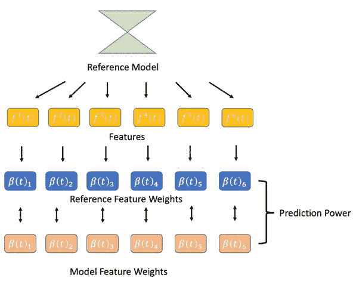

Overview of explanation method

# 第 1 部分:参考模型和特性权重

Reference model in hindsight

我们事后用线性模型作为参考模型。对于后知后觉的线性模型，恶魔会用实际股票收益和实际样本协方差矩阵来优化投资组合。这是任何线性预测模型能够达到的性能上限

我们使用回归系数将参考特征权重定义为

Reference feature weights

# 第 2 部分:DRL 代理的特征权重

Feature weights of a trained DRL agent.

我们使用综合梯度来定义投资组合管理任务中 DRL 代理的特征权重。

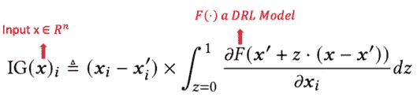

Integrated gradients

我们用一个线性模型来寻找特征和投资组合收益向量 q 之间的关系。

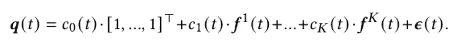

最后，我们使用综合梯度和回归系数定义了投资组合管理任务中 DRL 代理的特征权重。

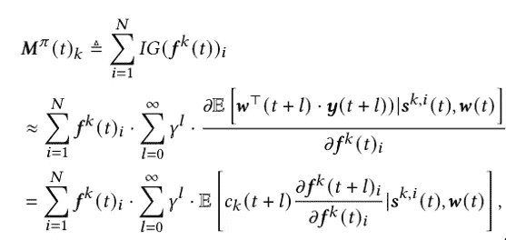

# 第 3 部分:ML 方法的特征权重

我们使用传统的机器学习方法作为对比。

首先，它使用特征作为输入来预测股票收益向量。

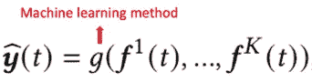

其次，建立线性回归模型，找出投资组合收益向量 q 与特征之间的关系。

最后，它使用回归系数 b 来如下定义特征权重。

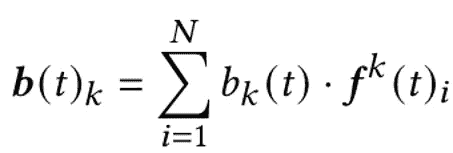

# 第 4 部分:预测能力

机器学习方法和 DRL 代理都从它们的预测能力中获利。我们通过计算 DRL 代理的特征权重和参考特征权重之间的线性相关性𝜌()来量化预测能力，并且类似地用于机器学习方法。此外，在预测未来时，机器学习方法和 DRL 代理是不同的。机器学习方法依靠单步预测来寻找投资组合权重。然而，DRL 的代理人发现投资组合权重具有长期目标。然后，我们比较了单步预测和多步预测两种情况。

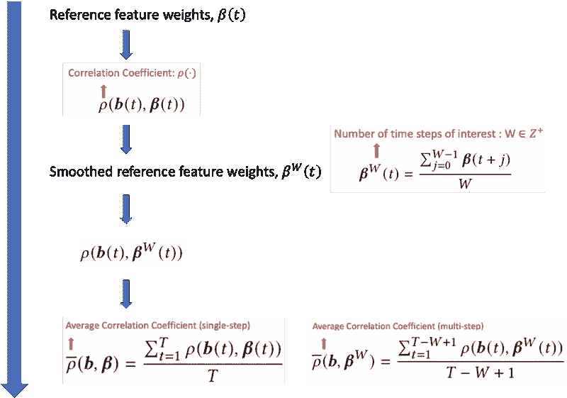

# 第五部分:实验

1.  算法:
    1.1 DRL 药剂:PPO，A2C
    1.2 ML 方法:SVM，决策树，随机森林，线性回归，
2.  数据:道琼斯 30 种成份股，访问时间:2020 年 7 月 1 日【2021 训练时间:2009 年 1 月 1 日至 2020 年 6 月 30 日
    2.2 交易时间:2020 年 7 月 1 日至 2021 年 9 月 1 日
3.  功能:MACD、CCI、RSI、ADX
4.  基准:道琼斯工业平均指数(DJIA)

**投资组合表现**

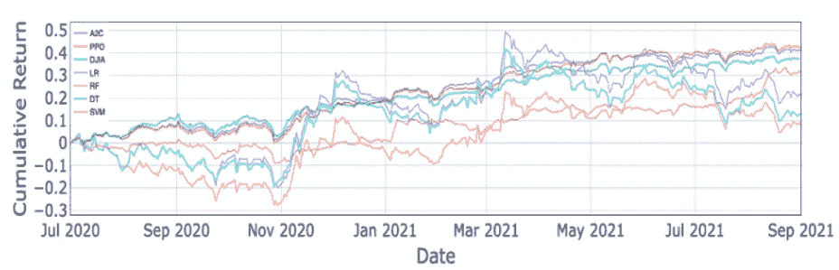

Portfolio performance comparison

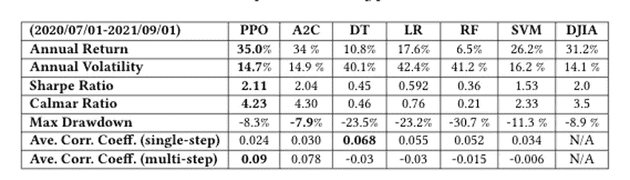

**预测功率分布**

单步执行

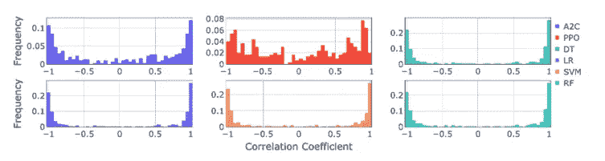

Single step prediction power’s histogram

多步骤

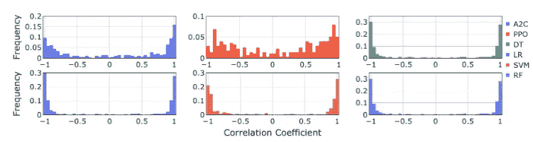

Multi step prediction power’s histogram

统计检验

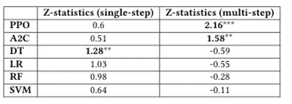

Statistical test for mean value

**平均预测功效&夏普比率**

我们比较了所有算法的预测能力和夏普比率。

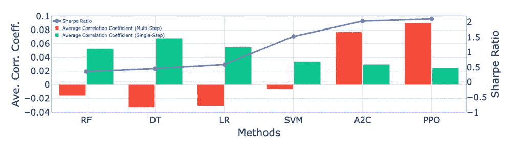

我们发现:

1.  在所有其他试剂中，使用 PPO 的 DRL 试剂具有最高的夏普比率:2.11 和最高的平均相关系数(多步):0.09。
2.  DRL 代理的平均相关系数(多步)明显高于它们的平均相关系数(单步)。
3.  机器学习方法的平均相关系数(单步)明显高于它们的平均相关系数(多步)。
4.  DRL 代理在多步预测能力方面优于机器学习方法，但在单步预测能力方面落后。
5.  总的来说，较高的平均相关系数(多步)表示较高的夏普比率

 [## Mlearning.ai 提交建议

### 如何成为 Mlearning.ai 上的作家

medium.com](/mlearning-ai/mlearning-ai-submission-suggestions-b51e2b130bfb)