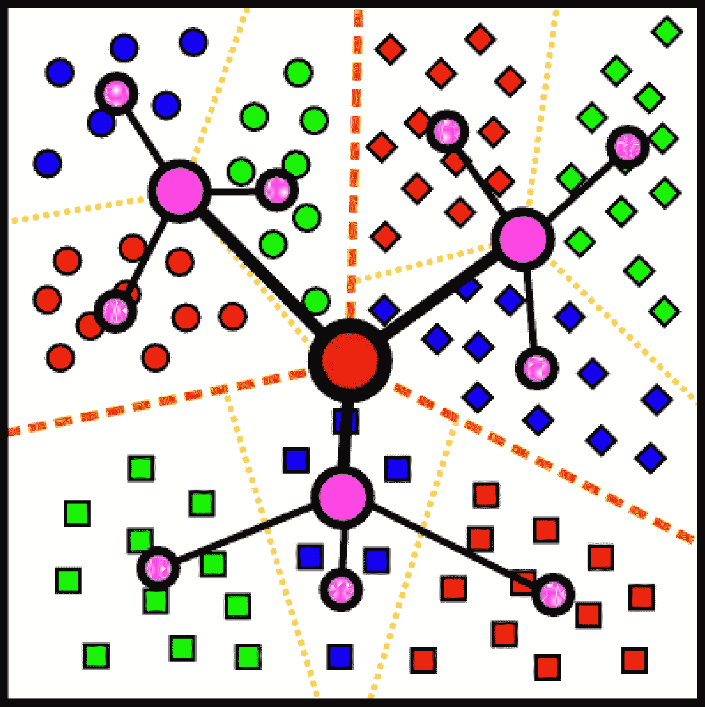

# 对 K-means 及其两个分支的解释

> 原文：<https://medium.com/mlearning-ai/an-explanation-of-k-means-and-two-of-its-offshoots-69487110c7c4?source=collection_archive---------0----------------------->

## k-means、层次 k-means 及其小批量兄弟的介绍

Photo by [Billy Huynh](https://unsplash.com/@billy_huy?utm_source=medium&utm_medium=referral) on [Unsplash](https://unsplash.com?utm_source=medium&utm_medium=referral)

*K*-均值聚类是机器学习中广泛使用的一种技术，作为矢量量化的一种形式，用于将点的矢量空间划分为 *k* 个聚类。这是一种非常有用的无监督方法，可以将多个点聚类成一个质心集合，稍后可以用于许多具有深度学习的下游任务。然而，有时普通的 *k* -means 计算量太大，或者在大型数据集上运行需要几天时间。这就是使用 *k* 的方法——分层次地使用或在小批中使用数据——大大提高了效率，同时仍然保持相当的性能。

# k 均值

传统的*k*-意味着算法从向量空间中的数据开始，我们称之为 *X，*其中 *X* 由 *r* 点 *(x₁，x₂，…，xᵣ).*我们希望将 *k* 形心与 *X* 相匹配，这样对于每个形心的聚类，方差最小化。通俗地说，这意味着每个质心的点集形成了一个很好的聚类，与其他质心的聚类不同。

那么在实践中如何做到这一点呢？有很多方法可以做到这一点，但是 k-means 使用了一种叫做劳埃德算法的东西。首先，质心被初始化为向量空间中的随机点。 *X* 中的每个点都被分配了一个质心，该质心是通过找到离每个点最近的质心来计算的。之后，每个质心的位置被更新为与其相关联的或其聚类的所有点的平均值。然而，在此步骤之后，考虑到质心位置已被更新， *X* 中的一些点将被分配给不同的质心。因此，我们重复前面的步骤，更新每个质心的位置，以反映其聚类中点的变化平均值。我们这样做，直到质心的位置不再改变，或者换句话说，当它已经收敛。这使得质心倾向于数据中存在的固有聚类的平均值。下面是一张说明整个过程的 gif 图:

Source: [https://en.wikipedia.org/wiki/K-means_clustering#/media/File:K-means_convergence.gif](https://en.wikipedia.org/wiki/K-means_clustering#/media/File:K-means_convergence.gif)

如您所见，这种简单的方法意味着聚类方法对于小数据集非常有效。然而，有许多方法可以使这更快更有效。

# 分级*k*-意思是

分层*k*-意思是聚类(又名*hk*-意思是聚类)，不要与分层聚类(这是完全不同的东西)混淆，它是普通 *k* 意思的更有效的兄弟。这是一种递归方法，包括对相对较小的数据使用 *k* -means，然后对使用相同 *k* 的每个质心簇使用 *k* -means，用于 *h* 层次。最后一个层次的质心被连接成整个数据集的质心。当具有大的 *k* 并且更新 *k* 形心的计算代价很高时，这种方法是有益的。该方法的直观表示如下所示:

Source: [https://www.andrew.cmu.edu/user/hgifford/projects/k_means.pdf](https://www.andrew.cmu.edu/user/hgifford/projects/k_means.pdf)

# 迷你批次 k 均值

顾名思义，minibatch*k*——的意思是和 mini batch*hk*——的意思是使用 mini batch 使这种算法适用于极其庞大的数据集。类似于神经网络如何批量消耗数据，k 的这个分支 *k* -means 在每一批之后迭代并更新质心。这使得在大型数据集上进行 k 均值计算变得简单，并获得与常规 k 均值计算相对相似的结果。有关 minibatch hk-means 的编码示例，请查看这个 python 包:

 [## ammesatyajit/分级-小型批次-kmeans

### 分层 kmeans 的一种实现，使用小型批处理来提高大型数据集的效率。pip3…

github.com](https://github.com/ammesatyajit/hierarchical-minibatch-kmeans) 

# 结论

均值是一种有用的技术，可以用作聚类方法、矢量量化等等。它还有多个分支，可以提高现实世界中大型数据集的性能和效率。其中两个变体是分层的 *k* -means 和迷你批处理 *k* -means，但是还有无数其他方法可以进一步提高这种性能，比如智能地初始化质心。有了这么多的用途和这么多的改进， *k* -means 仍然是机器学习中最突出的聚类算法之一也就不足为奇了。