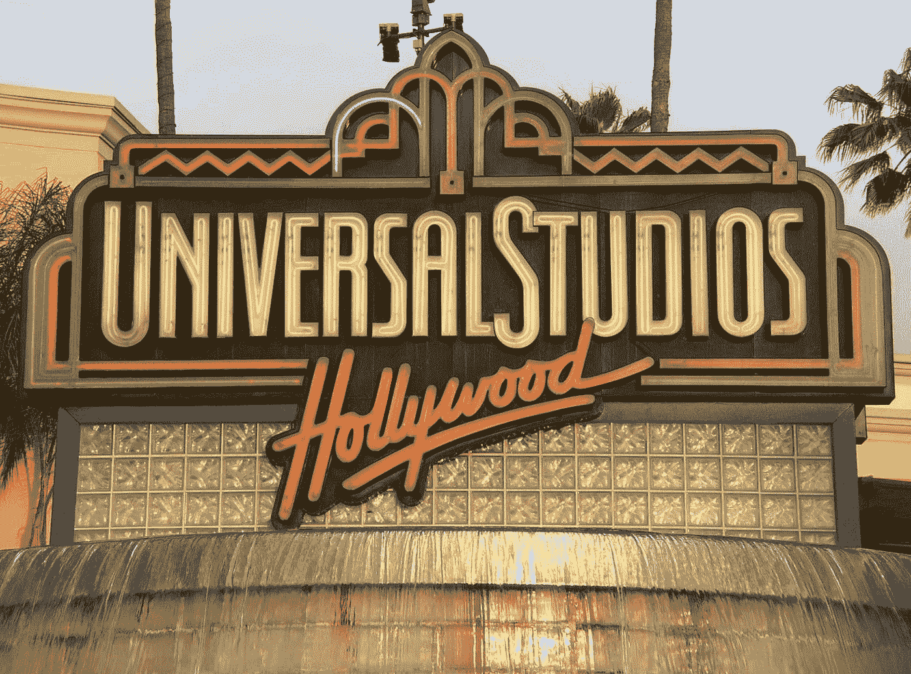

# 利用环球影城数据集进行自然语言处理的探索

> 原文：<https://medium.com/mlearning-ai/an-exploration-into-natural-language-processing-with-the-universal-studios-dataset-527644d42f4e?source=collection_archive---------0----------------------->

我没有发布很多关于自然语言处理(NLP)的内容，因为没有很多关于这种机器学习类型的数据科学竞赛。然而，我发现 Kaggle，这个主要的数据科学网站，在其网站的数据集部分确实有基于文本的数据集。为了获得更多的经验…