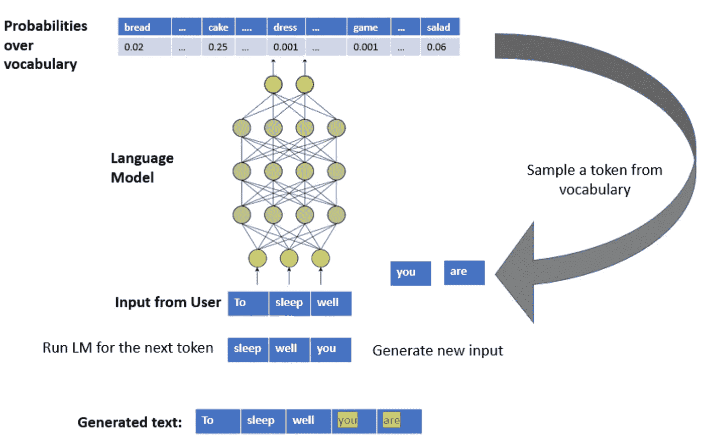
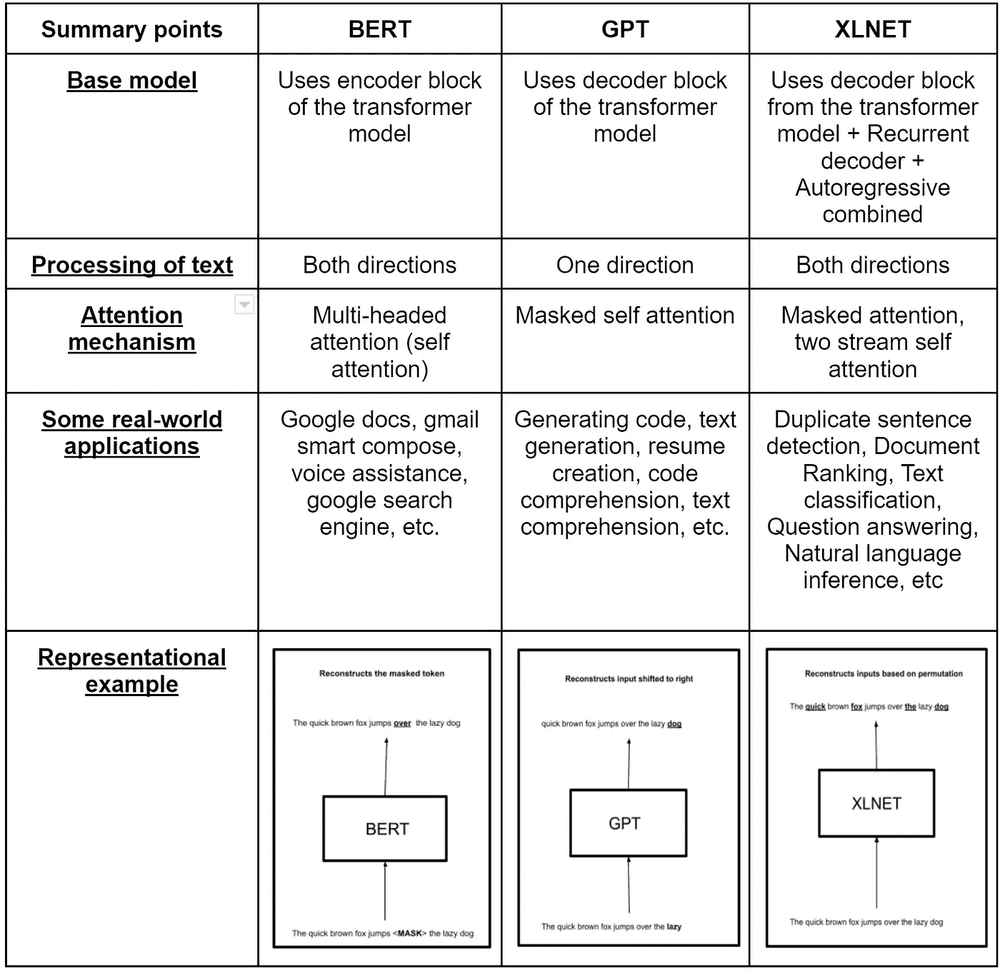
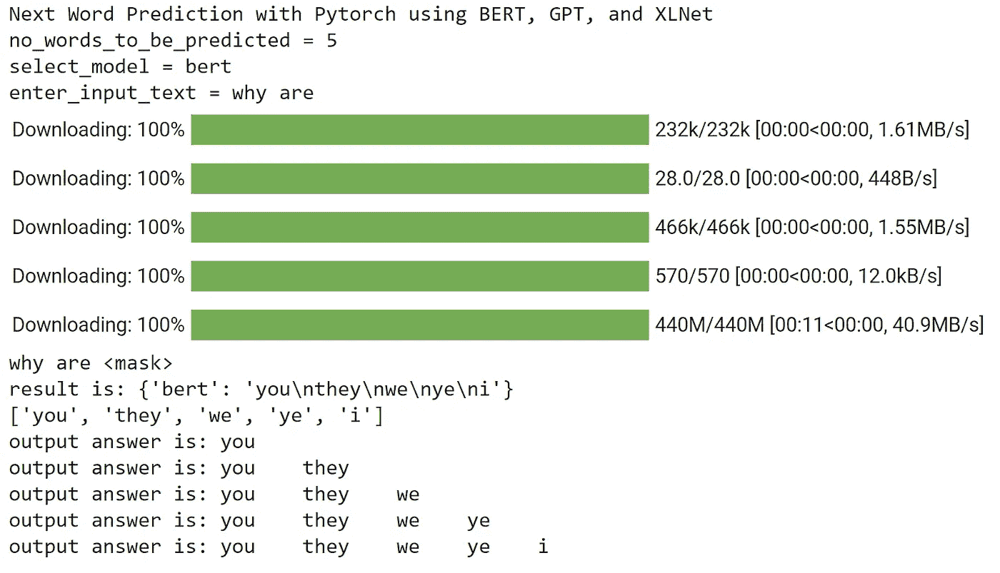
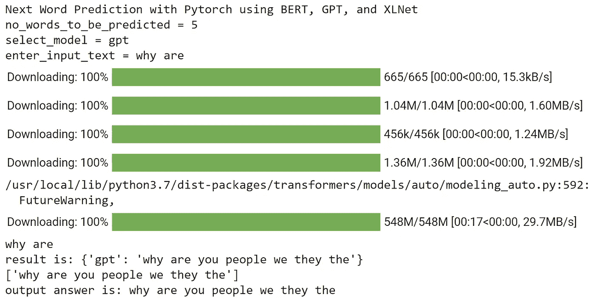
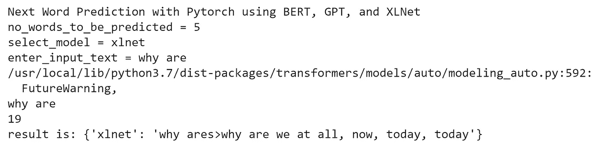

# 使用伯特、GPT 和 XLNet 等最先进的网络架构进行下一个单词预测的示例

> 原文：<https://medium.com/mlearning-ai/an-illustration-of-next-word-prediction-with-state-of-the-art-network-architectures-like-bert-gpt-c0af02921f17?source=collection_archive---------0----------------------->

## *使用 Pytorch 生成文本的动手演示*

**

*Image Source & Credits: [Assoc. Professor Murak Karakaya](https://kmkarakaya.medium.com/) [Image adapted & Copyright, Requested permission]*

*嗨，朋友们！*

*欢迎来到自然语言处理(NLP)的世界。我们人类的一个重要方面是交流的能力。语言在我们相互交流的方式中起着重要的作用。我们的大脑是如何处理这些语言的？我们如何使用文字交流，这种交流是如何处理和解释的？这些都是我们可能面临的紧迫的基本问题。我不会过多地谈论**神经语言学** & **神经科学**方面的内容，但我会鼓励所有感兴趣的读者浏览参考资料部分列出的参考资料。回到我们的关注点， **NLP 通俗地说就是机器如何处理、分析和解释大量自然人类语言数据，即主要是机器和人类语言之间的交互**。当前最先进的网络赋予了机器学习和模仿类似人类任务的能力。这不是很有趣吗？我们将通过一个演示来讨论一些重要的网络架构，看看对于给定的输入文本，我们如何使用这些语言模型来预测下一组单词。我们都非常熟悉 **GMAIL-SMART COMPOSE** 功能，现在&已经经常使用它，如下图所示。这是谷歌在 2018 年推出的。*

**

*Image by Author: **GMAIL-SMART-COMPOSE feature for automatic sentence completion***

*在本教程中，我们将了解如何使用预训练的 NLP 模型，通过不同的先进深度神经网络模型来预测给定输入句子的下一组单词，例如*

*   ***BERT** —变压器的双向编码器表示*
*   ***GPT** —创成式预训练变压器*
*   ***XLNET** —使用自回归方法预训练的 Transformer-XL 模型*

*现在，如果你注意到，所有上述三种网络架构都基于**变压器**系列。那么，变压器到底是什么？转换器是许多神经网络设计中使用的组件，用于**处理序列数据**，如**文本数据**、**基因组序列**、**声音信号**或**时间序列数据、**等。变压器模型已经成为 NLP 任务的领跑者。因此，让我们快速浏览一下变压器模型的基础知识。关于这一点，有大量的材料、帖子和参考资料，所以我不打算详细讨论。让我们先了解一些事情，以获得一个基本的概述。*

***变压器网络的 USP***

*变形金刚是一个非常有趣的深度学习架构家族，于 2017 年推出(谷歌大脑)。任何变压器架构的基本操作都是**自关注**操作。那么自我关注到底是什么呢？注意力机制使得这种网络架构能够超越典型的**RNN**或 **LSTM** 模型的注意力限制。传统的**序列到序列**模型丢弃所有中间状态，并且在初始化解码器网络时仅使用最终状态/上下文向量来生成关于输入序列的预测。丢弃一切，但是当输入序列相当小时，最终的上下文向量工作正常。但是，当输入序列的长度增加时，使用这种方法时模型的性能会下降。这是因为很难将一个长的输入序列概括为一个向量。解决方案是增加模型的**关注度**，利用中间编码器状态为解码器构建上下文向量。**因此，当为任何给定的标记创建编码时，注意力机制简单地定义了其他输入标记对模型的重要性。***

***为什么现在变压器架构更有意义？***

*从 2019 年开始，谷歌搜索开始使用谷歌的 transformer 神经网络 **BERT** 进行超过 70 种语言的搜索查询。在这一变化之前，许多信息检索是基于关键词的，这意味着谷歌在没有强有力的上下文线索的情况下检查其抓取的网站。以单词“bank”为例，它可以根据上下文有多种含义。谷歌搜索引入了 transformer 神经网络，这意味着谷歌可以更好地理解“从”或“到”等词影响含义的查询。用户可以用更自然的英语进行搜索，而不是根据他们认为谷歌能理解的内容来调整他们的搜索查询。来自谷歌博客的一个例子是查询“2019 年巴西旅行者去美国需要签证。”单词“to”的位置对于正确解释查询非常重要。以前的 Google Search 实现不能捕捉到这种细微差别，并返回关于美国公民去巴西旅游的结果，而 transformer 模型返回更多相关页面。transformer 架构的另一个优点是，一种语言的学习可以通过迁移学习转移到其他语言。谷歌能够采用经过训练的英语模型，并将其轻松应用于其他语言的谷歌搜索。*

*此外，如果对任何计算机视觉问题感兴趣，那么我会鼓励检查视觉转换器模型如何用于分类任务[这里](/mlearning-ai/covid-non-covid-classifier-with-sota-vision-transformer-model-97375c774ff7)*

***SOTA 概述:伯特、GPT、XLNET***

*[**BERT**](https://arxiv.org/abs/1810.04805) 是一个基于 t**transformer 的**语言模型，它通过联合处理左右两个&上下文来学习从未标记文本中学习底层表示。它已经在维基百科和 BooksCorpus 上进行了预训练。*

*如需更深入的详细信息，请查阅这些参考资料— [链接](https://jalammar.github.io/a-visual-guide-to-using-bert-for-the-first-time/)、[链接](https://yashuseth.blog/2019/06/12/bert-explained-faqs-understand-bert-working/)*

*[**GPT**](https://arxiv.org/abs/2005.14165)**是一个基于**变换器的**自回归语言模型，它以一种生成式的、无监督的方式进行预训练。它在大量未标记的文本(例如维基百科、书籍、电影剧本)上进行训练。该模型将学习估计任何给定单词序列的概率，甚至是它从未见过的单词序列。***

***如需更深入的详细信息，请查阅这些参考资料— [链接](https://jalammar.github.io/illustrated-gpt2/)、[链接](https://towardsai.net/p/latest/gpt-3-explained-to-a-5-year-old)***

***[**XLNET**](https://arxiv.org/abs/1906.08237)**是一种通用的自回归语言模型，它基于**基于变换器的**架构，通过递归输出一系列记号的联合概率，其中它使用置换语言建模来捕获双向上下文。它将最先进的自回归模型 Transformer-XL 的思想集成到预训练中。*****

*****如需更深入的详细信息，请查阅这些参考资料— [链接](https://researchdatapod.com/paper-reading-xlnet-explained/)、[链接](https://towardsdatascience.com/xlnet-a-clever-language-modeling-solution-ab41e87798b0)、[链接](https://towardsdatascience.com/xlnet-explained-in-simple-terms-255b9fb2c97c)*****

*****下面提供了一个快速摘要*****

**********

*****Image by Author: **Side-by-Side Comparison of BERT, GPT, and XLNET*******

*******示例演示*******

*****现在我们对这些神经网络架构有了一些非常基本的想法，让我们来看一个使用这些**预训练的** NLP 模型来预测下一组单词的简单演示。在这里，我将使用 pytorch 框架来完成这项任务。但是，替代方案也可以使用其他深度学习框架，如 tensorflow 等。那么，我们开始吧。对于本教程，我们将使用下面的主包“**火炬**”、“**变形金刚**”。安装完库后，我们将导入所有必要的库，声明用于设置模型配置的变量，创建用于从用户处获取参数的函数，加载相应模型&的相应标记器的函数，用于相应模型的编码和解码的函数，用于从所选模型获取所有预测的函数，用于预测输入文本结束后的单词集的函数，最后运行程序*****

*****步骤 1)导入库*****

*****步骤 2)声明变量*****

*****步骤 3)创建作为用户输入的初始模型设置的函数*****

*****步骤 4)加载相应的模型和标记器*****

*****步骤 5)为各个模型创建编码和解码输入文本的函数*****

*****步骤 6)编码器和解码器的包装函数*****

*****步骤 7)我们程序的主要执行*****

*******伯特模型输出** :-*****

**********

*****Image by Author: **Predicted next set of words by BERT*******

*******GPT 模型输出** :-*****

**********

*****Image by Author: **Predicted next set of words by GPT*******

*******XLNet 模型输出** :-*****

**********

*****Image by Author: **Predicted next set of words by XLNET*******

*******进一步待办事宜*******

1.  *****用这些自然语言处理模型的实时推理开发一个 gmail 风格的网络应用程序。*****
2.  *****交叉验证"**预应变卷积比预应变变压器好吗？**此处所指的[为](https://research.google/pubs/pub50306/)*****
3.  *****使用**预训练模型** & **对您的**自定义数据集**进行微调**(这个我留给读者去探索)*****
4.  ***尝试更长的信息序列和不常用的句子，使用不在词汇表中的单词(这个我留给读者去探索)***
5.  ***检查一下**填充文本**是否真的有助于 **XLNet** 执行得更好，如果是的话，与没有任何填充相比(这个我留给读者去探索)***

*****结论*****

***预训练语言模型在很大程度上主导了自然语言处理的神经历史，尤其是基于**转换器的**预训练模型。那么，沿着这个方向的下一件大事是什么呢？我们仍然可以触及几个方面，如“下游 NLP 任务的机器推理”，“即兴视觉 QAS”，等等。***

***以下是这篇文章的[完整代码](https://github.com/ajayarunachalam/nlp_demo)。***

*****联系人*****

***你可以在 ajay.arunachalam08@gmail.com 找到我***

***我们上 [LinkedIn](https://www.linkedin.com/in/ajay-arunachalam-4744581a/) 连线吧，继续学习，干杯:)***

*****参考文献*****

***[https://en .维基百科. org/wiki/Language _ processing _ in _ the _ brain](https://en.wikipedia.org/wiki/Language_processing_in_the_brain)***

***https://search enterprise ai . tech target . com/definition/natural-language-processing-NLP***

***[https://en.wikipedia.org/wiki/Natural_language_processing](https://en.wikipedia.org/wiki/Natural_language_processing)***

***[https://machine learning mastery . com/natural-language-processing/](https://machinelearningmastery.com/natural-language-processing/)***

***[https://en . Wikipedia . org/wiki/Transformer _(机器学习模型)](https://en.wikipedia.org/wiki/Transformer_(machine_learning_model))***

***[https://en . Wikipedia . org/wiki/BERT _(language _ model)](https://en.wikipedia.org/wiki/BERT_(language_model))***

***[https://en.wikipedia.org/wiki/GPT-3](https://en.wikipedia.org/wiki/GPT-3)***

***[https://arxiv.org/abs/1906.08237](https://arxiv.org/abs/1906.08237)***

***[https://huggingface.co/transformers/model_doc/xlnet.html](https://huggingface.co/transformers/model_doc/xlnet.html)***

***[https://towards data science . com/what-is-xlnet-and-why-it-performs-Bert-8d 8 FCE 710335](https://towardsdatascience.com/what-is-xlnet-and-why-it-outperforms-bert-8d8fce710335)***

***[https://towards data science . com/xlnet-auto regressive-pre-training-for-language-understanding-7ea4e 0649710](https://towardsdatascience.com/xlnet-autoregressive-pre-training-for-language-understanding-7ea4e0649710)***

***【https://pytorch.org/ ***

***[https://en.wikipedia.org/wiki/PyTorch](https://en.wikipedia.org/wiki/PyTorch)***

***[https://huggingface.co/transformers/model_doc/xlnet.html](https://huggingface.co/transformers/model_doc/xlnet.html)***

***[https://towards data science . com/xlnet-explained-in-simple-terms-255 b 9 FB 2 c 97 c](https://towardsdatascience.com/xlnet-explained-in-simple-terms-255b9fb2c97c)***

***[https://www.borealisai.com/en/blog/understanding-xlnet/](https://www.borealisai.com/en/blog/understanding-xlnet/)***

***[https://github.com/rusiaaman/XLNet-gen](https://github.com/rusiaaman/XLNet-gen)***

***[https://toward sai . net/p/latest/GPT-3-向一个 5 岁的孩子解释](https://towardsai.net/p/latest/gpt-3-explained-to-a-5-year-old)***

***[https://towards data science . com/Bert-for-dummies-step-by-step-tutorial-FB 90890 FFE 03](https://towardsdatascience.com/bert-for-dummies-step-by-step-tutorial-fb90890ffe03)***

***[https://towards data science . com/GPT-3-2 分钟内解释-9c977ccb172f](https://towardsdatascience.com/gpt-3-explained-in-under-2-minutes-9c977ccb172f)***

***[https://360digitmg.com/gpt-vs-bert](https://360digitmg.com/gpt-vs-bert)***

***[https://towards data science . com/what-is-xlnet-and-why-it-performs-Bert-8d 8 FCE 710335](https://towardsdatascience.com/what-is-xlnet-and-why-it-outperforms-bert-8d8fce710335)***

***[https://www . cs . Princeton . edu/courses/archive/spring 20/cos 598 c/lectures/le C5-pre training 2 . pdf](https://www.cs.princeton.edu/courses/archive/spring20/cos598C/lectures/lec5-pretraining2.pdf)***

***[https://towards data science . com/xlnet-a-clever-language-modeling-solution-ab41e 87798 b 0](https://towardsdatascience.com/xlnet-a-clever-language-modeling-solution-ab41e87798b0)***

***[https://researchdatapod.com/paper-reading-xlnet-explained/](https://researchdatapod.com/paper-reading-xlnet-explained/)***

***【https://research.google/pubs/pub50306/ 号***

***[https://medium . com/deep-learning-with-keras/text-generation-in-deep-learning-with-tensor flow-keras-e 403 aee 375 C1](/deep-learning-with-keras/text-generation-in-deep-learning-with-tensorflow-keras-e403aee375c1)***