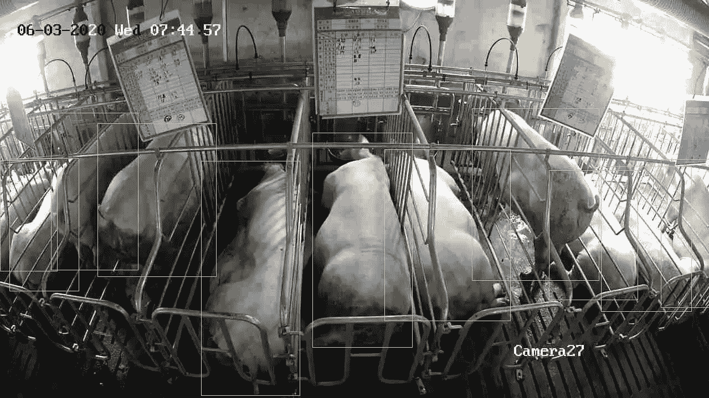

# 数据标签服务如何赋能农业？

> 原文：<https://medium.com/mlearning-ai/an-international-online-factory-brings-high-tech-innovation-into-pig-farming-industry-7d071a5afb8a?source=collection_archive---------5----------------------->

Photo by [Adrian Infernus](https://unsplash.com/@adrian_infernus?utm_source=medium&utm_medium=referral) on [Unsplash](https://unsplash.com?utm_source=medium&utm_medium=referral)

# **面部识别**

被称为面部识别之父的伍德罗·威尔逊·布莱索(Woodrow Wilson Bledsoe)在 20 世纪 60 年代开发了一个可以通过使用一个 10 英寸见方的平板电脑来识别面部的系统。在过去的 60 年里，世界各国都大幅增加了对面部识别系统的投资。今天，程序员将面部智能扩展到畜牧业，评估猪的情绪健康。

# 猪脸识别

阿里巴巴(中国电子商务巨头)最近开始自动识别猪脸。它还可以用于育种状态诊断和疾病检测。去年，苏格兰乡村学院(SRUC)实施了卷积神经网络来分析猪的情感和意图。

世界上越来越多的农场现在使用高科技设备来记录猪的行为。养猪场从人脸识别中受益匪浅，因为每只小猪的健康状况从出生起就可以得到精确控制。该系统还可以在监控每日饲料消耗量的同时，改善猪的健康状况。

# **训练数据是智能养殖的主键**

智能养殖的关键是高质量的标签数据。

最近，一家韩国养猪场正在寻找一种数字人工智能系统来监控猪的生产力、行为和福利。他们与[字节桥](http://tinyurl.com/3b5d9oze)标签平台合作，以便获取标签数据。

“智能人工智能系统应该能够通过跟踪喂食模式和行为来反映每头猪的健康状况。我们正在寻找一家数据注释公司来结构化地处理数据。棘手的是，我们为团队设定了非常严格的时间限制。我们需要尽快贴上标签，”养猪场的老板说。**令人惊讶的是，**[byte bridge](http://tinyurl.com/3b5d9oze)**完美的解决了这个问题，完善了我们的系统。在分发了数千张照片后，我们收到照片的时间比预期的要早。我们在 3 个工作日内就将数据贴上了标签。”******

************

******传统的数据标签公司在接到类似的项目后，会召集标签团队，根据客户的要求对他们进行至少几天的培训。******

******相反， [ByteBridge](https://tinyurl.com/yz9desvm) 在带有实时工作流注释工具的平台上运行任务，节省了大量的沟通时间。**标注的输出准确率达到 99.5%，耗时是其他方法的 1/4。********

# ****结束****

****将你的数据标注任务外包给 [ByteBridge](https://tinyurl.com/yz9desvm) ，你可以更便宜更快的获得高质量的 ML 训练数据集！****

*   ****无需信用卡的免费试用:您可以快速获得样品结果，检查输出，并直接向我们的项目经理反馈。****
*   ****100%人工验证****
*   ****透明标准定价:[有明确的定价](https://www.bytebridge.io/#/?module=price)(含人工成本)****

******为什么不试一试？******

******相关文章:******

****1 [数据标注——如何选择数据标注公司？](https://tinyurl.com/u32bv8jk)****

****2[2021 年机器学习数据标注公司](https://tinyurl.com/26ch6xfw)****

****3 [高质量训练数据在不同 AI 算法阶段的重要性](https://tinyurl.com/4k3h2ujv)****

****4 [无偏向训练数据——机器学习的新瓶颈](https://tinyurl.com/3wv9knbw)****

****5[2021 年最佳数据标签公司](https://tinyurl.com/3runtux4)****