# 机器学习导论——决策树分类器

> 原文：<https://medium.com/mlearning-ai/an-intro-to-machine-learning-decision-tree-classifier-d48bd341ca7a?source=collection_archive---------3----------------------->

解释监督机器学习分类问题中使用的基于树的分类器。


Photo by [Pauline Bernfeld](https://unsplash.com/@pizbern?utm_source=unsplash&utm_medium=referral&utm_content=creditCopyText) on [Unsplash](https://unsplash.com/s/photos/tree?utm_source=unsplash&utm_medium=referral&utm_content=creditCopyText)

决策树是一种监督学习技术，可用于分类问题。它是一个树形结构的分类器，如下图所示

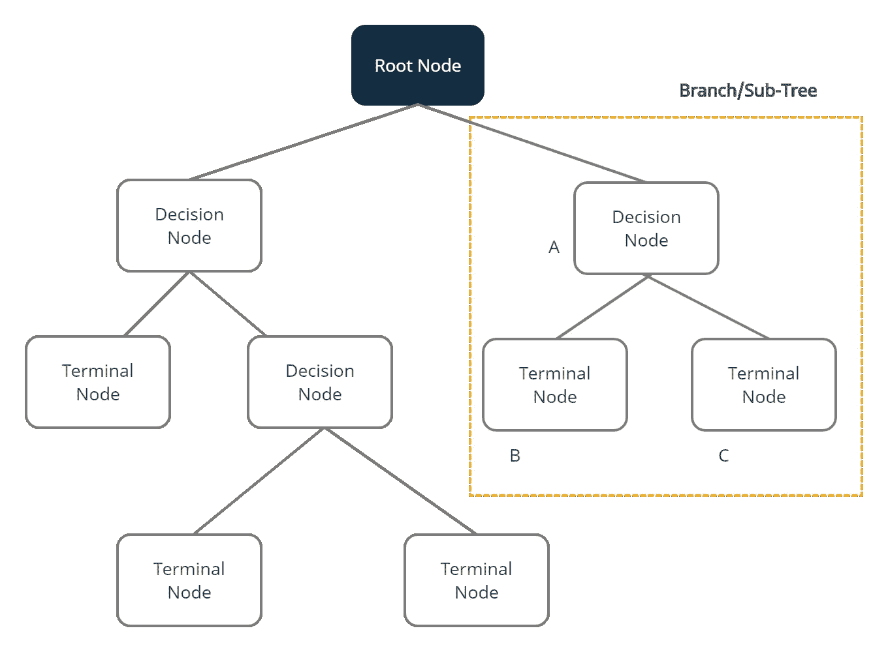

Figure 1\. Decision Tree. image by **the Author**

在我们深入研究决策树之前，让我们先熟悉一些术语。

1.  **根节点** —根节点是决策树开始的地方。它是存在于决策树开始处的节点，从该节点开始，种群根据各种特征开始划分。
2.  **决策节点** —我们将根节点拆分后得到的节点称为决策节点
3.  **终端/叶子节点** —终端/叶子节点是最终的输出节点，得到一个叶子节点后树就不能再分了。
4.  **子树/分支** —树的一小部分
5.  **修剪**—修剪是移除子树/分支的过程

让我们看一个例子，这样我们可以更好地理解。假设 Bob 是一个 35 岁的男人，他因为喉咙痛进了医院。想象你是照顾鲍勃的医生。你可以做一个新冠肺炎测试，但是测试工具已经卖完了。你需要一个准确的方法来确定鲍勃是否感染了新冠肺炎病毒。你有医院里新冠肺炎病人的数据集。

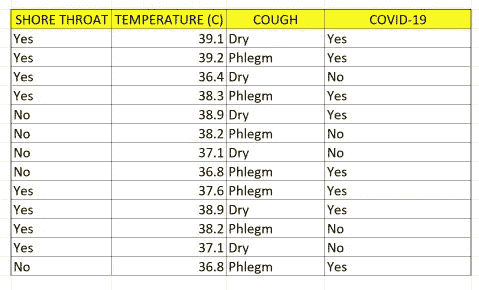

Table 1\. Imaginary covid-19 table

作为一名医生(和一名数据科学家)，你的任务是创建一个决策树，并预测鲍勃是否应该被视为新冠肺炎患者。要建造一棵树，你总是需要一个根。但是如何确定树的根节点呢？为此，我们需要理解杂质的概念

## 不纯

为了理解杂质，想象你有三个盒子，每个盒子里有四个球。第一个盒子里有 4 个黑球，第二个盒子里有 3 个黑球和 1 个白球，最后一个盒子里有 2 个黑球和 2 个白球。假设，从每个盒子里随机抽取一个球，你需要多少信息才能准确说出球的颜色？

从信息测量的角度来看，第一个盒子需要的信息较少，因为里面的球都是黑球。第二个盒子需要更多的信息，因为它有一个白球。最后一个盒子需要最大的信息，因为两个颜色球的数量是相同的。因为信息是纯度的量度，所以我们可以说第一个盒子是纯的，第二个盒子不太纯，第三个盒子更不纯。那么，杂质和决策树有什么关系呢？在决策树算法中，样本最纯粹的信息是根节点**的**，因此决策树根据对杂质的度量来分割样本。

那么，我们如何测量杂质呢？嗯，有两种方法:

1.  熵
2.  基尼杂质

## 熵

熵是科学、工程和信息论中常用的概念。简单来说，熵是“惊奇”的量度。让我们看看三个盒子的例子。从盒子 1 中抽出黑球的概率很高，等于 1，因为所有的球都是黑色的。因此，抽取非黑色球的**惊喜**为零，因此第一个盒子的熵为零。因此，如果样本是同质的，那么熵为 0，否则，如果样本被等分，那么熵最大值为 1。因此，第一个盒子的熵最小，第二个盒子的熵更大，第三个盒子的熵最大。熵在数学上写为

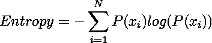

Equation 1\. Entropy

## 基尼杂质

它测量样品的杂质。它的值介于 0 和 1 之间，计算方法如下:

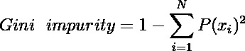

Equation 2\. Gini Impurity

基尼系数值为 0 意味着样本是完全同质的，正如我们在例子的第一个方框中看到的，而基尼系数值为 1 意味着元素之间的最大不平等。

## 分割节点

让我们计算数据集的杂质，为了简单起见，我们将使用基尼杂质法。

对于海岸咽喉功能，我们有


Table 2\. shore throat frequencies

岸喉的基尼不纯物有:

*基尼杂质(岸喉=是)= 1-(5/8)-3/8)= 0.468*

*基尼杂质(Shore Throat = No)= 1-(3/5)-2/5)= 0.480*

岸喉基尼不纯的加权和为

*基尼杂质(岸喉)=(8/13)* 0.468+(5/13)* 0.480 = 0.473*

对于温度，我们将阈值 37.5 定义为阈值

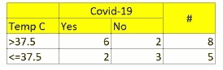

Table 3\. Temperature frequencies

温度的基尼系数为:

*基尼杂质(温度>37.5)= 1-(6/8)-2/8)= 0.375*

*基尼杂质(温度≤37.5)= 1-(2/5)-3/5)= 0.480*

温度的基尼系数加权和为

*基尼杂质(温度)=(8/13)* 0.375+(5/13)* 0.480 = 0.415*

对于咳嗽，我们有

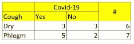

Table 4\. Cough frequencies

咳嗽的基尼不洁物有:

*基尼杂质(咳嗽=干咳)= 1-(3/6)-(3/6)= 0.5*

*基尼杂质(咳嗽=痰)= 1-(5/7)–( 2/7)= 0.408*

咳嗽基尼系数的加权和为

*基尼杂质(咳嗽)=(6/13)* 0.5+(7/13)* 0.408 = 0.450*

最终结果是:

基尼杂质(肖氏喉)=0.473

基尼杂质(温度)=0.415

基尼杂质(咳嗽)=0.450

从结果来看，温度的基尼系数最低。因此，温度特征是根节点

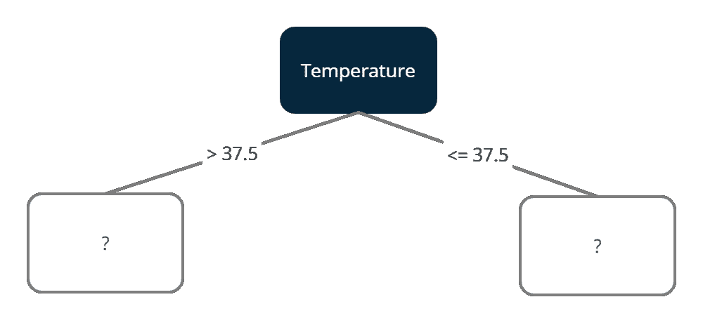

Figure 2\. Temperature as a root node. image by **the Author**

现在让我们集中计算温度特性。我们需要为海岸咽喉和咳嗽寻找基尼杂质，用于温度> 37.5

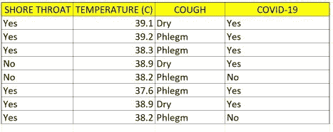

Table 5\. Covid-19 table for temperature above 37.5

对于喉咙短，我们有

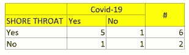

Table 6\. Frequency of shore throat for temperature above 37.5

温度> 37.5 和肖氏喉的基尼杂质为:

*基尼杂质(温度> 37.5，岸喉=是)= 1-(5/6)-1/6)= 0.27*

*基尼杂质(温度> 37.5，岸喉= No)= 1-(1/2)–( 1/2)= 0.5*

温度> 37.5 和肖氏喉道的吉尼杂质的加权和为

*基尼杂质(温度> 37.5，岸喉)=(6/8)* 0.27+(2/8)* 0.5 = 0.333*

对于咳嗽，我们有

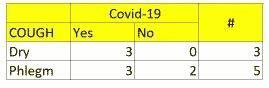

Table 7\. Frequency of cough for temperature above 37.5

体温> 37.5 和咳嗽的基尼系数为:

*基尼杂质(温度> 37.5，咳嗽=干燥)= 1-(3/3)-0/3)= 0*

*基尼杂质(温度> 37.5，咳嗽=痰)= 1-(3/5)-2/5)= 0.48*

咳嗽基尼系数的加权和为

*基尼杂质(体温> 37.5，咳嗽)=(3/8)*0+ (5/8)*0.408=0.3*

最终结果是:

基尼杂质(*温度> 37.5，*岸喉)=0.333

基尼杂质(*体温> 37.5，*咳嗽)=0.30

从结果来看，体温> 37.5 和咳嗽的基尼系数最低。因此，咳嗽特征是决策节点


现在让我们看一下体温> 37.5 和干咳的表格

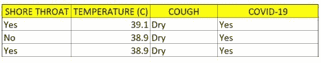

Table 8\. Frequency of dry cough for temperature above 37.5

当咳嗽是“干的”时，新冠肺炎的决定总是“是”。所以我们得到了叶节点。现在决策树可以被看作是

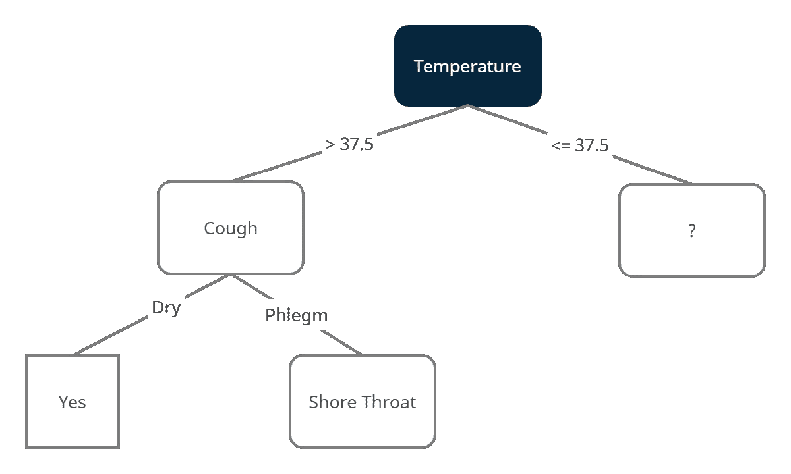

这足以让你了解决策树信息杂质度量的全过程。从这里开始，我们可以继续针对海岸咽喉和痰咳，并且我们还可以通过与上述相同的过程来确定温度低于 37.5 分支的决策节点。至于现在，让我们尝试用 Python 实现决策树算法

## 履行

对于 Python 中的实现，我们将使用带有 iris 数据集的 Scikit-Learn 模块

我们做的第一件事是加载大量的 python 模块

```
import pandas as pd
import numpy as np
import matplotlib.pyplot as plt
from sklearn.tree import DecisionTreeClassifier
from sklearn.tree import plot_tree
from sklearn.model_selection import train_test_split
from sklearn.model_selection import cross_val_score
from sklearn.metrics import confusion_matrix
from sklearn.metrics import plot_confusion_matrixfrom sklearn.datasets import load_iris
```

加载数据集

```
iris = load_iris()
X, y = iris.data, iris.target
```

训练和测试分割

```
X_test,X_train,y_test,y_train=train_test_split(X,y,test_size=0.2,random_state=1234)
```

决策树分类器实例(您可以通过添加参数`criterion='entropy'`使用熵进行杂质测量，默认为基尼杂质

```
clf = DecisionTreeClassifier()
```

然后你可以训练分类器(这是建立树的过程)

```
clf.fit(X,y)
```

您可以使用这个来绘制创建的三个

```
plot_tree(clf,filled=True,rounded=True,class_names=X.columns,feature_names=y)
```

现在来预测测试数据集

```
clf.predict(X_test)
```

## 结论

在本文中，我们了解到:

1.  决策树的结构
2.  决策树分裂过程中杂质的概念及如何度量杂质
3.  用 Python 实现决策树分类器。

[](/mlearning-ai/mlearning-ai-submission-suggestions-b51e2b130bfb) [## Mlearning.ai 提交建议

### 如何成为 Mlearning.ai 上的作家

medium.com](/mlearning-ai/mlearning-ai-submission-suggestions-b51e2b130bfb)