# 自主导航中的三维目标检测导论。

> 原文：<https://medium.com/mlearning-ai/an-introduction-to-3d-object-detection-in-autonomous-navigation-3a8779de6443?source=collection_archive---------0----------------------->

与 2D 相比，点云中的物体检测是相当复杂的。在这里，您可以找到关于在实现 3D 数据对象检测器的过程中需要考虑的最重要部分的简要介绍。

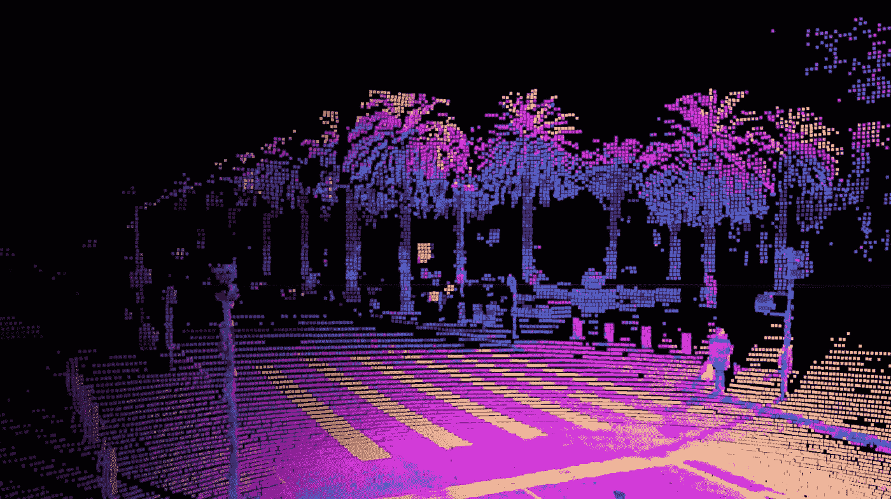

from [here](https://ouster.com/)

# 结构

*   (1) **为什么是 3D 数据**
*   (2) **传感器**
*   (3) **数据集**
*   (4) **神经网络**

# (1)为什么是 3D 数据

3D 数据是**在另一个层面上理解世界**的关键，但不幸的是不容易获得。这也是 3D 网络尚未接管的原因。第三维度使我们能够以更人性化的方式理解这个世界，甚至更好。想象一下，我们正驾驶着一辆汽车驶向下面这个类似大门的建筑:

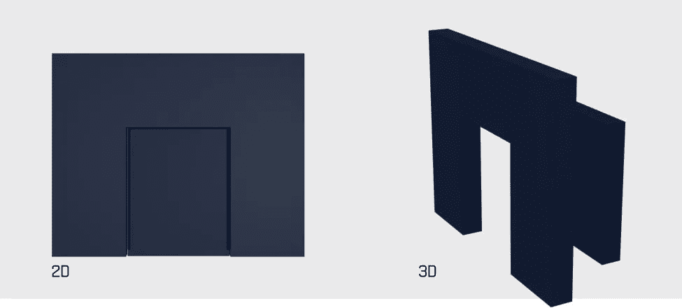

只有 2D 的数据，我们不可能知道开车穿过这个门(然后避开它后面的障碍物)就能通过。另一个真实世界的例子是通过隧道。

**3D 数据**

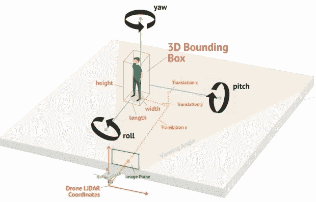

3D 数据不是由其 RGB 值描述的，而是由其在空间中的位置(x，y，z 坐标)描述的。原点(0，0，0)被设置为捕捉数据的对象(在本例中为无人机)。相应地，其他所有东西，比如人，都是相对于**原点**来描述的。例如，这个人可能在点(x，y，z) = (5，1，0)。(x，y，z)值的其他排列是可能的，这取决于您正在处理的数据集。例如，KITTI 数据表示如下:

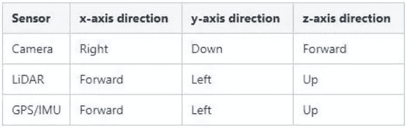

from [here](https://towardsdatascience.com/kitti-coordinate-transformations-125094cd42fb)

# (2)传感器

# **激光雷达**

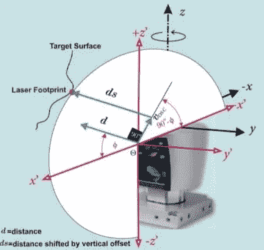

LiDAR sensors calculate the distance with the speed of light. [from here](https://airccj.org/CSCP/vol5/csit54618.pdf)

如果我们谈论点云，激光雷达是当然不得不提的。最著名的传感器是威力登 HDL-64E ，这是一个 12.7 公斤的庞然大物，于 2007 年推出，一直主导着高端激光雷达。2021 年，威力登宣布停止使用这种传感器，取而代之的是更轻的传感器，如[冰球](https://velodynelidar.com/products/)(不到 1 公斤)。这些传感器的功能很简单，它们发出多个垂直排列的光束**来测量距离。从表面反射后，光束随后被传感器捕获，因此可以计算出**距离**:**

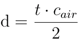

，其中 *c* ₐᵢᵣ是光速。你可能想知道，我们用单一的距离测量做什么？没什么！相反，我们需要成千上万的照片来获得我们周围环境的有意义的图像。因此，激光雷达**传感器旋转**，同时不断进行测量，以获得**360°全景**。最终结果是一个点云:

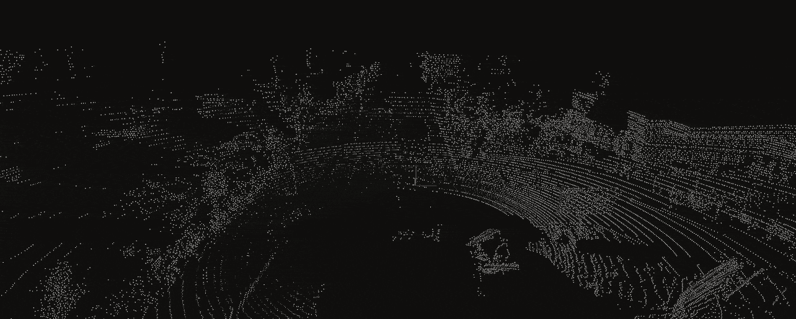

from [here](https://www.playment.io/blog/list-of-lidar-datasets-for-autonomous-vehicles-till-2018)

单点云由一系列(x，y，z)点坐标组成，其中**中心点(0，0，0)位于传感器的位置**。你可能注意到了围绕中心点(汽车的位置)的点的环形分布，这是由激光雷达传感器的**旋转**造成的。

除了威力登，还有其他激光雷达传感器制造商，如[驱逐者](https://ouster.com/)、[创新地带](https://innoviz.tech/innovizone)、 [Aeva](https://www.aeva.ai/) 和 [Luminar](https://www.luminartech.com/) 。

*   激光雷达 **pro** :高范围/精度
*   激光雷达**缺点**:重量/成本高

# **固态激光雷达**

我们要研究的下一种传感器是固态激光雷达。尽管机械激光雷达已经走过了漫长的道路，最轻的解决方案( [Puck LITE](https://velodynelidar.com/products/puck-lite/) )仍然非常重，只有 0.5 千克。对于像无人机这样的小型机器人来说，这一点意义重大。此外，由于振动、机械冲击、温度和湿度变化，**机械激光雷达** s 的移动部件需要大量能量和 [**维护**](https://www.linkedin.com/pulse/spot-differences-what-look-lidar-sensor-aditya-srinivasan/) **。因此，一种叫做 SSD 的新技术被开发出来。**

> 光学发射器以特定的模式和相位发出光子脉冲，从而产生定向发射。

SSD 的两种主要方法是 OPA(光学相控阵)和 MEMS(微机电系统)。一个 **OPA** **以**特定的模式**和相位发出光子**脉冲，产生定向发射。另一方面，**基于 MEMS** 的扫描仪 [**使用微镜**控制发射方向和聚焦](https://medium.com/r?url=https%3A%2F%2Fios.gadgethacks.com%2Fnews%2Flidar-vs-3d-tof-sensors-apple-is-making-ar-better-for-smartphones-0280778%2F)。换句话说，OPA 和 MEMS 在使用的激光器数量上有所不同:**OPA 使用许多激光器，而 MEMS 仅使用一个**，由微镜瞄准。这些技术也用在了 **iPhone 12 Pro 和 2020 iPad Pro** 上。

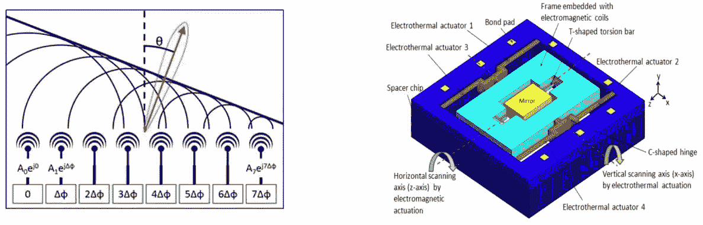

Left: [OPA](https://www.allaboutcircuits.com/news/solid-state-lidar-faster-cheaper-better/), Right: [MEMS](https://www.researchgate.net/publication/260332215_A_Two-Dimensional_MEMS_Scanning_Mirror_Using_Hybrid_Actuation_Mechanisms_With_Low_Operation_Voltage)

由于 SSD 是一项相对较新的技术，所以还没有发布多少传感器。英特尔和微软在 2019 年和 2020 年推出了固态解决方案，首次在市场上取得了成功。微软 Azure Kinect 的**和英特尔 L515 的**价格都很低，都在 400 美元左右，然而，Kinect 的重量是 L515 的五倍(440 克比 100 克)。另一方面，Azure 似乎有稍微好一点的范围和精确度，如测试镜头所示。正如最大 9 米的有限范围所示，这两款相机都不是为自动驾驶而制造的。此外，英特尔明确声明 L515 不适合户外使用，因为太阳光会干扰工作在 860 纳米的激光。此外，看看这篇文章，L515 在不同的光线条件下进行了测试。微软 Azure Kinect [也有同样的问题](https://www.mdpi.com/1424-8220/21/2/413)。对于未来，其他制造商如**威力登和驱逐者**已经宣布**远程户外固态**传感器将于 **2022** 问世。这些新的传感器可能最终会通过降低成本使激光雷达技术在大众市场上买得起，并使其适应道路、农田、建筑工地和矿井等崎岖地形。****

*   ****SSD **pro** :重量轻/精度中等****
*   ****固态硬盘**缺点**:低范围/仅室内(两者都将很快改变)****

# ******立体视觉******

****立体视觉是一种**非激光雷达**方法，通过使用**常规 RGB 或红外**相机获取深度信息，来降低成本、重量和**机械复杂性**。为了完整起见，应该提到的是，非激光雷达方法可以是单目的(单个相机)或多视图的(多个相机)。这里，我们将集中在多视图方法上，因为它们更加精确[而没有明显的缺点](https://arxiv.org/abs/1803.06199)。由于在立体视觉中距离**不是直接测量的**(像在激光雷达中一样)基于相机的方法使用**计算机视觉技术**来寻找图像中的**深度线索**。为了更好地理解核心问题，请参见下图，其中 3D 场景被映射到 **2d 相机平面**(标记为“近裁剪平面”)。****

****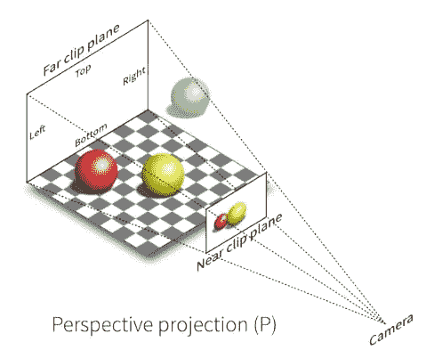****

****from [here](https://towardsdatascience.com/depth-estimation-1-basics-and-intuition-86f2c9538cd1)****

****这种映射也被称为 **2D 投影**，描述了相机的正常
功能，以产生真实 3D 世界的 **2D 表示**。由于**深度轴在 2D 投影过程中**被不可逆删除，因此**无法从图像中读取深度信息**。****

*****补充:当使用单个相机时，算法可以用来获得深度信息，同样的技术也可以在人脑* *中找到* ***(例如，通过搜索所谓的* ***深度线索*** *，如大小、纹理、视角和运动)。*******

**在使用多个摄像机(立体视觉)的情况下，可以应用一种称为**立体视觉** [49]的强大技术来获得深度信息。立体视觉描述了 [**借助**三角测量**从不同视角拍摄同一物体的两幅相机图像**计算距离****](http://www.cs.cornell.edu/~rdz/Papers/BVZ-PAMI98.pdf) 的可能性。理解立体视觉的直观例子如下图所示，当从两个不同的角度观察**时，较近的物体(食指)比较远的物体(房子)移位更多。这些物体之间的位移被称为**视网膜视差**，使我们能够通过公式 z =(f∫b)/d 精确计算距离，其中 z 是我们要搜索的距离，f 是相机的焦距，b 是两个相机之间的距离，d 等于 x1 x2。****

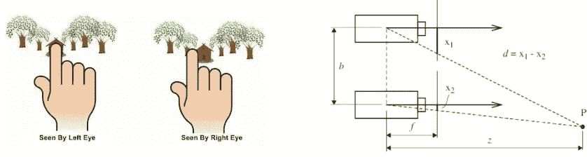

Calculate distance with retina disparity. from [here](https://towardsdatascience.com/depth-estimation-1-basics-and-intuition-86f2c9538cd1)

尽管三角测量方程使我们能够精确计算到任何物体的距离，但真正的困难在于前一步——在**中确定物体的位移**。这个问题可以通过使用**极线几何**(我会单独写一篇文章)**有效解决。**但是，距离计算在[以下情况](https://medium.com/r?url=https%3A%2F%2Fwww.andreasjakl.com%2Funderstand-and-apply-stereo-rectification-for-depth-maps-part-2%2F)中容易不准确:

*   ***图案纹理区域*** :一个图案有多个看起来相等的区域。
*   ***无纹理区域*** :多个像素的像素强度相同。
*   ***反光面*** :镜面状的物体表现出其他物体的纹理。
*   ***遮挡*** :物体在一个视图中被遮挡，而在另一个视图中没有被遮挡。
*   ***违反朗伯性质*** :当物体的亮度不(不)随透视而变化时。

## 制造商

立体视觉方法的市场由英特尔和 Stereolabs 主导。英特尔的立体视觉传感器，d415、 [**、d435i**](https://www.intelrealsense.com/depth-camera-d435i/) 和 D455。最轻的型号 d435i 的重量为 **72g** ，因此是所有制造商中第二轻的。Stereolabs 提供了 ZED 2 和 ZED Mini。主要区别在于英特尔提供板载计算和一个**红外发射器**。**板载计算**通过使用
英特尔实感视觉处理器 D4，允许直接输出深度图。相比之下，ZED 2 和 ZED mini 都依赖外部 GPU(如 [Jetson Nano](https://developer.nvidia.com/embedded/jetson-nano-developer-kit) )进行计算，这意味着额外的功耗(仅 Jetson Nano 就有 5-10 瓦)。d435i 的另一个优势是，由于其**红外摄像头** (Stereolabs 使用 RGB)，它可以在**完全黑暗的**中工作。

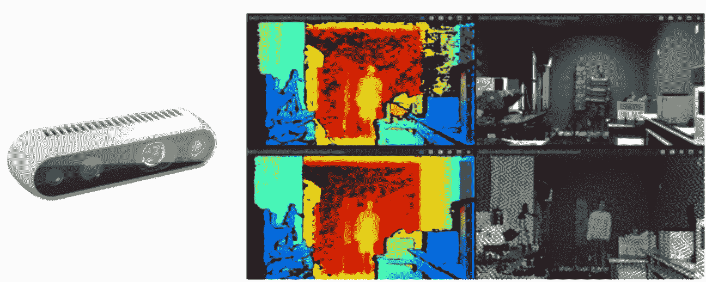

Depth images created by the Intel Realsense d435i. from [here](https://dev.intelrealsense.com/docs/optical-filters-for-intel-realsense-depth-cameras-d400)

在我的实验中，我看到 d435i 在最远距离内产生有用的结果。**7-10 米**，最佳作业范围
低得多(1-3 米)，而 ZED 系列可使用至**20**24】米，如[本](https://www.youtube.com/watch?v=tv4B01ELFWo)图所示。

# (3)数据集

我发现 3D 对象检测有三个有趣的类别:

## a)自动驾驶

*   [KITTI](http://www.cvlibs.net/datasets/kitti/) ， [nuScenes](https://www.nuscenes.org/) ， [Waymo](https://github.com/waymo-research/waymo-open-dataset) ， [Lyft](https://level-5.global/data/) ， [apolloscape](http://apolloscape.auto/) ，[福特](https://avdata.ford.com/downloads/default.aspx)

## b) ***三维物体检测***

*   [NYU 深度](https://cs.nyu.edu/~silberman/datasets/nyu_depth_v2.html)，[孙 RGB-D](https://rgbd.cs.princeton.edu/) ， [ScanNet](http://www.scan-net.org/) ，[斯坦福](http://graphics.stanford.edu/data/3Dscanrep/) 3D

## c)人体姿态检测

*   [田蜜](https://cocodataset.org/#densepose-2020)， [MPII](http://human-pose.mpi-inf.mpg.de/) ，[众筹](https://github.com/Jeff-sjtu/CrowdPose)， [PoseTrack](https://posetrack.net/) ， [CMU 全景](http://domedb.perception.cs.cmu.edu/)

a)最明显的数据集当然是用于自动驾驶的数据集，其中我们找到了对 **3d 长方体**、**激光雷达分割标签**、 **2d 框**、**实例遮罩、**和 **2d 分割遮罩**的注释。在这里，KITTI 是最知名的，因为它描绘了最早的自动驾驶 3D 数据集之一。nuScenes 更加通用，因为它还包括夜间和不同天气条件下的录音，这对训练一个强大的网络非常重要。请记住，如果训练数据中没有包含某些内容，网络很可能在以后的现实生活中出错。因此，在选择正确的数据时要明智地选择。大多数数据集使用的传感器是**威力登 HDL-64E** 或其他高成本/高精度选项。

b)第二类数据集是为自动驾驶之外的 3D 对象检测的一般任务而制作的。这里的常见物品大多出现在**家庭中，比如椅子**和杯子。注释也是 2D / 3D 对象和分段。与类别 a)无关，大多数数据集都是用像 [Kinect](https://rgbd.cs.princeton.edu/paper.pdf) 这样的 RGB-D 传感器或用 3D 软件人工创建的。必须指出的是，RGB-D 传感器远不如激光雷达精确，因此点云中的噪声(**距离误差**)更高。例如，在这张图片中，您可以看到超轻量级**英特尔实感 d435i** 在一米和三米距离内的输出:

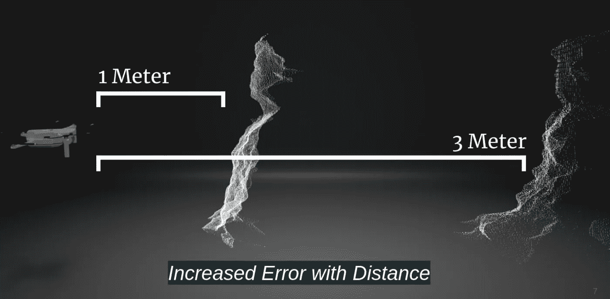

在这里，你从侧面看到一个人，坐在椅子上。在三米远的地方，点云已经变得如此混乱，以至于几乎认不出这个人了。然而，列出的数据集不是用 d435i 记录的，而是用其他精度稍高的传感器记录的，从而获得更好的数据。**请记住，根据您使用的传感器，您可能找不到适合您的训练数据。**例如，d435i 没有可用的公共数据集。

c)最后一类数据集不直接属于 3D 检测，因为它们中的大多数仅包含 2D 数据和注释。这里，像人的关节这样的某些关键点是感兴趣的。然而， [CMU 全景](http://domedb.perception.cs.cmu.edu/)是用 RGB-D 传感器记录的，因此也可以用于使用点云的网络。

# (4)神经网络

大多数出版物可以归入以下类别之一:

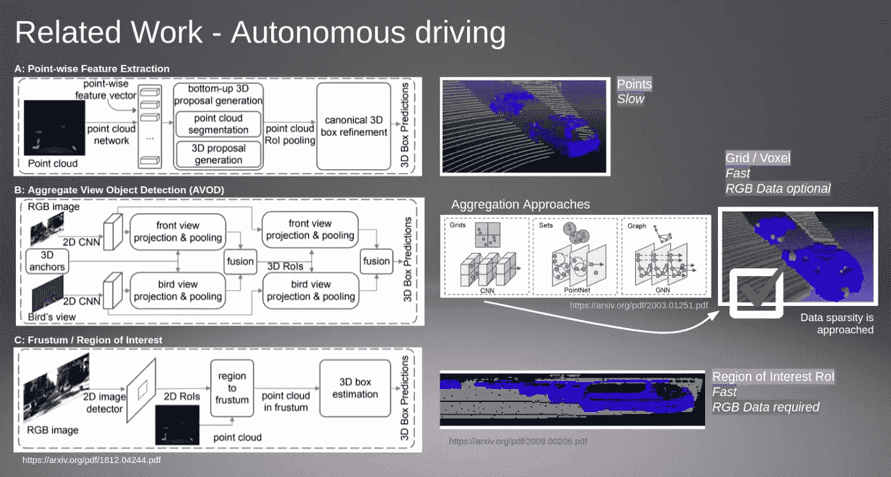

The three approaches for 3D object detection.

## **答:逐点特征提取**

3D 对象检测的第一种方法是特征的**逐点提取**。这可以通过使用线性层或 2D/3D 卷积层来实现。无论您使用哪种图层类型，网络都会非常慢，因为每个云中存在大量的点(10k-200k 个点)。一个例子就是[点网](https://github.com/charlesq34/pointnet) (2017)。

## **B:聚合视图对象检测(AVOD)**

目前在研究中最受关注的第二种方法是**将点聚集成子集**，其中每个子集可以被视为 3D 空间中某个**区域的代表。落入该区域的所有点现在都与该区域相关联，并通过卷积**聚合**。最后，您可以像对待 A 部分中的点(逐点要素提取)一样对待这些聚合区域，方法是通过一堆图层转发它们。这些方法可能非常复杂，因为**聚合过程考虑了点**之间的各种相关性。最常见的聚合区域类型是**网格**、**集合**和**图形**，其中最简单的解决方案是网格。对于网格方法，整个三维区域被分割成子部分(均等地切片或切块)，并且每个子部分中的点因此被聚集成单个特征列表。这个过程也被称为**体素化**。使用体素化的著名网络有 [VoxelNet](https://github.com/qianguih/voxelnet) (2017)、 [SECOND](https://github.com/traveller59/second.pytorch) (2018)、 [Pointpillars](https://github.com/nutonomy/second.pytorch) (2019)、以及 [SE-SSD](https://github.com/Vegeta2020/SE-SSD) (2021)。**

## **C:感兴趣的截锥/区域**

第三种类型的网络试图**使用**在 2D 检测器中发现的**高精度，通过(1):从 RGB 图像中提取感兴趣区域(ROI)，该图像是在点云被捕获的同时捕获的，以及(2): **当检测点云中的 3D 盒子时，仅考虑 ROI**。例如，如果 2D 探测器在 RGB 图像中发现一个人，我们可以通过使用**透视变换**将点云映射到图像的 2D 平面上，这样图像像素和点(来自云)就可以完美地相互关联(它们现在位于同一平面上)。现在，我们可以很容易地从云**中选择点，2D 探测器认为一个人在那里，因此，将这些点转发到另一个网络进行 3D 处理。这种方法工作良好，因为 2D 检测器对 3D 检测器进行预选，从而减少了误差。然而，这种方法也有缺点:

*   处理两个而不是一个数据流需要**更多的处理能力**
*   点云传感器和 RGB 相机需要**完全对齐**才能计算透视变换
*   多个传感器意味着**多个故障源**

基于平截头体提取的一个网络是[平截头体点网](https://arxiv.org/abs/1711.08488)。

## **速度**

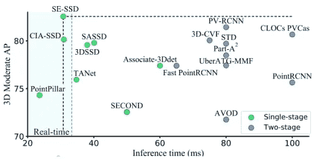

from [here](https://arxiv.org/pdf/2104.09804v1.pdf)

速度和精度显然必须平衡。网络越精致，计算时间就越长。可以看到，2019 年的 Pointpillars 仍然以接近 **50 fps** 的速度位居榜首，其次是 30 fps 的 SE-SSD，它在图表创建时也具有最佳的精度(Arpil 2021)。

# 总结:

您已经简要了解了 3D 对象检测中的重要主题。对于未来，网络**速度和准确性**以及传感器都有很多值得期待的地方。由于更可靠的感知和更自信的导航，新的导航机会将会出现，特别是随着**更复杂的固态** **激光雷达**解决方案的兴起。想象一下完美感知的可能性。例如，无人机可以高速飞行而不会发生事故，就像电脑游戏中的**机器人** **。完美的感知是迈向更高智能算法的重要一步。**

# **未来主题:**

**未来文章**将考虑:

*   点云中的**增强**
*   在立体视觉和**极线几何**中创建点云
*   **从 2d 到 3d 的透视投影**
*   **点柱**网络的 Tensorflow 实现

关于这个和其他 ML 主题的更多文章将很快出现。所以如果你喜欢就订阅吧。

**培养基:** [Matthes Krull—培养基](/@krull.matthes)

**关于我**:我是一名热情的深度学习工程师，工作在柏林。你可以通过***krull.matthes@gmail.com****联系我。*

 [## Mlearning.ai 提交建议

### 如何成为 Mlearning.ai 上的作家

medium.com](/mlearning-ai/mlearning-ai-submission-suggestions-b51e2b130bfb) 

[成为作家](/mlearning-ai/mlearning-ai-submission-suggestions-b51e2b130bfb)