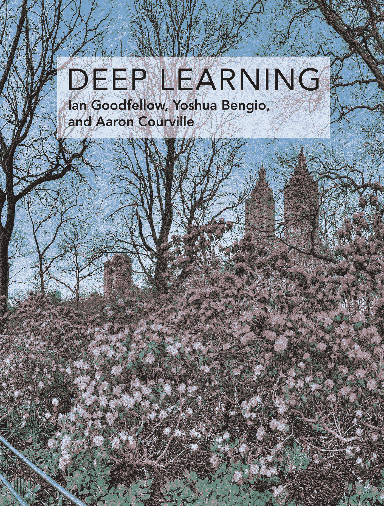

# 深度学习导论

> 原文：<https://medium.com/mlearning-ai/an-introduction-to-deep-learning-dc28a7340e49?source=collection_archive---------2----------------------->

## 书摘要:《深度学习》第一章，作者:伊恩·古德菲勒、约舒阿·本吉奥、亚伦·库维尔

人类长期以来一直梦想创造智能机器。古希腊人梦想上帝创造这样的人工生命。但是几千年后，我们变成了那些神。