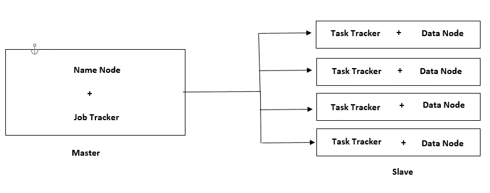
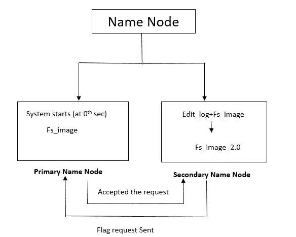

# Hadoop 简介

> 原文：<https://medium.com/mlearning-ai/an-introduction-to-hadoop-2f3e08528259?source=collection_archive---------1----------------------->

Figure 1

> **简介**

当我们处理大数据时，我们的系统将处理大量数据，即千兆字节和千兆字节。为了处理这些大块的数据，现在数据工程师使用 Hadoop，(多个系统的集群)Hadoop 有助于以并行和更快的方式分析大块的数据。

假设你是一个 Youtuber 用户，你有一台可以存储 1 Tb 数据的笔记本电脑。假设你定期发布你的内容。经过一段时间后，您在 youtube 上上传了 1TB 的内容，现在您需要一个额外的存储系统来进行备份，您可以通过两种方式来实现这一点:用更强大的系统(具有 5Tb 存储的系统)替换现有系统(纵向扩展),或者您可以购买一个额外的硬盘(横向扩展)来存储更多数据。

纵向扩展(用新系统替换旧系统)比横向扩展(添加商用硬件)成本更高。Hadoop 还使用横向扩展技术来处理大块数据。

> **住房和城市发展基金。X**

**H.D.F.S :- Hadoop 分布式文件系统。**

HDFS 1 号。x 以主从架构工作。它由一个主机和多个从机组成。假设你在一个组织中工作，你将有一个经理和 5-10 个团队成员，经理的主要任务是在不同的团队成员之间分配任务，就像 HDFS 1。x 工作，管理者是**主人**，团队成员是**奴隶**。

**现在的问题是 Hadoop 分布式文件系统是什么意思？**

假设您想要处理 1GB 的数据，并且您有 4 个系统可用于处理所请求的数据。系统将在所有四个系统之间平均分配数据( **250 Mb** )(考虑到所有系统都可以充分发挥其潜力)。数据的并行处理&分发是由分布式文件系统完成的。
先来了解一下 Hadoop 1。x 架构。

Figure 2:- Hadoop 1.X

# **主节点**

主节点由**名称节点**和**作业跟踪器**组成。

## a.名称节点:

1.名称节点的主要任务是存储**元数据**信息。

**元数据是什么意思？** 存储与可用系统相关的信息。例如系统的可用性。
二>系统配置
三>系统的处理能力
四>检查点。
v >分配工作给从节点

**注意:-** 名称节点不存储数据，但存储数据节点的元数据信息。

Figure 3

名称节点也分为两部分。即:- **主**名称节点和**次**名称节点。

Figure 4

一. >**主名节点** :-系统启动时，存储第 0 秒可用系统的元数据信息，称为`**fs_image**`(文件系统映像)。它给出了对任何类型的执行的第一个响应。
`**fs_image**` :-文件系统映像存储设备的信息，如配置、处理能力以及系统将处理的数据类型。

二。>**次名节点:-** 假设你定期从家通勤到办公室。你在特定的时间离开家，比如说早上 8:30，下午 2:30 吃午饭，晚上 7:00 离开办公室。这些时间是你生活的日志。同样，当一台机器做任何操作时，它都会记录一些日志，在这些日志的帮助下，我们可以得出任何任务成功的结论。这些日志记录在辅助名称节点中。假设管理员已经设置了每 50 秒更新一次日志的时间，那么每 50 秒就会创建一个`**edit_log**`文件，并且将`**fs_image+edit_log**`组合成更新后的`fs_image_2.0`，它将再次**发送回主名称节点**。一旦 fs_image 信息将在次名称节点中更新，则次名称节点将向 PNN(主名称节点)发送标记。一旦 PNN 将被释放，它将存储更新的`**fs_image**`文件。上述过程将一直发生，直到任务完成。

更新 fs_image_2.0 的过程被称为**检查点**，请始终记住，检查点只发生在次名称节点中。

## b.作业跟踪器:

它在集群级别上工作。当客户机请求数据时，作业跟踪器开始将任务 pinging 不同的集群(从属节点)。无论哪个集群响应作业跟踪器，任务都将被分配给该特定集群。
Job tracker 根据先到先得的原则选择集群。以下是求职者要做的一些重要工作:
i >作业调度
ii >资源管理
iii >作业监控。

# 从节点:

一个主节点可以有多个从节点。从节点由任务跟踪器和数据节点组成。

## **a .任务跟踪器**

任务追踪器和工作追踪器都有相似的工作。唯一的主要区别是作业跟踪器工作在集群级别，而任务跟踪器工作在节点级别。
任务跟踪器向作业跟踪器提供关于任务可用资源的响应。

## b.数据节点

它启动任务。它负责在 HDFS 存储实际数据。它配置了大量的硬件空间，因为实际的数据级工作发生在数据节点中。

**结论:-**
如果你有任何问题，请在下面评论。不断学习，不断探索。

 [## Mlearning.ai 提交建议

### 如何成为 Mlearning.ai 上的作家

medium.com](/mlearning-ai/mlearning-ai-submission-suggestions-b51e2b130bfb)