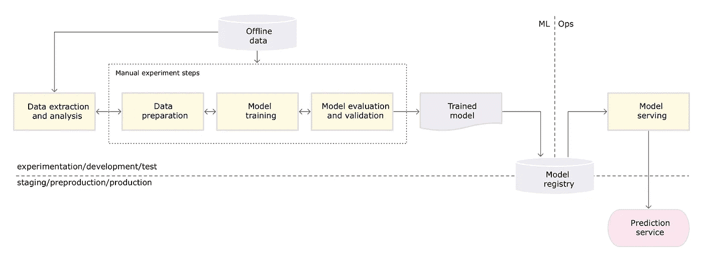
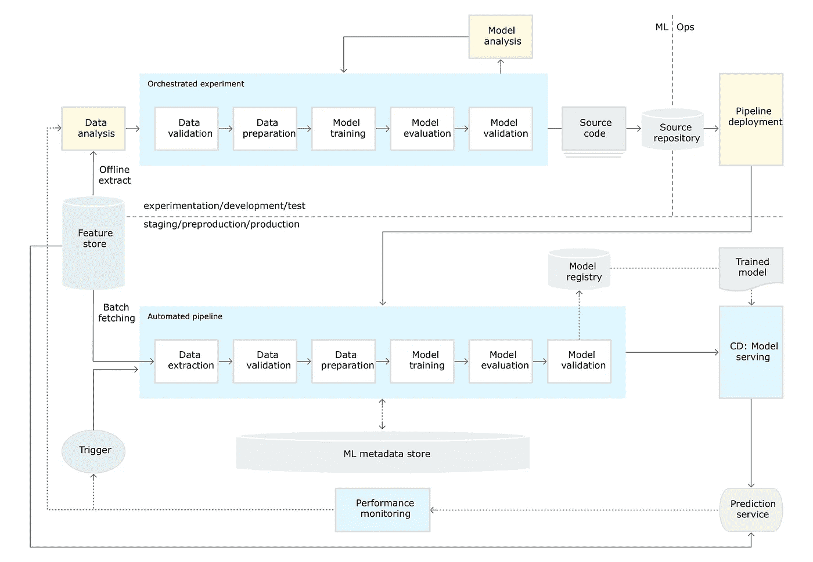

# MLOps 成熟度级别简介

> 原文：<https://medium.com/mlearning-ai/an-introduction-to-mlops-maturity-level-99734b6e2ea9?source=collection_archive---------7----------------------->

# 概观

*MLOps* 是一种机器学习(ML)工程文化和实践，旨在统一 ML 系统开发(Dev)和 ML 系统运营(Ops)。是 DevOps 实践在机器学习领域的应用。实践 MLOps 意味着我们提倡在 ML 系统构建的所有步骤中进行自动化和监控，包括集成、测试、发布、部署和基础设施管理。

更多了解 MLOps 的几段引言:

1.  "*人们在开发 ML 功能时面临的主要挑战是规模、版本控制、模型可再现性和与利益相关者保持一致"*
2.  术语 MLOps 被定义为*“DevOps 方法的扩展，将机器学习和数据科学资产作为 devo PS 生态中的一等公民”*
3.  与 DevOps 一样，MLOps 也认识到将 ML 模型开发与交付它的过程(ML 操作)分离会降低整个智能软件的质量、透明度和敏捷性。”

构建自己的 MLOps 管道并非一日之功。在开始之前，了解 MLOps 渠道的不同阶段或级别很重要，并据此计划逐步建立完整的 MLOps 渠道。在本文中，我们将探讨 MLOps pipeline 的不同成熟度级别，以及如何达到每个级别。

# MLOps 成熟度级别

MLOps 成熟度是衡量机器学习管道自动化水平的一个好方法。不同行业领导者(如 Google 或 Microsoft)对成熟度级别的确切定义可能略有不同。根据[微软 Azure 的 MLOps 级别定义](https://docs.microsoft.com/en-us/azure/architecture/example-scenario/mlops/mlops-maturity-model)(强烈推荐阅读)和[谷歌的 MLOps 级别架构回顾](https://cloud.google.com/architecture/mlops-continuous-delivery-and-automation-pipelines-in-machine-learning)，可以总结为:

*   0 级:没有 DevOps 或 MLOps
*   级别 1: DevOps，但没有 MLOps
*   级别 2: DevOps 和自动化模型培训
*   级别 3:开发运维及自动化模型部署
*   第 4 级:完全 MLOps

让我们深入了解 MLOps 成熟度级别，看看每个成熟度级别都有哪些特征。

# 0 级—无开发操作或多操作

成熟度等级 0 主要是手动的。在此级别中，没有用于模型发布的 DevOps，也没有用于模型培训和部署的 MLOps。一个数据科学家手动提取和实验数据，然后手动训练和创建 ML 模型，然后手动评估和验证模型。然后，ML 模型被交给软件工程师，以便在生产中手动部署到 ML 服务。下图是典型的 MLOps 成熟度等级 0 管道:

[*Source: Google Cloud MLOps level diagram: Manual process*](https://cloud.google.com/architecture/mlops-continuous-delivery-and-automation-pipelines-in-machine-learning#mlops_level_0_manual_process)

在这一级别中，有几个明显的特征值得一提:

1.  **无 MLOps** 。从数据提取和分析到模型训练和评估，整个过程完全是手动的。数据科学家可能有一些本地脚本来简化工作流，但没有统一或受管的系统来自动化该过程。缺乏自动数据处理、自动模型训练和自动模型评估经常导致 ML 模型的长发布周期和 ML 模型性能的折衷一致性。
2.  **没有 DevOps。**当 ML 项目处于初始阶段，软件工程师没有时间和投资来构建 DevOps 管道以自动发布 ML 模型时，这是很典型的。然而，缺乏自动化，特别是没有 ML 模型的自动化部署和 ML 服务的自动化集成测试，经常导致 ML 模型的长部署周期和有问题的生产管理，例如版本管理和紧急回滚。
3.  **不频繁的发布周期**。在大量手工操作的工作流程中，任何 ML 特性的改变都需要很长的周期才能发布给用户。在今天的敏捷软件开发中，频繁发布的常见实践在这个成熟度级别上失败得很惨。

总的来说，当一个 ML 项目刚开始的时候，处于这个水平是没问题的。但是如果停留在这个水平上，人工努力很快就会增加，并对项目的整体效率和进度以及科学家和工程师的快乐产生影响。

# 级别 1 — DevOps，但没有 MLOps

成熟度等级 1 仍然是手动的，但是已经向前迈进了一步，将自动化添加到系统中。由数据科学家执行的 ML 工作流仍然是手动的，但是一旦 ML 模型被移交给工程师(或科学家本人)，ML 服务的发布、部署和监控就完全自动化了。执行 ML 服务发布和部署的管道被认为是 CI/CD 管道，它确保适当的 DevOps 实践 ML 服务和代码管理。

需要注意的是，这个级别的 DevOps 指的是 ML 服务发布，而不是 ML 模型发布。ML 模型一旦创建，就不会自动发布并部署到生产中。工程师/科学家仍然需要手动触发 ML 服务管道来将 ML 模型部署到生产中。

在这个级别中，有几个特征值得一提:

1.  **ML 服务发布的 DevOps。**ML 模型一旦创建，就通过 DevOps 管道自动构建、打包、测试和部署。不再需要将 ML 模型手动复制到生产中。同样的 CI/CD 流程也适用于 ML 服务代码变更。自动化集成测试已到位，以验证与 ML 服务相关的代码更改。这确保了 ML 服务端生产中一致的模型性能和代码变更。
2.  没有 MLOps。ML 工作流程仍然是手动的。没有自动化的模型训练和自动化的模型部署。

一个团队通常会很快发展到这个水平。通常，这是因为团队中的工程师比科学家多，因此工程师有更多的能力来快速建立用于 ML 服务部署的 DevOps 管道。然而，团队和项目作为一个整体仍然感受到不频繁的发布周期的痛苦，这是由于 ML 模型创建工作流中涉及的手动工作，这通常需要更长的时间，特别是如果模型训练涉及深度学习和大量数据的话。

# 第 2 级—开发运维及自动化模型培训

成熟度等级 2 在 ML 工作流自动化方面取得了重大进展。在这个级别中，从数据提取、数据处理到模型训练的步骤都是完全自动化的。科学家利用这些自动化的效率来快速收集数据和训练 ML 模型，从而减少整个 ML 工作流程和发布周期。然而，经过训练的模型仍然需要手动验证，并且仍然需要手动交给工程师，以在生产中部署到 ML 服务。

在这一级别中，有几个特征值得一提:

1.  **部分 MLOps** 。ML 工作流程在 ML 模型训练之前是部分自动化的。当团队意识到长发布周期的痛苦并投入精力减少 ML 工作流时间时，数据处理和模型训练步骤通常是第一目标。
2.  **自动化模型训练。**模型训练通常是当今 ML 工作流程中最耗时的步骤，不仅因为实际训练时间，还因为需要基础设施和大量机器。培训基础设施的管理如果不是完全自动化的，通常会成为手动启动和关闭的负担。科学家可能会提出自动化脚本来减少管理培训基础设施所需的手动步骤，但需要一个更加统一和全面管理的系统来进一步减少工作。
3.  **没有自动化的模型部署**。如上所述，由自动化模型训练步骤创建的 ML 模型仍然没有自动发布。这通常是由于科学家的手动模型验证或者模型训练管道和模型部署管道之间的断开，或者两者都有。

在这个级别，团队在自动化 ML 工作流方面取得了巨大的进展，并明显感受到了它给整个发布周期带来的效率和速度的提高。在这一点上，随着自动化程度的提高，继续前进到下一个成熟度级别是有意义的。

# 级别 3 —开发运维及自动化模型部署

成熟度级别 3 处理 ML 工作流的最后一步—模型部署。在此级别中，使用预定义的度量阈值自动验证经过训练的模型。一旦模型验证通过，ML 模型将自动发送到 ML 服务管道，并自动触发 ML 服务管道部署，以将 ML 模型部署到生产中。正如您可能已经猜到的，在这个级别，从数据收集到生产中的模型部署的所有步骤都是自动化的。ML 培训管道和 ML 服务管道连接在一起，共同将生产中的原始数据转化为服务的 ML 模型。

同样重要的是，要意识到我们还没有达到完全的 MLOps。当 ML 模型被部署到生产环境中时，这项工作并没有完成。模型监控和特别是模型再培训是完整的 MLOps 系统中非常重要的部分，但我们还没有。

这一级别的几个特点:

1.  **接近最大行程**。ML 工作流从数据收集到模型部署是完全自动化的。不涉及人工操作，如果一切顺利，一旦科学家用所需数据触发 ML 训练管道。全面的 MLOps 尚未实现，因为我们还没有合适的模型再培训来结束这个循环。
2.  **自动化模型部署**。ML 工作流自动化中激动人心的部分。当科学家和工程师一起工作在 ML 培训管道和 ML 服务管道之间建立连接时，实现了自动化的模型部署。这通常涉及 ML 培训管道端的正确的自动化模型验证和 ML 服务管道端的自动化部署触发。

该团队现在有了一个工作高效的系统，可以快速将原始数据交付给生产中的服务模型。ML 项目的生产率和速度得到了显著提高。团队可能会欣喜若狂，宣布工作完成。然而，要实现完整的 MLOps，还有一个最终的成熟度级别要追求。

# 4 级-完整 MLOps

成熟度级别 4 是完整 MLOps 的最终级别。4 级和 3 级之间明显的区别在于模型再培训的能力。ML 模型主要由数据驱动。在 ML 模型被部署到生产环境并开始对从未接受过训练的真实世界数据进行推理之后，它的性能会随着时间的推移而下降。设置性能监控指标来监控生产中的 ML 模型性能很重要，更重要的是，当模式性能指标低于某个阈值时，会自动触发模型再培训。下面是典型的 MLOps 成熟度级别 4 管道图:

[Source: Google Cloud MLOps level diagram: ML Pipeline](https://cloud.google.com/architecture/mlops-continuous-delivery-and-automation-pipelines-in-machine-learning#mlops_level_1_ml_pipeline_automation)

4 级 MLOps 管道将所有持续集成(CI)、持续交付(CD)和持续培训(CT)流程整合到管道中。与上一级管道相比，围绕连续培训增加了一些新功能:

1.  收集新的真实世界数据。ML 模型部署到生产中后，不断得到现实世界数据的推理请求。在这一级，MLOps 系统收集其在生产过程中发现的新的真实世界数据，并保存这些数据以备将来使用。
2.  **ML 车型性能监控**。将 ML 模型投入生产并不是终点。按照惯例，需要设置性能监控来监控 ML 模型性能并创建相关警报。
3.  **自动化模型再训练。**与前一级管道相比，这是一个巨大的差异。当 ML 模型性能下降到某一预定阈值时，或者以某一步调，MLOps 系统可以触发自动再训练。到目前为止在生产中收集的新的真实世界数据可以用于重新训练 ML 模型，以更好地处理更多真实世界的情况。受益于已经实现的自动化模型测试和自动化模型部署，新训练的模型可以自动测试并发布到生产中，而无需任何手动干预。

第 4 级完整 MLOps 管道创建了一个具有模块化组件的统一 ML 管道，而不是具有手动转换的孤立组件。4 级 MLOps 渠道改变了我们对 ML 开发和部署流程的看法。这不再是一个独立的工作流程，科学家创建模型，工程师部署它们，就像过去开发团队创建应用程序，运营团队部署和监控它们一样。统一的 ML 管道简化了科学家的工作流程，使科学家能够以快速迭代和自信的方式创建、测试、部署和监控 ML 模型。

在这个层面上，团队发现自己运行着一个非常高效和强大的 MLOps 管道。ML 特性发布周期显著缩短，更多的特性更快、更安全地交付给客户。此外，由于 MLOps pipeline 的架构和平台高度可重用，团队现在可以将更多精力放在扩展到更多基于 ML 的产品上，而不必从头开始，再次经历缓慢而痛苦的 0 级过程。

*原载于*[*https://stephenweixu.com*](https://stephenweixu.com/blog/an-introduction-to-mlops-maturity-level)*。*

 [## Mlearning.ai 提交建议

### 如何成为 Mlearning.ai 上的作家

medium.com](/mlearning-ai/mlearning-ai-submission-suggestions-b51e2b130bfb)