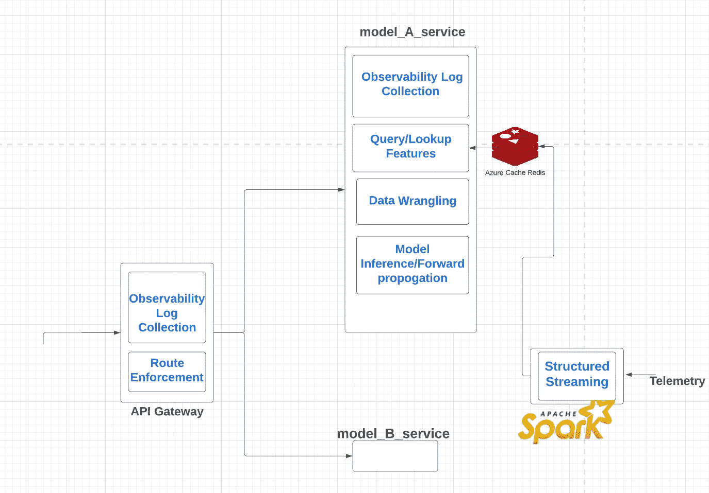

# 服务于实时机器学习预测

> 原文：<https://medium.com/mlearning-ai/an-introduction-to-serving-real-time-machine-learning-predictions-4bab3bf245fb?source=collection_archive---------8----------------------->

实时机器学习预测用例包括实时推荐模型、音乐会门票预订/拼车应用程序中使用的飙升价格预测算法等。这种模型使用编码为特征的最近会话活动，因此需要实时推理。本文是关于优化这种实时推理服务的响应时间。

在大多数实时用例中，人类用户会等待您的预测结果或效果出现在移动应用程序中或显示在网页上。因此，在进行实时预测时，对响应时间的重视是最重要的。

保持低响应时间的问题因增加功能层的迫切需要而变得复杂，如可观察性、A/B 测试、深度学习模型推理、流式高维特征集等。

**实时 ML 推理的模板**

下面是实时推理设置中的机器学习推理管道的简化图示。带标签的方框表示各自微服务中的模块。

A real-time machine learning inference template

推理管道是分布在多个微服务中的上述模块的同步部署。因为每个模块只占总响应时间的一小部分，所以让我们仔细研究一下为什么每个模块都应该存在于推理管道中。

**API 网关:**API 网关需要将传入的请求路由到一个或多个下游服务。API 网关服务从“路由实现”中抽象出“路由实施”。**当您的推理管道包括生产中多个模型的 A/B 测试、实施金丝雀测试、跨模型的流量分流等功能时，“路由实施”变得重要/重要。**

****数据争论:**传入推理请求的有效负载必须经常被解析和转换，以生成**请求时特征**。要优化该模块，请使用矢量化转换将您的代码与部署环境的底层硬件架构相匹配，并利用 GPU 优化库。**

****模型推断:**深度学习模型即使托管在最新的 GPU 上，也需要几十毫秒才能提供对高维特征的预测。有必要尽量减少神经网络的层数，看看我们是否能够维持模型的性能。还有一些技术，如量化技术，可以调整要素精度的容差并提高推理性能**

****结构化流:**在请求处理时生成所有特征可能是不可行和/或不必要的。复制转换逻辑的复杂性、对大规模聚合的需求以及功能的时间敏感性都可能在要求使用异步低延迟管道将结构化数据流式传输到 Redis 等高可用性存储系统中来保持某些功能方面发挥作用**

****查询/查找特征:**存储在高速缓存或其他可用存储器中的流式特征预期在亚毫秒时间内被查询。在实际设置中，这可能会变得棘手，因为在读取缓存的同时会填充缓存。因此，可用性可能非常不稳定，并且依赖于高效更新缓存。出现了监控查询查找失败&延迟的需要，即使它们是几毫秒的量级。**

****可观察性&日志收集:**响应时间开销几乎总是不均匀地分布在推理管道的各个部分。无论您是继承现有模型进行优化，还是从头开始，推荐的方法是在开始优化之前，让模型在端到端的生产模拟环境中服务。部署完成后，我们开始观察推理管道各个部分的记录性能。这种方法使我们能够将注意力集中在对提高绩效投资最重要的管道部分。因此，需要采取以下措施:**

**1)推理和路由过程将半结构化日志数据**异步**发送到本地存储。记住，随着 Flask 在服务架构中的流行，不要认为异步是理所当然的。**

**2)将标准化的日志收集器流程独立部署到托管推理和路由服务的 pod 中，而不会显著降低请求处理性能。**

**实时机器学习管道聚集了不断发展的多学科复杂层，使得精确设计几十毫秒量级的响应时间变得更加困难。这需要全面的设计工作来优化管道的速度，就像优化模型的精度一样。在随后的文章中，我打算扩展上面列出的每个模块的设计考虑**

** [## Mlearning.ai 提交建议

### 如何成为 Mlearning.ai 上的作家

medium.com](/mlearning-ai/mlearning-ai-submission-suggestions-b51e2b130bfb)**