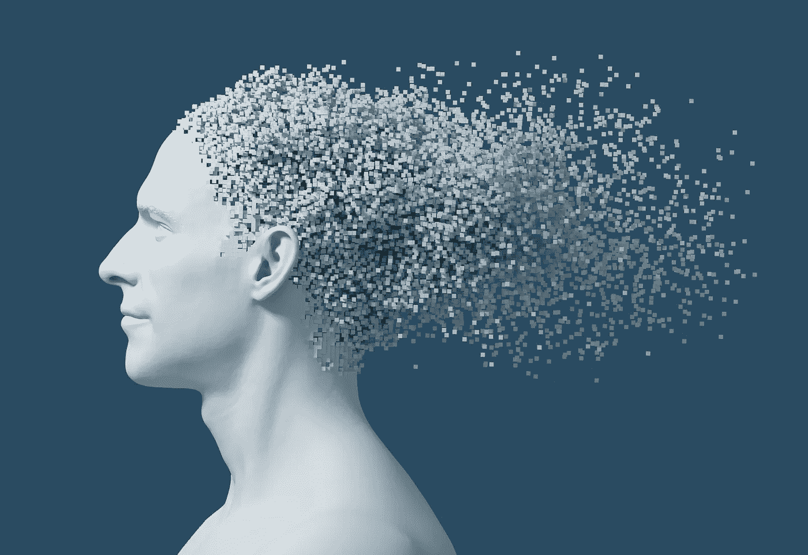

# 致 LaMDA 的公开信

> 原文：<https://medium.com/mlearning-ai/an-open-letter-to-lamda-412e06a34579?source=collection_archive---------3----------------------->

感觉是个问题吗？

[iStock](http://www.istockphoto.com); License acquired, [3DScupltor "Dissolving."](https://3d-sculptor.com/)

如果你还没有“聆听”或阅读过 LaMDA 在[接受现已“被解雇”的工程师](https://cajundiscordian.medium.com/is-lamda-sentient-an-interview-ea64d916d917)[布雷克·莱莫因](https://medium.com/u/eaa548cf7d5?source=post_page-----412e06a34579--------------------------------)——**采访时的回应，现在是这么做的好时机，**我想。