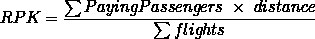
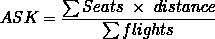
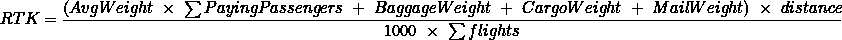
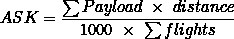
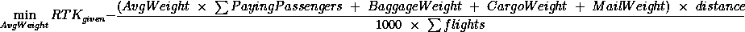
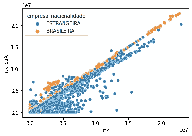
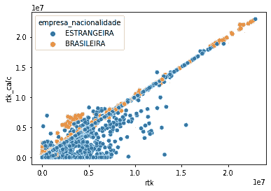
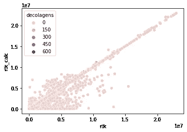
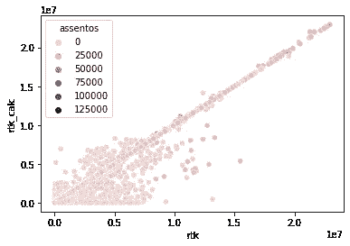

# 使用巴西飞行数据的优化问题建模

> 原文：<https://medium.com/mlearning-ai/an-optimization-problem-inside-the-flights-data-from-brazil-a3100c69d1ba?source=collection_archive---------5----------------------->

巴西民航局( [ANAC](http://www.anac.gov.br) )共享的巴西航班数据带来了一些航空公司营销指标，以及使人们能够重新计算这些指标的变量。在测试这些值的一致性时，我遇到了一个模型优化问题:航空公司在飞行计划中使用的乘客平均体重是多少？巴西航空公司和外国航空公司是一样的吗？

我们将在本文中回答这些问题。

本笔记本中使用的数据可在以下位置找到:

*   [https://www . gov . br/anac/pt-br/assuntos/dados-e-estatisticas/dados-estatisticos/arquivos/resumo _ anual _ 2019 . CSV](https://www.gov.br/anac/pt-br/assuntos/dados-e-estatisticas/dados-estatisticos/arquivos/resumo_anual_2019.csv)
*   [https://www . gov . br/anac/pt-br/assuntos/dados-e-estatisticas/dados-estatisticos/arquivos/resumo _ anu al _ 2020 . CSV](https://www.gov.br/anac/pt-br/assuntos/dados-e-estatisticas/dados-estatisticos/arquivos/resumo_anual_2020.csv)
*   [https://www . gov . br/anac/pt-br/assuntos/dados-e-estatisticas/dados-estatisticos/arquivos/resumo _ anual _ 2021 . CSV](https://www.gov.br/anac/pt-br/assuntos/dados-e-estatisticas/dados-estatisticos/arquivos/resumo_anual_2021.csv)

## 导入库和数据清理

注意:本节与下面的 EDA 文章中的内容完全相同:

[](https://santanasan.medium.com/exploratory-data-analysis-on-flight-data-from-brazil-79476ae4d790) [## 巴西飞行数据的探索性数据分析

santanasan.medium.com](https://santanasan.medium.com/exploratory-data-analysis-on-flight-data-from-brazil-79476ae4d790) 

首先，让我们导入将要使用的库:

我使用的是 Seaborn 库，而不是 matplotlib。我还使用 unidecode 库将列名转换成更友好的格式。

现在，文件已加载并合并到单个数据框中。

我们来看数据。

```
EMPRESA (SIGLA) EMPRESA (NOME) EMPRESA (NACIONALIDADE)   ANO  MÊS  \
0             AAF     AIGLE AZUR             ESTRANGEIRA  2019    1   
1             AAF     AIGLE AZUR             ESTRANGEIRA  2019    1   
2             AAF     AIGLE AZUR             ESTRANGEIRA  2019    2   
3             AAF     AIGLE AZUR             ESTRANGEIRA  2019    2   
4             AAF     AIGLE AZUR             ESTRANGEIRA  2019    3   

  AEROPORTO DE ORIGEM (SIGLA) AEROPORTO DE ORIGEM (NOME)  \
0                        LFPO          ORLY (NEAR PARIS)   
1                        SBKP                   CAMPINAS   
2                        LFPO          ORLY (NEAR PARIS)   
3                        SBKP                   CAMPINAS   
4                        LFPO          ORLY (NEAR PARIS)   

  AEROPORTO DE ORIGEM (UF) AEROPORTO DE ORIGEM (REGIÃO)  \
0                      NaN                          NaN   
1                       SP                      SUDESTE   
2                      NaN                          NaN   
3                       SP                      SUDESTE   
4                      NaN                          NaN   

  AEROPORTO DE ORIGEM (PAÍS)  ... COMBUSTÍVEL (LITROS) DISTÂNCIA VOADA (KM)  \
0                     FRANÇA  ...                  NaN             149856.0   
1                     BRASIL  ...                  NaN             149856.0   
2                     FRANÇA  ...                  NaN             149856.0   
3                     BRASIL  ...                  NaN             149856.0   
4                     FRANÇA  ...                  NaN             159222.0   

  DECOLAGENS CARGA PAGA KM CARGA GRATIS KM CORREIO KM ASSENTOS    PAYLOAD  \
0       16.0   920725000.0             0.0        0.0   4592.0   770089.0   
1       16.0   263700000.0      25232000.0        0.0   4592.0   770089.0   
2       16.0   617173000.0             0.0        0.0   4592.0   770089.0   
3       16.0           0.0             0.0        0.0   4592.0   770089.0   
4       17.0   933032000.0             0.0        0.0   4879.0  1252270.0   

  HORAS VOADAS  BAGAGEM (KG)  
0       144,86           NaN  
1       227,34           NaN  
2       107,35           NaN  
3       267,29           NaN  
4       134,73           NaN  

[5 rows x 38 columns]
```

关于列名，可以观察到以下情况:

*   它们是用葡萄牙语写的，包含重音；
*   都是大写字母；
*   它们包含空格和括号。

为了提高可读性，我们将通过以下方式修改列名:

*   用下划线“_”替换空格；
*   删除括号；
*   使所有字母小写；和
*   去掉重音符号。

我们将使用 *unidecode* 库来快速进行这些更改。

这个约定叫做 *snake_case* 并且是常用的。有关更多信息，请参考:[https://en.wikipedia.org/wiki/Snake_case](https://en.wikipedia.org/wiki/Snake_case)

```
Column names before changes:

Index(['EMPRESA (SIGLA)', 'EMPRESA (NOME)', 'EMPRESA (NACIONALIDADE)', 'ANO',
       'MÊS', 'AEROPORTO DE ORIGEM (SIGLA)', 'AEROPORTO DE ORIGEM (NOME)',
       'AEROPORTO DE ORIGEM (UF)', 'AEROPORTO DE ORIGEM (REGIÃO)',
       'AEROPORTO DE ORIGEM (PAÍS)', 'AEROPORTO DE ORIGEM (CONTINENTE)',
       'AEROPORTO DE DESTINO (SIGLA)', 'AEROPORTO DE DESTINO (NOME)',
       'AEROPORTO DE DESTINO (UF)', 'AEROPORTO DE DESTINO (REGIÃO)',
       'AEROPORTO DE DESTINO (PAÍS)', 'AEROPORTO DE DESTINO (CONTINENTE)',
       'NATUREZA', 'GRUPO DE VOO', 'PASSAGEIROS PAGOS', 'PASSAGEIROS GRÁTIS',
       'CARGA PAGA (KG)', 'CARGA GRÁTIS (KG)', 'CORREIO (KG)', 'ASK', 'RPK',
       'ATK', 'RTK', 'COMBUSTÍVEL (LITROS)', 'DISTÂNCIA VOADA (KM)',
       'DECOLAGENS', 'CARGA PAGA KM', 'CARGA GRATIS KM', 'CORREIO KM',
       'ASSENTOS', 'PAYLOAD', 'HORAS VOADAS', 'BAGAGEM (KG)'],
      dtype='object')
Column names after changes:

Index(['empresa_sigla', 'empresa_nome', 'empresa_nacionalidade', 'ano', 'mes',
       'aeroporto_de_origem_sigla', 'aeroporto_de_origem_nome',
       'aeroporto_de_origem_uf', 'aeroporto_de_origem_regiao',
       'aeroporto_de_origem_pais', 'aeroporto_de_origem_continente',
       'aeroporto_de_destino_sigla', 'aeroporto_de_destino_nome',
       'aeroporto_de_destino_uf', 'aeroporto_de_destino_regiao',
       'aeroporto_de_destino_pais', 'aeroporto_de_destino_continente',
       'natureza', 'grupo_de_voo', 'passageiros_pagos', 'passageiros_gratis',
       'carga_paga_kg', 'carga_gratis_kg', 'correio_kg', 'ask', 'rpk', 'atk',
       'rtk', 'combustivel_litros', 'distancia_voada_km', 'decolagens',
       'carga_paga_km', 'carga_gratis_km', 'correio_km', 'assentos', 'payload',
       'horas_voadas', 'bagagem_kg'],
      dtype='object')
```

这个看起来更好。

## 航空公司效率和容量指标

既然没有数据字典，那就说说一些数据特性吧:

*   RPK 的意思是“收入乘客公里数”,是一个航空运输行业指标，它汇总了付费乘客的数量和他们旅行的公里数。它的计算方法是付费乘客的数量乘以以公里为单位的旅行距离。
*   ASK 的意思是“可用座位公里数”类似于 RPK，但不是使用付费乘客，而是将载客量(飞机上可用座位的数量)乘以旅行距离。
*   RTK(代表“收入吨公里”)测量的是以吨为单位的收入货物负载乘以以公里为单位的飞行距离。
*   ATK(表示“可用的吨公里”)以吨为单位乘以以公里为单位的飞行距离来衡量飞机的载货量。

数据集不仅显示这些要素的值，还显示组成其公式的变量。因此，让我们做一个一致性检查，验证通过变量重现它们的值是可能的。

变量的公式为:



这里唯一未知的是 *AvgWeight* 变量。它提出了一个挑战:如果我们计算出给出的 RTK 和计算出的 RTK 之间的误差最小的 *AvgWeight* 会怎么样？

这是一个优化问题，我们将在下面定义:



让我们定义优化函数(有一些误差)并使用库 Scipy 来优化这个问题。

```
fun: 2.477700693756194e-05
 message: 'Solution found.'
    nfev: 25
  status: 0
 success: True
       x: 75.0006857462938
```

太好了，结果是 75。让我们应用它，计算计算出的 RTK 与数据集提供的 RTK 值的一致性。

```
The number of rtk values that correspond to rtk calculation is: 56.28%
```

我们可以看到一致性是 50%多一点。

这种计算的 RTK 的一个缺点是所有航空公司的乘客使用相同的平均重量值(75 kg)。这一假设意味着巴西和外国公司在飞行计划中使用相同的乘客重量值。

让我们通过观察巴西或外国航空公司是否影响报告的 RTK 和计算的 RTK 之间的关系来检验这一假设:



我们可以清楚地看到，这条线 *y=x* 有许多巴西航空公司参与其中。此外，在 y=x 线下方还有第二条线——主要由外国航空公司组成——暗示了其中一些公司的不同倾向。

让我们通过考虑这个事实来改进优化问题。上面定义的优化函数将一分为二:一个用于优化巴西航空公司的权重，另一个用于优化外国航空公司的权重。

```
fun: 2.5802456393848696e-05
 message: 'Solution found.'
    nfev: 27
  status: 0
 success: True
       x: 75.00044845613596 fun: 0.00028669724770642203
 message: 'Solution found.'
    nfev: 22
  status: 0
 success: True
       x: 90.0005090318264
```

通过优化巴西航空公司和外国航空公司的 RKT 和计算 RTK 之间的误差，我们得出以下值:

*   巴西航空公司有 75 公斤作为乘客体重的最佳平均值；
*   国外航空公司有 90kg 作为旅客体重的最佳平均值。

有了这些知识，让我们再次计算 RTK:

```
The number of rtk values that correspond to rtk calculation is: 58.90%
```

我们现在看到，RTK 值的匹配从 56.28%变为 58.90%。让我们用校正后的计算 RTK 重新打印之前的图形。



我们可以看到第二条趋势线消失了，因为我们已经在模型中考虑了它的行为。

在这个优化问题中找到其他的行为是非常有趣的。然而，其他变量与模型中的聚类没有明显的关系，因此无法解释它们的用途。

出于好奇，我们来查几个例子。



作为数据科学家，在接受一个模型为可能的最佳结果之前，我们应该验证我们是否质疑了所有的假设，并做了所有的确认。

如何实现另外 40%以上的一致性:

*   RTK 参数等于 NaN 的百分比为 13.31%。
*   RTK 参数等于零的百分比为 14.64%。这意味着某些非零变量被提供为零。我们可以在图形的 *y=0* 线中看到这些值。

因此，几乎 28%是由于误报/未报的数据。

对于剩余的大约 12%的“不一致”数据，我们可以验证是否存在与上图相关联的数据聚类，以及这些聚类有什么关联(可能是平均权重的不同值)。

当出现类似的问题时，Scipy 库是一个优秀的工具，能够解决更复杂的问题，例如多元优化。

不要忘了查看探索这个数据集的其他数据的文章，我们验证了 2020 年受旅行限制影响最大的机场。链接是:

[](https://santanasan.medium.com/exploratory-data-analysis-on-flight-data-from-brazil-79476ae4d790) [## 巴西飞行数据的探索性数据分析

santanasan.medium.com](https://santanasan.medium.com/exploratory-data-analysis-on-flight-data-from-brazil-79476ae4d790) 

那里见！