# 变压器架构的完整视图

> 原文：<https://medium.com/mlearning-ai/an-out-and-out-view-of-transformer-architecture-6926da4c8080?source=collection_archive---------2----------------------->

# 为什么会推出变压器？

对于顺序任务，最广泛使用的网络是 RNN。但是 RNN 不能处理消失梯度。因此，他们引入了 LSTM、GRU 网络，借助存储单元和门来克服消失梯度。但就长期依赖性而言，甚至 GRU 和 LSTM 也缺乏，因为我们依赖这些新的门/记忆机制将信息从旧步骤传递到当前步骤。如果你不了解 LSTM 和 GRU，没什么好担心的，只是因为《变形金刚》的评估才提到的，这篇文章与 LSTM 或格鲁无关

现在，transformer 克服了长期依赖，绕过了整个句子，而不是逐字逐句(顺序)。它可以直接访问所有其他单词，并引入了不允许任何信息丢失的自我关注机制。几个新的自然语言处理模型在人工智能行业，特别是自然语言处理领域产生了巨大的变化，如 BERT，GPT-3 和 T5，都是基于 transformer 架构的。《变形金刚》之所以成功，是因为他们使用了一种叫做**自我关注**的特殊类型的关注机制。我们将深入了解自我关注机制。

# 变压器架构

NLP 中的 Transformer 是一种新颖的体系结构，旨在解决序列到序列的任务，同时轻松处理长距离依赖性。论文中提出的变压器[就是你所需要的全部注意力](https://arxiv.org/abs/1706.03762)。下图是变压器架构。我们将把 Transformer 架构分解成子部分，以便更好地理解它。

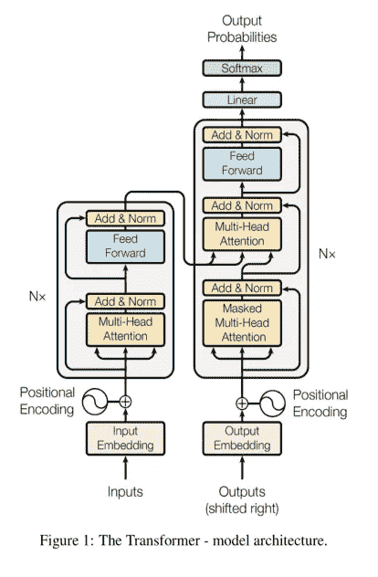

*source:* [*arXiv:1706.03762*](https://arxiv.org/abs/1706.03762)***.***

# 本文中分解变压器架构如下:

**1。编码器-解码器架构**

**2。编码器架构**

> 2.1 输入嵌入和位置编码
> 
> 2.2 自我关注机制
> 
> 2.3 多头关注机制
> 
> 2.4 前馈网络
> 
> 2.5 添加和定额组件

**3。解码器架构**

> 3.1 掩盖多头注意力
> 
> 3.2 多头关注
> 
> 3.3 前馈网络
> 
> 3.4 添加和定额组件

**4。线性和 softmax 层**

**5。将编码器-解码器组装在一起**

# 1.编码器-解码器架构:

*我们将输入的句子输入编码器。编码器使用一些注意力和网络来学习输入句子的表示。解码器接收由编码器学习的表示作为输入，并生成输出。*

*例如，如果我们正在构建一个从英语到德语的机器翻译模型。让我们假设给编码器的输入句子是“你好吗？”而解码器的输出应该是“威格特的？”。请参考下面的图 2。*

*因此，原始输入数据“你好吗”被提供给编码器，该编码器以向量捕获句子的语义，例如每个单词的 100 维向量。因此，该表示可以是(3，100)矩阵的形式，其中 3 是单词的数量，100 是每个单词向量的维数。来自编码器的向量表示被提供给解码器，解码器建立机器翻译模型，将向量表示转换成人类可读形式的输出。*

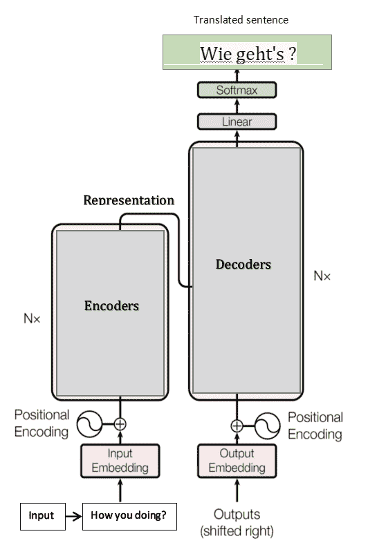

*这种机器翻译背后的过程对我们来说始终是一个黑箱。但我们现在将详细了解转换器中的编码器和解码器如何将英语句子转换为德语句子*

# 2.编码器架构:

*变压器不仅仅由一个如图 2 所示的编码器组成。它有几个编码器堆叠在一起。编码器 1 的输出作为输入发送到编码器 2，编码器 2 作为输入发送到编码器 3，依此类推，直到编码器 n 和编码器 n 返回句子“你好吗？”作为输入提供给解码器。如下图 3 所示。*

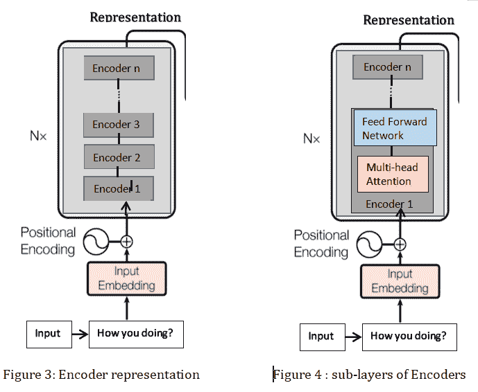

每个块由 2 个子层**多头关注**和**前馈网络**组成，如上图 4**所示。**这在每个编码器块中都是相同的，所有编码器块都有这两个子层。在深入多头注意力的第一子层之前，我们先来看看什么是自我注意力机制。

# 2.1.输入嵌入和位置编码

**输入嵌入:**

输入嵌入只是嵌入层。嵌入层获取单词序列，并学习每个单词的矢量表示。向量表示法

**位置编码:**

单词的位置和顺序决定了句子的语法和实际语义。在 RNN 的例子中，它通过一个词一个词地分析一个句子来考虑单词的顺序。位置编码块对嵌入矩阵应用一个函数，该函数允许神经网络理解每个单词向量的相对位置。

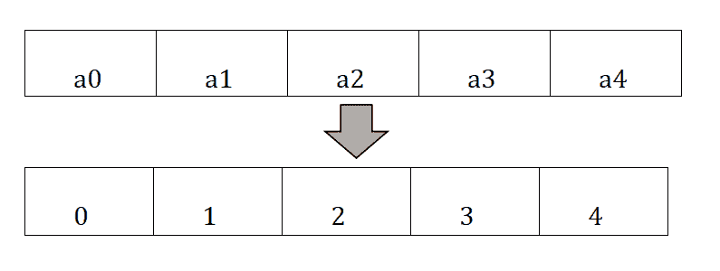

非常简单，创建了一个新的向量，每个条目都是它的索引号。这是绝对位置编码。但是有一个错误的方法，因为数字的尺度不同。如果我们有一个由 500 个记号组成的序列，我们的向量最终会是 500。一般来说，神经网络喜欢它们的权重在零附近徘徊，并且通常正负平衡。如果没有，你会让自己暴露在各种各样的问题面前，比如爆炸性的梯度和不稳定的训练。

我们借助正弦和余弦函数创建一个位置编码器:

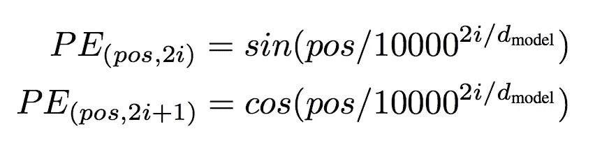

取公式中的 sin 部分。让我们假设这个句子里有 5 个单词。其中 d=5，(p0，p1，p2，p3，p4)将是每个单词的位置。保持内径不变并改变位置。我们有，

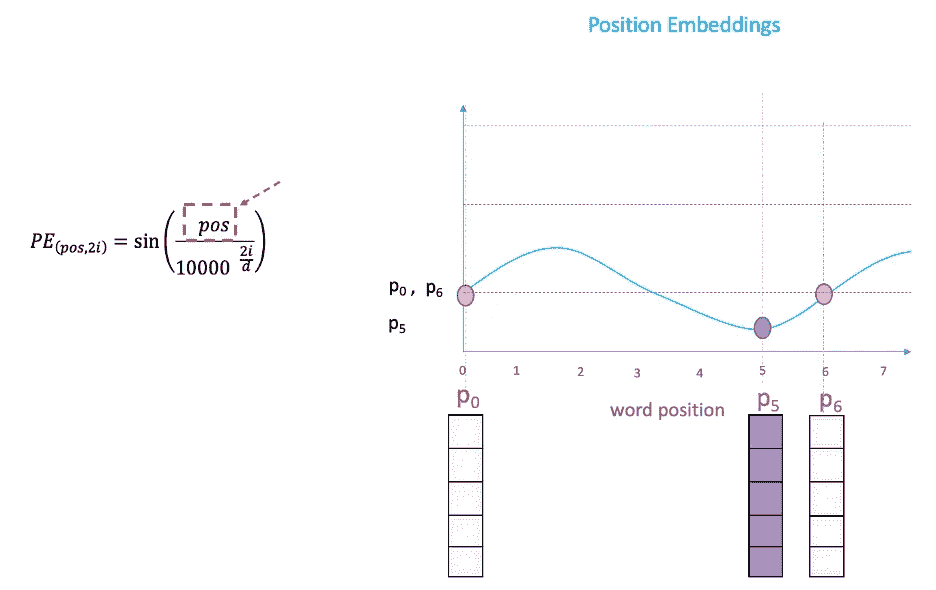

*source:* [*Visual Guide to Transformer Neural Networks — (Part 1) Position Embeddings*](https://www.youtube.com/watch?v=dichIcUZfOw)

如果我们绘制一条正弦曲线并改变“位置”(在 x 轴上)，您将在 y 轴上得到不同的位置值。因此，不同位置的词会有不同的位置嵌入值。

但是有一个问题。由于“sin”曲线在间隔中重复，您可以在上图中看到 P0 和 P6 具有相同的位置嵌入值，尽管它们位于两个非常不同的位置。这就是等式中“我”部分发挥作用的地方。

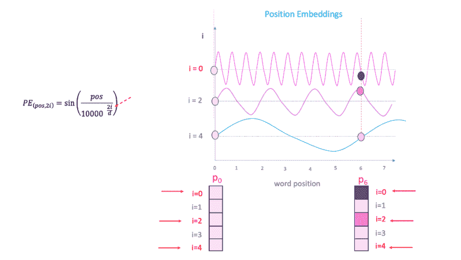

*source:* [*Visual Guide to Transformer Neural Networks — (Part 1) Position Embeddings*](https://www.youtube.com/watch?v=dichIcUZfOw)

如果你改变上面等式中的“I ”,你会得到一串不同频率的曲线。相对于不同频率的位置嵌入值的读取结果给出了 P0 和 P6 在不同嵌入维度的不同值。

# 2.2.自我注意机制

自我注意机制确保句子中的每个单词都有一些关于上下文单词的知识。例如，我们使用这些著名的句子"**动物没有穿过街道是因为它太长了**"和"**动物没有穿过街道是因为它太累了**"

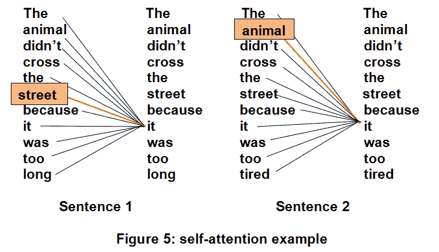

所以“它”完全取决于“长”和“累”两个字。“长”字靠“街”，“累”字靠“兽”。我们如何让模型理解它！？这就是我们使用自我关注机制的地方。自我关注机制确保每个单词都与所有单词相关。

让我们再来看看句子“你好吗”,每个单词的单词嵌入是 100 维。那么输入矩阵的维数将是 X[3，100]，其中 3 是单词的数目，100 是每个单词的维数。

自我关注机制通过使用**查询**(Q)**键**(K)**值** (V) **矩阵进行学习。**这些查询、关键字和值矩阵是通过将输入矩阵 X 乘以权重矩阵 WQ、WK、WV 而创建的。权重矩阵 WQ、WK、WV 被随机初始化，并且它们的最佳值将在训练期间被学习。

这就是我们计算查询、键和值矩阵的方式。我们将会看到 Q、K 和 V 是如何在自我注意机制中使用的。自我注意机制包括四个步骤。

**第一步:**

计算查询和关键字矩阵之间的点积。

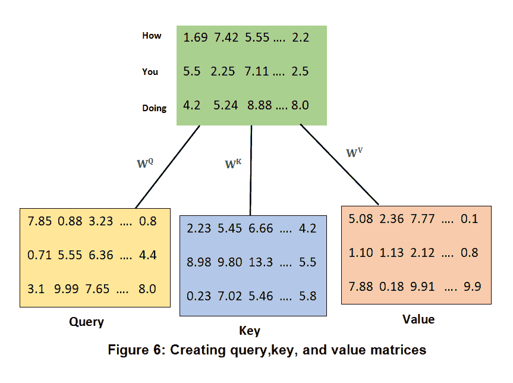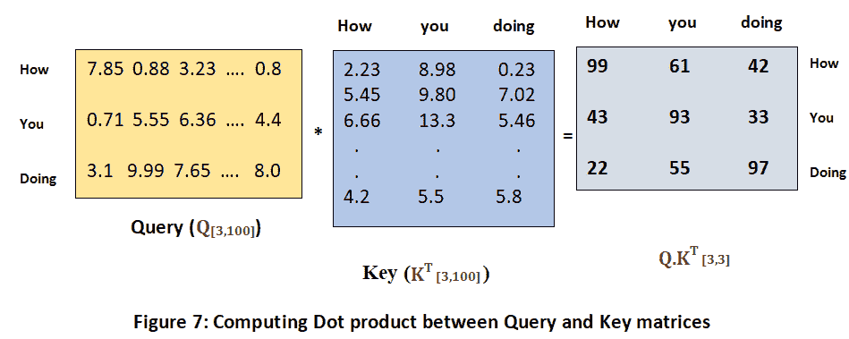

因此，我们可以说，计算查询矩阵(Q)和关键矩阵(KT)之间的点积本质上给了我们相似性得分，这有助于我们理解句子中的每个单词与所有其他单词有多相似。

**第二步:**

自我注意机制的第二步是将 Q.KT 矩阵除以关键向量维数的平方根。我们这样做是为了获得稳定的梯度。

# Q.KT / √dk

**第三步:**

我们通过应用 softmax 函数将 **Q.KT / √dk** 的非规范化形式转换为规范化形式，这有助于将分数带到 0 到 1 的范围内，并且分数之和等于 1。

# 得分矩阵= softmax(Q.KT / √dk)

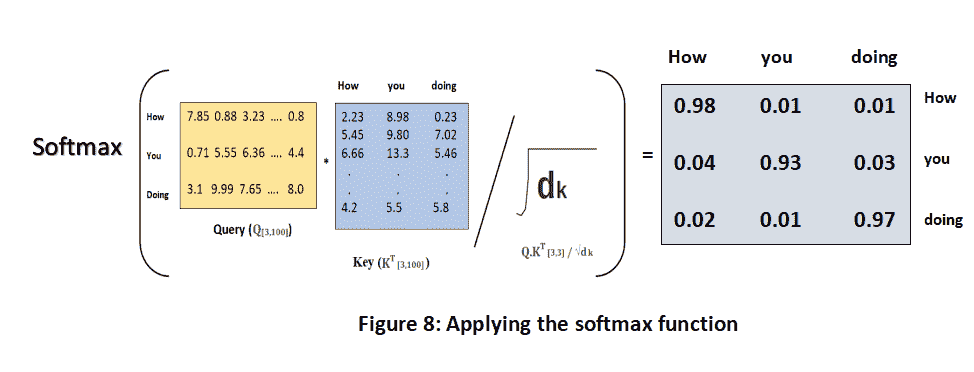

**第四步:**

我们通过将得分矩阵乘以价值矩阵来计算注意力矩阵 **z** 。

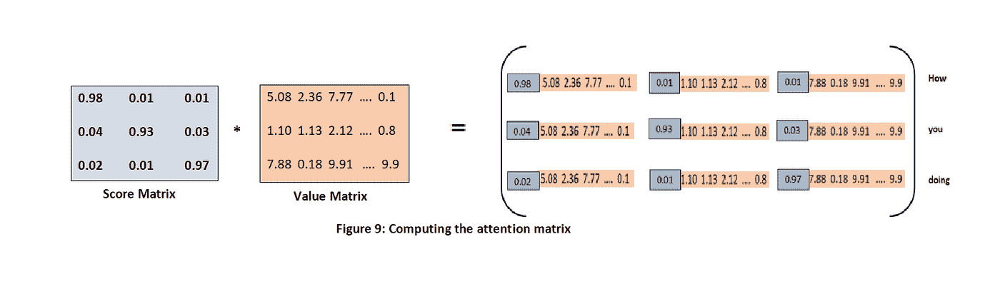

因此， **ZHow** 的值将包含来自价值向量(How)的值的 98%，来自价值向量(you)的值的 1%，来自价值向量(doing)的值的 1%。参考上面的图 9。

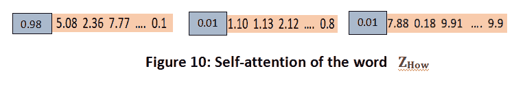

同样，在“动物因为太长而没有过马路”的例子中，可以通过上面提到的 4 个步骤计算出 **Zit** 的值。那么**青春痘**就会:

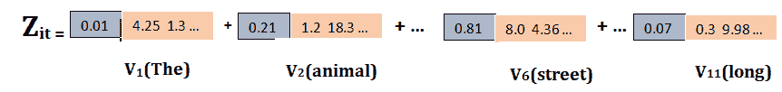

单词“它”的自我关注值包含来自值向量 V6(街道)的值的 81%。这有助于从上面的句子中看出单词“它”实际上指的是“街道”而不是“动物”。因此，我们可以通过使用自我注意机制来理解一个单词与句子中所有其他单词的关系。

# 2.3.多头注意力机制

我们将计算多个单注意力矩阵并连接它们的结果，而不是计算单注意力矩阵。因此，通过使用这种多头注意力，我们的注意力模型将更加准确。

因此，对于短语“你好吗”，我们将通过创建查询(Q1)、关键(K1)和值(V1)矩阵来计算第一个单一关注矩阵。其计算方法是将输入矩阵(X)乘以加权矩阵 WQ、WK 和 WV。那么我们的第一个注意力矩阵将是，

# Z1 = Softmax(Q1。K1T / √dk1)

然后，我们将通过将输入矩阵(X)乘以加权矩阵 WQ、WK 和 WV 来创建查询(Q2)、键(K2)和值(V2)矩阵，从而计算第二关注矩阵。那么我们的第二个注意力矩阵将会是，

# Z2 = Softmax(Q2。K12T / √dk2)

同样，我们将计算 n 个注意力矩阵(z1，z2，z3，…zn ),然后连接所有的注意力矩阵。所以我们的多头注意力矩阵是:

# 多头关注=串联(Z1，Z2，…)。Zn)*W0

其中 W0 是权重矩阵。

# 2.4.前馈网络

在前向神经网络层中，它由两个具有相关活动的密集层组成。这适用于每一个注意力向量。以便它是下一个编码器和解码器关注层可接受的形式。

# 2.5.添加和定额组件

add 和 Norm 组件基本上是层规范化之后的剩余连接。它连接子层的输入和输出。

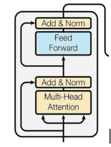

其将多头注意力子层的输入连接到其输出前馈神经网络层。然后将前馈子层的输入连接到其输出。

# 3.解码器架构

这是一个解码器单元的堆栈，每个单元将编码器的表示作为前一个解码器的输入。因此，每个解码器接收两个输入。这样，每个预测在时间步长 t 的输出。

*Source:* [*jalammar’s*](https://jalammar.github.io/visualizing-neural-machine-translation-mechanics-of-seq2seq-models-with-attention/)

来自上面的 GIF 图片来自[贾勒马的](https://jalammar.github.io/visualizing-neural-machine-translation-mechanics-of-seq2seq-models-with-attention/)博客。

解码器将输入<sos>作为第一个令牌。在时间步长 t=2，解码器接收两个输入:一个来自先前解码器预测的先前输出，另一个是预测“am”的编码器表示。在时间步长 t=3，解码器接收来自先前输出和编码器表示的输出，并预测“a”。同样，它预测直到它到达结束标记<eos>。</eos></sos>

# 3.1.掩蔽的多头注意力

对于底部解码器或第一个解码器，应给出输入。我们不是将输入直接提供给解码器，而是将其转换为输出嵌入，并添加位置编码，然后将其提供给解码器。

**X =输出嵌入+位置编码**

x 将作为第一解码器的输入。现在，我们通过将权重矩阵 **WQ、WK 和 WV** 乘以 **X** 来创建查询(Q)、键(K)和值(V)矩阵，就像我们在编码器中所做的那样。

然后我们计算**气。KiT / √dki** 等于下面给出的矩阵

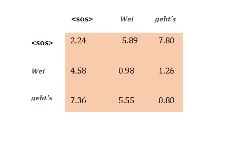

在归一化上面得到的矩阵之前。我们需要用∞来屏蔽目标单词右边的单词。以便使用句子中的前一个单词，并屏蔽其他单词。这允许转换器学习预测下一个单词。

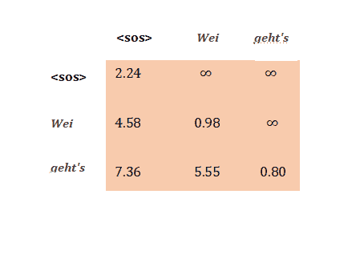

通过将 softmax 应用于屏蔽的 **Qi，该屏蔽的注意块的输出被相加并归一化。KiT / √dki** 矩阵，然后传递给另一个注意模块。

# 3.2.多头注意力

每个解码器接收两个输入:一个来自前一子层掩蔽的多头注意力，另一个是编码器表示。

让我们用 R 表示编码器表示，用 m 表示作为掩蔽多注意子层的结果而获得的注意矩阵。因为我们有编码器和解码器之间的交互，所以这一层被称为**编码器-解码器注意层**。

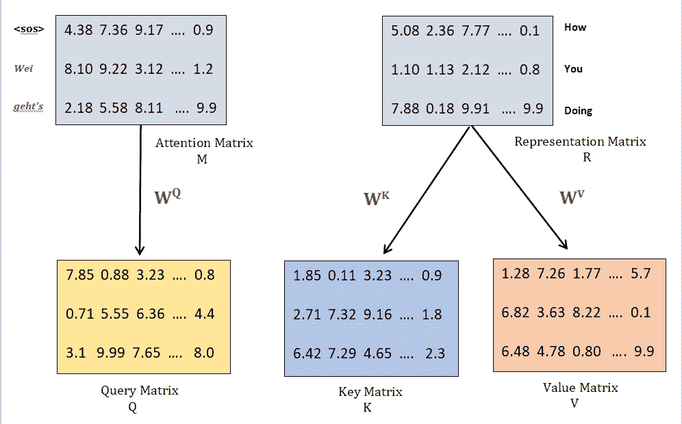

查询矩阵实质上保存了目标句子。因为它是从 M 中获得的，并且键和值矩阵保存源句子的表示。因为它是从 r 获得的。

然后，我们像在编码器中一样计算得分矩阵。但是这次我们从两个不同的矩阵中得到 Q，K 和 V 矩阵。

# Z1 = Softmax(Q1。K1T / √dk1)，Z2 = Softmax(Q2。K12T / √dk2)…

然后我们用 z1，z2，z3，…计算多头注意力。上面的 zn。

# 多头关注=串联(Z1，Z2，…)。Zn)*W0

# 3.3 前馈神经网络及加法和范数

这与编码器的工作方式相同。

# 4.线性和 Softmax 层

解码器根据问题学习目标句子/目标类别/的表示。我们将最顶层解码器的表示提供给线性和 Softmax 层。

线性层生成其大小等于词汇表大小的 logits。假设我们的词汇只有三个词“你好”。那么线性层返回的 logits 的大小将为 3。然后，我们使用 softmax 函数将对数转换为概率，解码器输出其索引具有较高概率值的单词。

# 5.将编码器和解码器组装在一起

# 参考:

1.灵感来自 Sudharsan Ravichandiran 先生的《Google Bert 入门》一书。

2.[可视化神经机器翻译](https://jalammar.github.io/visualizing-neural-machine-translation-mechanics-of-seq2seq-models-with-attention/)模型博客作者[杰伊·阿拉玛](https://jalammar.github.io/)。

3.《变形金刚》图解指南博客。

4.[位置编码](https://kazemnejad.com/blog/transformer_architecture_positional_encoding/)博客。

5. [StackExchange 线程—变压器中的位置编码](https://datascience.stackexchange.com/questions/51065/what-is-the-positional-encoding-in-the-transformer-model)。位置编码最佳解释

6. [Colah 的博客。](https://colah.github.io/posts/2015-08-Understanding-LSTMs/)