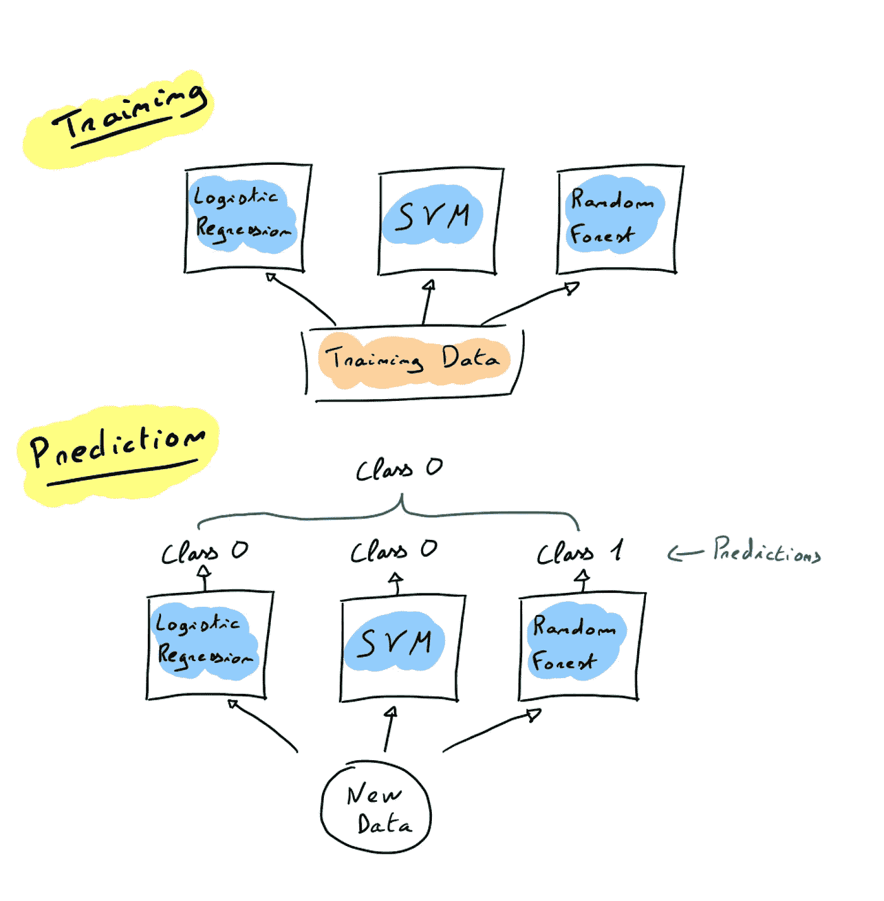
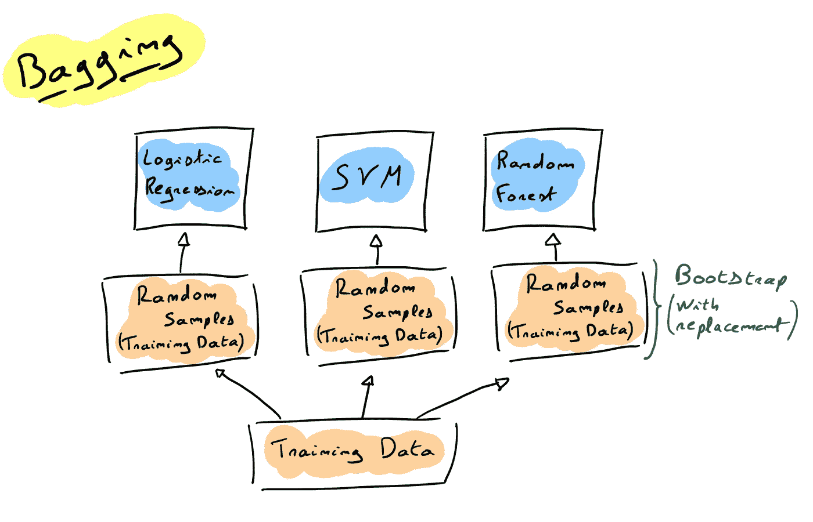
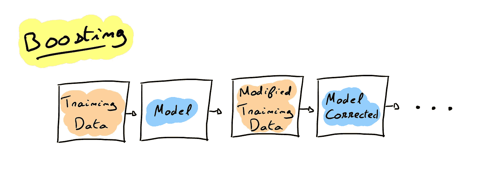
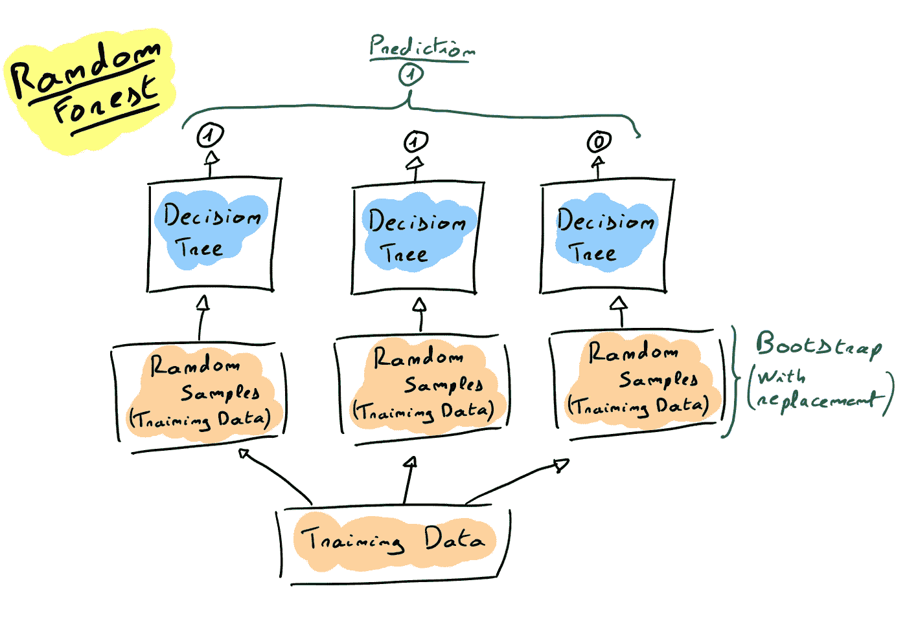
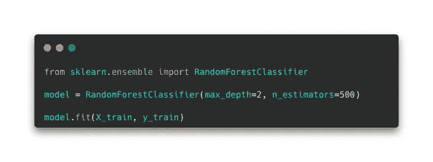
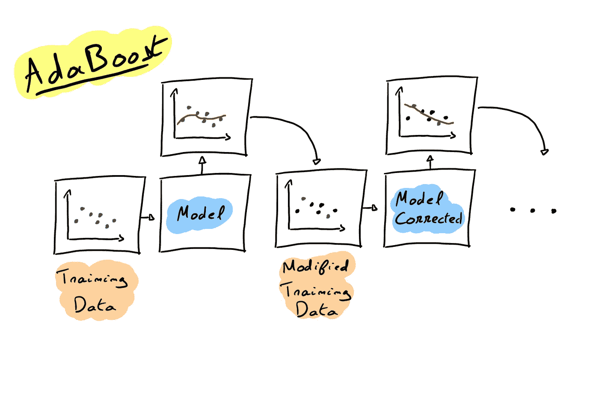
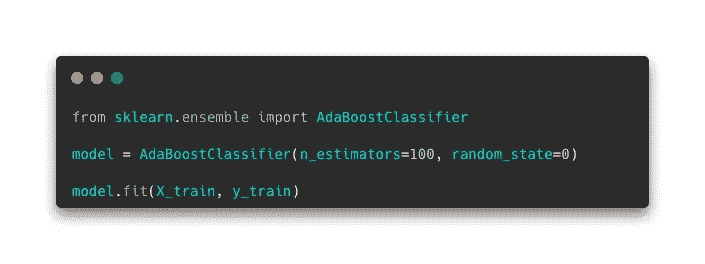
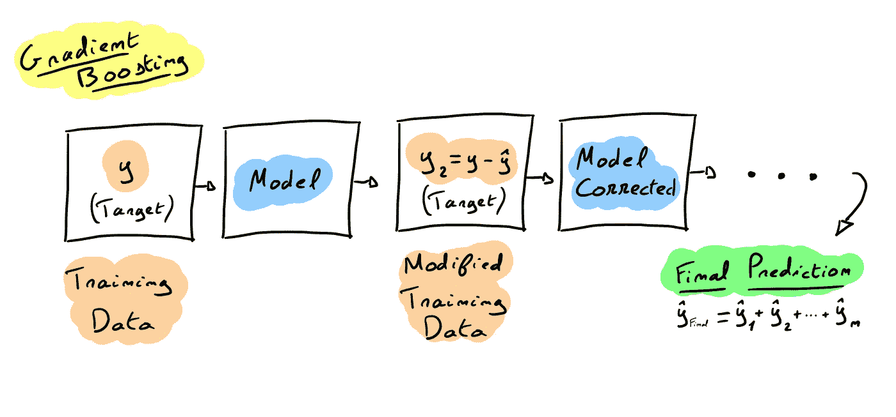
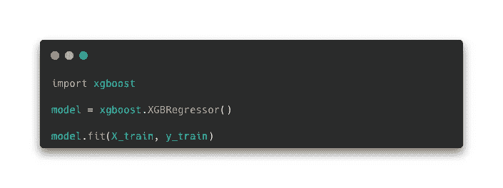

# 集成学习概述——我们团结一致

> 原文：<https://medium.com/mlearning-ai/an-overview-of-ensemble-learning-united-we-stand-11643f019e6e?source=collection_archive---------6----------------------->

在这篇文章中，我们将看看**集合** **学习**和集体智能之间的关系，背后的机器学习技术和可以实现的算法。

Photo by [Mitchell Luo](https://unsplash.com/es/@mitchel3uo?utm_source=medium&utm_medium=referral) on [Unsplash](https://unsplash.com?utm_source=medium&utm_medium=referral)

集成学习是基于 Scott Page 在他的[研究论文](https://www.jstor.org/stable/j.ctt7sp9c)中所说的。他谈到了**知识**聚合**的**重要性**并得出结论:**

> 多样性优先于能力。(斯科特·佩奇)

面对一个领域的专家和一群对这个领域有基本了解的人，会让这个群体做出比专家更好的决定和选择。这是基于**集体** **智慧**的领域，指 **群众**的**智慧** **。**

> 一群 lambda 个体能够形成相关的判断并解决复杂的问题。

一个很好的例子是世界各地的**加里**卡斯帕罗夫**卡斯帕罗夫**和**50**000玩家之间的国际象棋比赛。所有 50，000 人在同一时间一起玩，人群的每个动作都由投票决定。比赛的目的不是结果，因为卡斯帕罗夫在 4 个月后赢得了比赛，而是一群普通的棋手能够对抗有史以来最好的棋手之一。

既然我们看到了集体决策的要点和知识聚合的重要性，让我们看看机器能做些什么…

由于人类可以通过分享他们的想法来做出决定，机器也可以结合他们的学习来获得更好的结果，这被称为集成学习。

基本上，多个模型将被训练，它们的预测将被用来制作一个独特的模型，这将是更好的，因为它使用了从不同角度学习。

# 集成学习的不同技术

从多个模型中学习可以通过不同的方式完成。然而，第一个问题是关于模型本身。**集成** **学习**可以多次使用同一个模型，也可以使用基于不同机器学习算法的不同模型。

让我们看看技术…

## 投票或平均

最简单的集成学习就是选择不同模型(来自不同算法)预测的****最多的**类**。例如，如果训练 4 个模型，其中 3 个预测了正类(1)，则集成学习的整体预测将是正类(1)。****

********

****这也可以在回归问题中通过使用所有模型预测的平均值来完成。****

## ****装袋和粘贴****

******打包**和**粘贴**是集成学习技术，它们使用相同的模型(例如具有固定超参数的决策树)在数据集的**不同的******样本**上进行训练。******

> ****当模型在不同的数据上被训练时(或者在它们的模型中使用真正不同的算法)，集成方法工作得更好。
> (奥雷连恩·盖伦)****

****知道这一点后，每个模型将从样本中学习，然后所有预测将按最频繁的类别或平均值(用于回归)进行聚合。****

****与第一种技术的最大区别在于**每种模型都根据不同的数据进行训练**。这使得最终模型受结果差异的影响更小，因为聚合只会收集数据集中的共性，而不会收集数据集中的某些特定特性。****

****→ **集合的每个** **唯一** **模型**将具有比最终模型更大的****方差**(从所有其他模型的结果中聚集)。******

********

******什么区分装袋和裱糊？******

****在**Bagging**(bootstrap aggregation)“训练集中的随机数据样本被选择**并替换**——这意味着单个数据点可以被选择不止一次”( [IBM — Bagging](https://www.ibm.com/cloud/learn/bagging) )，而在**粘贴**中，数据的随机样本在被集合的一个模型选择后不会在训练数据集中被替换。因此，在粘贴中，训练集的每个观察将用于学习，而在装袋中，平均而言，仅选择数据集的 63%**来进行训练。这意味着 37%没有被任何模型看到，这些数据点被称为:**出袋实例** (OOB)。
OOB 实例因此可用于评估模型性能。******

## **助推**

**这种技术是第二常见的集成学习技术。基本上是**顺序** **模型** **训练**(一个接一个)，其中每个模型试图校正前一个模型(或者通过增加坏预测的权重作为 AdaBoost，或者通过从前一个模型预测的残差训练作为梯度增强(我们将在下一节中看到这些算法))。**

****

# **著名算法**

**现在我们知道了集成学习的不同方法，让我们用一点代码来看看一些著名的算法。**

## **随机森林**

**该算法使用一个用打包技术训练的 **决策树** **树**的**集合** **。这导致更高的偏差误差(和更低的方差)，因为每个决策树将只使用数据集的样本来为每个分裂寻找最佳特征(查看[我的文章](/mlearning-ai/decision-tree-the-simplest-algorithm-to-explain-82889d300904)关于决策树的更多信息)。****

****

**Scikit-Learn 库提供了随机森林的实现:RandomForestClassifier(用于分类)或 RandomForestRegressor(用于回归) :**

****

**(made with [Carbon](https://carbon.now.sh))**

## **adaboost 算法**

**AdaBoost 是一种使用 **Boosting** **方法**训练预测器的算法。正如我之前提到的，算法在所有例子上实现了**权重**，并增加了那些错误预测的权重。因此，每个新训练的模型将集中于**集合** **模型** **具有** **难度** **至** **预测**的**实例**。它校正欠调整的观测值，以得到更准确的最终集合模型。**

****

**Scikit-Learn 还提供了 AdaBoost 算法的实现:AdaBoostClassifier(用于分类)或 AdaBoostRegressor(用于回归) :**

****

**(made with [Carbon](https://carbon.now.sh))**

## **梯度推进**

**梯度提升是一种集成方法，通过使用先前模型预测的**残差** **误差** (y - ŷ)作为训练数据集中的新目标，依次训练每个模型。基本上，第一个模型是在数据集上训练的，第二个模型使用第一个模型预测的残差作为新的目标。因此，每个模型将试图**减少** **残留** **错误**，只需关注它(一个接一个)。最后，由集合做出的预测是来自集合中每个模型的所有****预测**的**和**(因为每个模型预测总目标的一部分)。****

********

****机器学习中最著名的算法之一是 XGBoost，它是 python 中一个优化的梯度提升实现:****

********

****(made with [Carbon](https://carbon.now.sh))****

# ****结论****

****集成学习是收集**多个** **模型**的**性能**的好方法。正如 **人群**中的**智慧** **所强调的，一个由多个个体组成的群体能够真正擅长解决问题和做出决策。这被应用在具有集成方法的机器学习中。
**套袋**(粘贴)和**助推**是主要技术，而**随机** **森林**、**阿达助推**和**坡度** **助推**是最著名的。******

**感谢你阅读这篇文章，我希望你喜欢并学到了一些关于合奏学习的东西！**

# **资源:**

 **[## 区别:多样性的力量如何创造更好的团体、公司、学校和社会…

### 在这本里程碑式的书中，斯科特·佩奇重新定义了我们理解彼此的方式。区别在于…

www.jstor.org](https://www.jstor.org/stable/j.ctt7sp9c)** ** [## 流行的集成方法:一项实证研究

### 集成由一组单独训练的分类器(如神经网络或决策树)组成，其…

arxiv.org](https://arxiv.org/abs/1106.0257)  [## 集成学习的温和介绍-机器学习掌握

### 我们在生活中做出的许多决定都是基于许多其他人的意见。这包括选择一本书来…

machinelearningmastery.com](https://machinelearningmastery.com/what-is-ensemble-learning/)  [## 使用 Scikit-Learn、Keras 和 TensorFlow 进行机器实践学习，第二版

### 通过最近的一系列突破，深度学习推动了整个机器学习领域。现在，甚至…

www.oreilly.com](https://www.oreilly.com/library/view/hands-on-machine-learning/9781492032632/)  [## 什么是装袋？

### 了解引导聚合或 bagging 如何提高机器学习模型的准确性，使您能够…

www.ibm.com](https://www.ibm.com/cloud/learn/bagging)  [## Mlearning.ai 提交建议

### 如何成为 Mlearning.ai 上的作家

medium.com](/mlearning-ai/mlearning-ai-submission-suggestions-b51e2b130bfb)**