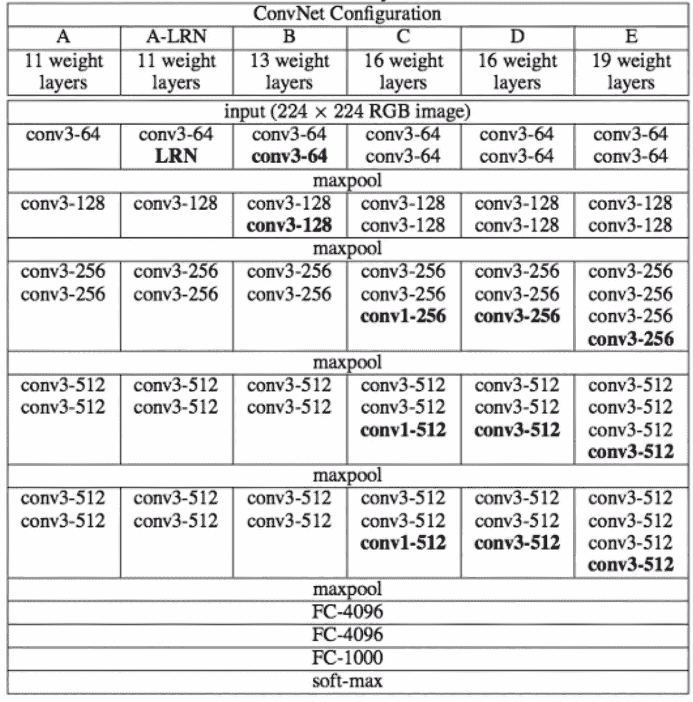
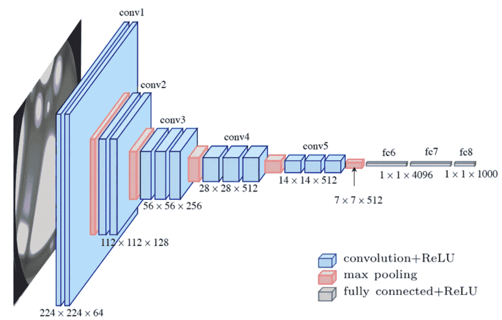
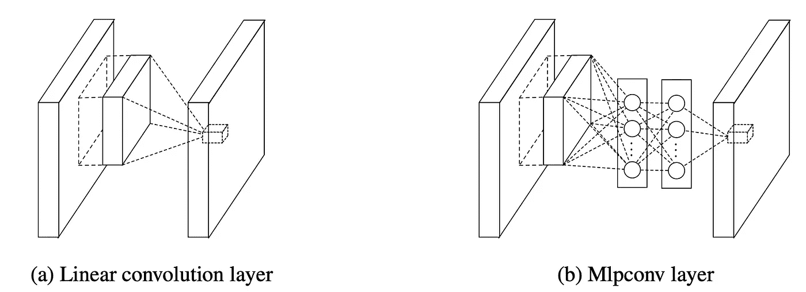
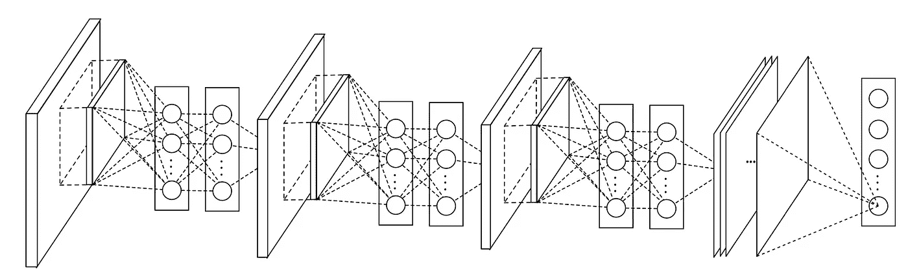
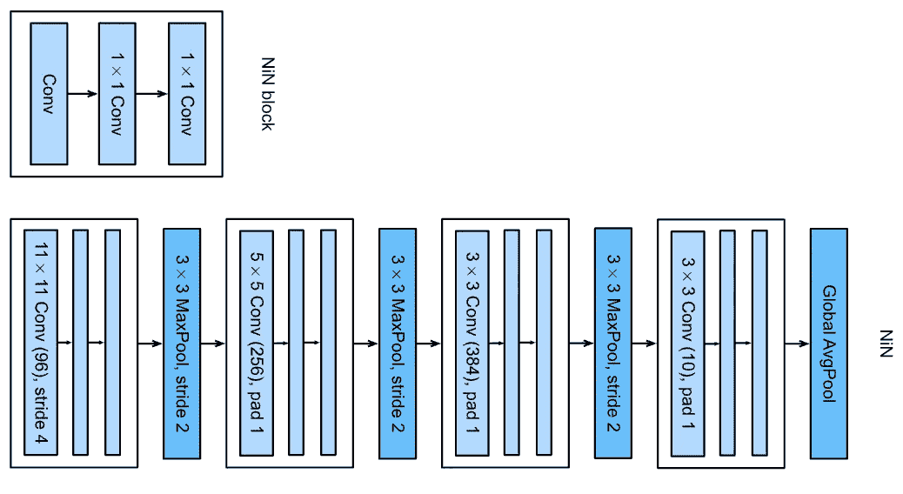

# VGG16 和 NiN 模型概述

> 原文：<https://medium.com/mlearning-ai/an-overview-of-vgg16-and-nin-models-96e4bf398484?source=collection_archive---------0----------------------->

这篇文章旨在简要介绍两个经典的卷积神经网络，VGG16 和 NiN(又名网络中的网络)。我们将发现他们的架构以及他们在 Keras 平台上的实现。可以参考我之前的一些相关主题的博客:[卷积神经网络](https://lekhuyen.medium.com/convolutional-neural-networks-3f00c165c9d9)、 [LeNet](https://lekhuyen.medium.com/lenet-and-mnist-handwritten-digit-classification-354f5646c590) 、 [Alexnet](https://lekhuyen.medium.com/alexnet-and-image-classification-8cd8511548b4) 模型。

# 一. VGG 模式

## ***1。*简介**

VGG 是一种深度卷积神经网络，由卡伦·西蒙扬和安德鲁·齐泽曼提出[1]。VGG 是他们小组名称的首字母缩写，来自牛津大学的视觉几何小组。该模型在 ILSVRC-2014 竞赛中获得第二名，实现了 92.7%的分类性能。VGG 模型使用非常小的卷积滤波器(3 × 3)来研究层的深度，以处理大规模图像。作者发布了一系列不同层长度的 VGG 模型，从 11 层到 19 层，如下表所示。



Table 1: Different configurations of VGG. [Source](https://pub.towardsai.net/the-architecture-and-implementation-of-vgg-16-b050e5a5920b)

总而言之:

*   VGG 的所有构型都是块状结构。
*   每个 VGG 块由一系列卷积层组成，其后是最大池层。相同的内核大小(3 × 3)应用于所有卷积层。此外，作者使用填充大小 1 来保持每个卷积层之后的输出大小。还应用了大小为 2 × 2、步长为 2 的最大池，以便在每个块之后将分辨率减半
*   每个 VGG 模型都有两个完全连接的隐藏层和一个完全连接的输出层。

在这篇文章中，我们只关注 VGG16 的部署、它的架构以及它在 Keras 上的实现。其他配置的构造类似。

VGG16 的结构如下图所示:



Figure 1**: The architecture of VGG16**. Source: Researchgate.net

VGG16 由 13 个卷积层、5 个最大池层和 3 个全连接层组成。因此，具有可调参数的层数是 16 (13 个卷积层和 3 个全连接层)。这就是型号名称为 VGG16 的原因。第一块中的滤波器数量是 64，然后在后面的块中这个数量加倍，直到它达到 512。该模型由两个完全连接的隐藏层和一个输出层完成。两个完全连接的层具有相同的神经元数量，即 4096。输出层由 1000 个神经元组成，对应于 Imagenet 数据集的类别数。在下一节中，我们将在 Keras 上实现这个架构。

## ***2。在 Keras*T3 上实现 VGG16**

首先，我们需要导入一些必要的库:

一旦所有必要的库都准备好了，就可以通过下面的函数来实现该模型:

现在，让我们来看看模型每一层的详细信息:

```
***vgg16_model = VGG16()******vgg16_model.summary()***Model: "sequential"
_________________________________________________________________
Layer (type)                 Output Shape              Param #   
=================================================================
conv2d (Conv2D)              (None, 224, 224, 64)      1792      
_________________________________________________________________
conv2d_1 (Conv2D)            (None, 224, 224, 64)      36928     
_________________________________________________________________
max_pooling2d (MaxPooling2D) (None, 112, 112, 64)      0         
_________________________________________________________________
conv2d_2 (Conv2D)            (None, 112, 112, 128)     73856     
_________________________________________________________________
conv2d_3 (Conv2D)            (None, 112, 112, 128)     147584    
_________________________________________________________________
max_pooling2d_1 (MaxPooling2 (None, 56, 56, 128)       0         
_________________________________________________________________
conv2d_4 (Conv2D)            (None, 56, 56, 256)       295168    
_________________________________________________________________
conv2d_5 (Conv2D)            (None, 56, 56, 256)       590080    
_________________________________________________________________
conv2d_6 (Conv2D)            (None, 56, 56, 256)       590080    
_________________________________________________________________
max_pooling2d_2 (MaxPooling2 (None, 28, 28, 256)       0         
_________________________________________________________________
conv2d_7 (Conv2D)            (None, 28, 28, 512)       1180160   
_________________________________________________________________
conv2d_8 (Conv2D)            (None, 28, 28, 512)       2359808   
_________________________________________________________________
conv2d_9 (Conv2D)            (None, 28, 28, 512)       2359808   
_________________________________________________________________
max_pooling2d_3 (MaxPooling2 (None, 14, 14, 512)       0         
_________________________________________________________________
conv2d_10 (Conv2D)           (None, 14, 14, 512)       2359808   
_________________________________________________________________
conv2d_11 (Conv2D)           (None, 14, 14, 512)       2359808   
_________________________________________________________________
conv2d_12 (Conv2D)           (None, 14, 14, 512)       2359808   
_________________________________________________________________
max_pooling2d_4 (MaxPooling2 (None, 7, 7, 512)         0         
_________________________________________________________________
flatten (Flatten)            (None, 25088)             0         
_________________________________________________________________
dense (Dense)                (None, 4096)              102764544 
_________________________________________________________________
dropout (Dropout)            (None, 4096)              0         
_________________________________________________________________
dense_1 (Dense)              (None, 4096)              16781312  
_________________________________________________________________
dropout_1 (Dropout)          (None, 4096)              0         
_________________________________________________________________
dense_2 (Dense)              (None, 1000)              4097000   
=================================================================
Total params: 138,357,544
Trainable params: 138,357,544
Non-trainable params: 0
_________________________________________________________________
```

随着过滤器的数量随着模型深度增加，因此在后面的层中参数的数量显著增加。特别地，两个全连接隐藏层中的参数数量非常大，分别有 102，764，544 和 16，781，312 个参数。它占整个模型参数的 86.4%。

大量参数可能会降低模型性能。有时，它会导致过度拟合。一个自然的问题出现了: ***有没有可能用一些东西来代替完全连接的层来降低模型的复杂度？我们将在下一节讨论的 NiN 模型是这个问题的恰当答案。***

# 二。NiN 模型

## ***1。*简介**

网络中的网络(NiN)是由、、水城范等提出的一种深度卷积神经网络[2]。这个网络的结构不同于经典的 CNN 模型:

*   经典模型使用线性卷积层，这些层之后是一个激活函数来扫描输入，而 NiN 使用**多层感知器卷积层**，其中每一层都包括一个微网络。



Figure 2: Comparison of Linear convolutional layer and Multilayer perception convolutional layer (Mlpconv layer). [Source](https://arxiv.org/abs/1312.4400)

*   经典模型在模型末端应用完全连接的层来分类对象，而 NiN 在将输出馈送到 softmax 层之前使用一个 [**全局平均池层**](https://www.machinecurve.com/index.php/2020/01/30/what-are-max-pooling-average-pooling-global-max-pooling-and-global-average-pooling/) 。与传统的全连接层相比，全局平均池层具有一些优势。首先，通过加强特征图和类别之间的对应，它更适合于卷积结构。其次，在全局平均池层中没有要优化的参数，因此有助于避免过拟合现象。最后，使用全局平均池图层对输入的空间转换更具鲁棒性，因为它汇总了空间信息。



Figure 3: The overall structure of NiN: three MLP convolutional layers and one global average pooling layer. [Source](https://arxiv.org/pdf/1312.4400.pdf)

## **2。在 Keras 上实现 NiN**

最初的 NiN 网络由四个 NiN 块组成。每个块包括三个卷积层:

*   第一层使用的是形状属于{11 × 11，5 × 5，3 × 3}的滤波窗口。
*   后两层是 1 × 1 卷积层。

每个 NiN 块后面是一个最大池层，池大小为 3 × 3，跨度为 2。除了最后一个块后面是全局平均池层。



Figure 4: The architecture of the NiN model. [Source](https://d2l.ai/_images/nin.svg)

这个模型很容易通过下面的函数实现:

让我们考虑模型每一层的详细信息(即输出大小和参数数量):

```
***NiN_model = NiN()
NiN_model.summary()***Model: "sequential_1"
_________________________________________________________________
Layer (type)                 Output Shape              Param #   
=================================================================
conv2d_13 (Conv2D)           (None, 54, 54, 96)        34944     
_________________________________________________________________
conv2d_14 (Conv2D)           (None, 54, 54, 96)        9312      
_________________________________________________________________
conv2d_15 (Conv2D)           (None, 54, 54, 96)        9312      
_________________________________________________________________
max_pooling2d_5 (MaxPooling2 (None, 26, 26, 96)        0         
_________________________________________________________________
conv2d_16 (Conv2D)           (None, 22, 22, 256)       614656    
_________________________________________________________________
conv2d_17 (Conv2D)           (None, 22, 22, 256)       65792     
_________________________________________________________________
conv2d_18 (Conv2D)           (None, 22, 22, 256)       65792     
_________________________________________________________________
max_pooling2d_6 (MaxPooling2 (None, 10, 10, 256)       0         
_________________________________________________________________
conv2d_19 (Conv2D)           (None, 8, 8, 384)         885120    
_________________________________________________________________
conv2d_20 (Conv2D)           (None, 8, 8, 384)         147840    
_________________________________________________________________
conv2d_21 (Conv2D)           (None, 8, 8, 384)         147840    
_________________________________________________________________
max_pooling2d_7 (MaxPooling2 (None, 3, 3, 384)         0         
_________________________________________________________________
dropout_2 (Dropout)          (None, 3, 3, 384)         0         
_________________________________________________________________
conv2d_22 (Conv2D)           (None, 1, 1, 10)          34570     
_________________________________________________________________
conv2d_23 (Conv2D)           (None, 1, 1, 10)          110       
_________________________________________________________________
conv2d_24 (Conv2D)           (None, 1, 1, 10)          110       
_________________________________________________________________
global_average_pooling2d (Gl (None, 10)                0         
_________________________________________________________________
dense_3 (Dense)              (None, 1000)              11000     
=================================================================
Total params: 2,026,398
Trainable params: 2,026,398
Non-trainable params: 0
_________________________________________________________________
```

请注意，全局平均池层没有参数。因此，使用这一层而不是完全连接的层有助于显著降低模型的复杂性。该模型的参数数量比 VGG 模型的参数数量少得多。

**结论:**我们发现了 VGG 和 NiN 模型的架构。VGG 模型的构造与之前的模型类似， [LeNet](https://lekhuyen.medium.com/lenet-and-mnist-handwritten-digit-classification-354f5646c590) 和 [Alexnet](https://lekhuyen.medium.com/alexnet-and-image-classification-8cd8511548b4) 。它们都由卷积层、汇集层和全连接层组成。VGG 的合理深度扩展使它优于以前的。然而，全连接层中的参数数量太大，尤其是在大规模图像处理的情况下。NiN 通过用全局平均池层替换这些层来克服这个缺点。这一层有一些优点，它更自然地加强了特征映射和类别之间的对应关系。除此之外，这一层没有任何参数需要优化。因此，使用该层有助于在训练模型时避免过度拟合。NiN 模型的出现也是我们将在 ne xt 帖子中讨论的后来现代 CNN 模型的构建的灵感。

希望这篇帖子对你有帮助！不要犹豫，关注我的[中博客](https://lekhuyen.medium.com/)接收相关话题。

感谢阅读！

***Github 代码:***[https://Github . com/khu yenle-maths/An _ overview _ of _ VGG _ 和 _ NiN _ models/blob/main/An _ overview _ of _ vgg 16 _ 和 _NiN_models.ipynb](https://github.com/KhuyenLE-maths/An_overview_of_VGG_and_NiN_models/blob/main/An_overview_of_VGG16_and_NiN_models.ipynb)

***我的博客页面:***[https://lekhuyen.medium.com/](https://lekhuyen.medium.com/)

______________________________________________________

**参考文献:**

[1]西蒙扬，卡伦，和安德鲁齐塞曼。“用于大规模图像识别的非常深的卷积网络。” *arXiv 预印本 arXiv:1409.1556* (2014)。

[2]林，闵，，严水成.“网络中的网络。” *arXiv 预印本 arXiv:1312.4400* (2013)。