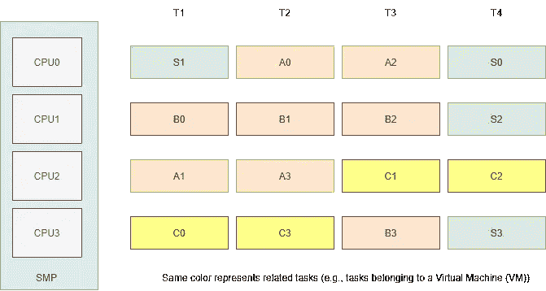
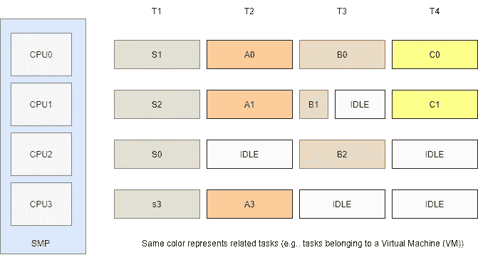
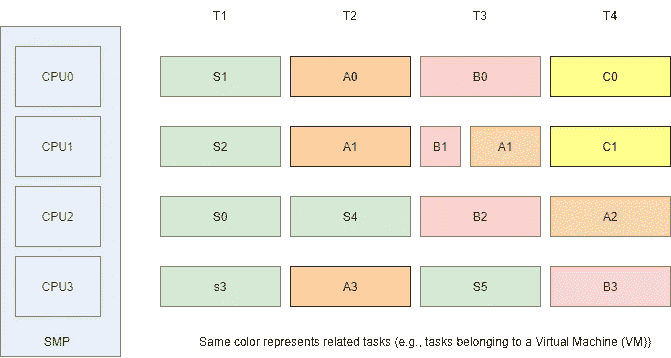
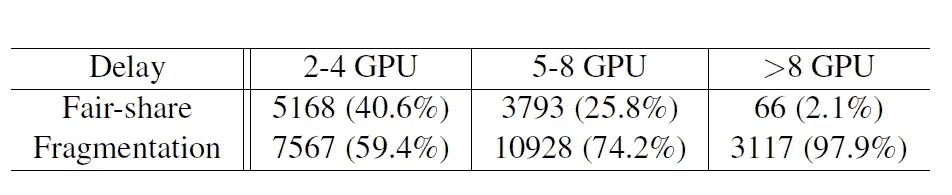
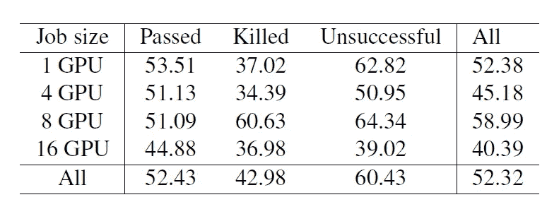
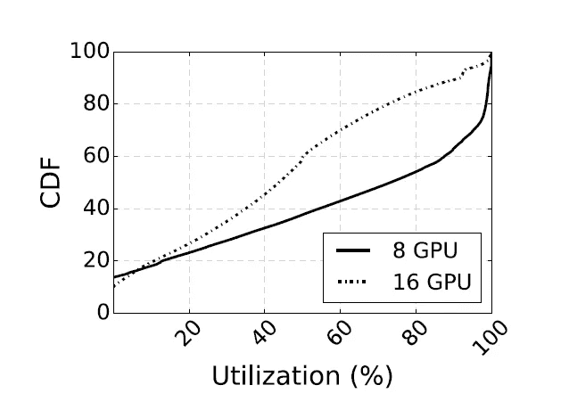
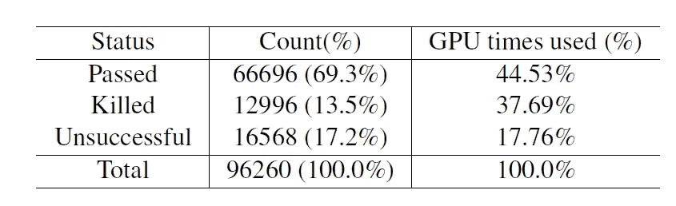
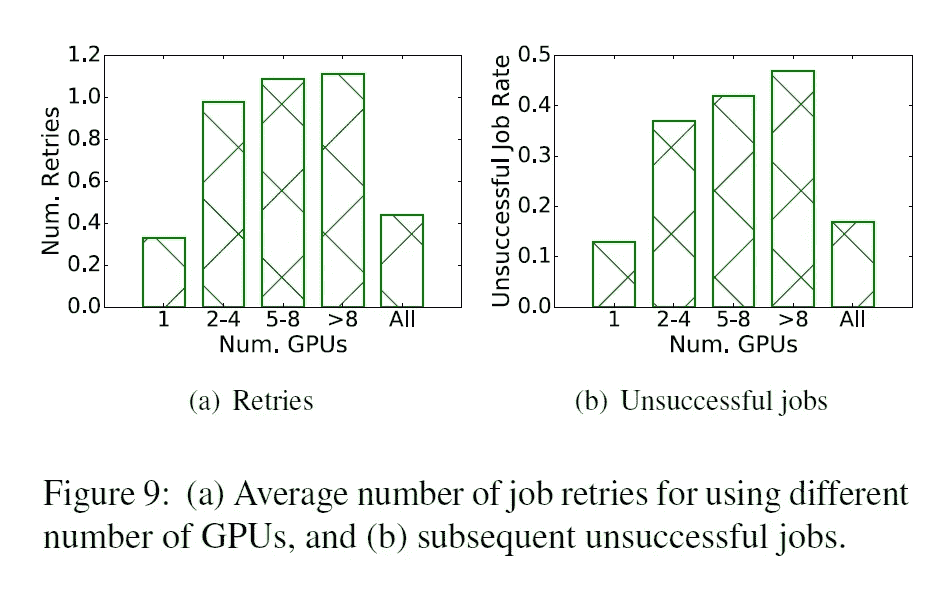
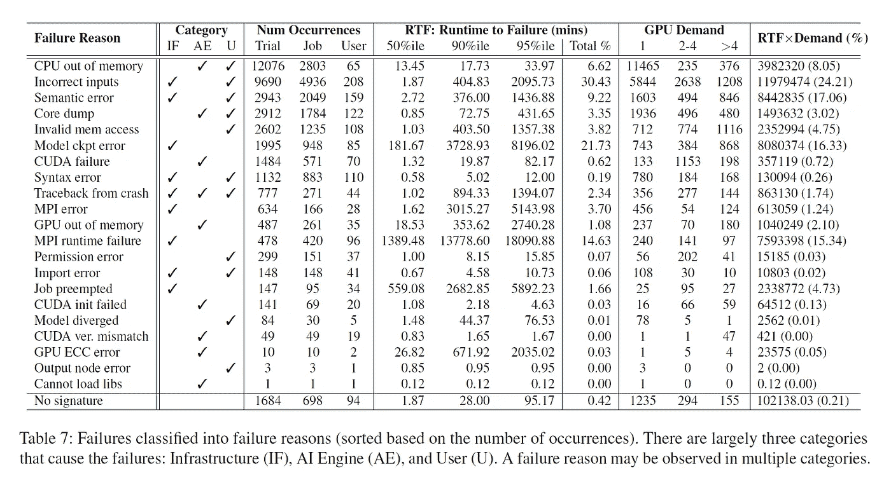

# 《面向 DNN 培训工作负载的大规模多租户 GPU 集群分析》摘要

> 原文：<https://medium.com/mlearning-ai/analysis-of-large-scale-multi-tenant-gpu-clusters-for-dnn-training-workloads-88bb2bec0c01?source=collection_archive---------2----------------------->

# 介绍

机器学习( **ML** )的广泛采用，尤其是深度学习在广泛应用中的广泛采用，要求促进其模型的训练。为此，企业由来自不同制作团队的用户共享大型图形处理单元集群(**GPU**)。使用共享集群提供了**更高的资源利用率**和**更少的开发开销**。深度学习工作负载对集群管理系统的几个新挑战。这些工作负载是浮点( **FP** )计算密集型的，需要 GPU 加速。但是，GPU 缺乏细粒度共享[ **3** ]，软件机制开销很大[ **4，5** ]。此外，大型数据集上的训练需要使用几个 GPU，ML 框架通常需要同时调度每个 GPU 上的任务，就像 **Gang Scheduling** 机制中发生的那样。这增加了共享集群中资源碎片和低利用率的风险。像上一个一样，多 GPU 训练也意味着跨 GPU 的模型参数的同步，因此在调度时实现更好的局部性是很重要的，以允许使用更快的互连进行机器内和机器间的通信。Myeongjae Jeon 等人在[ **1** 中提到，还没有对用于训练机器学习模型的多租户 GPU 集群进行系统研究，他们使用**微软 Philly** (微软的一种服务，用于训练机器学习模型，为集群上运行的作业执行资源调度和集群管理)进行了为期**两个月**的广泛研究，使用了由**运行的大约 **100，000 个作业**使用来自上述系统的数据，作者呈现了详细的工作负载特征，并研究了诸如**组调度**、**位置要求、**和**故障**等因素如何影响集群利用率。然后，他们研究了位置感知调度如何影响性能和利用率的两个主要方面。首先，他们强调放松位置限制可以减少排队延迟。其次，他们研究了位置感知调度如何影响分布式训练作业的 GPU 利用率。他们发现了导致 GPU 利用率低的两个原因:(1)各个作业在服务器之间的分布，忽略了位置约束，增加了同步开销；(2)不同作业在同一台服务器上的打包会导致因争用共享资源而产生的干扰。他们通过研究工作失败的原因来完成论文，并详细描述了他们集群中失败的原因。最后，根据他们从研究中获得的经验，他们提供了三个准则来改进下一代 DNN 工作负载集群调度程序。这些指导方针可以在本文下面的章节中找到。**

# 背景

## 调度的一般思想

调度器是决定选择和运行哪个任务的组件(硬件或软件)。从操作系统(OS)的角度来看，它是一个决定选择和运行哪个任务的软件组件。下图显示了调度程序如何选择不同的任务在 CPU 上执行。请注意，每个 CPU 遵循其挑选任务的顺序，任务放置和迁移(从一个 CPU 到另一个 CPU)取决于 CPU 的负载。更重要的是，接任务没有考虑任务的相互依赖性。

[A Scheduler Selecting Tasks for Execution](https://www.youtube.com/watch?v=4SdzmT9gfQI) (**SMP** stands for **S**ymmetric **M**ulti-**P**rocessor)

## 团伙调度

成组调度是一种在不同的 CPU 上同时调度一组相关/相互依赖的任务的方法。下图显示了这种调度方法的严格模式的示例。

[Gang Scheduling Method](https://www.youtube.com/watch?v=4SdzmT9gfQI)

下图是一个宽松版本的团队调度方法的示例。

Relaxed Version of Gang Scheduling

群组调度方法的使用案例是高性能计算(HPC)工作负载和虚拟化。HPC 使用联合调度方法来提高协作任务的并行作业性能。可以在[连接机 CM-5](https://www.youtube.com/watch?v=blvC0DA96dI) 超级计算机和风暴资源管理框架[ **2** 中找到。

# 系统概况

本节介绍工作负载、集群的硬件特征、作业的生命周期以及收集数据的管道。

## 工作量

费城支持执行**监督的 ML** 的工作负载。该系统支持使用任何机器学习框架编写的作业，如 Tensorflow、CNTK、Caffe 和 PyTorch。Jobs 基于最近提出的学习架构，如卷积神经网络(CNN)、LSTMs 和 RNNs。工作负载依赖于迭代优化方法，如**随机梯度下降(SGD)** 。为了在更大的数据集上扩展训练，几个作业在机器上使用**分布式训练**。在这个培训中，每个工人将模型的完整副本加载到其内存中。然后，在每次迭代中，每个工人使用输入数据的子集执行**训练，并且**在迭代结束时，所有工人交换梯度以同步模型更新**。使用参数服务器[ **6** ]或高性能库(如 MPI、NCCL 等)进行同步。**

## 集群架构

集群中的服务器和 GPU 之间存在高速网络连接。这是为了加速分布式培训，在分布式培训中，工作人员需要为每次迭代及时交换模型更新。GPU 之间的通信有一个网络链接层次。同一机架内的机器通过 100 Gbps[RDMA](https://bit.ly/3bUQIkc)([InfiniBand](https://en.wikipedia.org/wiki/InfiniBand))网络([一种允许网络中的计算机在不涉及处理器](https://bit.ly/3bUQIkc)的情况下交换主内存中的数据的技术)连接，而跨机架的流量则通过以太网传输。为了提高通信性能，分布式培训工作中的工作人员必须在同一台机器上协同工作，或者最好通过高速网络(比如 InfiniBand)进行通信。**因此,[1]使用的框架同时考虑了 GPU 和网络连接的调度**。

## **作业调度和执行工作流程**

下图显示了费城深度学习工作的生命周期以及它所经历的不同执行阶段。

The Lifecycle of Deep Learning Jobs in Philly

1.  **接收任务和排队**

用户指定所需的 GPU 数量，为了便于主机资源分配，CPU 内核和内存容量的分配与请求的 GPU 数量成比例。为了支持多个生产组，为每个生产组构建了一个虚拟集群，它在 Apache YARN 中有一个单独的分配队列。为了管理这些队列，使用了**公平调度器**。

对于分布式训练，深度学习框架要求所有 GPU 同时可用。因此，调度程序需要在执行联合调度的同时具有位置意识，比如将作业的 GPU 打包到最少数量的服务器上，并且在 RDMA 域内。尊重局部性通过减少参数同步所需的时间来改进训练时间。为了促进位置感知 GPU 调度，我们的作业调度程序跟踪集群中所有空闲的 GPU，并对相应的机架和服务器进行排序。

2.**工作安置和利用**

当调度程序试图最大化分布式作业的局部性时，同时试图通过将较小的作业打包到较少的服务器中来避免资源碎片。然而，在同一台服务器上打包不同的作业可能会导致 GPU 利用率降低，因为会干扰共享的系统资源，如 PCIe 总线。作者也对此进行了研究。

3.**培训进度及完成情况**

作业以三种状态完成:通过(~成功完成)、终止(~被用户终止)或不成功。系统中失败的作业被退役固定的次数。这对于克服非确定性故障非常有用，如果作业在重试后仍未成功，则它会被标记为不成功。

# 观察结果

## 位置意识的影响

调度程序牺牲了局部性以获得更短的等待时间。调度器做出的放置选择以两种方式影响 DNN 训练的效率:排队延迟(在作业执行之前)和正在使用的 GPU 的硬件利用率(在作业执行之后)。排队延迟的发生有两个原因:**公平性**，当虚拟集群使用其资源时会发生，资源**碎片化**，这是因为资源碎片化使得很难找到足够多的具有高局部性的 GPU。下表显示了排队延迟的频率。**结果显示大部分延迟是因为资源碎片**！**不过，同时也要考虑重新考虑两人的调度！**

[**1**]

**这项研究的观点是，公平共享延迟很容易通过*抢占*来减少，但是由于网络的架构，碎片延迟在该系统中很难克服！**

此外，作者尝试无序调度，他们没有观察到重要的改进。这一部分是他们对从这项研究中学到的东西的总结。他们说，他们了解了为什么应该放松本地加班，以减少分布式培训的排队延迟。此外，除了公平共享排队延迟，对**群组调度**和**位置**的需求为机器学习作业引入了碎片延迟。

## GPU 利用率

注意[ **1** 的使用报告是粗粒度的。它的纹路是 SM。它没有显示正在使用 SMs 的哪一部分。

下图显示了不同作业规模的 GPU 利用率。

[**1**]

此外，分布会对 GPU 利用率产生负面影响，如下图所示。

[**1**]

洞察力:给定一个分布式训练设置，对共享资源(如 RDMA 和 PCIe)的争夺进一步降低了 GPU 的利用效率。

在许多共享服务器上分配作业会进一步降低 GPU 的利用率。利用率的降低不仅是由于网络开销，也是由于来自不相关但位于同一位置的作业的**干扰**。

## 培训进度和完成情况

该研究表明，很大一部分作业要么未成功终止，要么被用户终止。它们约占 GPU 总时间的 55%。下表显示了研究结果。

[**1**]

虽然作者没有提供来自用户调查的数据，但该论文提到，当损失变化在连续时期内小于特定阈值时，机器学习实践者可以提前终止作业，以节省大量 GPU 时间。

在开始了解失败之前，作者强调了在他们的集群调度器中，一个任务在失败后被**重试**。如果作业重复失败，它将被标记为不成功，因为进一步的重试将不再有效。下图显示了故障是如何发生的。

[**1**]

作者根据故障的来源将故障分为三类:

1.  **基础设施故障(如果)**包括纱线、HDFS 和其他框架
2.  **AI 引擎(AE)** 包括 TensorFlow、Torch 等平台
3.  **用户(U)** 包括程序员
4.  [ **1** 中的下表给出了故障分析。

[**1**]

分析表明:

1.  **同一作业/用户重复出现故障**。例如，一名工程师发布了几个培训任务，所有这些任务都遇到了相同的内存不足问题。
2.  **用户或程序员错误导致大量故障**。
3.  故障前运行时间(RTF)显示出高度可变性，主要是短 RTF。用户驱动的故障具有较短的 rtf。**注意，这些故障中的大多数是确定性的，并且在运行时开始执行程序时被捕获**。由于数据不一致而导致的故障。
4.  **基础设施故障不常发生，但故障前运行时间(RTF)要长得多**。
5.  有编程语义错误的大型作业在执行后往往会失败。

# 根据从研究中获得的经验教训提供了三项指导方针

1.  **优先考虑局部性**:因为缺少局部性会影响利用率和作业运行时间， ***因为 DNN 培训作业需要很长时间来运行*** ，**调度器应该用排队延迟来换取遵守局部性约束**。*另一种策略是，如果资源在执行过程中变得可用，则将作业迁移到位置更好的机器上*。
2.  **减轻干扰:共享一台服务器的不同工作可能会相互干扰，并对他们的培训时间产生不利影响**。调度器应该旨在隔离专用服务器上的作业，同时实现碎片整理的迁移等技术，以支持需要更多 GPU 的作业的位置约束。
3.  **改进故障处理**:研究表明，大多数故障是由用户在代码和配置中的错误造成的。使用简单的语法检查可以防止许多错误。此外，一些更复杂的运行时故障可以通过运行第一次迭代训练来捕获。一个可能的解决方案是为预运行作业设置一个虚拟机池。即使运行多 GPU 也可以在大型集群上运行这些错误之前捕捉到它们，从而防止在这些集群上浪费 GPU 周期。正如前面在故障研究中提到的，训练错误是由错误的数据格式引起的。让**为 ML** 中使用的数据集定义良好的模式，并在访问数据时进行模式检查，将会减少这样的错误。制作 GPU 集群调度程序的另一个想法是设计一个系统来检测和防止某些失败的任务重试。

# 结论

随着机器学习变得无处不在，由于当前的低效率，资源管理变得更加重要。Jeon Myeongjae 等人在[ **1** ]中通过分析运行在大型多租户 GPU 集群上的深度学习作业的轨迹，研究了影响利用率的不同因素。此外，他们对各种故障进行了详细分析，并展示了来自堆栈不同层的错误是如何导致故障的。最后，基于他们的数据分析和经验，他们提出了可以帮助机器学习调度器未来研究和开发的指导方针。最重要的是，他们的踪迹可以在 [GitHub](https://github.com/msr-fiddle/philly-traces) 上找到。

# 未来阅读

亚历山德罗斯·科利乌西斯、皮伊卡·瓦查拉皮查特、马蒂亚斯·魏德利希、罗迈、保罗·科斯塔和彼得·皮兹乌奇。" **Crossbow:在多 GPU 服务器上用小批量扩展深度学习."过程。 **VLDB** ( **2019** )，1399–1412。**

# 参考

【**1**】Jeon，Myeongjae 等人《**DNN 训练工作负载的大规模多租户 GPU 集群分析，**》(**2019**)。

[**2**Frachtenberg，Eitan & Petrini，Fabrizio & Fernández，Juan & Pakin，Scott & Coll，Salvador。"**风暴:快如闪电的资源管理。**第 46—46 页。10.1109/sc . 2002.10057(**2002**)。

**3** 顾、&刘、桓&周、&王、辛。" **DeepProf:通过挖掘 GPU 执行模式对深度学习应用进行性能分析。**”(**2017**)

[**4**m . Rhu，N. Gimelshein，J. Clemons，A. Zulfiqar，S. W. Keckler， **vDNN:虚拟化深度神经网络，用于可扩展、内存高效的神经网络设计**，*第 49 届 IEEE/ACM 微体系结构国际研讨会(***)*， **2016)** ，第页*

*余、和克里斯托夫·j·罗斯巴赫。"**重新考虑 GPU 的完全虚拟化。** " ( **2017** )。*

*【 **6** 李牧，大卫·g·安德森等】**用参数服务器缩放分布式机器学习。**《第 11 届 USENIX 操作系统设计与实现会议论文集》(OSDI'14)。美国 USENIX 协会，583–598(**2014**)。*

* [## Mlearning.ai 提交建议

### 如何成为 Mlearning.ai 上的作家

medium.com](/mlearning-ai/mlearning-ai-submission-suggestions-b51e2b130bfb)*