# R 中重复计数数据的分析

> 原文：<https://medium.com/mlearning-ai/analysis-of-repeated-count-data-in-r-the-poisson-quasi-poisson-negative-binomial-e62aff528309?source=collection_archive---------0----------------------->

## 泊松、拟泊松和负二项分布

众所周知，计数数据很难建模。它们不仅与你们大多数人熟悉的正态分布有很大的不同，而且也很难用最常与之相关的分布——泊松分布(T1)来描述。为了使它更具挑战性，我在混合中添加了重复的数据，这意味着我们现在必须处理在测量中很好相关的整数。

所使用的数据集包含对猪腹泻的重复测量。腹泻在 4 点主观顺序量表上测量——0，1，2，3。

在这一部分，我将展示如何使用泊松、[准泊松](https://en.wikipedia.org/wiki/Poisson_regression)(不是真正的分布)和[负二项分布](https://en.wikipedia.org/wiki/Negative_binomial_distribution)来分析计数数据。下一部分将强调[二项式](https://en.wikipedia.org/wiki/Binomial_distribution)和 [Beta](https://en.wikipedia.org/wiki/Beta_distribution) 分布的使用。你心里应该已经有了危险信号，因为一个既可以作为计数又可以作为比例进行分析的指标意味着我们将会有不同的估计和不同的标准误差。只是通过发行的选择。

由于我将跨时间和按时间建模，这篇文章将展示[广义线性模型](https://en.wikipedia.org/wiki/Generalized_linear_model) (GLM)以及[广义线性混合模型](https://en.wikipedia.org/wiki/Generalized_linear_mixed_model#:~:text=In%20statistics%2C%20a%20generalized%20linear,models%20to%20non%2Dnormal%20data.) (GLMM)的应用。区别在于，后一套模型可以包括随机效应的协方差矩阵，以及模型的误差部分。

我在这里使用的代码和例子已经超过 4 年了，但是它们仍然适用。然而，它们只是一个建模者——我——的工作，所以不要把它们和事实混淆，可以随意改进它们。我相信会有很多机会。

尽情享受吧！

Quite a lot of libraries were used here. The last two lines complement the parallel package and help you specify the number of cores you will allow to run in parallel.

下面的代码是我故意放进去的。当然，我可以从一个干净的数据集开始，但事实是我确实收到了一个干净的数据集。然而，这是一个宽列重数据集。此外，需要很快做出选择。我是允许腹泻被归类为(1，2，3)还是用(2，3)。也许我应该使用(3)并将其余的(0，1，2)标记为无腹泻。这些选择应该由科学而不是统计数据来决定模型的进一步发展方向和结果。

Lots of data-wrangling.

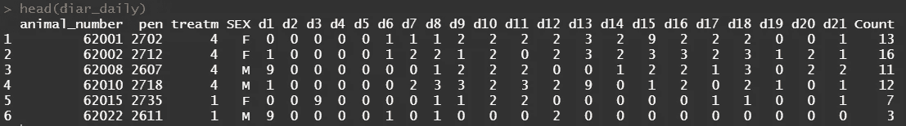

Data in wide format with a count at the end. The value in this column depends on how you classify diarrhea. Here, we used (1,2,3).

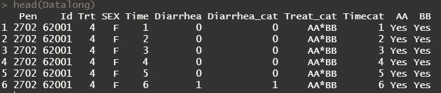

The data in long format.

Simple code to take a look, for each animal (id), when they did or did not have diarrhea.

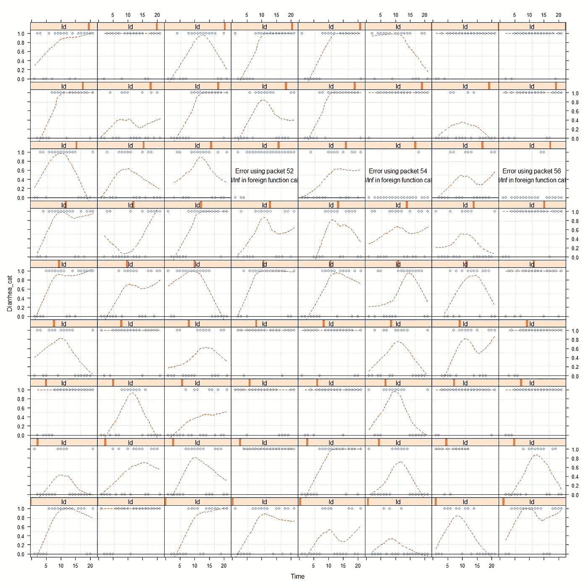

What I am looking for is sufficient events to model. This means I need to have points at the ceiling of each cell. The red spline may hint at variation across id’s but not to much weight should be attributed to it. Especially on binary data, which this plot highlights. Image by author.

Once again, heavy wrangling to get the data ready in a format that I can use for Poisson modelling.

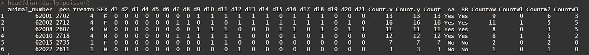

The count columns you should be most interested in. The first ones (which are all the same actually) highlight the total count when diarrhea is specified as (1,2,3). The last four — all weeks, week1, week2, week3 — classified diarrhea as (2,3). The choice was science driven.

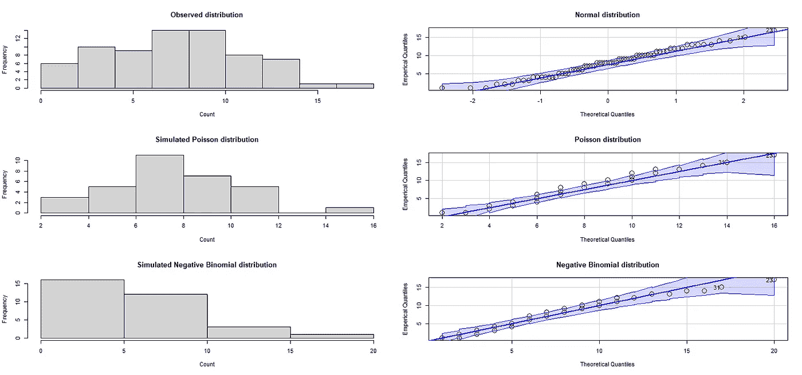

In this plot, you can already see me trying out different distributions and how they will fit. An early hint that the Negative Binomial might do well. Image by author.

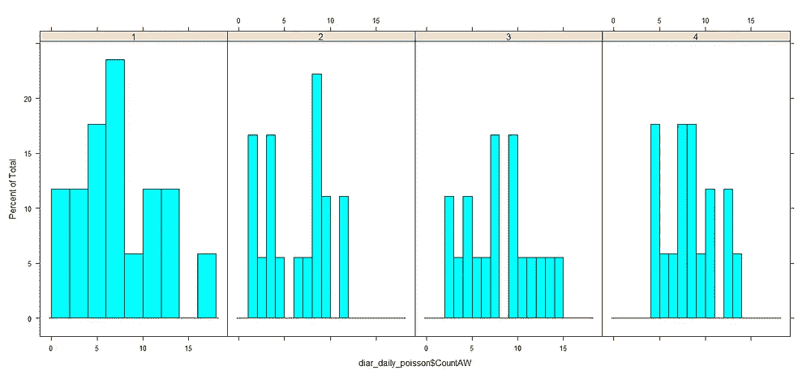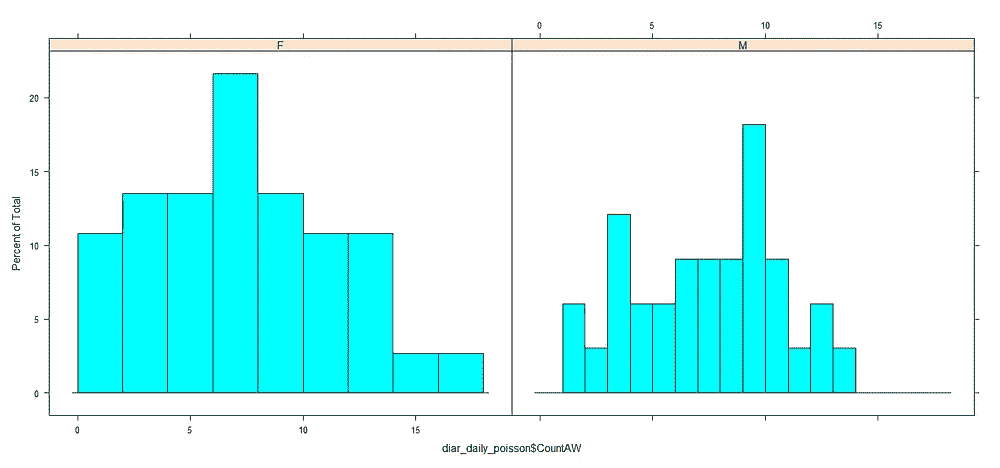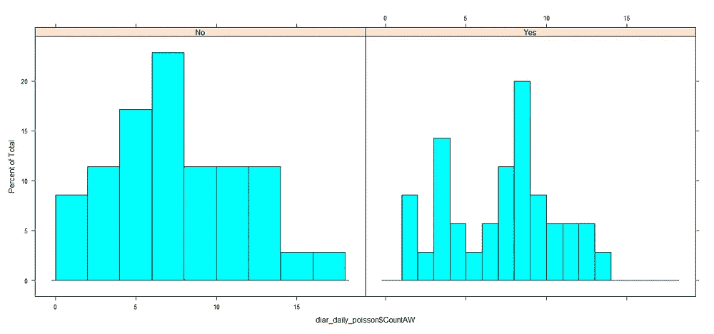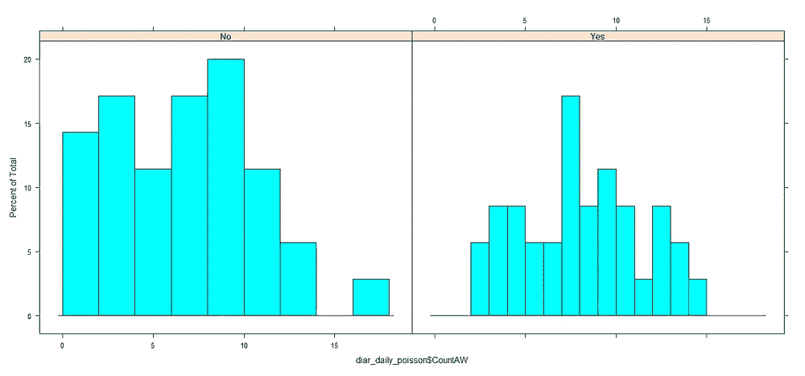

These are simply distribution plots to look at the count of diarrhea across all weeks for each treatment, sex, factor AA, and factor BB. Image by author.

好了，这就是有趣的开始。第一行代码可能是最重要的一行，它是对所有周数的均值/方差比率的简单计算。我可以说得更具体一些，分别针对多个因素，但关键是要理解泊松分布是一个非常有限的分布——均值等于方差。这被称为 lambda 参数，它的限制通常会导致[过度分散](http://biometry.github.io/APES//LectureNotes/2016-JAGS/Overdispersion/OverdispersionJAGS.html) —泊松模型会低估数据中的标准误差，并更容易假设最有可能不存在的影响。

或者，用频率主义者的话说——你有更高的机会获得显著的 p 值。

下面，您将找到拟合泊松模型、准泊松模型和负二项式模型的代码。尽管准泊松不是一个分布，而是泊松模型的一个扩展，它们确实代表了一系列在估计方差时变得越来越自由的模型。

对于泊松，均值等于方差。

对于准泊松，方差是所有观测值的估计方差。该方差用于获得更“真实”的标准误差。

对于负二项分布，方差是半独立估计的。它不像正态分布那样自由，但比泊松分布自由得多，也不像准泊松分布那样容易出错。

Code to run three types of models, check if the fixed effects can be changed by dropping variables, and compare them.

```
Variance-to-Mean Ratio
[1] 1.769033   --> larger than 1 hints at overdispersion> summary(fit.poisson.AW) # overdispersedCall:
glm(formula = CountAW ~ AA * BB, family = poisson(link = "log"), 
    data = diar_daily_poisson)Deviance Residuals: 
     Min        1Q    Median        3Q       Max  
-3.10410  -1.09661  -0.04676   0.88019   2.81010Coefficients:
            Estimate Std. Error z value Pr(>|z|)    
(Intercept)  2.06463    0.08638  23.900   <2e-16 ***
AAYes       -0.17587    0.12596  -1.396    0.163    
BBYes        0.06228    0.11868   0.525    0.600    
AAYes:BBYes  0.21970    0.17088   1.286    0.199    
---
Signif. codes:  0 ‘***’ 0.001 ‘**’ 0.01 ‘*’ 0.05 ‘.’ 0.1 ‘ ’ 1(Dispersion parameter for poisson family taken to be 1)Null deviance: 134.89  on 69  degrees of freedom
Residual deviance: 128.79  on 66  degrees of freedom
AIC: 401.28Number of Fisher Scoring iterations: 4> drop1(fit.poisson.AW)
Single term deletionsModel:
CountAW ~ AA * BB
       Df Deviance    AIC
<none>      128.79 401.28
AA:BB   1   130.45 400.93
```

与您习惯的线性回归模型相比，上述结果并没有显示出任何异常。唯一需要寻找的是过度离差，这里通过偏差/自由度的比值来计算。在这里，128.79 / 65 意味着过度离差约为 2，这意味着标准误差被低估了 2 倍。

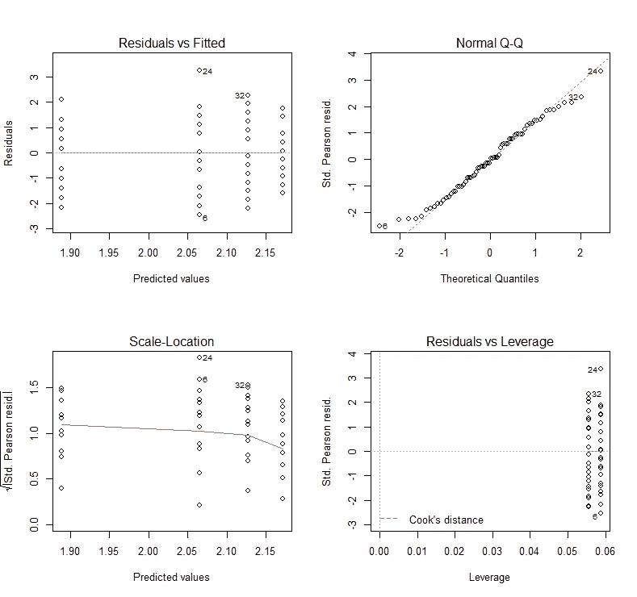

These plots are a bit dangerous to look for, since the mode and the errors do not have to be i.i.d or independent and identically distributed random variables. The reason why they do mimic i.i.d here is because the distribution of countAW does not mimic a traditional Poisson which is right-skewed. You could already see that when I tried a Normal distribution on the data — the fit was not bad. Image by author.

```
> anova(fit.poisson.AW, fit.quasipoisson.AW,fit.nb.AW)
Analysis of Deviance TableModel 1: CountAW ~ AA * BB
Model 2: CountAW ~ AA * BB
Model 3: CountAW ~ AA * BB
  Resid. Df Resid. Dev Df Deviance
1        66    128.794            
2        66    128.794  0    0.000
3        66     76.407  0   52.387
```

负二项式光明正大地打败了泊松和准泊松。我并不期望有任何减少，因为我正在比较刚性分布——泊松分布——和越来越不刚性的分布。灵活性越大，就越适合数据(这并不总是你想要的，但这是另一个讨论的问题)。

Now, despite that we know that the Negative Binomial is flexible, lets still run bootstrapped simulations to check for overdispersion. In addition, I want to check for zero-inflation.

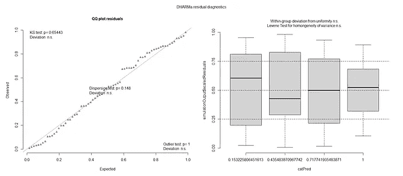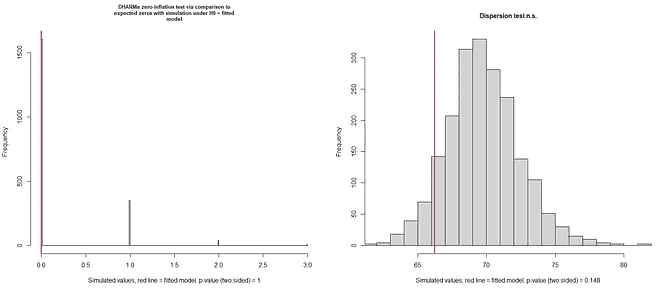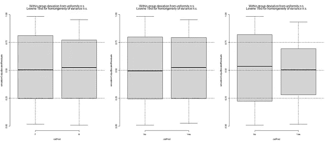

Simulations do not show any weird. residuals. The Negative Binomial for the countAW data is good to go. Image by author.

现在，上面的例子处理的是跨时间的计数数据，这意味着不包括时间因素。我们只是研究了腹泻的患病率，而不是一段时间内的发病率。这就是我们现在要做的，这将把我们带到广义线性混合模型的世界。

就像我说的，GLMM 模型是 GLM 的一个重要扩展，它为我们提供了建模方差的可能性。由于重复数据的自相关性是众所周知的，而且我们已经在动物水平上进行了观察，我们应该能够利用这些数据做更多的事情。

下面是一个非详尽的练习。

Putting data in long format requires additional wrangling.

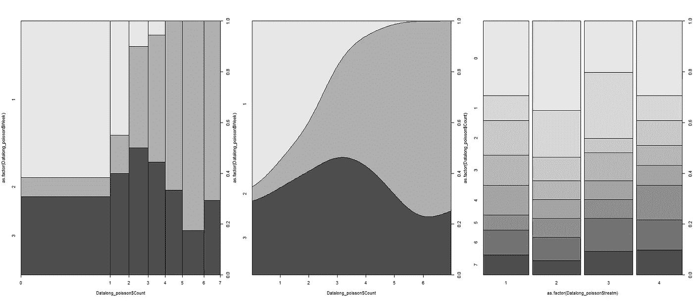

Plots to show the shift in diarrhea counts per week and per treatment. Enough going on to model overall. Image by author.

Code to get a better feeling of where the majority of the events (diarrhea) are taking place.

```
> tapply(Datalong_poisson$Count, list(Datalong_poisson$Week), mean)
        1         2         3 
0.6285714 4.7000000 2.5714286> tapply(Datalong_poisson$Count, list(Datalong_poisson$treatm), mean)
       1        2        3        4 
2.627451 2.203704 2.796296 2.921569> tapply(Datalong_poisson$Count, list(Datalong_poisson$treatm,Datalong_poisson$Week), mean)
          1        2        3
1 1.1176471 4.470588 2.294118
2 0.4444444 4.222222 1.944444
3 0.5555556 4.666667 3.166667
4 0.4117647 5.470588 2.882353> tapply(Datalong_poisson$Count, list(Datalong_poisson$treatm, Datalong_poisson$Week), sum)
   1  2  3
1 19 76 39
2  8 76 35
3 10 84 57
4  7 93 49
```

下面你可以看到 GLMM 模型的代码。代码本身非常简单，除了(1|x)部分。这些是模型的随机效应。当我指定(1|Week)时，我请求以随机截距的形式将该周作为随机效果包含在内。对动物也有同样的要求。因此，在这个 GLMM 泊松模型中，我有两个随机效应— *周*和*动物数量*。因为我在模型中是分开添加的，所以方差分量是分开的。这是一个选择。

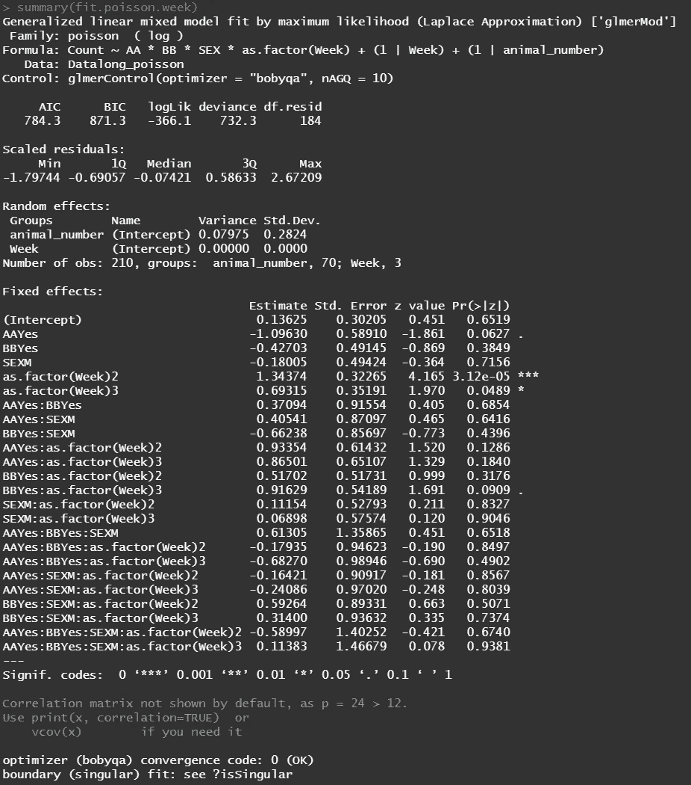

The results show we approached the data as a nested set, containing 70 animals with 3 observations each leading to a total of 210 observations. There is no reason to include the Week random effect. It has no variance. The results suggest an overdisperion factor of 732 / 184 = 5\. Hence, the standard error of the fixed effects are underestimated by a factor five.

I deleted the Week random effect, and specified Sex as a main effect instead of full interaction. I then asked a comparison between two models, and specified code for the assessment of the smaller model.

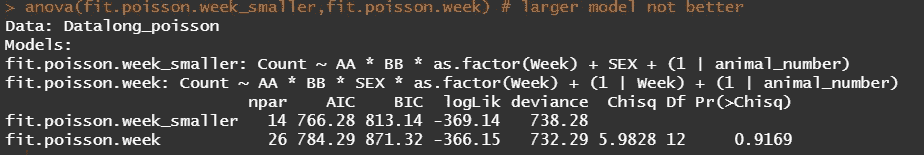

The Anova sees no reason to keep the larger model as we expected.

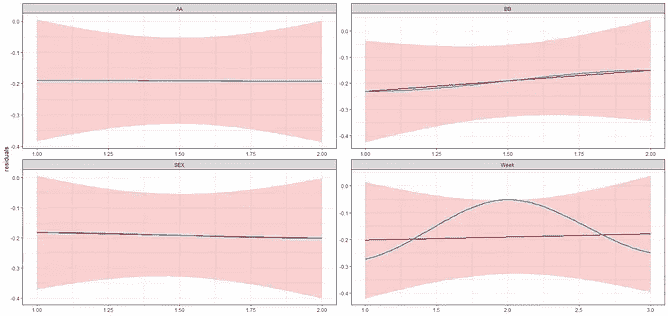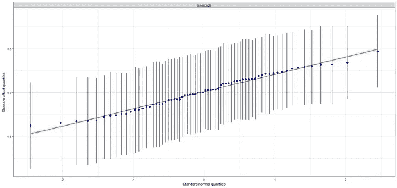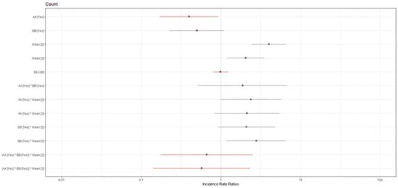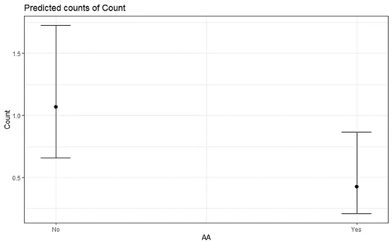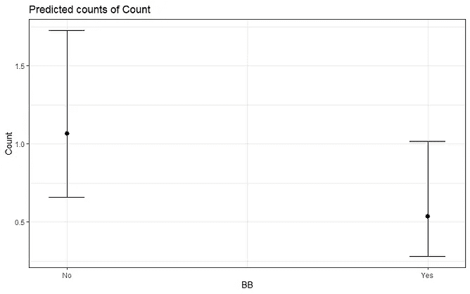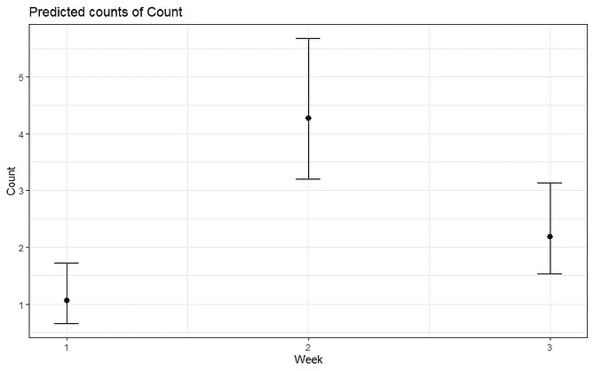

Image by author.

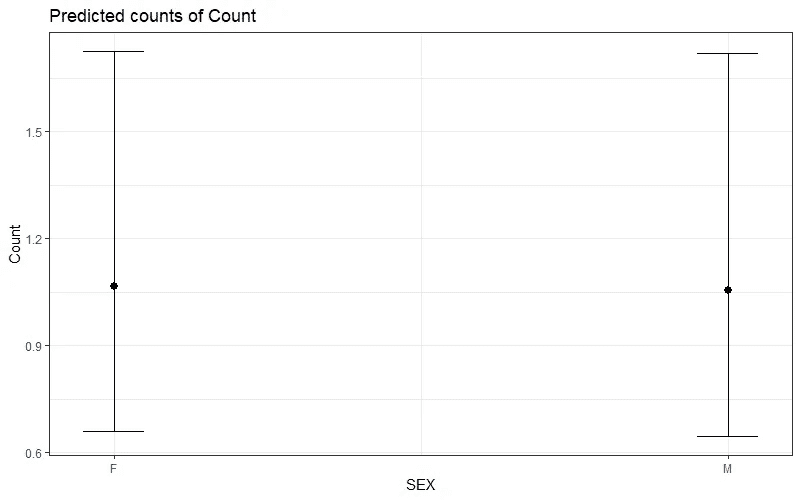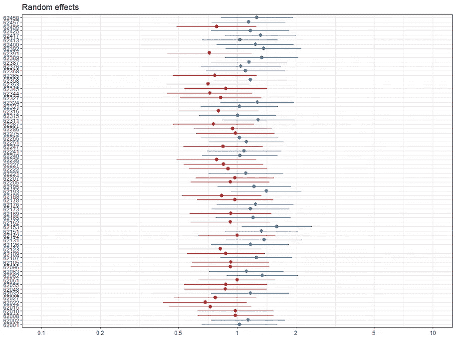

Plots looking at residuals across factors, the normality of the random effect, the estimates provided for the fixed effects, the predictions per factor, and the animal specific random effects. You want to see residuals that are homogenous, random effects that follow normality and show variance, predictions that make sense, and fixed effect estimates that follow biology. Image by author.

第一次使用 drop1 时，我就爱上了它。从统计学角度来看，这是一种快速的逐步筛选算法。这里，建议放弃完全相互作用，如超过主观阈值 3 的 AIC 差所示。

如果不明智地使用并以生物学为指导，这个工具可能弊大于利，但我仍然喜欢它。

```
> drop1(fit.poisson.week_smaller)
Single term deletionsModel:
Count ~ AA * BB * as.factor(Week) + SEX + (1 | animal_number)
                      npar    AIC
<none>                     766.28
SEX                      1 764.29
AA:BB:as.factor(Week)    2 762.89
```

下面你可以看到拟合两个广义矩的代码——泊松和准泊松。我们再次添加了一个观察水平方差分量(1|Id)来将泊松转换为准泊松。基于自举的模拟用于测试模型的剩余部分。

```
> summary(fit.quasipoisson.week)
Generalized linear mixed model fit by maximum likelihood (Laplace Approximation) ['glmerMod']
 Family: poisson  ( log )
Formula: Count ~ AA * BB * Week + SEX + (1 | Week) + (1 | Id)
   Data: Datalong_poisson
Control: glmerControl(optimizer = "bobyqa", nAGQ = 10)AIC      BIC   logLik deviance df.resid 
   789.5    826.3   -383.7    767.5      199Scaled residuals: 
     Min       1Q   Median       3Q      Max 
-1.79287 -0.74991 -0.03795  0.60581  2.77765Random effects:
 Groups Name        Variance Std.Dev.
 Id     (Intercept) 0.06459  0.2542  
 Week   (Intercept) 0.39123  0.6255  
Number of obs: 210, groups:  Id, 210; Week, 3Fixed effects:
                 Estimate   Std. Error z value Pr(>|z|)  
(Intercept)      -0.11411    1.01639  -0.112   0.9106  
AAYes            -0.72744    0.50702  -1.435   0.1514  
BBYes            -1.01081    0.49184  -2.055   0.0399 *
Week              0.41468    0.46764   0.887   0.3752  
SEXM             -0.02044    0.09425  -0.217   0.8283  
AAYes:BBYes       0.92020    0.71174   1.293   0.1960  
AAYes:Week        0.24416    0.22192   1.100   0.2712  
BBYes:Week        0.47812    0.21230   2.252   0.0243 *
AAYes:BBYes:Week -0.31183    0.30586  -1.020   0.3080  
---
Signif. codes:  0 ‘***’ 0.001 ‘**’ 0.01 ‘*’ 0.05 ‘.’ 0.1 ‘ ’ 1Correlation of Fixed Effects:
            (Intr)  AAYes  BBYes  Week   SEXM   AAYs:BBY AAYs:W BBYs:W
AAYes       -0.214                                                   
BBYes       -0.216  0.464                                            
Week        -0.929  0.202  0.205                                     
SEXM        -0.037 -0.007 -0.018  0.000                              
AAYes:BBYes  0.151 -0.709 -0.688 -0.142  0.003                       
AAYes:Week   0.209 -0.962 -0.452 -0.214  0.000  0.683                
BBYes:Week   0.215 -0.459 -0.963 -0.221  0.002  0.663    0.486       
AAYs:BBYs:W -0.151  0.696  0.665  0.154 -0.004 -0.964   -0.724 -0.691
```

如果你计算准泊松中的偏差/ df，你仍然会发现 4 倍的过度偏差。然而，由于我们包括了观察水平的方差成分，我们对标准误差的估计更放心。即使方差分量不是很大。

固定效应的相关矩阵总是很好看，以便进一步指定-简化-您的模型。特别是*周*有一些非常重的相关性。

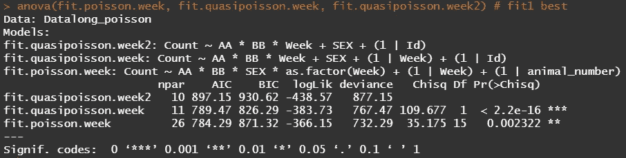

Comparison between three models shows that the fit.poisson.week is the best model. I guess adding the observational-level variance component did not do that much. We already expected as such.

```
> testZeroInflation(simulationOutput)DHARMa zero-inflation test via comparison to expected zeros with simulation under H0 = fitted modeldata:  simulationOutput
ratioObsSim = 1.2956, p-value = 0.452
alternative hypothesis: two.sided> testDispersion(simulationOutput)DHARMa nonparametric dispersion test via mean deviance residual fitted vs. simulated-refitteddata:  simulationOutput
dispersion = 1.1075, p-value = 0.408
alternative hypothesis: two.sided
```

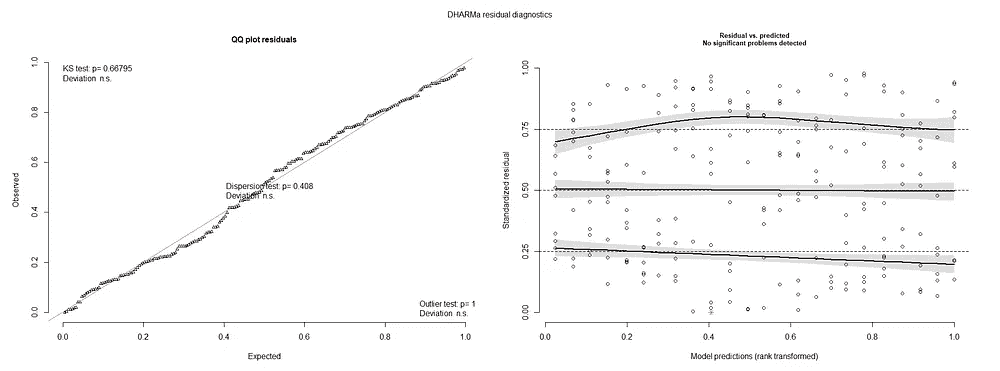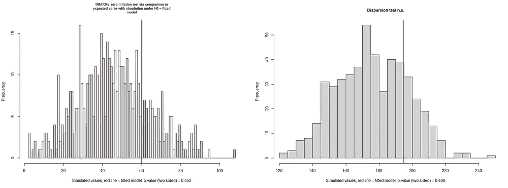

Simulation results for the Quasi-Poisson seem to be OK, overall. Image by author.


Simulations results zoomed in for the various factors seem mostly okay, expect when you look at the individual animal level. I suspect this is because the first Quasi-Poisson model did fit week-specific, but not animal-specific intercepts. Image by author.

The code to run a GLMM Negative Binomial has a different code, but follows the same structure.

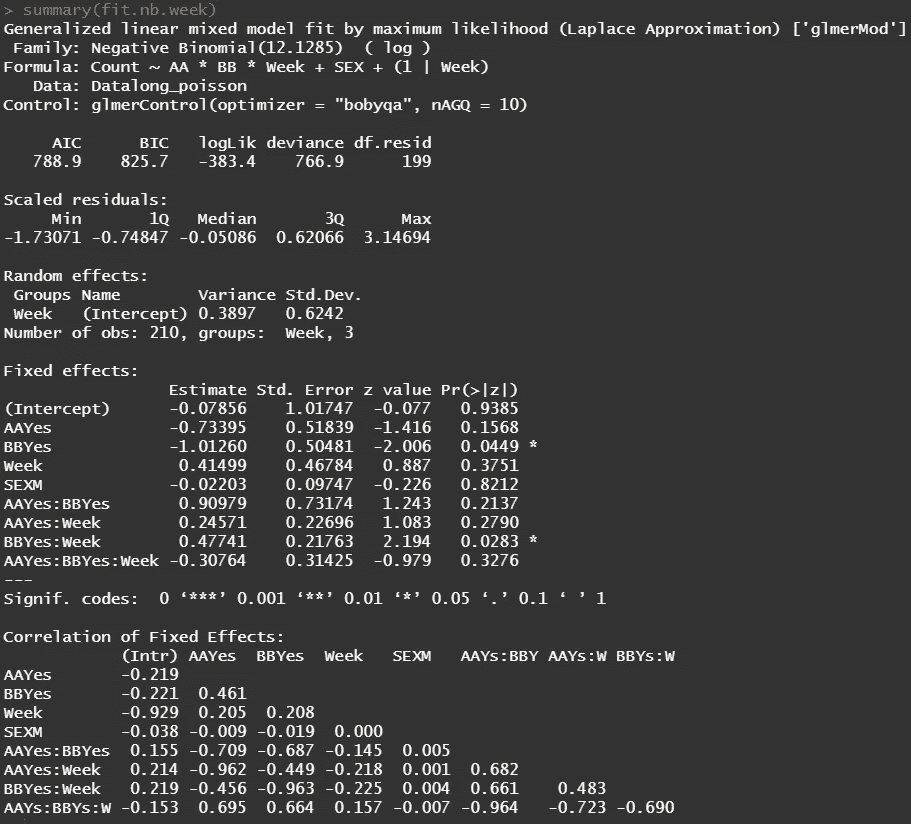

Also here, overdispersion is present, and we see the same high-correlation across certain fixed effects.

上面的结果应该告诉你，当你有计数数据时，负二项式不会自动救你。该模型只是没有很好地指定，导致过度分散，高固定效应相关性，以及方差估计应该出现的缺口。

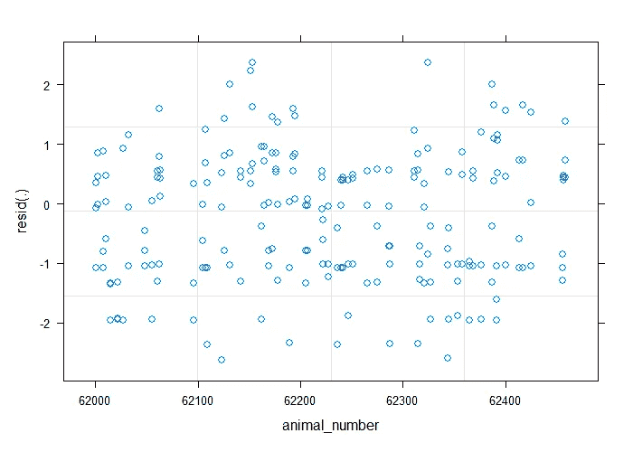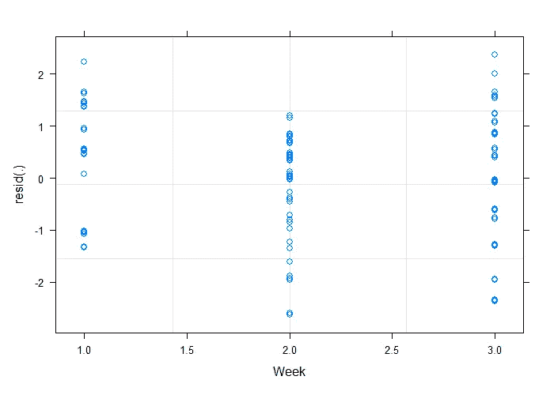

Image by author.

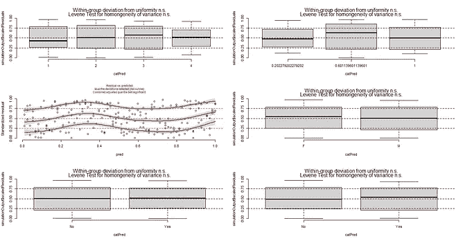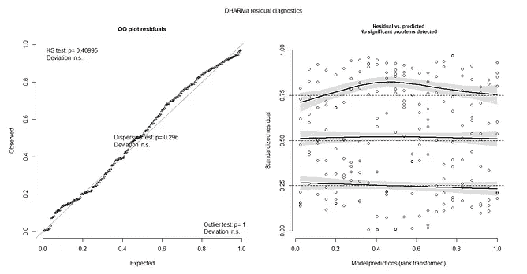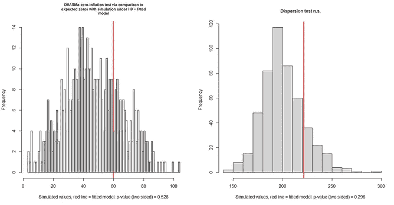

Diagnostic plots show no real deviances, expect at the animal. Image by author.

在这一点上，我不会认为模型完成了，但这并不损害结果。作为一个建模者，我们永远不会真正完成，需要做更多的工作来获得给定数据和科学的最佳可能模型。

最后，但并非最不重要的是，我想包含应用一个[零膨胀泊松](https://en.wikipedia.org/wiki/Zero-inflated_model) (ZIFP)模型的代码。尽管每个模型的每个模拟都没有暗示零通货膨胀，因此 ZIFP 不可能增加任何东西，但你会比你想象的更容易遇到零通货膨胀。在大多数情况下，计数数据有许多 0 和 1，并且过多的 0 暗示了一个应该由两个模型组成的模型:

1.  模型 A 解释为什么有许多零
2.  模型 B 解释如果不为零，计数会是多少。

所以是的，它们就像一棵决策树。

Poisson vs Zero-Inflated Poisson vs. Negative Binomial. Do note that now, the random effect is a random slope (fWeek | animal_number).

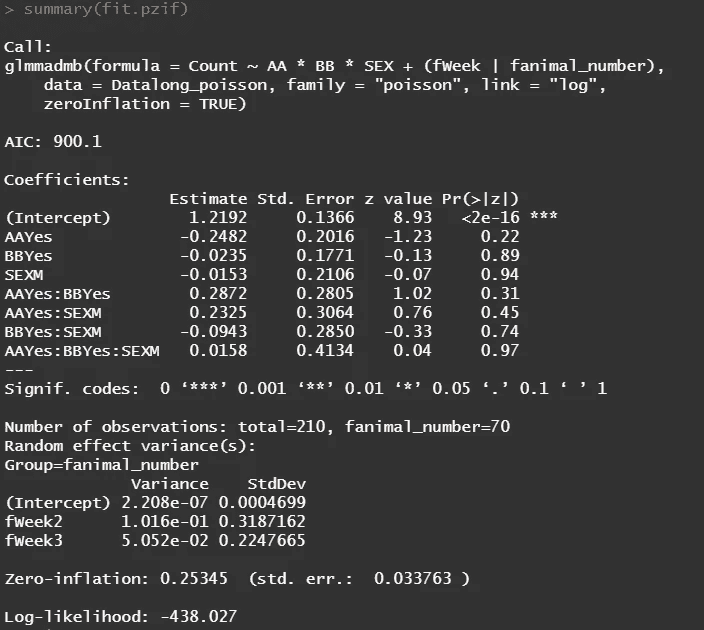

Does not hint at severe Zero-Inflation.

然而，下面的代码确实表明 ZIFP 模型比泊松模型更好。也许这并不奇怪，如果你考虑到任何只有一个多分布参数的模型都可能比单参数泊松分布做得更好。这并不意味着 ZIFP 真的是更好的模型。也有可能我们的泊松从一开始就没有被很好地建模。

```
> anova(fit.p, fit.pzif)
Analysis of Deviance TableModel 1: Count ~ AA * BB * SEX
Model 2: Count ~ AA * BB * SEX
  NoPar  LogLik Df Deviance  Pr(>Chi)    
1    11 -456.99                          
2    12 -438.03  1   37.926 7.348e-10 ***
---
Signif. codes:  0 ‘***’ 0.001 ‘**’ 0.01 ‘*’ 0.05 ‘.’ 0.1 ‘ ’ 1> anova(fit.p, fit.nb,fit.pzif)
Analysis of Deviance TableModel 1: Count ~ AA * BB * SEX
Model 2: Count ~ AA * BB * SEX
Model 3: Count ~ AA * BB * SEX
  NoPar  LogLik Df Deviance  Pr(>Chi)    
1    11 -456.99                          
2    12 -445.83  1   22.312 2.318e-06 ***
3    12 -438.03  0   15.614 < 2.2e-16 ***
---
Signif. codes:  0 ‘***’ 0.001 ‘**’ 0.01 ‘*’ 0.05 ‘.’ 0.1 ‘ ’ 1
```

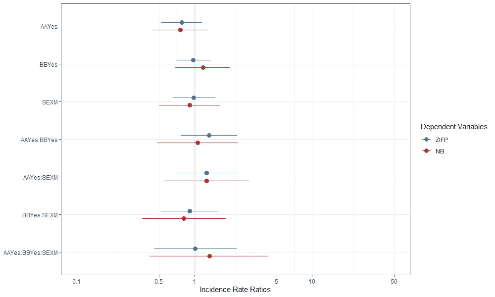

In the end, the NB beats the ZIFP model. Image by author.

我希望您喜欢这个使用泊松、准泊松、负二项式和零膨胀泊松模型分析重复计数数据的例子。记住，这个例子并不详尽，还有很多可以改进的地方！

[](/mlearning-ai/mlearning-ai-submission-suggestions-b51e2b130bfb) [## Mlearning.ai 提交建议

### 如何成为 Mlearning.ai 上的作家

medium.com](/mlearning-ai/mlearning-ai-submission-suggestions-b51e2b130bfb)