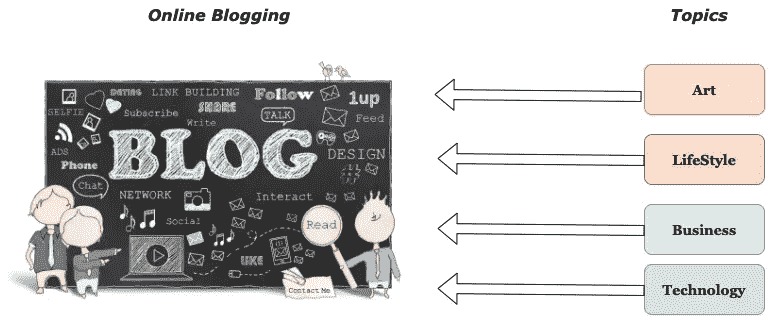

# 在线博客中最常见的话题——数据科学视角

> 原文：<https://medium.com/mlearning-ai/analysis-of-topics-in-text-data-with-topic-modelling-e177e6d2187a?source=collection_archive---------3----------------------->

我们有丰富的文本数据，在主题造型手法的帮助下，我们可以分析其中涉及的主题。它属于无监督算法的范畴。这种方法适用于不同的搜索引擎。让我们考虑一下报纸数据集，我们可以很容易地找到这个数据集中广泛涉及的话题，如政治、体育、天气…