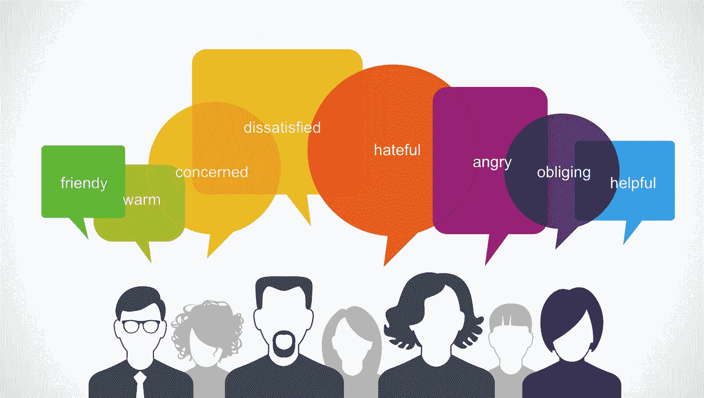
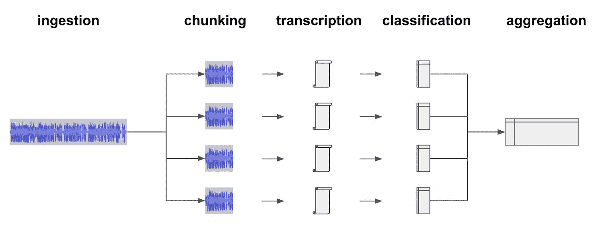
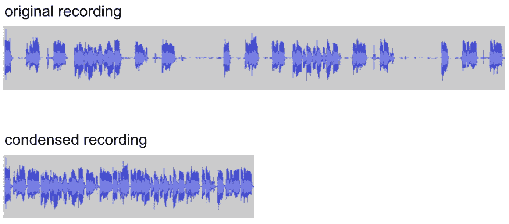
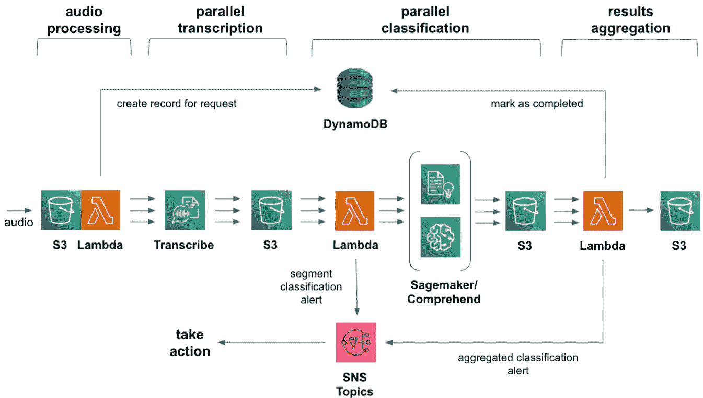

# 使用并行无服务器架构快速分析用户语音

> 原文：<https://medium.com/mlearning-ai/analyze-user-speech-quickly-with-parallel-serverless-architecture-c43a953aff24?source=collection_archive---------2----------------------->



当你的用户与你的企业互动时，快速分析他们所说的话是至关重要的。这可以是不满意的客户来电，也可以是你的应用程序中带有脏话的语音聊天。但这也可以是体验改善、广告和销售机会。一旦感兴趣的音频被标记，您就需要迅速采取行动。

当然，你可以对用户说的每一句话进行实时分类。你可以从他们的设备或你的云中进行推理。但是这对每个人来说都是 cpu 和带宽的浪费。还有隐私问题要考虑。因此，只对已被标记的音频进行分类更具成本效益。

首先要做的是将音频记录转录成文本，这样就可以进行自然语言处理(NLP)。AWS *转录* 是一项服务，它可以获取你的音频记录，并以 json 格式提供一份抄本。然而，高质量的转录需要时间，尤其是在音频嘈杂的情况下。批处理作业可能需要半个小时来转录一个长音频会话。到那时，采取行动可能为时已晚。


## **对一分钟以内任意长度的音频进行分类**

本文介绍的架构通过将冗长的录音分成较短的音频片段来实现这一点。然后，所有片段被转录并平行处理，以便快速分类。结果在最后汇总。该架构是无服务器的，并且是按使用量付费的。这使得它可以快速部署，并且基本上无需维护。



需要聪明地进行分块，以避免跨段边界将单词分成两半。理想情况下，每个片段都应该包含完整的句子。如果句子按上下文分组就更好了。例如，确保呼叫中心代理的问题与呼叫者的相关回答进行分组。

## 分块还是不分块

每当速度和低延迟很重要的时候，分块就是一个必要的祸害。但是它不可避免地影响 NLP 结果，因为音频会话的整体上下文现在分布在多个片段上。每个片段都是独立处理的，因此您的分类器将只处理部分上下文。

在第 2 部分中，我们将探索 ***语音分段*** 和****组块问题的本质。*** 我们将讨论的另一个有用的技术是 ***总结*** 用于在更多的上下文中打包。*

*将音频分成 60 秒左右的片段可以快速转录和分类。这种大小非常适合基于单词或句子的用例，如脏话检测、广告等。这也使得在音频会话期间能够进行情感分析变化。*

## *注意那些帐户限制！*

*并行处理大量音频片段会增加您的云帐户中的资源节流机会。我想到了 Lambda 函数的并发执行限制。而且 ***转录******领悟*** 极限，默认为低。对于自定义分类器来说尤其如此。然而，这些很大程度上是你可以轻易提出的软限制。*

## *音频处理技巧*

*音频通常在源处以压缩格式录制，如***【AAC】******ogg***或更糟的 ***mp3*** 。这可以节省存储空间，但对于转录来说并不理想，因为语音中更精细的音频细节可能会丢失。如果可以的话，使用类似 ***WAV*** 或者 ***FLAC*** 的无损格式。否则，考虑将您的音频转换为最适合您的转录技术的格式。*

*转换采样率以适应您的转录人工智能模型的偏好也可能是有益的。例如，电话优化模型通常针对 8khz 或更低的采样率进行训练。*

*此外，转录是按音频持续时间(秒)收费的，而不是按实际的口头内容收费的。因此，通过在转录之前删除音频中的静音和没有内容的段落(如打字),您可以节省大量资金。例如，考虑下面这段客户服务电话录音。*

**

*口头交流往往可以这样缩减一半。但是只考虑对你的分块音频片段这样做。在分块之前这样做可能会混淆你的语音分割算法。*

*令人敬畏的音频工具 ***ffmpeg*** 可以帮你做到这一点。此外，该实用程序可以方便地作为 AWS [***无服务器回购***](https://serverlessrepo.aws.amazon.com/applications/us-east-1/145266761615/ffmpeg-lambda-layer) 中的 lambda 层使用。*

*从你的 lambda 函数调用 shell 执行中的 ***ffmpeg*** 很简单。您需要提供一些参数，比如静音分贝阈值。这决定了什么被认为是背景噪音或语音。您可能需要尝试自己的音频。*

****ffmpeg*** 将输出一个新的、更短的音频文件，您可以提交该文件进行转录。下面举个例子。*

```
*ffmpeg -i input.wav -af silenceremove=1:0:-50dB output.wav*
```

# *架构漫游*

*该架构是一个简单的管道，音频记录在头部被丢弃，NLP 结果在尾部变得可用。你可以通过在它前面加上 AWS ***API 网关*** 来接受处理请求和上传，从而把它变成一个服务。*

**

## *音频处理*

**摄取桶订阅了一个音频处理λ函数。只要有音频文件放入，该功能就会唤醒。该函数在本地下载音频文件，然后决定如何最好地将它分成更小的片段。**

**在第 2 部分中，我们将探索 python 库，如 ***pydub*** ，它们可以帮助创建包含完整句子的片段。分块后，该函数会在 ***DynamoDB*** 中创建一条记录来保存详细信息。**

**接下来，该函数生成一个线程来处理每个数据段。每个线程可以优化它的段，例如去除静音。然后线程将它们的段上传到 s3，并为它安排一个 ***转录*** 批处理作业。**

**做这个多线程对于速度至关重要，因为工作主要在于等待*和 ***转录*** 做出响应。从主线程中一次执行一个片段会花费一些不必要的时间。***

**当所有线程都已加入并终止时，lambda 函数最终可以退出。**

## **抄本**

**一旦使用 ***转录，转录作业将自行进行。*** 为任务提供了音频段文件在*S3 中的位置，以及副本应存放的位置。片段抄本作为 *json* 格式的文件交付。***

*****转录*** 让您选择让它排队作业，以防您的并发作业限制间歇性地达到。利用这个选择是明智的。但是出现排队的情况意味着是时候要求 ***转录*** 增加你账户的限额了。**

**如果达到了排队限制，那么 ***转录*** 将暂时拒绝您的服务，并以节流错误条件进行响应。**

## **分类**

**每当片段抄本文件被存放在 ***S3*** 中时，分类λ函数被唤醒。该函数将文件下载到本地进行处理。**

**脚本文件包含纯文本，可以提供给各种分类器，如*或您自己在 ***Sagemaker*** 中托管的模型。抄本还包括一个部分，提供每个转录单词的置信度得分。所以你可以考虑用它来生成你自己的纯文本，只包含高可信度的单词和句子。***

**然后将分段分类结果作为 json 文件保存在 ***S3*** 中。如果细分分类检测到紧急情况，您的函数可能会选择性地触发 ***SNS*** 通知。**

## **聚合**

**最后一个 lambda 函数将所有分段分类结果聚合为一个结果，以便安全保管。它可以以这样的方式重新格式化它，使得能够由各种引擎进行查询，例如 ***【雅典娜】******EMR***或 ***红移*** 。该功能可以发出 ***SNS*** 通知，以通知可用性或对其采取行动的需要。**

**但是分类不必就此停止。现在您已经有了完整的录音文本，您可以考虑安排它在以后进行更深入的分析。分段分类结果可以帮助决定下一步做什么。**

## **DynamoDB 和 S3 卫生**

**通过为在*S3 中处理过程中创建的所有临时文件定义一个自动删除策略，节省您的管理工作。例如，一旦转录完成，就不再需要音频片段。你可以在一天后安全地删除它们。***

***在 ***DynamoDB*** 中创建的记录也是如此。您应该考虑在您的表中为它们设置一个类似的 ***生存时间*** 。这样，桌子可以自行清洁，也无需维护。***

# **关于作者**

***Pierre 是一家大型云提供商的深度学习架构师。他的工作日职责是确保客户在使用和部署人工智能和机器学习技术方面非常成功。***