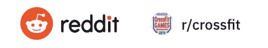
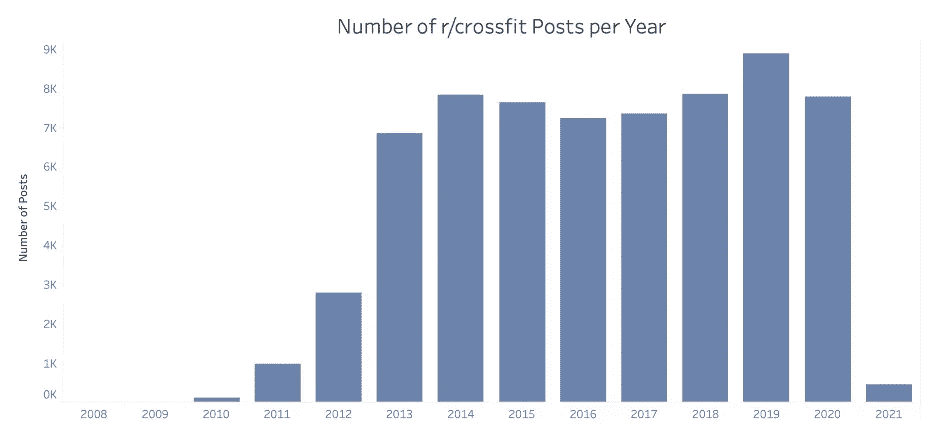
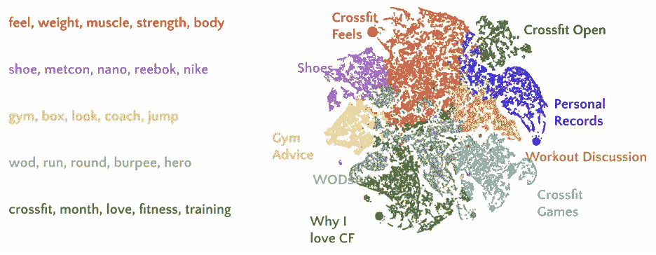
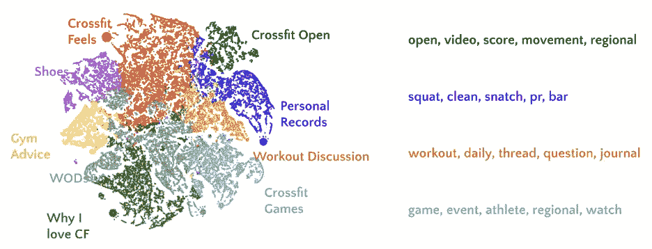
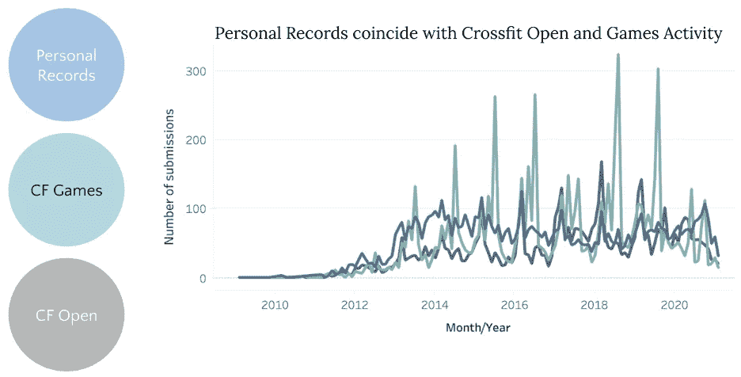
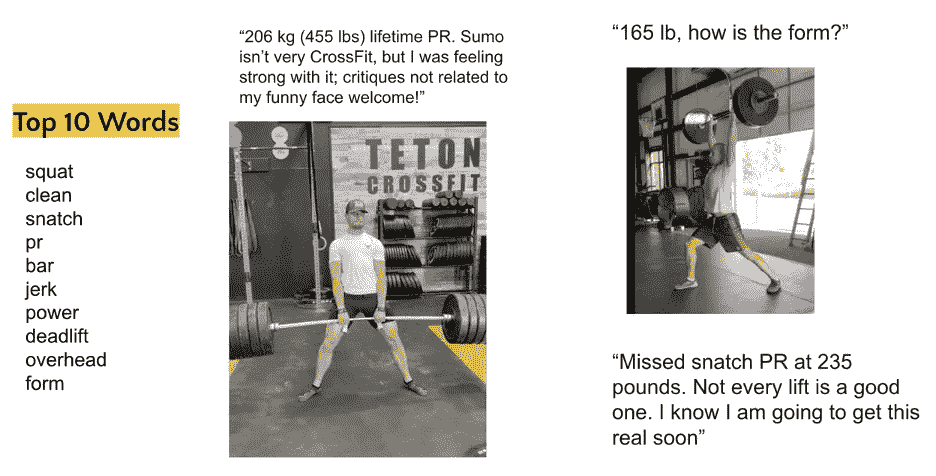
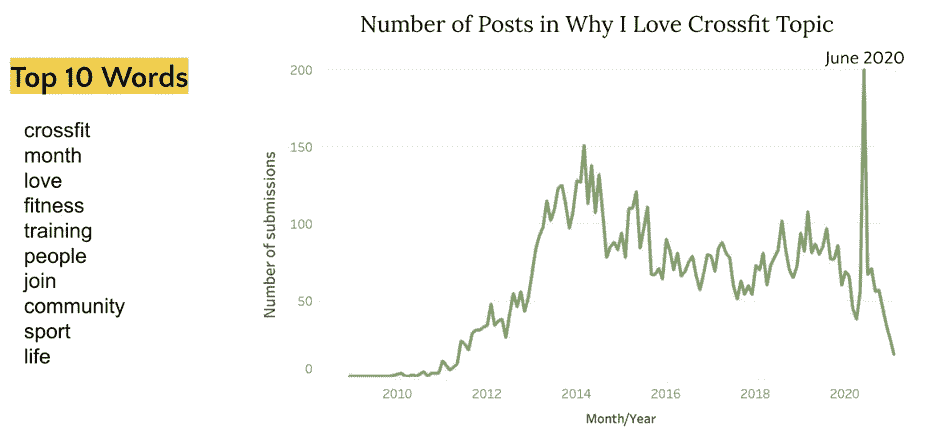
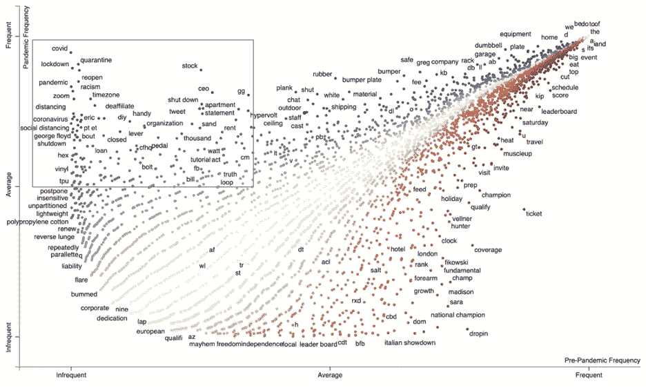
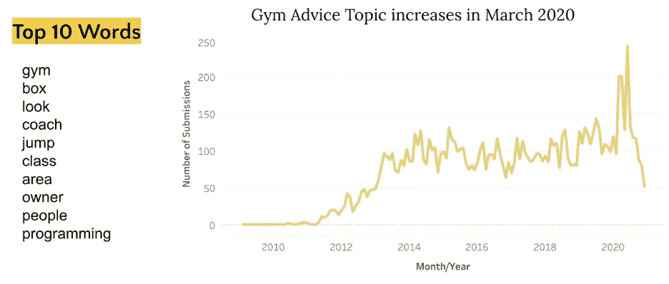
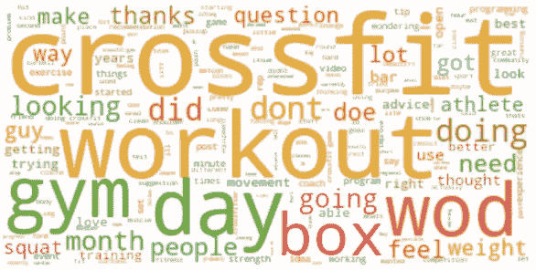

# 用 NLP 分析交叉子网格

> 原文：<https://medium.com/mlearning-ai/analyzing-crossfit-subreddit-with-nlp-4a4e9f008518?source=collection_archive---------2----------------------->

使用自然语言处理技术对 CrossFit subreddit 社区内的话语进行处理，以获得运动员和健身房所有者的洞察力。

CrossFit 是一项专注于力量和调节的健身计划，旨在建立功能性健身。每天的锻炼结合了高强度间歇训练、奥林匹克举重、力量举重、体操、有氧运动和大力士训练中的不同运动。

从 2012 年开始，CrossFit 开始加速发展，越来越受欢迎。根据[晨报](https://morningchalkup.com/2019/07/09/media-misreports-crossfit-affiliate-growth-down-2-4/)的数据，截至 2019 年 7 月，全球 CrossFit 附属机构的数量约为 15200 家。今年，这一数字下降了 29%，至 10，800 英镑左右。

> 发生了什么事？— 2020

2020 年，新冠肺炎疫情对每个人的生活造成了前所未有的破坏。在 CrossFit 中，许多运动员由于感染风险而减少或终止了他们的健身房会员资格。CrossFit 健身房也在苦苦挣扎。政府关闭对当地健身房的打击非常大。最重要的是，CrossFit 的创始人兼首席执行官格雷格·格拉斯曼(Greg Glassman)在提到乔治·弗洛伊德(George Floyd)时发表了一篇麻木不仁的评论，并且没有为此道歉。由于反弹，许多健身房退出，格拉斯曼被迫出售公司。

鉴于过去一年的事件、当前形势和许多在线服务— **这对 CrossFit 社区的运动员和健身房所有者意味着什么？**这是我在[为期 12 周的 Metis 数据科学训练营](https://www.thisismetis.com/)期间通过一个 NLP 项目进行的调查。

为了探索 CrossFit 在线社区中的话语，我使用了 reddit。Reddit 是一个基于人们兴趣的在线社区网络。当然，这并不能完全代表每一位 CrossFit 运动员，但可以为该社区的在线对话提供见解。r/crossfit subreddit 社区创建于 2008 年 12 月，目前有 232K 名成员。

**接近**

1.  数据收集和预处理
2.  主题建模
3.  结果

# **数据采集和预处理**

使用 [Pushshift](https://www.reddit.com/r/pushshift/comments/bcxguf/new_to_pushshift_read_this_faq/) API 为 r/crossfit 子编辑收集数据。这提供了一种更容易访问 reddit 历史帖子的方式。这项分析是使用 2008 年 12 月至 2021 年 2 月 19 日的数据进行的。

一旦收集了数据，我就执行文本预处理来清理数据。这个过程包括将所有文本转换为小写，以及删除表情符号、数字和标点符号。我还删除了停用词，这是一些常用词，像“the”、“a”和“with”等没有什么意义。最后，我使用词汇化将具有相同基本形式的单词组合在一起。比如“蝙蝠”变成了“蝙蝠”，“脚”变成了“脚”，“有”变成了“有”。

下面的数据图表显示了每年 r/crossfit 帖子的数量。这遵循了 CrossFit 到 2019 年的增长模式。

# **主题建模**

一旦数据完成，我就应用主题建模将 r/crossfit 的帖子分成共同的主题。

1.  **TFIDF:** 这是通过首先使用 TF-IDF 矢量器将每个帖子中的单词转换为矢量中的数字表示来完成的。该过程为每个帖子相对于整个数据集中的其他帖子的相对词频分配权重。
2.  **NMF:** 接下来，我应用了一种名为 NMF 的无监督机器学习算法，将帖子分组到主题中。
3.  **TSNE:** 最后，我使用了 TSNE，一种额外的降维方法来减少二维平面上的特征。

以下是九个主题以及描述每个主题的前五个词。图中的每个点都是一个带有颜色分类主题的 r/crossfit 帖子。这些分组是可以合理区分的。

# **结果/发现**

> 1.个人记录主题可能会给健身房老板带来机会

随着围绕 CrossFit 公开赛和 CrossFit 游戏的讨论，个人记录主题中的话语类似地增加。“公开赛”和“运动会”是世界性的比赛，通常每年举办一次。这个观察是有意义的，因为许多人在这段时间创造了新的个人记录。

因为运动员喜欢挑战自我和探索极限，所以如果还没有举办室内比赛的话，举办室内比赛可能会提高他们在当地健身房的参与度，即使是虚拟的。

这个个人记录类别也包含很高比例的视频。这个主题中的帖子经常会向 redditors 的同事寻求详细的反馈，并收到他们的反馈。以下是这一主题中的十个热门词汇和一些示例帖子。

对于运动员来说，这提供了一个获得表扬和反馈的渠道。

对于健身房老板来说，这可能意味着提供在线教练反馈服务的机会。这可能是一种接触当地以外更多客户的方式。由于人们在网上寻求陌生人的反馈，运动员每周为一些视频评论支付少量费用可能是有益和有吸引力的。这样，运动员可以从熟悉他们运动的人那里获得更个性化的反馈，而不必支付私人教练的高额费用。

> 2.反对种族主义

围绕 Glassman 问题的讨论出现在一个有趣的话题中，即“我为什么喜欢 CrossFit”这个话题。在这个话题中，许多人分享了 CrossFit 对他们生活质量的影响(通常是积极的)。排名前十的词反映了人们为什么加入并热爱 CrossFit: **健身**、**人**、**社区**。这个话题在 2020 年 6 月奇怪地增加了，与格拉斯曼问题一致。经调查，我发现有这样的帖子:“我爱 crossfit，但我为 glassman 感到尴尬”。

由于格拉斯曼的评论，围绕脱离 CrossFit 的反弹和讨论表明，大量健身房反对种族主义，近 1/3 的健身房选择通过将自己与品牌分离来实现自己的信仰。

此外，下图显示了一年疫情时期的词频与一年前疫情时期的词频的对比。疫情热门词汇分为三类:**检疫**、**种族主义**和**装备**。

> 3.增加了“健身房建议”话题的讨论

这一“健身房建议”主题包含围绕编程和设备的讨论(前 15 个单词)，在 2020 年 3 月有所增加，反映了运动员在寻找和购买设备以及讨论编程方面的转变。运动员拥有自己的设备并对编程表现出兴趣可能是在线远程服务需求的另一个指标。

# 结论

使用应用的自然语言处理技术，这种分析为运动员和健身房所有者提供了来自在线 CrossFit reddit 社区的见解。这项调查概述了:

*   运动员们积极地使用这个在线社区来寻求对他们托举的反馈，并庆祝个人记录。本主题的帖子数量与 CrossFit 游戏和开放相关。举办内部比赛可能会增加健身会员的参与度
*   种族主义是一个重要的讨论，许多人强烈反对种族主义。健身房可能会考虑有意传达支持运动员的信息
*   由于疫情，越来越多的运动员拥有自己的设备，因此健身房所有者有可能提供远程服务，如组合编程和电梯反馈

我这个项目的 Github repo 是[这里](https://github.com/grettel13/nlp_crossfit_subreddit)。请随时在 Linkedin 上与我联系。