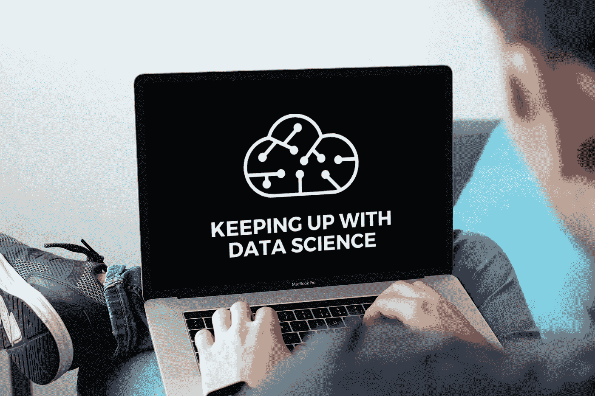

# 分析印度人的糖尿病模式，皮尔逊相关系数初学者指南，网络安全的深度学习等等

> 原文：<https://medium.com/mlearning-ai/analyzing-diabetes-patterns-amongst-indians-a-beginners-guide-to-pearson-s-correlation-e74abe611395?source=collection_archive---------12----------------------->

[Source](https://www.canva.com/design/DAFBHNG5BqE/CWqEiWn6azjDC_hCX2pKVw/edit)

# 1.使用机器学习提取印度人的糖尿病模式

*   数据显示，发展中国家的糖尿病患者将增加 266%。
*   训练模型的分数是惊人的 100%,这意味着它对所有元素进行了正确的分类，这从混淆矩阵中可以明显看出。
*   可以看出，训练和测试数据集都是平衡的。
*   在测试数据集的混淆矩阵分析中，观察到与决策树模型相比，很少元素被错误分类。
*   机器学习模型如果与解剖学和生理学、临床参数、实验室参数和药物的知识正确同步，可以证明是正在进行的糖尿病斗争中的游戏规则改变者。

**类别:**糖尿病，机器学习

**等级:**初学者

**整篇文章链接:**[https://www . analyticsvidhya . com/blog/2021/06/juicing-out-the-diabetes-patterns-in-Indians-using-machine-learning/](https://www.analyticsvidhya.com/blog/2021/06/juicing-out-the-diabetes-patterns-amongst-indians-using-machine-learning/)

# 2.使用 SPSS、Power BI、R Studio、Excel 和 Orange 进行探索性分析

**案例:**请进行探索性的数据分析，并根据给定的数据集创作一个引人注目的故事；也预测一下近期哪篇文章会更受欢迎。

**网址:**[www.mashable.com](http://www.mashable.com/)

*   在可视化(根据天数发布和根据天数受欢迎程度)中，可以观察到 Mashable 通常在周末发布较少的文章，因为人们不喜欢在周末阅读更多的文章。原因可能是任何一种——也许人们将只有周六和周日作为假期，他们可能想放松或旅行而不是阅读文章。
*   现在，流行度已经与不同的主题进行了比较(分析基于过去两年的数据):从可视化中，可以观察到商业文章在 Mashable 网站上不太受欢迎。
*   从可视化中可以观察到，生活类文章在 Mashable 网站上更受欢迎。
*   从可视化中，还可以观察到社交媒体文章在 Mashable 网站上更受欢迎。

**类别:**数据探索

**等级:**初学者

**全文链接:**[https://www . analyticsvidhya . com/blog/2020/12/explorative-analysis-using-SPSS-power-bi-r-studio-excel-orange/](https://www.analyticsvidhya.com/blog/2020/12/exploratory-analysis-using-spss-power-bi-r-studio-excel-orange/)

# 3.皮尔逊相关系数初学者指南

*   使用 python 可以发现连续变量之间的相关性:我们可以在上面的散点图中看到，随着车长、整备重量和车宽的增加，汽车的价格也会增加。
*   我们可以说，上述三个变量与汽车价格之间存在正相关关系。“r”的值等于接近+1 或-1，这意味着所有数据点分别包含在最佳拟合线上或接近最佳拟合线。
*   您需要考虑仅在一个变量上异常的异常值，称为“单变量变量”，或者对于两个变量都异常的异常值，称为“多变量异常值”。
*   如果我们绘制年龄与贷款金额的关系图，我们可以肯定地看到，一个人的年龄与贷款金额之间存在相关性，年龄越大，贷款金额越小，反之亦然。

**类别:**皮尔逊相关系数

**等级:**初学者

**整篇文章链接:**[https://www . analyticsvidhya . com/blog/2021/01/beginners-guide-to-pearsons-correlation-coefficient/](https://www.analyticsvidhya.com/blog/2021/01/beginners-guide-to-pearsons-correlation-coefficient/)

# 4.使用机器学习和深度学习技术预测股票价格(使用 Python 代码)

*   我们将使用移动平均技术，而不是简单的平均，移动平均技术对每个预测使用最新的一组值。
*   RMSE 值没有很大的差异，但是预测值和实际值的图表应该提供更清晰的理解。
*   尽管使用这种技术的预测远好于之前实现的机器学习模型的预测，但这些预测仍然不接近真实值。
*   有许多时间序列技术可以在股票预测数据集上实现，但是这些技术中的大多数在拟合模型之前需要大量的数据预处理。LSTM 是其中之一。
*   本文将 LSTM 实现为一个黑盒，并检查它在特定数据上的性能。

**分类:** Auto Arima，KNN，线性回归，LSTM，移动平均线，脸书先知，Python，股市分析，股票预测，时间序列，时间序列预测

**级别:**中级

**全文链接:**[https://www . analyticsvidhya . com/blog/2018/10/predicting-stock-price-machine-learning nd-deep-learning-techniques-python/](https://www.analyticsvidhya.com/blog/2018/10/predicting-stock-price-machine-learningnd-deep-learning-techniques-python/)

# 5.将深度学习的力量用于网络安全(第 1 部分)

*   深度学习不是可以解决所有信息安全问题的银弹，因为它需要大量的标记数据集。
*   自动微分用于计算在网络中使用的权重计算中所需的梯度。在“从 TOR 加密流量中推断应用程序类型信息”一文中，提取了突发流量和方向，以创建 HMM 模型来检测可能产生该流量的 Tor 应用程序。
*   但是，该体系结构使用大量其他元信息来对流量进行分类。例如，如果需要训练一个分类器来检测 TOR 使用的应用程序，那么只有输出层需要重新训练，而所有其他层都可以保持不变。

**类别:**网络安全、深度学习、深度学习安全、信息安全

**等级:**高级

**全文链接:**[https://www . analyticsvidhya . com/blog/2018/07/using-power-deep-learning-cyber-security/](https://www.analyticsvidhya.com/blog/2018/07/using-power-deep-learning-cyber-security/)

# 6.DeepMind 的计算机视觉算法带来了想象力，可以从 2D 图像中构建 3D 场景

*   如果没有正确标记的数据，模型就可能不存在！通常，为了训练复杂的模型，我们必须手动标记和注释算法要使用的图像。
*   换句话说，人工智能算法能够使用 2D 图像来理解或“想象”物体从各种角度(在图像中看不到)看起来是什么样子。
*   GQN 能够独立学习物体的形状、大小和颜色，然后可以将所有这些特征结合起来，形成精确的 3D 模型。
*   此外，研究人员能够使用这种算法开发新的场景，而不必明确地训练系统什么对象应该去哪里。
*   GQN 不仅限于标记和注释图像，它还可以被自主机器人用来更好地理解它们的周围环境。

**类别:**人工智能、计算机视觉、Deepmind、谷歌、DeepMind、物体检测

**级别:**高级

**全文链接:**[https://www . analyticsvidhya . com/blog/2018/06/Google-ai-create-3d-objects-using-2d-snapshot s/](https://www.analyticsvidhya.com/blog/2018/06/google-ai-create-3d-objects-using-2d-snapshots/)

# 7.第 15 部分:掌握自然语言处理的逐步指南——使用 NMF 的主题建模

*   在这种方法中，考虑了文档术语矩阵中的每个单词。但是具有最高权重的那个被认为是一组单词的主题。
*   为了测量距离，我们有几种方法，但在这篇博文中，我们将讨论机器学习实践者使用的以下两种流行方法。
*   让我们点击下面的链接，逐一详细讨论它们。

**类别:**话题造型采用 NMF

**等级:**高级

**整篇文章链接:**[https://www . analyticsvidhya . com/blog/2021/06/part-15-step-by-step-guide-to-master-NLP-topic-modeling-using-NMF/](https://www.analyticsvidhya.com/blog/2021/06/part-15-step-by-step-guide-to-master-nlp-topic-modelling-using-nmf/)

# 结论

我希望你觉得这篇博文很有见地。请与您的朋友和家人分享它，并订阅我的博客[了解数据科学](https://keepingupwithdatascience.in/)以获取更多关于数据科学的信息内容，直接发送到您的收件箱。可以在[Twitter](https://twitter.com/ChitwanManchan1)&[LinkedIn](https://www.linkedin.com/in/chitwanmanchanda/)联系我。我在那里很活跃，我很乐意与你交谈。请随时在评论中留下您的反馈，帮助我提高工作质量。随着我作为一名数据科学家越来越成熟，我会继续分享更多的内容。直到下一次，继续努力&跟上数据科学。快乐学习🙂

 [## Mlearning.ai 提交建议

### 如何成为 Mlearning.ai 上的作家

medium.com](/mlearning-ai/mlearning-ai-submission-suggestions-b51e2b130bfb)