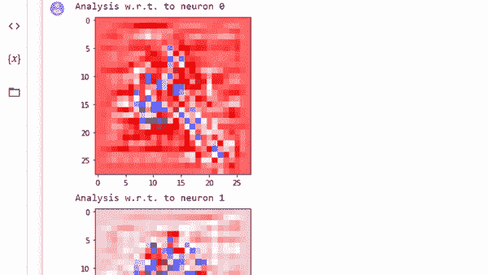

# 分析神经网络预测

> 原文：<https://medium.com/mlearning-ai/analyzing-neural-network-predictions-1c89e1b0215c?source=collection_archive---------0----------------------->

## 用调查比较不同的方法来解释预测

Innvestigate (Source: By Author)

神经网络有助于识别原始数据中的隐藏模式和相关性，并对其进行聚类和分类。他们在每一次训练中不断学习和提高。它们模仿人脑，人脑包含传递信息的神经元。