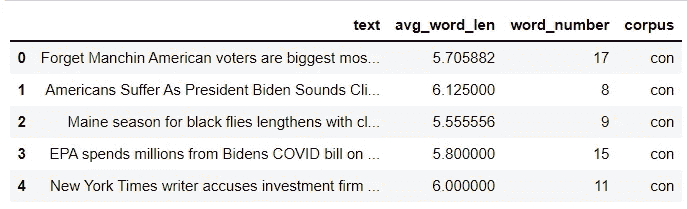
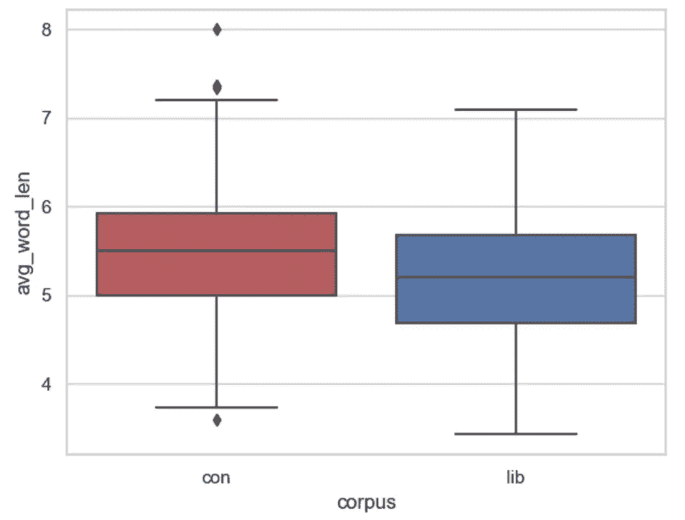
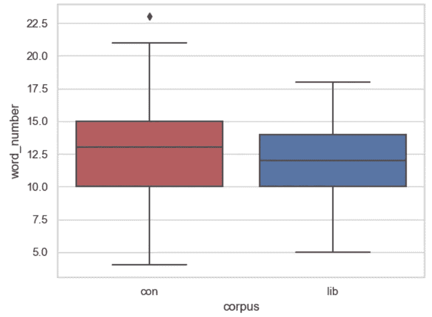
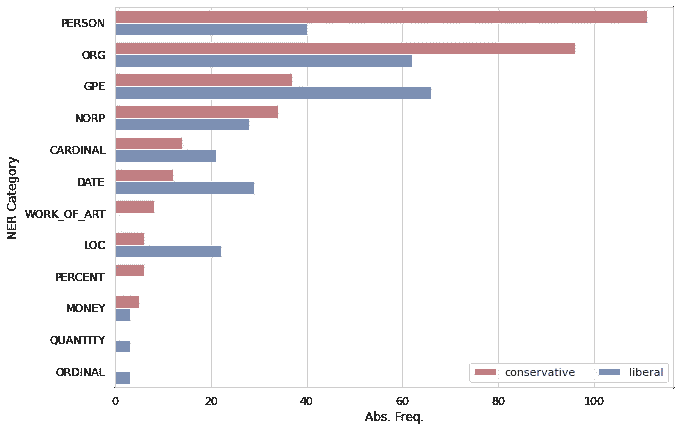
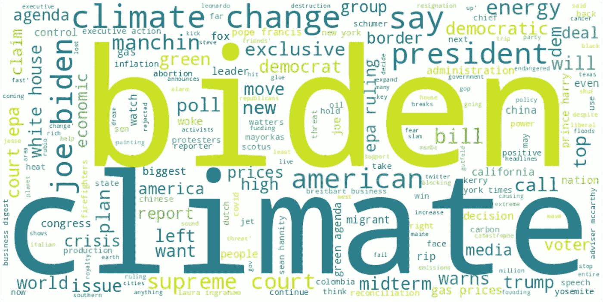
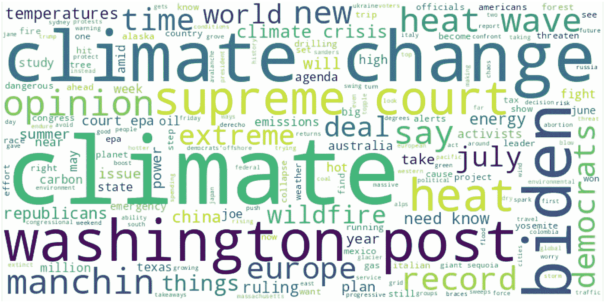
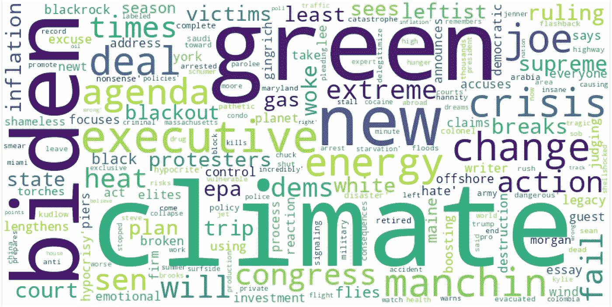
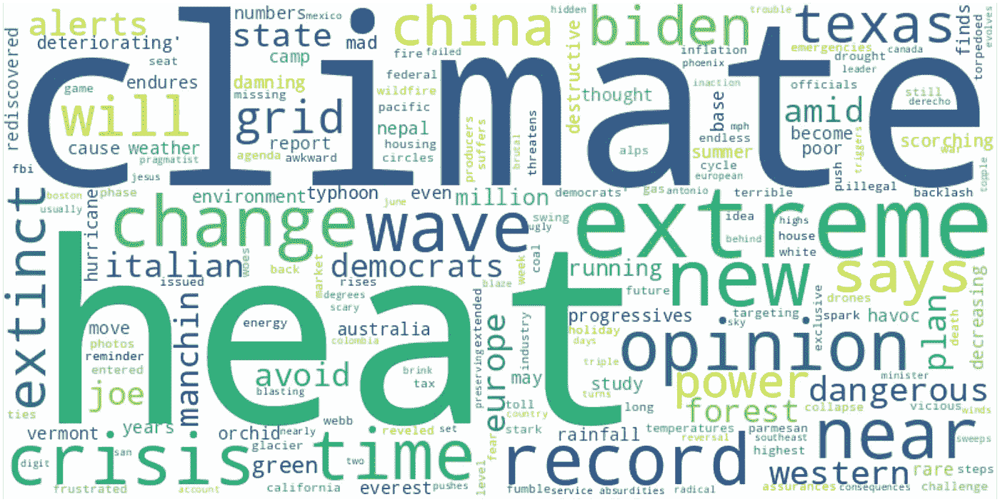

# 分析美国媒体中关于“气候变化”的论述:如何使用 Python 进行数据科学的基础教程

> 原文：<https://medium.com/mlearning-ai/analyzing-the-discourse-on-climate-change-in-u-s-1dd029e58420?source=collection_archive---------3----------------------->

# 介绍

## 这个教程的目的是什么？

在这篇文章中，我将分析一个由通过 API 收集的新闻文章组成的小数据集，以说明数据驱动研究的典型管道:

**收集数据** ➔ **清洗/转换数据** ➔ **分析/可视化数据**

本教程的受众是刚开始用 Python 做数据科学的初学者。我的目标是说明上面提到的总体方法。因此，我将把分析限制在几个用 Python 实现的易于理解的方法上。然而，我希望表明，基本方法已经可以产生有希望的初步结果，即使应用于相当小的数据集。

## 我们要怎么做？

在本教程中，我将使用 [Jupyter 笔记本](https://jupyter.org/)和编程语言 [Python](https://www.python.org/) 。

Jupyter 笔记本是可以在浏览器中显示的交互式文档。除此之外，它们允许在代码单元格中逐步执行代码，以及通过 [Markdown](https://www.markdownguide.org/) 在文本单元格中详细记录代码。Jupyter 笔记本特别适合数据驱动的研究，因为它们使分析的每个步骤都变得透明。此外，它们能够以每个人都能理解的方式呈现结果，包括没有任何编程知识的人。

Jupyter 笔记本和数据可在 [GitHub](https://github.com/thomjur/climate_change_in_us_media_tutorial) 上获得。

# 数据

我们将要处理的数据包括来自美国知名媒体网站的提到“气候变化”一词的英文文章，这些文章是我使用[新闻 API](https://newsapi.org/) 的*免费层*收集的。

在这种情况下，API ( *应用编程接口*)是使程序或用户能够从外部 web 服务器(通常以 JSON 格式)访问和检索数据的接口。关于我们的例子，查询新闻 API 允许我们使用简单的 HTTP 查询字符串以半结构化的形式检索大量的文章数据。有关查询的详细信息，请参见[新闻 API 文档](https://newsapi.org/docs)。

我们通过新闻 API 收集的一篇典型文章如下所示:

```
{
 “source”: {
     “id”: “reuters”,
     “name”: “Reuters”
 },
 “author”: null,
 “title”: “Wary shoppers muddy outlook for tech, auto firms in Asia — Reuters”,
 “description”: “Asian tech firms from chipmaker Samsung to display panel maker […]”,
 “urlToImage”: “[https://www.reuters.com/resizer/43w65Nb0zXMVr68fW8Al2pM83M8=/1200x628](https://www.reuters.com/resizer/43w65Nb0zXMVr68fW8Al2pM83M8=/1200x628)",
 “publishedAt”: “2022–07–28T08:02:00Z”,
 “content”: “July 28 (Reuters) — Asian tech firms from chipmaker Samsung to display … [+5170 chars]”
}
```

正如我们所看到的，检索到的数据包含了大量的信息。在本教程中，我们将重点关注检索到的文章的`title`字段。我们分析的数据基础包括 2022 年 6 月 **22 日**和 2022 年 7 月 **22 日**之间发表的文章，这些文章来自以下新闻网站:

**1。福克斯新闻频道
2。布莱巴特
3。华盛顿邮报。美国有线电视新闻网**

如果您还想包含其他网站，您可以使用 News API 轻松地从其他新闻网站检索附加数据。

来自四个网站的文章集合被分组为两个语料库(“语料库”是“语料库”的复数)；语料库简单的意思是文本的集合)根据网站的一般政治取向(右翼/保守派对自由派):福克斯新闻频道和布莱巴特(**语料库保守派**，195 篇文章)以及《华盛顿邮报》和 CNN ( **语料库自由派**，184 篇文章)。

# 研究问题和方法

在本教程中，将只检查文章的标题。分析过程中使用了以下方法:

**1。命名实体识别
2。文字袋
3。情绪分析**

由于本教程的重点在于展示整个数据科学管道中各个步骤之间的相互作用，因此方法的选择仅限于易于理解和易于实现的技术。对于更深入的分析，请随意添加其他方法，例如语料库语言学领域的方法或混合方法意义上的补充定性分析方法。此外，增加语料库数据的大小和种类也可能是好的。

# 收集和加载数据

首先，我们需要收集、存储文章数据并将其加载到我们的笔记本中。

在这样做之前，我们需要导入必要的库，并定义一个带有网站 id 的列表，我们希望将搜索限制在这些网站 id 上(参见 News API 文档)。接下来，我们使用我们的 auth key 从 News API 收集数据，并将收集到的数据以一种`pickle`格式存储在我们的计算机上，供以后使用。

现在，我们可以将两个语料库的数据重新加载到我们的笔记本中。为什么我们第一步没有这样做呢？我建议只收集一次数据，然后继续使用同一个数据集一段时间。一旦您获得了足够的数据并将其存储起来，下次您想要处理数据时，您可以简单地跳过第一步，开始将已经收集的数据加载到您的笔记本中。

存储数据对于与他人共享数据也很重要，从而使您的分析结果具有可再现性和透明性，即使在很久以后，数据可能不再能够通过 News API 访问。

# 探索性数据分析

尽管我们的数据基础非常简单，但深入了解我们的数据结构仍然很有趣。

在这个例子中，我们感兴趣的是两个语料库之间每个标题的平均单词长度和平均单词计数。在开始统计概述之前，我们需要准备我们的新闻数据。通常，使用现有的单词标记器(spaCy、NLTK 等)可能是个好主意。)将标题字符串拆分成单个单词。然而，在这个例子中，我们将简单地使用`split(' ')`方法和一些使用`re`模块的基本清理。

为 Corpus Liberal 新创建的“单词列表”应该是这样的(只有前三个条目):

```
[['Frozen', 'sand', 'dunes', 'created', 'by', 'climate', 'change'],
 ['In', 'Pictures', 'Wildfires', 'in', 'Europe'],
 ['Europe', 'battles', 'wildfires', 'in', 'intense', 'heat']]
```

接下来，我们将为每个语料库创建一个字典，其中包括每个标题的以下信息:

1.  **标题正文**
2.  **题目中单词的平均单词长度**
3.  **标题字数**
4.  **文集名称**

然后，我们将两个字典转换成熊猫数据帧。

新创建的数据帧的头部应该如下所示:



我们将使用 seaborn 的箱线图来可视化平均单词长度和单词计数，而不是使用熊猫的内置方法`describe()`来查看一些描述性统计数据。

这两个箱线图如下所示:



我们可以看到两个平均值的中间值。两个语料库的单词长度和单词数量非常相似。然而，保守语料库有更多的离群值，在 25%和 75%之间的范围稍大(10-15 个单词/标题)。总体而言，两个子 corpora 中的数据似乎具有相似的结构，这对于我们即将进行的比较是一个好兆头。

# 数据准备

为了应用上述方法(命名实体识别、
词袋、情感分析)，我们将使用 Python 中可用的各种模块和库，如 [spaCy](https://spacy.io/) 、 [TextBlob](https://textblob.readthedocs.io/en/dev/) 和 [NLTK](https://www.nltk.org/) (通过 [wordcloud](https://pypi.org/project/wordcloud/) )，以及用于可视化结果的 [matplotlib](https://matplotlib.org/) 和 [seaborn](https://seaborn.pydata.org/) (如果您一直遵循本教程，请注意我们已经导入了

在导入必要的模块之后，我们还为每个语料库初始化了两个 spaCy 对象。通过将标题作为字符串传递给`nlp`实例，spaCy 为我们分析标题，并解析每个语料库中的命名实体。

# 分析一—命名实体识别(NER)

> **命名实体识别** (NER)(也称为(命名)实体识别、实体分块和实体提取)是信息提取的子任务，旨在定位非结构化文本中提到的命名实体并将其分类到预定义的类别中，如人名、组织、位置[…](引自相应的[维基百科](https://en.wikipedia.org/wiki/Named-entity_recognition)文章)

对文章标题中提到的命名实体的分析可以帮助我们对文章中的中心主题有一个印象，如个人、地方、机构或数字。命名实体分析将使用 spaCy 进行。

简单看一下《保守文集》中最常提到的前 10 个命名实体就可以发现，大多数命名实体都与美国政治有关，重点是乔·拜登和民主党。然而，没有一个顶级实体与实际的气候相关主题相关。

```
[('Biden', 28),
 ('EPA', 9),
 ('US', 8),
 ('Supreme Court', 8),
 ('Joe Biden', 7),
 ('American', 6),
 ('White House', 6),
 ('Democrats', 5),
 ('Dems', 5),
 ('Congress', 4)]
```

最常用的 NER 类主要是 Person 类，其次是 organizations 类。

```
[('PERSON', 111), ('ORG', 96), ('GPE', 37), ('NORP', 34), ('CARDINAL', 14)]
```

有趣的是，自由派文章语料库中提到的实体几乎与保守派语料库中的实体没有什么不同。这表明两个语料库都在气候变化的背景下处理和讨论类似的(政治)事件。然而，与保守派语料库不同，国际话题在自由派语料库(中国、欧洲)中出现得更频繁，共和党也是一个话题。

```
[('Biden', 14),
 ('Democrats', 12),
 ('EPA', 8),
 ('Republicans', 6),
 ('Supreme Court', 6),
 ('U.S.', 6),
 ('US', 5),
 ('Europe', 5),
 ('China', 4),
 ('Texas', 4)]
```

然而，最频繁出现的 NER 类表明，文集自由似乎不太关心人的文章。相反，他们关注地缘政治实体和其他组织。

```
[('GPE', 66), ('ORG', 62), ('PERSON', 40), ('DATE', 29), ('NORP', 28)]
```

对 NER 范畴在两个子语料库中的绝对频率进行直观的比较，可以帮助我们更好地了解每个范畴在两个语料库中分布的差异。在这种情况下，绝对频率的比较是有意义的，因为每个语料库中文章标题的数量和长度大致相同。

多条形图的可视化是用基于 [matplotlib](https://matplotlib.org/) 的库 [seaborn](https://seaborn.pydata.org/) 完成的。

第一步，使用 pandas 为可视化准备和总结数据。下一步是使用 seaborn 可视化数据。

最终的可视化效果应该是这样的:



可视化表明，与自由主义者文集相比，保守主义者文集的文章明显更侧重于个人(主要是乔·拜登)和组织，例如 EPA(“环境保护局”)。另一方面，语料库自由派文章在其标题中提到了更多的数字、数据和地缘政治关联。这允许我们建立一个工作假设，即《保守文集》中的文章主要关注(与人相关的)美国国内政治，而《自由文集》也从更国际化的角度讨论气候变化话题。

# 分析二—词汇袋(BoW)

在这部分分析中，将统计各个语料库的标题中的词频(所谓的词袋[BoW]方法)。它们的分布将借助词云可视化。使用词袋分析意味着我们简单地统计每个词在各自语料库中的出现次数。例如，考虑下面的句子:

我喜欢香蕉。我也喜欢苹果。

这两个句子的单词包(以 Python 字典的形式)如下所示:

```
{"I": 2, "like": 2, "also": 1, "bananas": 1, "apples": 1}
```

我们可以简单地应用已经使用过的`Counter()`类来计算每个字符串中的术语数(然后，我们首先必须将它分成一个单词列表)。然而，由于我们也想将结果可视化为单词云，我们将利用已经完成这项工作的 [wordcloud](https://pypi.org/project/wordcloud/) 模块中的`WordCloud()`类(包括基本的词干和其他处理步骤)。

尽管这种方法很简单，但它已经能够初步表明在各自语料库中气候变化背景下讨论的相关主题。更进一步，借助于[搭配分析](https://en.wikipedia.org/wiki/Collocation)来研究“气候”或“气候变化”的具体语义邻居会很有趣，然而，这不是本教程的一部分。

语料库中保守的单词的单词云看起来是这样的:



Word cloud of the most prominent words in the Corpus Conservative.

在这个可视化中可以很容易地看到，诸如"拜登"、"美国人"、"最高法院"、"曼钦"、"白宫"、"比尔"、"民意测验"、"中期"、"能源"、"天然气价格"等词的高频出现。在文集里，保守党强调了已经提到的国内政治问题的重要性。令人惊讶的是，几乎没有任何术语与环境或气候变化的影响直接相关。

语料库 Liberal 中的单词云是这样的:



Word cloud of the most prominent words in the Corpus Liberal.

尽管在保守派文集里频繁出现的一些术语也在自由派文集里发挥了作用(“拜登”、“最高法院”)，但可视化显示，气候变化的影响和危险在自由派文集里被更明确地提及。这在诸如“热”、“热浪”、“危机”、“极端”、“记录”等术语中尤其明显。

# 分析三——情感分析

在分析的最后部分，我们将使用 Python 中可用的情感分析器来检查两个语料库中标题的一般情感倾向(正面/负面),并将它们相互比较。这将通过使用[文本块](https://pypi.org/project/textblob/)库来完成。

将该代码应用于两个语料库表明，至少根据我们应用的情感分析器，保守语料库中 17.95%的标题和自由语料库中 17.93%的标题是负面的。但是，请注意，我们将所有具有负极性值的标题都视为负面。因此，改变这个阈值也会导致不同的结果。

负面标题的百分比并不能告诉我们太多。更有趣的是，看看哪些话题在那些被我们的情感分析器视为负面的标题中被频繁提及。在这一点上，我们可以重用我们以前的单词 clouds 代码，只传递我们的负面标题列表，而不是完整的标题列表。



Word cloud of the most prominent words in the Corpus Conservative (negative titles only).



Word cloud of the most prominent words in the Corpus Liberal (negative titles only).

基于这两个词云，可以清楚地看出两个语料库中的否定句指的是不同的主题。《保守派文集》主要涉及与(国内)政治辩论相关的话题，包括乔·拜登的“绿色协议”以及其他主要是政治经济的话题，如“能源”、“通胀”或“危机”。

而《文集·自由派》中的否定句则侧重于气候危机的影响，包括不断增加的热度(“热度”、“记录”、“浪潮”)及其危险性(“灭绝”、“破坏性”、“警报”、“危险”)，但政治方面也起一定作用(“拜登”)。

# 摘要

从内容相关的角度来看，可以说三部分分析(NER、鲍、情绪)揭示了《保守文集》中的文章主要讨论美国国内气候变化的政治方面，这些方面与气候政策的影响(通货膨胀、能源安全等)特别相关。).由于这些话题在负面标题中也经常被提及，出现频率很高的词如“民主党人”和“乔·拜登”，它们显示了美国保守派媒体对气候相关政治的负面看法。

尽管《自由文集》中的文章肯定也提到了这些话题，但气候危机的具体(负面)影响显然更多地出现在《自由文集》中，无论是在美国国内还是国外。

在下一步中，这些假设应该通过以所谓的**混合方法方法**的形式对单个例子进行定性分析来测试。第一步可以是显示从两个语料库中选择的负面标题，并将它们相互比较。

在语料库保守(仅否定句)的情况下，这将从该语料库中随机打印标题，例如:

```
['Sean Hannity: The anti-Trump smear will come to a pathetic end, at least for now',
 'DC-area climate protesters shut down Maryland highway; 14 arrested',
 "Kylie Jenner Labeled 'Climate Criminal' over 17-Minute Private Jet Flight",
 "Dems 'hate' democratic process judging by reaction to Supreme Court EPA ruling: Sen. Lee",
 "Piers Morgan torches 'shameless hypocrite' Biden for trip to Saudi Arabia: Green policy a 'complete disaster'"]
```

对这五个句子的简要评估已经表明，我们最初的假设在具体的例子中也有所反映。然而，我们需要更深入的定性分析(超出了本教程的范围)来真正检查我们的假设是否充分。

总之，我希望展示用 Python 进行数据驱动的研究是多么容易。即使我们没有应用任何先进的方法(如聚类算法、搭配分析等。)，对通过新闻 API 的免费层收集的相当小的文章标题数据库的分析已经产生了有趣的见解和工作假设，用于对美国媒体中围绕“气候变化”的辩论进行基础研究。因此，使用 Python 的数据科学不一定需要计算机科学博士学位、大型数据集或复杂的研究问题。有时，检查与日常话题相关的小数据也是有趣和令人满意的，而不必花费接下来的六个月来完成这项任务。

[](/mlearning-ai/mlearning-ai-submission-suggestions-b51e2b130bfb) [## Mlearning.ai 提交建议

### 如何成为 Mlearning.ai 上的作家

medium.com](/mlearning-ai/mlearning-ai-submission-suggestions-b51e2b130bfb)