# 分析里约热内卢的暴力事件

> 原文：<https://medium.com/mlearning-ai/analyzing-the-violence-in-rio-de-janeiro-7b90dda68dcb?source=collection_archive---------2----------------------->


Photo by [Maxim Hopman](https://unsplash.com/@nampoh?utm_source=medium&utm_medium=referral) on [Unsplash](https://unsplash.com?utm_source=medium&utm_medium=referral)

你好，这是我的第三篇文章，我正在努力提高我的英语和写作技巧。很抱歉这篇文章中的错误。

里约热内卢，你听说过吗？它是巴西与圣保罗齐名的城市之一。里约热内卢有近 700 万人居住在那里，其大都市地区约有 1300 万人。它以科帕卡巴纳和伊帕内马海滩以及 38 米高的救世主耶稣雕像而闻名(见下文)。这是一座美丽而历史悠久的城市，有许多建于葡萄牙殖民地时期的建筑。我来自巴西，但是我从来没有机会去参观这个城市，但是如果你去巴西旅游的话，这是一个你必须去的城市。

但没有什么是完美的，里约热内卢有巨大的社会问题，如社会不平等(富人住在海滩，穷人住在贫民窟，城市有很多大贫民窟)和腐败(该州和城市有几个市长和州长在过去 5 年被捕)。

这些因素导致了这个城市的高犯罪率。在这篇文章中，我将向你展示一些关于犯罪的信息以及疫情对犯罪的影响。


Photo by [Raphael Nogueira](https://unsplash.com/@phaelnogueira?utm_source=unsplash&utm_medium=referral&utm_content=creditCopyText) on [Unsplash](https://unsplash.com/s/photos/rio-de-janeiro?utm_source=unsplash&utm_medium=referral&utm_content=creditCopyText)

我们将使用的数据集来自里约热内卢公共安全研究所。该研究所收集了几个警察局的警察记录并制作了一个数据集，你可以在这里看到它的网站(葡萄牙语)。

让我们看一些关于数据集的简单信息。

数据集有多少行和列。

```
print("Rows/inputs: **{}**".format(df.shape[0])) 
print("Columns/variables: **{}**".format(df.shape[1]))
```

行/输入:361，列/变量:56

让我们看看列/变量:

```
df.columns
```

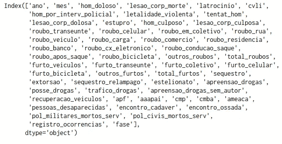

这里有一些犯罪，像谋杀、各种抢劫、强奸和盗窃。

让我们看看数据集的前 5 行:

```
df.head()
```

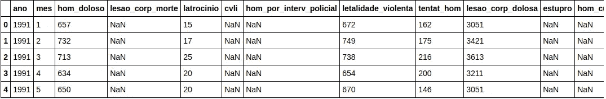

现在最后 5 行:

```
df.tail()
```

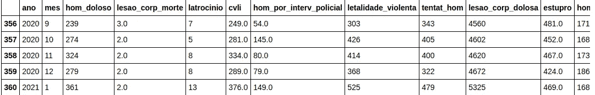

在这里我们可以看到一些东西:

*   日期设置介于 1991 年和 2021 年之间(2021 年初)。
*   在几行中，我们可以看到许多缺失值(NaN)。

但是为什么会有那么多缺失的价值观呢？我认为有一些原因:

*   缺乏关于特定主题的信息。
*   将纸张转换为计算机时数据丢失(1991 年信息是用纸写的)。
*   有些罪行一开始不算(比如 1991 年)，过了年才开始算。
*   数据管理不善。

与其他国家相比，巴西没有制作好数据集的文化。

现在让我们看看每个变量缺失值的百分比。

```
((df2.isnull().sum() / df2.shape[0])*100).sort_values(ascending = False)
```

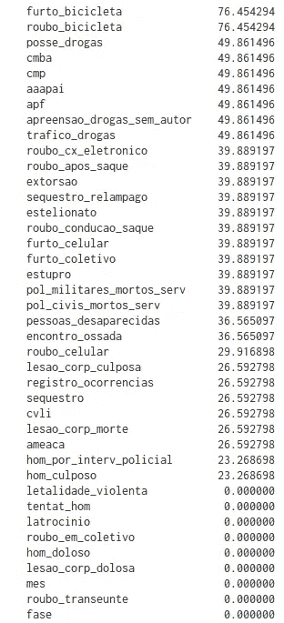

有些犯罪(自行车盗窃)几乎有 80%的丢失值！

我们将处理没有这个问题的数据。

首先，我们将了解车辆抢劫和盗窃。让我们看看彼此的意思。

```
vehicle-rob =  round(df2.roubo_veiculo.mean())vehicle-steal = round(df.furto_veiculos.mean())print("Vehicle rob mean: {}".format(vehicle-rob))print("Vehicle rob mean: {}".format(vehicle-steal))
```

劫车平均数:2443，劫车平均数:1648

除了这两个数字，还有回收车辆的数量:

```
Vehicle-recovered = round(df.recuperacao_veiculos.mean())print("Recovered vehicle mean: {}".format(Vehicle-recovered))
```

回收车辆平均数:1757 辆

现在，我们将看到使用此公式找回的汽车的百分比:

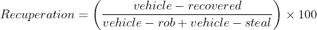

```
rec = (vehicle-recovered / (vehicle-rob + vehicle-steal)) * 100print("Percentage of revovered vehicles: {}%".format(round(rec)))
```

找回车辆的百分比:43%

所以 10 辆车中有 4 辆被警方找回。

现在让我们看看谋杀:数据集中谋杀的最大最小数量是多少:

```
print("Max : {}".format(df2.hom_doloso.max()))print("Min: {}".format(df2.hom_doloso.min()))
```

最大值:831，最小值:239

让我们看看这些数字是哪一年出现的。

```
df2[df2.hom_doloso == 831]df2[df2.hom_doloso == 239]
```

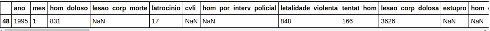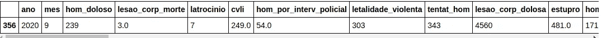

看来杀人犯正在减少。但这是真的吗？

下图显示了随着时间的推移谋杀。

```
df2.groupby(["ano"]).mean().hom_doloso.plot(grid=True);plt.title("Murder between 1990 and 2021");
```

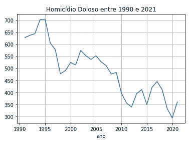

现在我们可以肯定的是，随着时间的推移，谋杀正在减少。

# 新冠肺炎对里约热内卢犯罪的影响:


Photo by [United Nations COVID-19 Response](https://unsplash.com/@unitednations?utm_source=medium&utm_medium=referral) on [Unsplash](https://unsplash.com?utm_source=medium&utm_medium=referral)

当新冠肺炎变得全球化时，世界各地的城市进入无限期封锁状态，以避免病毒感染。食品杂货、餐馆、办公室和商店等商业不得不关门。几个人开始在家工作。所有这些都是为了避开人群密集的地方。

但是有一个问题:巴西有一个巨大的针对女性的暴力问题，报告显示，像强奸、杀害女性和家庭暴力这样的犯罪有很高的统计数据。

虽然家对每个人来说都应该是一个安全的地方，但研究表明，60%对女性的侵犯发生在自己家里。在 80%的案件中，犯罪者是妇女的前伴侣的伴侣。因此，疫情对几个女人的生活产生了不好的影响。

让我们看看在 2019 年和 2020 年(当 Covid 成为全球性的)有多少攻击

```
print("Mean of assault in Rio de Janeiro: {} for 2019 and {} for 2020".format(round(df2.groupby(["ano"]).lesao_corp_dolosa.mean()[2019]),round(df2.groupby(["ano"]).lesao_corp_dolosa.mean()[2020])))
```

里约热内卢袭击手段:2019 年 5305 起，2020 年 4146 起。

等等，为什么 2020 年殴打案件比 2019 年少？2020 年不应该因为之前讨论过的事情出现更多病例吗？

事情是这样的:**每个人都在家里，避免公共场所，所以犯罪的通知往往会下降**。这是因为:

*   受害者不想抓住新冠肺炎，所以他们不会去警察局对侵犯者提出正式指控。
*   害怕侵犯者发现受害者在报警而伤害更大。

让我们只获取 2020 年的输入/行，只研究这一次。

```
ano_2020 = df2[df2.ano == 2020]ano_2020
```

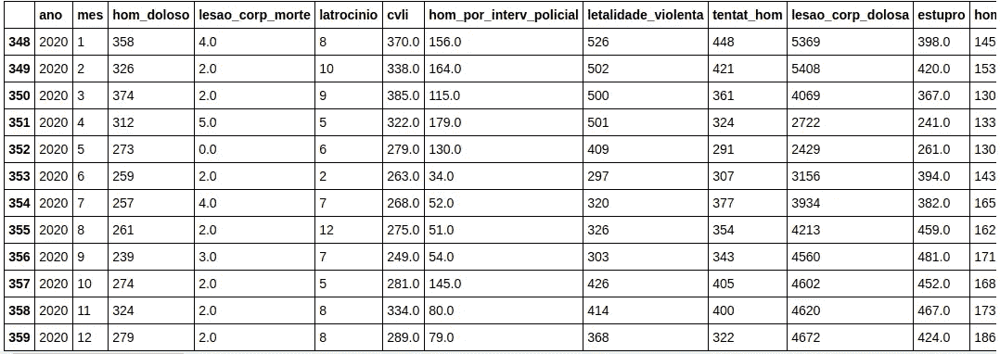

好了，现在让我们用图表来看看这些信息。首先是 2020 年的突击图。

```
plt.plot(ano_2020.mes , ano_2020.lesao_corp_dolosa);plt.xlabel("Month");plt.ylabel("Assault");plt.title("Assault in 2020");
```

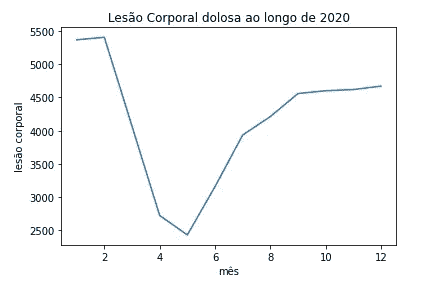

这就有意思了！二月之后，袭击事件大幅减少，这正好发生在里约热内卢开始封锁的时候。

在那之后，你可以看到病例在增加。这是隔离放松的反应。这个数字几乎和封锁前的数字一致。

所以我们不能说:“好，越来越好了！病例在减少！”因为这不是现实。

但这种模式也发生在其他几起犯罪中，让我们来看看图表:

```
fig , axes = plt.subplots(2,2 , sharex=True)xticks = np.arange(1,13,1)axes[0,0].plot(ano_2020.mes , ano_2020.roubo_celular)axes[0,0].set_title("Phone rob")axes[0,0].set_xlim([1,12])axes[0,0].set_xticks(xticks)axes[0,1].plot(ano_2020.mes , ano_2020.roubo_em_coletivo)axes[0,1].set_title("Bus rob")axes[0,1].set_xlim([1,12])axes[0,1].set_xticks(xticks)axes[1,0].plot(ano_2020.mes , ano_2020.roubo_veiculo)axes[1,0].set_title("Vehicles rob")axes[1,0].set_xlim([1,12])axes[1,0].set_xticks(xticks)axes[1,1].plot(ano_2020.mes , ano_2020.roubo_bicicleta)axes[1,1].set_title("Bikes rob")axes[1,1].set_xlim([1,12])axes[1,1].set_xticks(xticks)plt.tight_layout()plt.show()
```

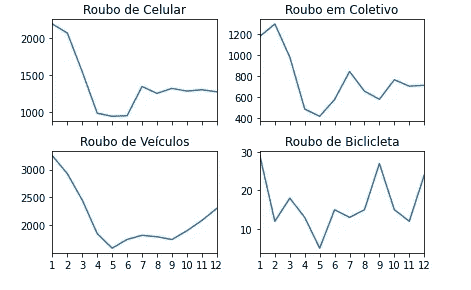

你能看到它们都有相同的图案吗？

当然，并不是所有的人都因为通知而减少了，有些人减少只是因为房子外面的人少了。

# 结论

我们对数据集进行了简单的可视化，这是一个真实的数据集(不是一个干净和令人愉快的 Kaggle 数据集)，正因为如此，这里有很多问题，如丢失值。数据科学家花更多的时间修复数据集，而不是分析。没有一个好的干净的数据集，我们就无法做出卓越的分析。

我们在许多犯罪案件的数量中看到了疫情的影响。这会让我们得出错误的结论。

我希望你喜欢这篇文章，并随时发表评论。呆在家里！