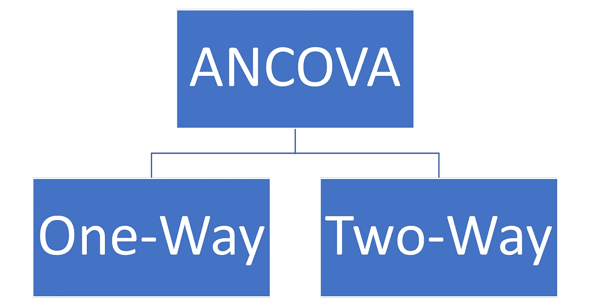

# 协方差分析——简要概述

> 原文：<https://medium.com/mlearning-ai/ancova-analysis-of-covariance-a-brief-overview-cefc03c06459?source=collection_archive---------0----------------------->

# **简介**

当我们混合 ANOVA 和回归分析时，我们遇到了 ANCOVA，它通过一次考虑一个独立变量而不受其他变量的影响，为我们提供了额外的信息。

这可以用下面的例子来解释。我们想知道慢跑、跑步和散步这三种运动中哪一种运动减肥最快。一个常规的方差分析可以很容易地告诉我们哪一个效果好。然而，如果我们想看到这三个以外的东西，并想进一步研究，ANCOVA 将帮助我们找出哪些其他因素可能影响结果，即医疗条件、药物滥用、饮食习惯等。

# **什么是反变量？**

协变量给方差分析增加了趣味，使之成为协方差分析。协变量是与我们的响应变量协变的连续变量。因此，它影响了研究的结果。协变量可以是直接相关的独立变量，也可以是不想要的变量或混杂变量。

简而言之，实验参与者的特征(不包括实际治疗)将被视为协变量。例如，植物如何耐受干旱将受到植物大小的影响，排除了干旱水平的实际处理。这里工厂的规模是一个协变量，因为它可以影响结果或治疗变量。

关于协变量，我们必须记住几件事

1.观察和测量，而不是操纵变量

2.连续变量

3.控制变量

# **什么是控制变量？**

这些是在研究中保持不变或有限的变量。这些变量在研究中不是很重要，但是它们受到控制，因为它们确实影响结果。可以通过在整个研究过程中保持它们的值来直接控制它们(例如，通过在实验中保持恒定的压力)，也可以通过使用随机化或统计控制等技术来间接控制它们(例如，在统计测试中考虑参与者的特征，如年龄)。

# **an cova 测试中的假设**

*   协变量和因子变量的独立性
*   协变量是连续的
*   数据正态性
*   没有极端异常值
*   差异必须是同质的
*   组间观察的独立性

# **为什么是安科瓦？**

Tabachnick 和 Fidell (2013)提出了 ANCOVA 的 3 种主要应用:

1.提高 f 检验实验的功效

2.等价非等价群

3.在多个因变量的情况下调整均值。

所以总的来说，它回答了这个问题，“由于协变量的影响，在因变量上调整分数后，均值差异或交互效应可能是偶然发生的吗？”

# **类型**

Types of ANCOVA

# **单向协方差**

让我们用一个例子来理解这一点:

第一组:每天学习 8 小时

**第二组:**每天学习 12 个小时

**第三组**:每天学习 16 个小时

**协变量:**智商水平

**兴趣变量:**评分

这个例子中的零假设:在考虑了他们的智商水平后，所有三个组的平均成绩都不同

实验结束后，如果 F 统计值高而 p 值低，这意味着至少有一组的平均成绩有显著差异。然而，需要事后测试来进一步调查。

# **双向协方差**

在对一个或多个连续协变量进行调整或控制后，当两个自变量对连续因变量有任何交互作用时(即，如果存在双向交互作用)，我们使用双向协方差分析。

**示例:**

**自变量 1:** 药物(分组:当前、实验)

**自变量 2:** 风险(分组:低、高)

**因变量:**糖尿病(血液中的葡萄糖浓度)

**连续协变:**年龄

测试的目的是:

1.与标准药物相比，实验药物降低糖尿病水平的效果更好还是更差

2.这两种药物的效果是否不同取决于老年患者被归类为高风险还是低风险。

在双向协方差分析中，统计学上显著的交互作用效应是优先考虑的。如果发现了具有统计学意义的双向相互作用效应，这表明，在对年龄进行调整或控制后，即我们的协变量，这两种药物在低风险和高风险老年患者中的作用是不同的(即，该药物对糖尿病的作用取决于风险水平)。根据我们得到的这些结果，我们将确定我们必须解释双向协方差分析中的哪些效应，以及是否需要进行任何事后检验。

# **参考**

*   [https://www.statology.org/ancova/](https://www.statology.org/ancova/)
*   [https://www.statisticshowto.com/covariate/](https://www.statisticshowto.com/covariate/)
*   [https://www.scribbr.com/methodology/control-variable](https://www.scribbr.com/methodology/control-variable)
*   [https://www . statistics solutions . com/general-uses-of-analysis-of-协方差-ancova/](https://www.statisticssolutions.com/general-uses-of-analysis-of-covariance-ancova/)
*   [https://www.statstest.com/one-way-ancova/](https://www.statstest.com/one-way-ancova/)
*   [https://statistics . laerd . com/SPSS-tutorials/two-way-an cova-using-SPSS-statistics . PHP](https://statistics.laerd.com/spss-tutorials/two-way-ancova-using-spss-statistics.php)

 [## Mlearning.ai 提交建议

### 如何成为 Mlearning.ai 上的作家

medium.com](/mlearning-ai/mlearning-ai-submission-suggestions-b51e2b130bfb)