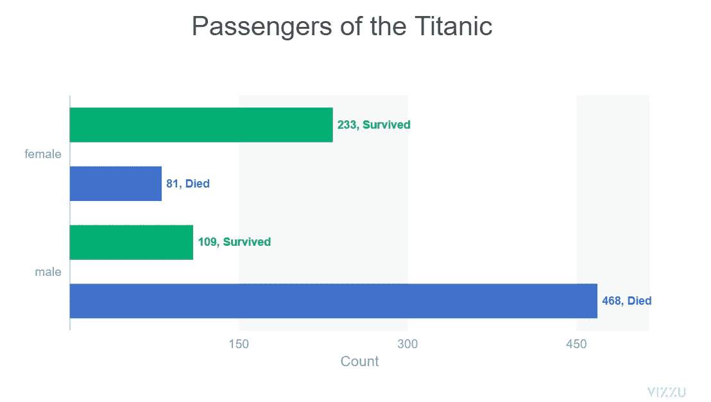

# Python 中的动画可视化

> 原文：<https://medium.com/mlearning-ai/animated-visualizations-in-python-a16715bd315e?source=collection_archive---------5----------------------->

## 使用 ipyvizzu 创建动画可视化

Visualization (Source: By Author)

数据可视化有助于理解隐藏的数据模式和分析数据想要表达的内容。通过创建不同类型的图表和绘图，我们可以了解不同数据集与目标变量之间的关联和共线性。