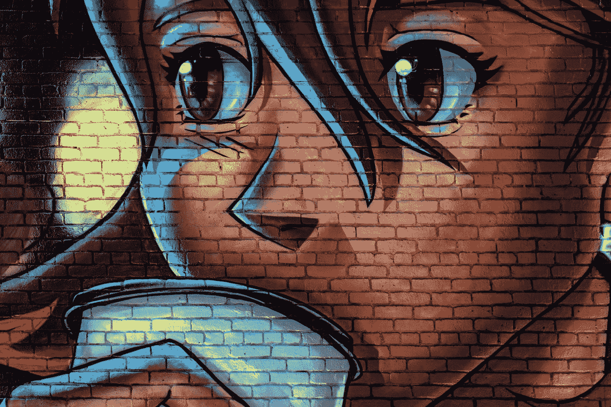
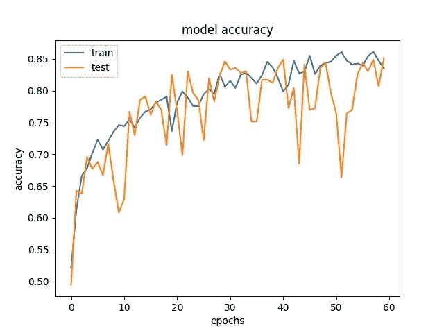
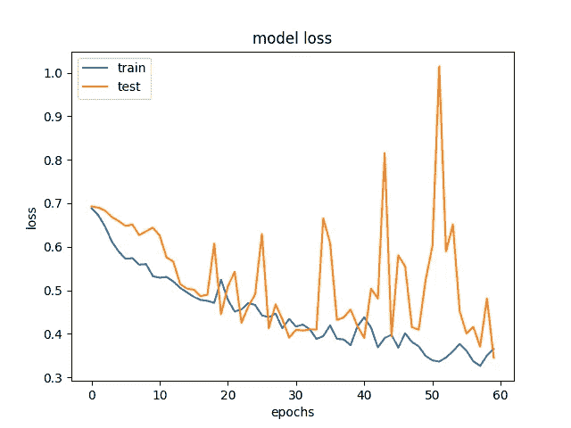
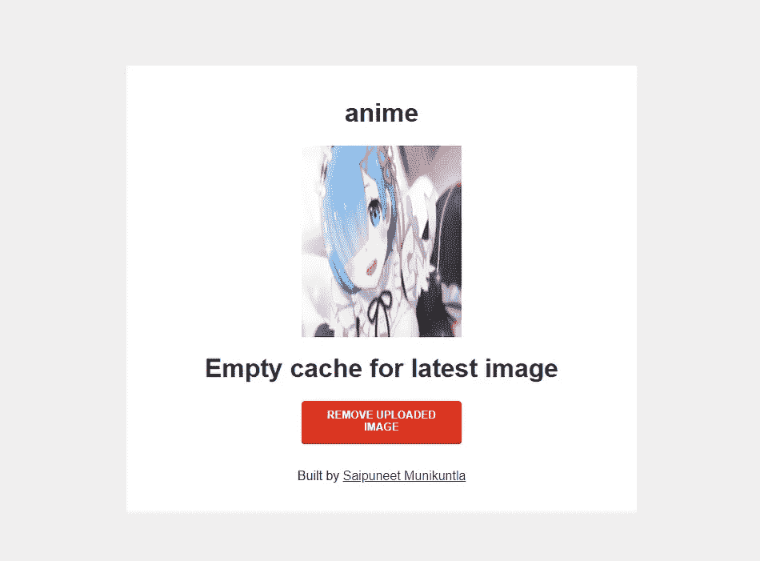
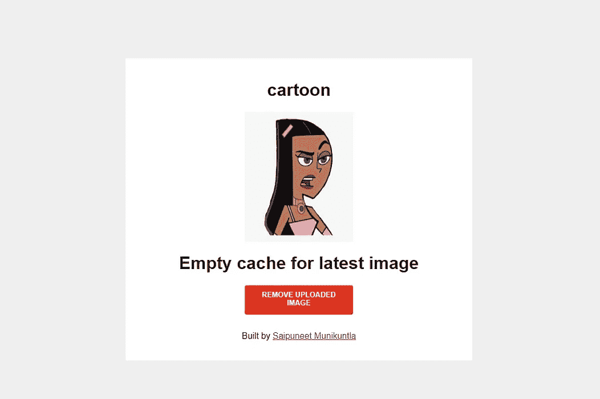

# 动漫/卡通女孩分类器

> 原文：<https://medium.com/mlearning-ai/anime-cartoon-girl-classifier-bccef797f6d9?source=collection_archive---------1----------------------->

Photo by [Tim Mossholder](https://unsplash.com/@timmossholder?utm_source=medium&utm_medium=referral) on [Unsplash](https://unsplash.com?utm_source=medium&utm_medium=referral)

动漫的艺术风格通常可以与卡通区分开来，但我想知道这是否可以通过深度学习模型来识别，

所以在这篇文章中，我将从头到尾经历一个机器学习项目，从获取数据到部署模型。

最终目标是使用其他人的艺术风格重新创造一个动画/卡通形象，但由于数据有限，在这篇文章中，我将改为对动画/卡通女孩进行分类。

> 问题陈述:对动漫和动漫少女进行分类

# **流程**

*   获取数据
*   数据预处理
*   型号选择
*   使用 flask 创建一个 Web 应用程序
*   在 Heroku 上部署您的应用

# **获取数据**

为了收集数据，我使用了 bing 的图像 API。我跟踪了 [PYImageSearch](https://www.pyimagesearch.com/2018/04/09/how-to-quickly-build-a-deep-learning-image-dataset/) 的博客文章，收集了动漫少女和卡通少女的数据。

收集完数据后，我给这些数据贴上了“动漫女孩”和“卡通女孩”的标签。

# 数据预处理

Data preprocessing script

1.  **灰度转换**:假设我的模型不需要学习颜色，我将我的图像输入转换成灰度。我想让我的模型了解艺术风格的差异，因此灰度数据似乎就足够了。
2.  **图像大小调整:**这是在不同图像大小上测试了我的模型后完成的，120*120 像素是我的 GPU 能够容纳的最大值。
3.  **数据集分割**:测试集被分割为 25%。
4.  **数据归一化:**在分割测试和训练数据集之后，我通过将测试和训练特征集除以 255 来归一化数据。
    **注意**:每个像素值都有一个从 0 到 255 的值，其中 0 代表最低强度，即黑色，255 代表最高强度，即白色。
5.  **标签二进制化器:**我使用 Label Binarizer 对我的字符串类进行一次性编码。
6.  **数据重塑:**根据后端重塑训练和测试特征以包括通道。在 Keras 中，默认情况下，通道被配置为使用“channels_last”。这可以在 Keras 配置文件中设置为使用“channels_first”或“channels_last”。

# 型号选择

Model Code

最终模型是在多次反复测试模型后选择的，即(观察训练/验证损失和准确性)，通过改变层数并添加批量归一化和剔除以及 l2 正则化。

## 模型摘要

在这个模型中，我有四个层，其中前两层结合使用了两个 Conv 和最大池层。在第一层中使用批量标准化。

点击下面的 URL 来可视化神经网络模型。

 [## 模型图

### 神经网络模型图的绘制](https://ibb.co/YtdKsDL) 

## 精确度和损耗曲线

Model Accuracy for 60 epochs

Model loss for 60 epochs

# 使用 flask 创建一个 Web 应用程序

下一步是创建 web 应用程序。在这一部分，我使用 flask 构建了一个简单的 web 应用程序。

上传后，我添加了一个上传按钮、一个提交表单和一个删除按钮。只有 2 个 HTML 页面，应用程序将在它们之间旋转。整个应用相当简单，你可以点击[这里](https://github.com/saipuneet357/Anime_Classifer)获取 GitHub 的源代码。

Flask Webapp

造型和 JS 的灵感来自 [**这个文件上传**](https://codepen.io/aaronvanston/pen/yNYOXR) 由开发者亚伦·万斯顿创作。

# 在 Heroku 上部署您的应用

web 应用程序完成后，最后一步是将应用程序部署到 Heroku 服务器上。

Anime and Cartoon

最终部署的 web 应用程序可在以下网址找到:

 [## 动漫少女 vs 卡通少女分类器

ani-car-class.herokuapp.com](https://ani-car-class.herokuapp.com/) 

# 考虑未来的改进

*   艺术风格转换使用动画风格或相反的风格重新创建卡通形象
*   使用像 VGG16 这样的预训练网络作为我现有模型的特征。