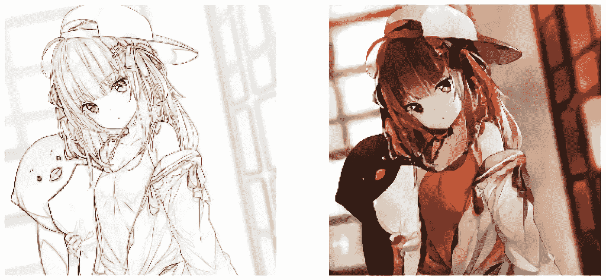

# 深度学习项目—动画插图着色—第 1 部分

> 原文：<https://medium.com/mlearning-ai/anime-illustration-colorization-with-deep-learning-9e7d7de7ee0b?source=collection_archive---------0----------------------->

sketch source (left): [🐧 by Hitsu](https://www.pixiv.net/artworks/71852423)

# 介绍

这个项目旨在创建一个深度学习模型，学习从非彩色动漫插画(素描)到彩色版本的映射。我们将使用 Pix2Pix GAN 来实现这一点。

# 1.资料组

首先，我们需要一个数据集，一个包含一组非彩色…