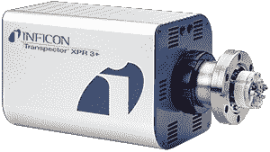
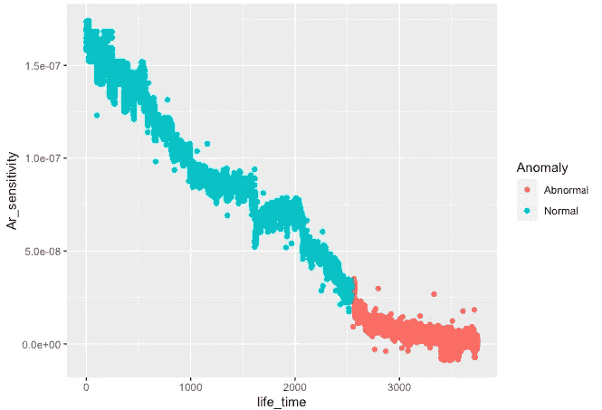
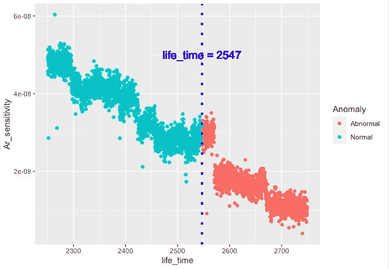
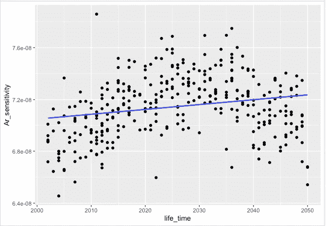
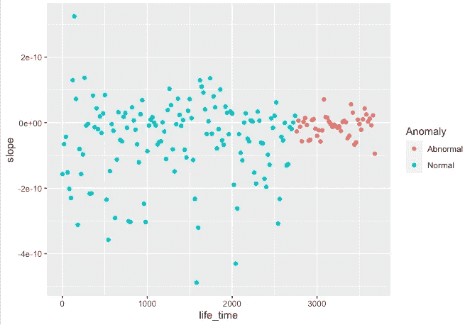
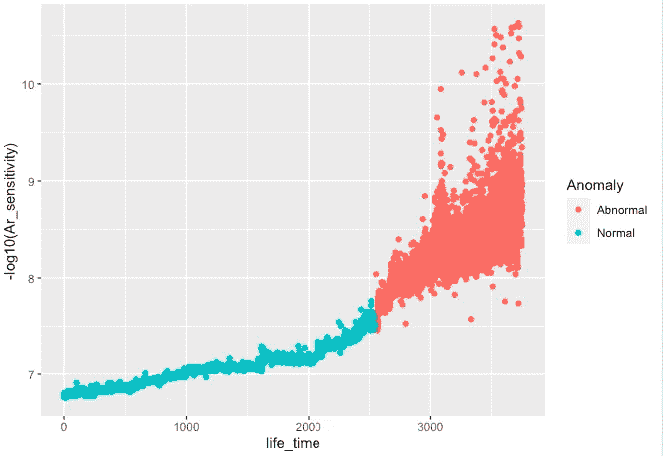
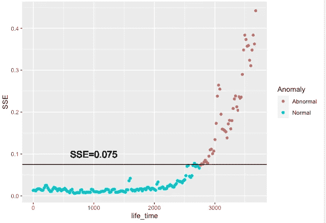
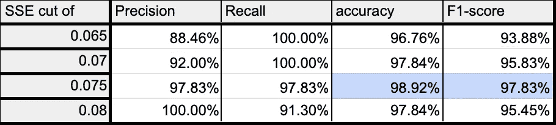

# 残余气体分析仪中的异常检测

> 原文：<https://medium.com/mlearning-ai/anomaly-detection-in-ar-sensitivity-ac01ac7edbc9?source=collection_archive---------4----------------------->

Gas Analyzer machine

星期天早上，我接到一个电话，是我在部队服役时认识的一个朋友打来的。他问我:“你对线性回归有多熟悉？我的硕士论文需要帮助:(”

喂？我当然知道线性回归！

# 动机:

设备异常检测系统的开发可以有助于在整个系统故障发生之前识别错误的来源，并且可以区别于被动维护，在被动维护中，维护工程师仅在机器异常时根据机器状态来诊断故障。

该项目的目标是避免半导体物理气相沉积(PVD，physical vapor deposition)工艺设备中使用的残余气体分析仪意外停机。这样做的好处不仅可以一天 24 小时监控，减少生产机器停止测试机器以获得生产力。

根据经验，当来自残余气体分析仪的 Ar 灵敏度信号变弱时，这意味着异常发生。**统计学上的说法，我们想定义一个可以在残余气体分析仪出现故障时立即识别故障的指标。**

# 数据:

Lifetime verse Ar sensitivity

根据数据，我们可以看到当寿命> 2547 时，出现异常信号。

# 移动窗口:

我们首先使用截断回归的斜率来识别点。也就是说，我们首先将生命期作为移动窗口，每个窗口包含 50 个生命期，窗口每次向右移动 20 个生命期。

因此，第一个窗口的寿命在 1 到 51 之间，第二个窗口的寿命在 21 到 71 之间，依此类推。在本例中，我们创建了 185 个窗口。

# 方法 1:原始数据中的线性回归斜率模式

然后我们从 ar 灵敏度和寿命拟合 185 线性回归。

Linear regression between 2000 to 2051

我们计算了 185 个窗户的斜率。下图是每条回归线的斜率。

**答对了！我们发现了这个规律:如果斜率的方差很小，那么这就是异常！**

# 但是……

在这种情况下，它还没有结束。我们仍然需要

1.  定义“多小才算小？”
2.  定义寿命间隔的长度，并计算间隔中的方差

有什么聪明的方法可以避免这种情况吗？是啊！当然

# 方法 2:对转换后的数据进行回归

Ar 灵敏度的尺度太小了！让我们取对数 10。

是啊！这里的模式非常清楚。异常是发散的！

然后，我们根据预定义的窗口拟合 185°回归线，并计算每个模型的 SSE(误差平方和)。散点图如下。

我创建了一个表格来寻找 SSE 的最佳截止值(正值表示异常)

*   精度:σ真阳性/σ预测条件阳性
*   回忆:σ真阳性/σ预测阳性
*   准确度:σ真阳性+σ真阴性/σ总人口
*   f1-分数:2 精确回忆/精确+回忆

细节可以参见[混淆矩阵](https://en.wikipedia.org/wiki/Confusion_matrix)

这里我们可以看到，当 SSE 截止值为 0.075 时，性能最佳。

# 结论

在实践中，我们如何检测异常？

1.  通过取-log10 转换 Ar 灵敏度
2.  每 50 个生命周期拟合一次回归
3.  从模型中计算上证指数
4.  如果上证> 0.075，则止损。把它定义为异常点！

 [## Mlearning.ai 提交建议

### 如何成为 Mlearning.ai 上的作家

medium.com](/mlearning-ai/mlearning-ai-submission-suggestions-b51e2b130bfb)