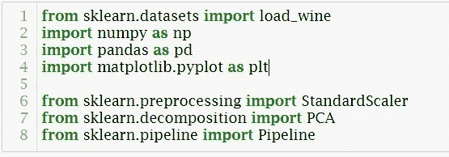
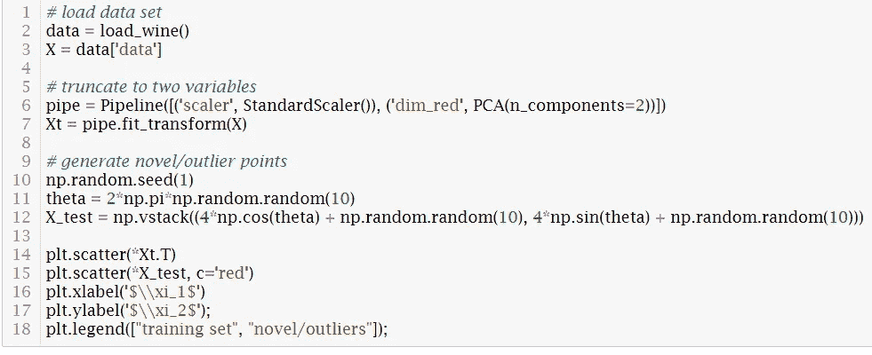
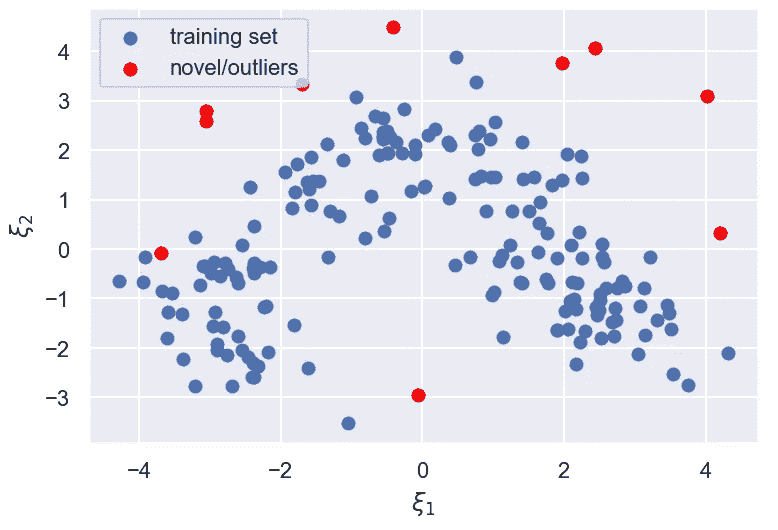
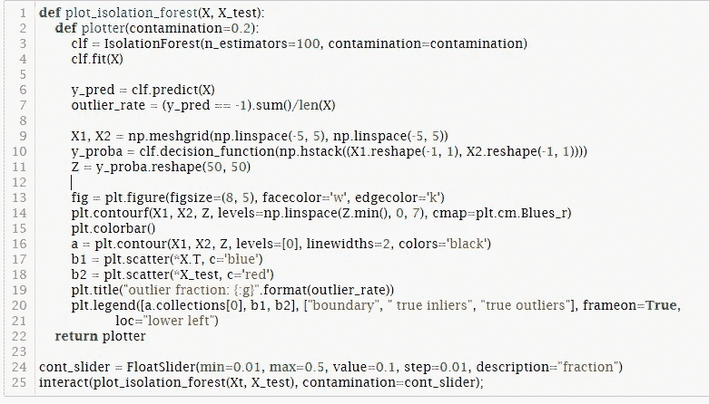
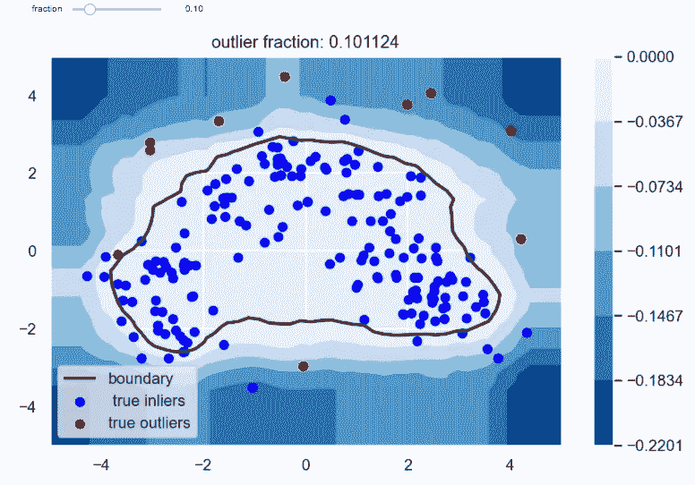
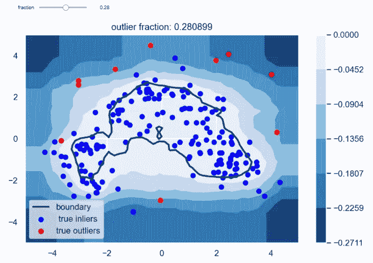

# 基于机器学习的异常检测

> 原文：<https://medium.com/mlearning-ai/anomaly-detection-with-machine-learning-8fa942fb5adc?source=collection_archive---------0----------------------->

# 介绍

一般来说，每个数据科学家或机器学习工程师都不止一次地做过异常检测分析。很多时候，我们需要在数据集中找到异常和不寻常的值或数据点。别担心，这本指南会告诉你如何开始——我们到底在说什么？

# 什么是异常检测？

异常检测是一种数据预处理技术，可以发现数据集的异常值，即那些不属于数据集的数据点。识别这些数据点可以达到多种目的，例如

1.  在拟合机器学习模型之前移除训练集中的异常值。
2.  分析一组观察结果，以确定流程是否有问题。例如，是否有任何异常服务器日志*可能*指示安全漏洞，指向异常网络流量。

判断事物是否异常的应用分为两类，**异常值**或**新奇检测**。这两个术语经常被混为一谈，但确实有不同的定义。

**异常值检测:**识别显著偏离其余观测值的过程。用包含离群值的数据集来训练离群值检测模型；它并不“干净”。该模型学习一个点可以偏离多少来被分类为异常值。

**新颖度检测:**通过用未被离群值“污染”的数据集训练模型来识别新颖点的过程。该模型学习包含所有正常/常规点的一个或多个边界。任何位于这些边界之外的点都是新的，因此是新颖的。

区别是微妙的，但某些算法被称为异常值或新奇检测。然而，在实践中，无论应用程序是纯粹的新奇还是离群点检测，这两个类都可以很好地工作。说了这么多，让我们开始吧——准备好了吗？

# scikit 中的实现-学习

在 scikit-learn 中，异常检测算法是无监督的学习器。我们将在“scikit-learn”中讨论两种异常检测模型， ***一类******SVM***和 ***隔离林*** 。两者都是无监督学习模型，具有相似的界面；两种主要方法是:

**拟合(X):** 用数据集‘X’拟合/训练模型。
**predict(X)** :确定‘X’中的观察值是内联值‘1’还是界外值‘1’。
**decision _ function(X)**:用于确定一个点是否为内/界外点的得分/度量。对“决策函数”方法的输出的解释是特定于算法的。

# 单类支持向量机

一类分类方法用于检测数据集中的异常值和异常值。基于支持向量机(SVM)评估，一级 SVM 应用一级分类方法进行**新颖性检测**。这是我对模型的简单理解。点击了解更多关于[一级 SVM 的详情。](https://scikit-learn.org/stable/modules/generated/sklearn.svm.OneClassSVM.html)

根据我的知识，让我们使用单级 SVM 来看看它是如何工作的。

我们将使用 scikit-learn 提供的**葡萄酒数据集**。数据集的细节并不重要，只是它有 178 个观察值和 13 个数字特征。

让我们采取以下步骤:

# 1.导入模块和数据集

导入 numpy，pandas，matplotlib，modules。让我们导入 [StandardScaler](https://scikit-learn.org/stable/modules/generated/sklearn.preprocessing.StandardScaler.html) 来缩放我们的数据，导入 [PCA](https://scikit-learn.org/stable/modules/generated/sklearn.decomposition.PCA.html) 来对葡萄酒数据进行降维，导入 [Pipeline](https://scikit-learn.org/stable/modules/generated/sklearn.pipeline.Pipeline.html) 来组装几个步骤，这些步骤可以在设置不同参数的同时进行交叉验证。

(Image Source: Author)

我们不需要知道葡萄酒数据的细节。

让我们把我们的分析形象化

# 2.形象化

加载数据， **X** 。缩放数据，通过设置 PCA***n _ components***= 2 来使用两个变量。将整个流程封装在一个管道中。生成一些随机点 **X_test** ，以代表异常值。在相同的轴上绘制葡萄酒数据 X 的散点图和 X_test 的散点图。

(Image Source: Author)

(Image Source: Author)

所以蓝点代表我们的训练点。红色的代表异常值。我们注入了这些新的异常值，因此它们倾向于存在于我们的蓝点空间的外围(外部边界)。

现在，让我们训练一个单类 SVM 模型来学习一些决策边界，学习内联者位于何处，边界之外的一切都是离群值——红苹果！

下面的可视化图绘制了数据以及确定某个点是否被视为新颖的边界。图中的填充轮廓线表示一类 SVM 的决策函数值。***decision _ function***方法报告点和超平面之间的有符号距离(负表示在错误的一侧)。可视化允许你修改 ***v*** ，假阳性率的上限。你也可以把 ***v*** 看作是在定义正则点的区域之外有一个新的但是正则的观测的概率。随着 ***v*** 的减小，包含规则点的区域增大。与标准的内核化 SVM 一样，您可以更改内核函数，但是[***RBF***](https://scikit-learn.org/stable/modules/generated/sklearn.gaussian_process.kernels.RBF.html)通常效果最好。

(Image Source: Author)

# 隔离森林

隔离林是一种使用决策树的异常值检测算法。隔离林的工作原理是，离群点是具有与其他数据(内联者)显著不同的特征的点。

隔离林通过随机选择一个要素，然后随机选择所选要素的最大值和最小值之间的拆分值来“隔离”观察值。详情请点击 [**此处隔离林**](https://scikit-learn.org/stable/modules/generated/sklearn.ensemble.IsolationForest.html) **。**

## 形象化

让我们想象一下在葡萄酒数据集上使用隔离森林的结果。

导入模型

(Image Source: Author)

让我们使用训练数据 X，异常值 X_test。绘制散点图和等高线图。让我们设置 ***n_estimator*** 参数，集合中基本估计量的数量，以及 ***污染*** 参数，数据集的污染量，即数据集中异常值的比例。

等高线图向我们揭示了价值决定函数，因此负值将是异常值。

黑线代表边界。里面的所有东西都将被归类为内层，外面的所有东西都将被归类为外层。

我们将 ***污染*** 参数或数据集中异常值的比例设置为 10%或 0.1 的分数。当我们用这个污染分数训练模型时，我们的训练集的 10%将被标记为异常值。

如果我们将污染分数(滑块)增加到 0.28(我们训练数据的 28%)，我们会注意到边界(黑线)后退，这是意料之中的，因为我们说我们的训练数据中有很大一部分异常值，因此边界应该缩小，这样它就不会覆盖太多的训练观察值。

# 问题

1.  隔离森林和一类 SVM 哪个算法的训练时间复杂度更好？什么影响了你的决定？
2.  决策树在隔离林算法中还有哪些优势？

# 一级 SVM 与隔离林的比较

以下是一级 SVM 和隔离森林之间需要注意的一些事项。

1.  这两种算法都能够正确地建模多模态数据集。
2.  当训练数据没有被离群值污染时，一类 SVM 对离群值敏感，使得它更适合于新颖性检测。
3.  由于决策树的分裂是随机选择的，所以隔离林的训练速度更快。
4.  总的来说，SVM 的训练速度很慢，尤其是在训练规模方面。

此外，这两种方法继承了其父算法的优缺点。scikit-learn 中还有其他异常值和新颖性检测算法，此处列出了其他方法的比较和概述。

# 完整代码:GitHub

# 异常检测的应用

**入侵检测:**监控网络或系统的恶意活动或违反政策的行为

**欺诈检测:**通过收集大量金融数据，结合预测分析或取证分析，使用电子数据重建或检测金融欺诈，来检测大规模欺诈活动。

# **结论**

我们已经注意到，我们还没有经历所有的步骤，这两种异常检测方法背后的数学。有益的是，我在下面添加了一些教程，详细解释了这两种方法

## 资源:

**【1】**[**一班 SVM**](https://www.youtube.com/watch?v=0dngOGhv5Mc)

**【2】**[**一类 SVM | 6 个内核，随机森林|模式识别**](https://www.youtube.com/watch?v=rNGtj2iEw6g)

**【3】**[**异常检测用隔离林**](https://www.youtube.com/watch?v=TP3wdwD8JVY)

**【4】**[**隔离林——异常检测**](https://www.youtube.com/watch?v=OnpFWVN601Q)