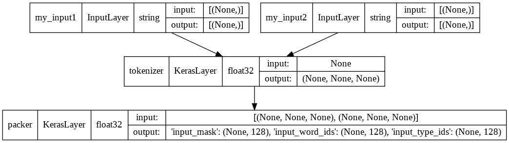
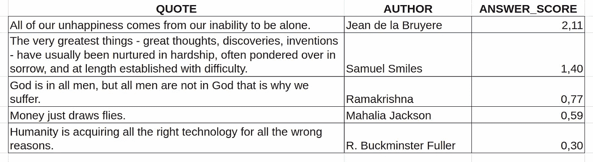
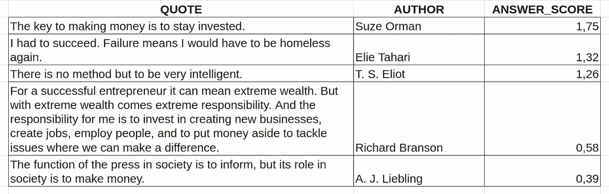
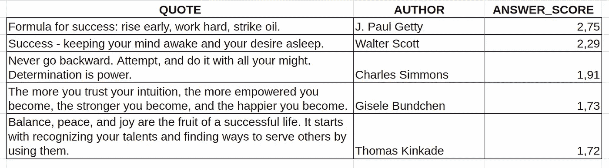

# 用变形金刚的流行语录回答问题:伯特语言模型

> 原文：<https://medium.com/mlearning-ai/answer-questions-by-popular-quotes-with-transformers-bert-language-model-fe832032ab2e?source=collection_archive---------5----------------------->


> 如需完整解决方案，请访问我的 GitHub

你想从著名思想家那里获得哲学问题的答案吗？

让我们用 [BERT](https://en.wikipedia.org/wiki/BERT_(language_model) architecture for NLP 在有影响力的作者的名言中寻找答案吧！

为此，我们将:

1.  使用 Google Colab 中的 TPU 有效地训练模型
2.  微调伯特的具体任务:“检查一个句子是否包含一个问题的答案”
3.  应用这个调整后的模型来查找可能包含所选问题答案的报价

# 伯特是什么？

> [BERT](https://en.wikipedia.org/wiki/BERT_(language_model) 的核心是一个 transformer 语言模型，具有可变数量的编码器层和自关注头。该架构与 Vaswani 等人(2017)的原始变压器实施“几乎相同”。
> 
> BERT 接受了两项任务的预训练:语言建模(15%的标记被屏蔽，BERT 被训练从上下文中预测它们)和下一句预测(BERT 被训练预测所选择的下一句是否可能或是否给出第一句)。作为训练过程的结果，BERT 学习单词的上下文嵌入。在计算代价昂贵的预训练之后，BERT 可以在较小的数据集上用较少的资源进行微调，以优化其在特定任务上的性能。

# 设置 TPU

在 Google Colab 中，可以使用 TPU 来代替 GPU。选择 Runtime -> Change runtime type，验证是否选择了 TPU，并连接到 TPU 工作进程:

```
**if** os**.**environ['COLAB_TPU_ADDR']:
  cluster_resolver **=** tf**.**distribute**.**cluster_resolver**.**TPUClusterResolver(tpu**=**'')
  tf**.**config**.**experimental_connect_to_cluster(cluster_resolver)
  tf**.**tpu**.**experimental**.**initialize_tpu_system(cluster_resolver)
  strategy **=** tf**.**distribute**.**TPUStrategy(cluster_resolver)
  print('Using TPU')
**elif** tf**.**config**.**list_physical_devices('GPU'):
  strategy **=** tf**.**distribute**.**MirroredStrategy()
  print('Using GPU')
**else**:
  **raise** ValueError('Running on CPU is not recommended.')
```

# 调整伯特模型

要将 BERT 应用到我们的任务中，我们需要执行以下步骤:

1.  以适合 BERT 的方式准备文本输入
2.  通过 BERT 编码器处理输入
3.  训练我们的神经网络使用编码输入来定义一个句子是否包含答案

首先，让我们使用 BERT 预处理层对输入进行预处理，以备后用:

```
*# Preprocessing for encoder*
tfhub_handle_preprocess **=** 'https://tfhub.dev/tensorflow/bert_en_uncased_preprocess/3'
```

我们的预处理模型有两个输入，如下所示:



为了进行预测，我们需要使用 BERT 编码器，然后使用密集层来预测每个问题-句子对的类别标签。BERT 编码器经过预训练，下载方式与预处理层相同:

```
*# BERT model - encoder*
tfhub_handle_encoder **=** 'https://tfhub.dev/tensorflow/bert_en_uncased_L-12_H-768_A-12/3'
```

为了微调这个架构，让我们使用一个[粘合数据集](https://gluebenchmark.com/) : [QNLI](https://rajpurkar.github.io/SQuAD-explorer/) (问答自然语言推理)。任务是确定上下文句子是否包含问题的答案。请参见以下数据集中的示例:

```
sample row 1
b'The period of time from 1200 to 1000 BCE is known as what?'
b'In the Iron Age'
label: 0 (entailment)

sample row 4
b"What is Nigeria's local vehicle manufacturer?"
b'In 2013, Nigeria introduced a policy regarding import duty on vehicles to encourage local manufacturing companies in the country.'
label: 1 (not_entailment)
```

为 3 个时期训练我们的模型:

```
Epoch 1/3
3273/3273 [==============================] - 362s 88ms/step - 
loss: 0.4016 - accuracy: 0.8314 - val_loss: 0.2576 - val_accuracy: 0.9079
Epoch 2/3
3273/3273 [==============================] - 272s 83ms/step - 
loss: 0.2434 - accuracy: 0.9204 - val_loss: 0.2582 - val_accuracy: 0.9142
Epoch 3/3
3273/3273 [==============================] - 270s 82ms/step - 
loss: 0.1539 - accuracy: 0.9555 - val_loss: 0.3484 - val_accuracy: 0.9142
```

# 用名言作为回答

为了找到哲学问题的答案，我们可以引用有影响力的思想家的名言。此处提供报价列表[。](https://github.com/akhiltak/inspirational-quotes/raw/master/Quotes.csv)

给定一个问题，我们可能会找到更有可能包含答案的引语:

*   将一个问题与每个报价配对，并使用我们训练有素的模型来确定该报价包含答案的可能性
*   对所有报价重复该过程，并选择得分最高的报价

由于我们有许多可能的报价(30k+唯一报价),我们可以选择每次使用一个较小的随机子样本来加快处理过程。

# 例子

让我们在几个问题上试试吧！

## 怎么开心？


## 人为什么会感到悲伤？



## 怎么挣钱？



## 如何变得成功？



# 参考

1.  伯特微调检查一个句子是否包含问题的答案:【https://www.tensorflow.org/text/tutorials/bert_glue
2.  名言:[https://github . com/akhiltak/inspirational-quotes/blob/master/quotes . CSV](https://github.com/akhiltak/inspirational-quotes/blob/master/Quotes.csv)

[](/mlearning-ai/mlearning-ai-submission-suggestions-b51e2b130bfb) [## Mlearning.ai 提交建议

### 如何成为 Mlearning.ai 上的作家

medium.com](/mlearning-ai/mlearning-ai-submission-suggestions-b51e2b130bfb)