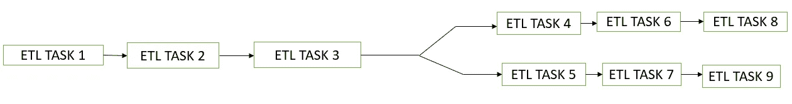
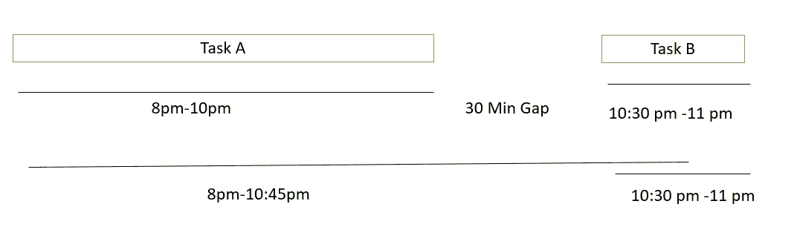
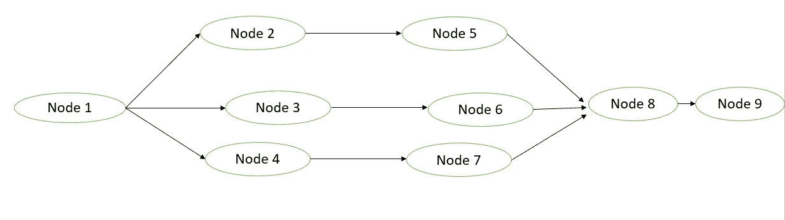

# 阿帕奇气流:基本介绍

> 原文：<https://medium.com/mlearning-ai/apache-airflow-a-basic-introduction-ce8e22a89210?source=collection_archive---------7----------------------->

[**Source**](https://www.google.com/search?q=apache+airflow&rlz=1C1CHBF_enIN998IN998&tbm=isch&source=lnms&sa=X&ved=2ahUKEwjMw7DCnN34AhVK7jgGHYjtAbAQ_AUoAXoECAEQAw&biw=1280&bih=609&dpr=1.5#imgrc=XowKbx0ZpUTtvM)

***什么是阿帕奇气流？***

Apache Airflow 是一个框架，用于以编程方式调度和监控数据管道。它运行不同的-不同的任务，它们有定义的执行依赖关系。

**执行依赖** :-它有助于区分任务的优先级，假设**任务 1** 和**任务 2** 是两个不同的任务。假设**任务 2** 是优先级最高的任务，那么在气流的帮助下，我们设置任务依赖关系，每当调度程序将首先运行时，将启动**任务 2** ，然后**任务 1** 将运行。

Apache Airflow 主要由 Airbnb 为他们的内部数据工程管道开发。如今，超过 500 家知名组织正在使用这个框架。

***Apache air flow 相对于传统调度器的优势？***

传统的调度程序在简单的 ETL 管道中工作得很好，但是当涉及到复杂的数据管道时，传统的调度程序会带来一定的挑战，因此我们需要一些健壮的框架来处理复杂的 ETL 管道，这里就涉及到气流了。

Fig :- Simplest ETL Pipeline

Fig :- Simple ETL Pipeline Nowadays used in Industry

1.  **错误处理** :-假设您已经运行了一个 ETL 任务，但它失败了。如果任务运行失败，Airflow 为我们提供了多次运行任务的灵活性。
2.  **执行依赖关系** :-假设你运行了两个任务，即:-任务 A 和任务 B。假设任务 B 依赖于任务 A。因此，首先任务 A 将运行，然后任务 B 将运行。

Fig :- Execution Dependencies

参考上图，假设在一个传统的调度器中，您将任务 A 调度在晚上 8 点(需要 2 个小时来执行)。半小时后，任务 B 将运行，但由于某种原因，任务 A 运行了 2.25 小时(晚上 8 点-10 点 45 分)，由于我们已将任务 B 安排在晚上 10 点 30 分，因此任务 B 将在任务 A 完成之前开始执行，并将导致错误(执行失败)。这种依赖是在气流中处理的。任务 B 只有在任务 A 成功运行后才会被执行。

3.**透明性** :-我们在传统的调度程序中看不到执行日志，但是 Airflow 在 UI 上给出了执行日志/历史记录。

4.任务跟踪:我们可以很容易地跟踪哪个任务执行了更长的时间。该任务为单次成功执行进行了多次尝试。甚至我们可以触发一封邮件，如果一些特定的任务在多次尝试后仍未成功运行。

> **气流中的常用术语**

1.  **DAG/ Workflow** :有向无环图

Fig :- Directed Acyclic Graph

有向无环图本质上是单向的。参考上图，我们可以从**节点 1** 到**节点 9** ，但不能回滚到**节点 1** 。这里每个节点代表任务，边代表依赖关系。在 DAG 的帮助下，我们可以决定哪个任务可以并行运行，哪个任务应该按顺序运行。DAG 仅决定如何运行工作流，它不运行实际计算。

2.操作符 :-操作符负责计算任务，比如运行 bash 命令，执行 python 函数等等。

3.**任务** :-一旦操作符被实例化，它就被称为任务。

**结论:-**

请继续关注更多关于阿帕奇气流的博客。如果你有任何建议和问题，请在下面评论。

 [## Mlearning.ai 提交建议

### 如何成为 Mlearning.ai 上的作家

medium.com](/mlearning-ai/mlearning-ai-submission-suggestions-b51e2b130bfb)