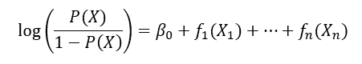
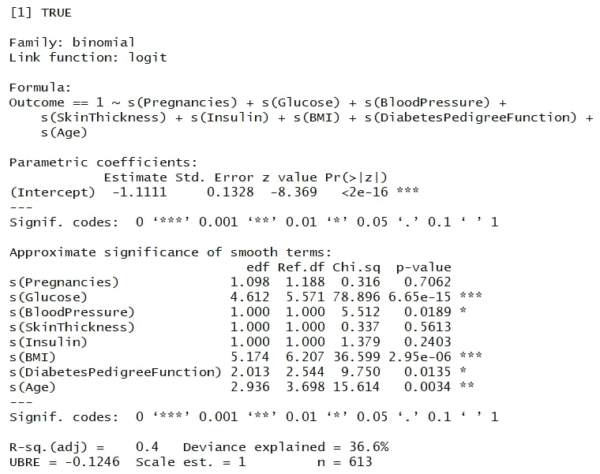
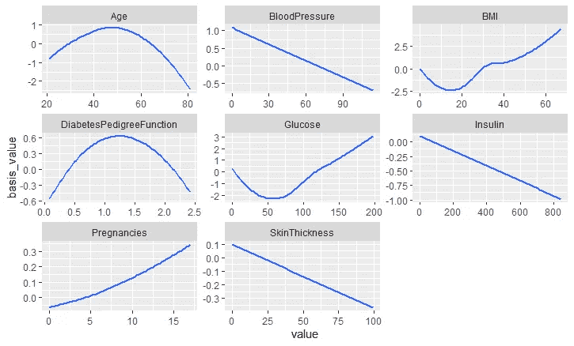
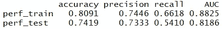
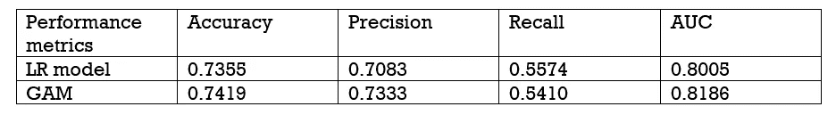

# 广义可加模型在糖尿病检测中的应用

> 原文：<https://medium.com/mlearning-ai/application-of-generalized-additive-models-gams-in-detecting-diabetes-3a44a26017aa?source=collection_archive---------1----------------------->

逻辑回归被证明是理解个体特征、 **X** ⱼ和响应变量、 **y** 之间关系的强大建模工具。尽管如此，它假设自变量和 logit 之间的关系是线性的和单调的。广义可加模型(GAMs)是一种在保持可加性的同时，在 logistic 模型框架内对非单调响应进行建模的方法。因为模型是可加的，每个独立变量的影响可以单独检查，同时保持所有其他变量不变，类似于逻辑回归。

下面是二元分类问题中逻辑回归 GAM 的数学公式:



*f* ⱼ是预测器 j 的非线性函数(平滑样条)。正是这些非线性函数允许对各个特征和响应之间的非线性关系进行建模。

让我们通过一个简单的例子来看看它是如何工作的。此外，在本演示结束时，我们可以看到逻辑回归和 GAM 之间的性能差异。

首先，在 r 中加载所需的库包。

```
library(mgcv) # library for GAM
library(ggplot2) # for beautiful plots
library(cdata) # data wrangling
library(sigr) # AUC calculation
```

设置数据文件所在的工作目录。将数据分为训练数据(80%)和测试数据(20%)，类似于上一篇文章。

```
data=read.csv(‘diabetes.csv’) # load the data into global #environmentset.seed(123) # for reproducibility
randn=runif(nrow(data))
train_idx=randn<=0.8
train=data[train_idx,]
test=data[!train_idx,]
```

*“mgcv”包中的 gam()* 函数用于训练 gam 模型。由于事先不知道每个预测值和 logit 之间的关系，因此我们使用 *s()* 来表示所有属性的基函数。

```
# formula: “Outcome==1” is to binarize the response variable
form_gam=as.formula(“Outcome==1~s(Pregnancies)+s(Glucose)+s(BloodPressure)+
 s(SkinThickness)+s(Insulin)+s(BMI)+s(DiabetesPedigreeFunction)+
 s(Age)”)gam_model=gam(form_gam,data=train,family = binomial(link=”logit”))
gam_model$converged # check if the algorithm converges
summary(gam_model)
```



变量 **X** ⱼ的函数 *f* ⱼ的平滑度可以通过上述输出中的 edf 进行总结。接近 1 的 edf 表示变量与输出具有近似的线性关系。像怀孕、血压、皮肤厚度和胰岛素这样的预测因素的 edf 正好为 1 或接近 1。与逻辑回归相似，p 值可用于评估预测值的统计显著性。“解释的偏差”告诉我们由模型解释的 logit 输出中方差的比例—在这种情况下，36.6%的方差可以由模型解释。

我们总是可以使用绘图(模型)语法来可视化每个预测值上的基函数映射。然而，这种语法只允许在一个图形中线性预测器标度上绘制一个平滑函数。以下代码片段提供了另一种可视化每个预测值上的基函数映射的方式。

```
# Visualize s() output 
terms=predict(gam_model,type=”terms”)
terms=cbind(Outcome=train$Outcome,terms)# convert terms into data frame
frame1=as.data.frame(terms)
# remove brackets
colnames(frame1)=gsub(‘[()]’,’’,colnames(frame1))
vars=setdiff(colnames(train),”Outcome”)
# remove first character ‘s’
colnames(frame1)[-1]=sub(“.”,””,colnames(frame1)[-1])
# Convert the wide to long form
library(cdata)
frame1_long=unpivot_to_blocks(frame1,nameForNewKeyColumn = “basis_function”,
 nameForNewValueColumn = “basis_value”,
 columnsToTakeFrom = vars)
# get the predictor values from training data
data_long=unpivot_to_blocks(train,nameForNewKeyColumn = “predictor”,
 nameForNewValueColumn = “value”,
 columnsToTakeFrom = vars)
frame1_long=cbind(frame1_long,value=data_long$value)ggplot(data=frame1_long,aes(x=value,y=basis_value)) +
 geom_smooth() +
 facet_wrap(~basis_function,ncol = 3,scales = “free”)
```



解释每个预测因子和反应之间的关系的方法，logit 非常简单，如上图所示。例如，通过参考图的左上图，被诊断为糖尿病的对数几率从 20 岁增加到 45 岁左右，然后趋于平稳，最后在 50 岁后下降。如果所有的预测因子保持不变，这种解释是正确的。请记住，在解释 GAM 模型时，也应考虑图的垂直刻度中显示的刻度以及模型摘要中的 p 值。

```
# function to calculate the performance of model in terms of #accuracy, precision, recall and
# area under the curve (AUC). The curve refers to receiver operating #characteristics curve.
performance=function(y,pred){
  confmat_test=table(truth=y,predict=pred>0.5)
  acc=sum(diag(confmat_test))/sum(confmat_test)
  precision=confmat_test[2,2]/sum(confmat_test[,2])
  recall=confmat_test[2,2]/sum(confmat_test[2,])
  auc=calcAUC(pred,y)
  c(acc,precision,recall,auc)
}
```

为某些需要重复执行的计算任务编写函数总是一个好的做法。“训练”和“测试”数据帧中的“预测”列包含后验概率 P(Y=1|X)，其中 Y=1 表示阳性反应(糖尿病)。因此，如果两个类别的误分类成本不同，则可以选择任意阈值来进行权衡建模。

```
# Posterior probability
train$pred=predict(gam_model,newdata = train,type = "response")
test$pred=predict(gam_model,newdata=test,type="response")# model performance evaluated using training data
perf_train=performance(train$Outcome,train$pred)
perf_test=performance(test$Outcome,test$pred)
perf_mat=rbind(perf_train,perf_test)
colnames(perf_mat)=c("accuracy","precision","recall","AUC")
round(perf_mat,4)
```



逻辑回归模型(见 [**上一篇**](https://jq0112358.medium.com/data-visualization-and-diagnosis-of-diabetes-using-logistic-regression-1ea3958335a5) )和 GAM 模型的性能指标列表如下。GAM 在准确度、精确度和 AUC 方面表现稍好，但在召回率方面不如 LR 模型。



Performances of both LR model and GAM.

总之，广义加性模型(GAMs)是线性模型的一个有用的扩展，它支持非线性建模(更灵活),同时保留了模型的可解释性。这些代码可以在 [Github](https://github.com/Jacky-lim-data-analyst/programmer.git) 和 [RPubs](http://rpubs.com/JQ_programmer_92/779781) 中找到。使用 Rstudio“闪亮”包开发了一个交互式应用程序。在 [Github](https://github.com/Jacky-lim-data-analyst/programmer.git) 和这个[链接](https://jqprogrammer.shinyapps.io/prediction2/?_ga=2.143980150.2136395793.1623984469-680060565.1623984469)中检查一下。