# 混合整数二次规划(MIQP)在特征选择中的应用

> 原文：<https://medium.com/mlearning-ai/application-of-mixed-integer-quadratic-programming-miqp-in-feature-selection-for-regression-3985d2ab95a7?source=collection_archive---------3----------------------->


A fancy pic about cherry picking on [Unsplash](https://unsplash.com/?utm_source=medium&utm_medium=referral)

线性回归是一种用于预测定量反应的监督学习算法。它假设在特征向量 xi∈R(d)和响应 yi∈R 之间存在线性关系。预测分析中最常见的问题之一是回归的变量选择。由于普通最小二乘法(OLS)很少产生精确为零的估计值，因此丢弃了与响应无关的特征，我们需要求助于特征选择方法。流行的方法包括:

子集选择，例如逐步选择。
降维，如主成分分析。
收缩，如套索。

由于计算困难，使用优化的直接变量选择长期以来一直被统计/分析社区所摒弃。这个计算问题是 LASSO 和 ridge 回归发展的部分动机。然而，在最近的过去，优化软件有了巨大的进步，如 Gurobi，特别是解决混合整数二次规划(MIQP)的能力。

在本文中，我们将提出回归的变量选择问题作为 MIQP，并与 LASSO 进行比较。我们将讨论每种方法的优缺点，并就哪种方法更适合哪种场景提出建议。

*请注意，本文中的建模示例可能需要您具备一些关于使用 Gurobi Python API 构建数学优化模型的知识。*

# ***临近***

在我们的实验中，有 2 个数据集，包括 x 和 y 数据。一个数据集是训练数据集，一个是测试数据集。我们将首先对训练集进行 10 重交叉验证，以选择 k 或λ。然后，利用 k 或λ的最佳值，我们将使用整个训练集来拟合βs。然后，利用这些β，我们将对测试集上的 y 值进行预测，并将我们对 y 的预测与测试集中 y 的真实值进行比较。

为了使我们的结果完全可复制，所有相关的源代码和数据集都在我们的 [github](https://github.com/ping2022/Mixed-Integer-Quadratic-Programming-MIQP-in-Feature-Selection) 上公开。

> ***方法一:直接变量选择— MIQP***

MIQP 是一种优化方法，它将常规的普通最小二乘损失函数最小化，并包括几个约束条件，如[大 M 方法](https://en.wikipedia.org/wiki/Big_M_method#:~:text=In%20operations%20research%2C%20the%20Big,%22greater%2Dthan%22%20constraints.)，它涉及使用二元变量，以便在损失计算期间在计算中包括或排除某些变量。另一个重要的约束是超参数 k，它是函数中包含的最大变量数。

我们现在提出一个 MIQP 公式，它可以找到线性回归问题的权重估计，其中正好 k 个权重可以是非零的。

**参数**

(1) k:包括在模型中的特征数量，忽略截距。有 50 个 X 变量，我们将尝试 k = [5，10，15，20，25，30，35，40，45，50]

(2) Q 矩阵:目标函数的二次分量。这里是一个(2m+1) * (2m+1)矩阵，其中矩阵的左上角等于 X(T)X，其他所有值为零。

(3) c:目标函数的线性分量。这里它是一个(2m+1) * 1 向量，其中前(m+1)个分量是-2y(T)X，其余的为零。

**决策变量**

(1) βj:特征 Xj 和连续变量的权重，代表特征 Xj 每单位变化的响应变量的变化。

(2) zj:二元变量。如果βj 正好等于零，则为 1，否则为 0。用于管理预算约束的辅助变量。

**目标函数**

**训练误差**:最小化误差平方和(SSE):


使用线性代数中的一些技巧，我们可以将目标函数设定为:

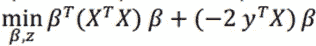

**约束条件**

(1) **互斥**:若 zj 为零，则对应的βj 为零。否则，βj 的值介于-M 和 M 之间。选择足够大的 M，使得βj 的值不等于 M 或-M。


(2) **预算约束**:非零特性数量不能超过 k。


基于以上，我们建立了如下的 MIQP 模型。该函数将返回由 MIQP 模型选择的 k 个权重。

```
def beta(X, y, k):
    new_column = [1] * len(X)
    X_addConst = np.insert(X, 0, new_column, axis=1)

    # define quadratic term Q
    Q = np.zeros((2*m+1, 2*m+1))
    Q[0:m+1, 0:m+1] = np.transpose(X_addConst) @ X_addConst

    # define linear term c
    X_expand = np.zeros((len(X_addConst), 2*m+1))
    X_expand[0:len(X_addConst), 0:m+1] = X_addConst
    c = -2 * np.transpose(y) @ X_expand

    # define left hand side of constraint matrix A
    A = np.zeros((2*m+1, 2*m+1))
    A[:,0] = 0
    A[0:m, 1:m+1] = np.diag(np.ones(m))
    A[0:m, m+1:2*m+1] = np.diag(np.ones(m))*M
    A[m:2*m, 1:m+1] = np.diag(np.ones(m))
    A[m:2*m, m+1:2*m+1] = np.diag(np.ones(m))*(-M)
    A[2*m:2*m+1, m+1:2*m+1] = [1]*m

    # define right hand side of constraint matrix B
    b = np.array([0]*(2*m+1))
    b[-1] = k

    # define lower boundary lb
    lb = np.array([np.NINF] + [-M]*m + [np.NINF]*m)  # lb = np.array([-M] * (2*m+1))

    # define optimization sense
    sense = np.array(['>']*m + ['<']*(m+1))

    # set up model
    MIQPMod = gp.Model()
    MIQPMod_x = MIQPMod.addMVar(len(Q),lb=lb,vtype=['C']*(m+1)+['B']*m)
    MIQPMod_con = MIQPMod.addMConstrs(A, MIQPMod_x, sense, b)
    MIQPMod.setMObjective(Q,c,0,sense=gp.GRB.MINIMIZE)

    MIQPMod.Params.TimeLimit = time
    MIQPMod.optimize()

    coef = MIQPMod_x.x
    loss = MIQPMod.objVal

    # return coefficients
    return coef[0:m+1]
```

请注意，训练误差会随着更多要素的考虑而单调下降(这相当于放松了 MIQP)，但我们还需要找到 k 的值，以最大限度地提高对未知观测值的回归性能。因此，建议通过交叉验证来估计 SSE。我们随机打乱数据，将其分成 10 份，并使用所有可能的 k 值进行 10 份交叉验证。下面显示了我们如何计算 SSE 并执行交叉验证。

```
def least_squares(coef, X, y):
    new_column = [1] * len(X)
    X = np.insert(X, 0, new_column, axis=1)
    a = X @ coef - y
    b = np.transpose(a)
    c = b @ a
    return cdef cross_val(X, y, k):
    accuracies = []
    coefs = []
    df = pd.DataFrame(columns = ['coef'])
    df['coef'] = list(df_train.columns)
    i = 1
    for train_index, holdout_index in kf.split(X):
        X_train, X_holdout = X[train_index], X[holdout_index]
        y_train, y_holdout = y[train_index], y[holdout_index]
        coef = beta(X_train, y_train, k)
        sse = least_squares(coef, X_holdout, y_holdout)
        df[str(i)] = coef
        i = i+1
        accuracies.append(sse)
    sum_sse = sum(accuracies)
    df.set_index(['coef'],inplace=True)
    return sum_sse, df, accuracies
```

接下来，我们选择对应于最小交叉验证错误的 k 值。在运行 MIQP 模型几个小时后，基于 10 文件夹交叉验证的最佳选择 k 是 10，相应的 sse 是 724.7876。

```
keys = []
values = []
coefs = []  # store each ten sets of coefficients for every k
accuracies = [] # store each ten sets of sse for every k
dict = {} # Store k and corresponding sse into dictionary
for k in k_all:
    sse, coef, acc = cross_val(X_train, y_train, k)
    keys.append(k)
    values.append(sse)
    coefs.append(coef)
    accuracies.append(acc)
dict['k'] = keys
dict['sse'] = valuesdf = pd.DataFrame(dict) # Convert dictionary into dataframe
best_result = df.loc[df['sse'].idxmin()] #find the best chosen k based on minimun sseprint('The best chosen k based on 10-folder cross validation is', best_result[0])
print('Corresponding sse is', best_result[1])
```

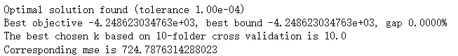

> ***趋近ⅱ:间接变量选择— LASSO:***

LASSO 回归是线性回归的一种形式，它使用收缩来从模型中删除变量，这样做可以使损失函数最小化。LASSO 使用超参数λ(λ)来执行这种收缩，其中λ越大，越多的 X 变量被强制到绝对零。下面是公式:

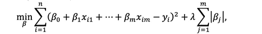

我们首先将λ设置为在间隔[0.001，1000]内计算的 100 个均匀间隔的数。接下来，我们对训练集进行 10 次交叉验证以选择λ。在同一数据集上运行 LASSO 回归只需要几秒钟。基于 10 文件夹交叉验证选择的最佳λ为 0.0756，相应的 sse 为 695.00097。

```
# Generate 100 uniform values between -3 to 3 as power series
alphas = 10**np.linspace(3,-3,100)# Write function that computes the sse over all 10 folds for lasso.
def cv_accuracy_score_lasso(X, y, alpha):
    model = Lasso(alpha=alpha)
    accuracies = []
    for train_index, holdout_index in kf.split(X):
        X_train, X_holdout = X[train_index], X[holdout_index]
        y_train, y_holdout = y[train_index], y[holdout_index]

        model.fit(X_train, y_train) # Fit the model

        #mse = mean_squared_error(y_holdout, model.predict(X_holdout)) # mse: average of squared error
        sse = sum((y_holdout-model.predict(X_holdout))**2) # sse: sum of squared error
        accuracies.append(sse)

    sum_sse = sum(accuracies)
    return sum_ssekeys = []
values = []
dict = {} # Store alpha and corresponding sse into dictionary
for alpha in alphas:
    keys.append(alpha)
    values.append(cv_accuracy_score_lasso(X_train, y_train, alpha))

dict['alpha_value'] = keys
dict['sse_value'] = valuesdf_lr = pd.DataFrame(dict) # Convert dictionary into dataframe
best_alpha = df_lr.loc[df_lr['sse_value'].idxmin()] #find the best chosen alpha based on minimun sseprint('The best chosen alpha based on 10-folder cross validation is', best_alpha[0])
print('Corresponding sse is', best_alpha[1])
```

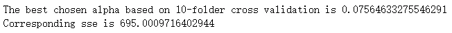

> ***测试集评估***

***直接变量选择——MIQP:***

找到最佳 k 后，使用 k=10 在整个训练集上拟合 MIQP 模型，并获得截距和系数，如下所示:

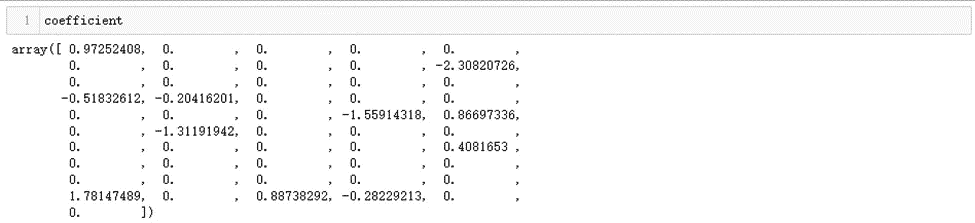

最后，我们使用上述截距和从 MIQP 获得的βj 来预测测试集中的 y 值。测试集上的 MIQP 上交所是 116.8272。

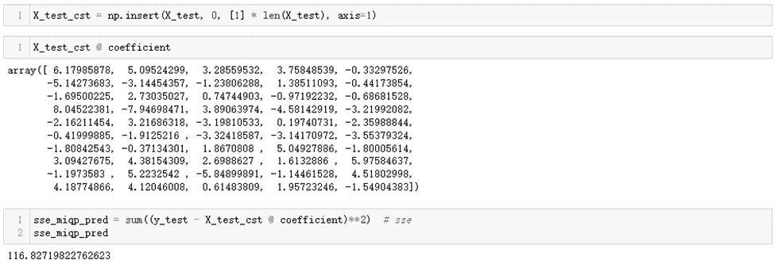

***间接变量选择-LASSO:***

在找到最佳λ之后，我们使用λ =0.0756 在整个训练集上拟合 LASSO 回归，并获得如下截距和系数。由此可以看出，LASSO 选择了 17 个变量，其中包括 MIQP 模型选择的 10 个 X 变量，但是它们的系数不同。

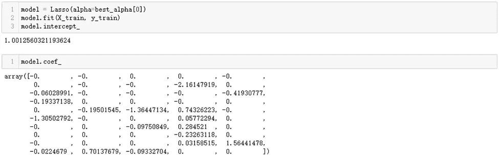

最后，我们使用上述截距和从 LASSO 获得的βj 来预测测试集中的 y 值。LASSO 在测试集上的 SSE 是 117.4688。

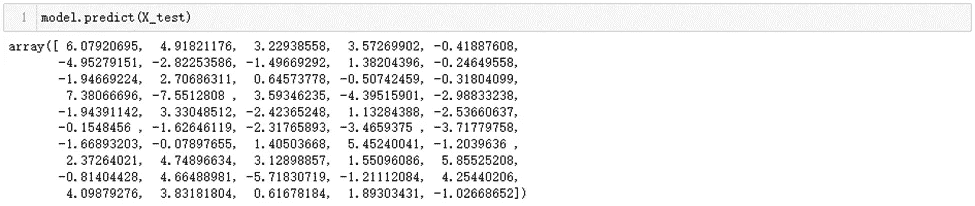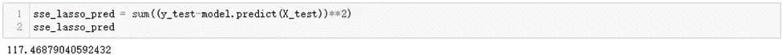

# I***n-样本比较***

根据样本内 sse 以及 MIQP 模型和 LASSO 回归返回的系数，可以看出:

(1)总体而言，MIQP 模型的样本内 sse 低于 LASSO 回归。

(2)在训练误差与特征个数的关系上，MIQP 和拉索呈现出不同的趋势。关于 MIQP，随着 k 减小到 10，训练误差(sse)大部分时间都在减小。关于 LASSO，随着λ从 0.0756 增加，训练误差(sse)也增加。

(3)使用 LASSO，特征选择的过程更平滑，因为 LASSO 允许我们逐渐将系数减小到 0，而不是直接消除一个变量。

(4)利用该数据集，MIQP 选取 10 个变量，训练 sse 为 724.7876，LASSO 选取 17 个变量，训练 sse 为 695.00097。由于训练错误是封闭的，我们可能会认为 MIQP 用更少的特征达到了同样的效果。

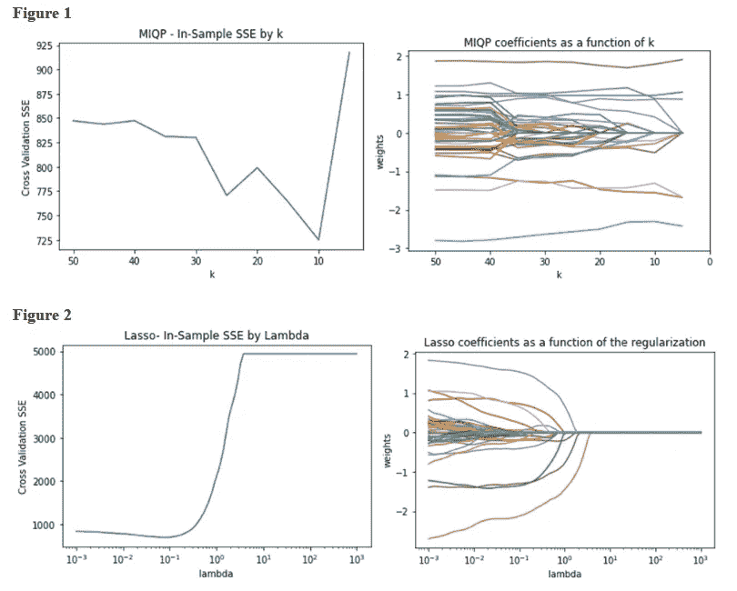

# ***样本外比较***

根据 MIQP 模型和 LASSO 回归返回的样本外上证综指，MIQP 略好于 LASSO。我们认为这是因为通过缩小β，我们给估计值增加了偏差。此外，我们观察到 MIQP 用更少的特征获得了更好的性能。这很方便，因为它导致了一个更易解释的模型。

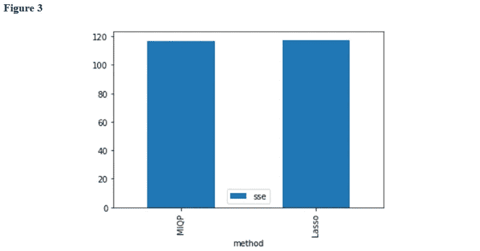

另一方面，正如我们所知，LSAAO 不是规模不变的，因为预算约束是基于 L1 准则的。记住，βj 被解释为特性 Xj 每单位变化的响应变化。由于 L1 范数取绝对值之和，βj 消耗多少预算取决于与其相关的特性的测量单位。

然而，MIQP 是尺度不变的，不会给权重估计增加偏差。此外，这种方法符合附加线性约束[1]的规范，例如:

加强特征间的组稀疏性。

限制成对多重共线性。

限制全球多重共线性。

考虑一组固定的非线性变换。

# **结论**

基于以上所述，我们已经展示了如何使用优化来对线性回归问题执行特征选择。由于直接变量选择的计算时间随着更好的解算器的出现而减少，它实际上是套索的一个很好的替代方案，假定 MIQP 是比例不变的，并且不会给重量估计引入偏差。因此，如果在这样的数据集规模下，解决任务的 3 小时时间跨度是可以接受的，我们将推荐使用 MIQP。换句话说，如果我们有足够的计算能力，或者愿意为了更好的结果而投资计算能力。

与 LASSO 相比，MIQP 更适合高维数据，不容易出现共线性，性能更好，但运行时间更长。即使我们通常的任务有较低维度的较小数据集，我们也建议在遇到较高维度或需要高级性能的任务时合并它。

然而，如果我们想要迅速的结果，愿意用有限的计算资源来解决体面的解决方案，或者通常用较低维度的数据来处理任务，那么可能就没有必要引入 MIQP。尤其是如果合并过程成本太高或耗时太长。由于套索可以在几分钟内解决这样的任务，而 MIQP 需要几个小时，套索也适合流媒体。

总而言之，我们的建议是“统计学中没有免费的午餐”。也就是说，在所有可能的数据集下，没有算法比其他算法更好。在分析数据集时，我们将考虑多种学习算法。

# 感谢

我们要特别感谢丹尼尔·米切尔博士在整个分析过程中的指导。

# 参考

[1]资料来源:贝特西马斯博士和金博士(2015 年)。或者论坛——线性回归的算法方法。运筹学，64(1)，2–16 页。

# Github 链接

[](https://github.com/ping2022/Mixed-Integer-Quadratic-Programming-MIQP-in-Feature-Selection) [## GitHub-ping 2022/混合整数二次规划-MIQP-特征选择:比较…

### 混合整数二次规划(MIQP)和 LASSO 在特征选择中的比较我们知道，最…

github.com](https://github.com/ping2022/Mixed-Integer-Quadratic-Programming-MIQP-in-Feature-Selection) [](/mlearning-ai/mlearning-ai-submission-suggestions-b51e2b130bfb) [## Mlearning.ai 提交建议

### 如何成为 Mlearning.ai 上的作家

medium.com](/mlearning-ai/mlearning-ai-submission-suggestions-b51e2b130bfb)