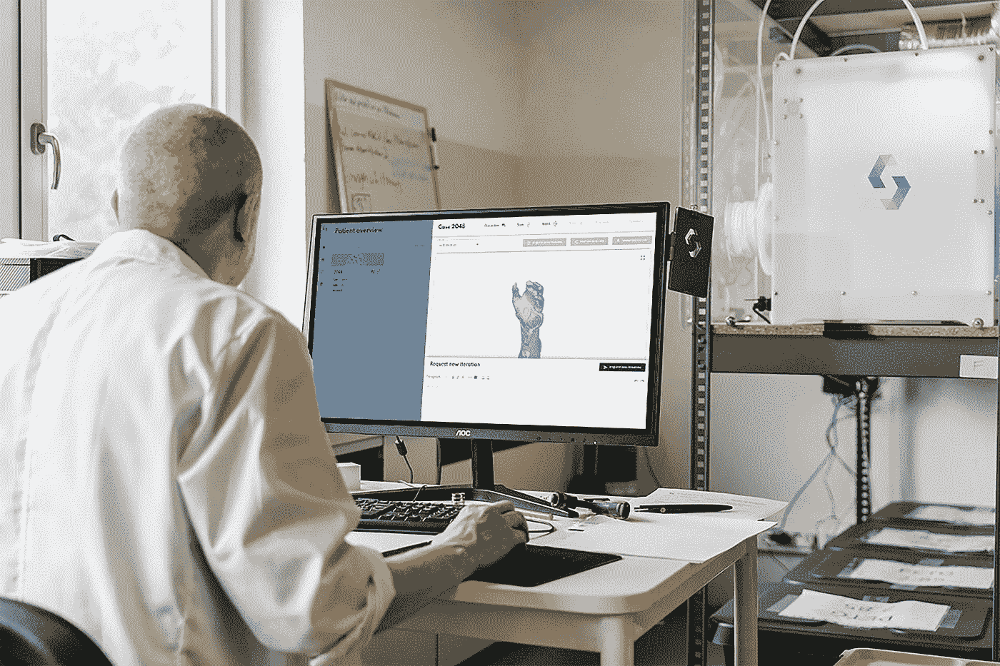

# 深度学习技术在现代医疗保健中的应用:我们应该期待什么？

> 原文：<https://medium.com/mlearning-ai/applications-of-deep-learning-techniques-in-modern-health-care-what-should-we-expect-35166e4b1272?source=collection_archive---------15----------------------->

Photo by [Tom Claes](https://unsplash.com/@tomspentys?utm_source=medium&utm_medium=referral) on [Unsplash](https://unsplash.com?utm_source=medium&utm_medium=referral)

# 一.导言

人工智能及其子学科的发明被公认为计算机科学的第四次重大革命。人工智能和这个特定的案例中，深度学习在过去几十年里一直在医疗保健领域快速发展。尽管有人认为它仍然需要人工监控，并可能导致失业，但它在诊断和研究领域的效率是准确的。此外，深度学习模型是用人工神经网络(ann)建立的，人工神经网络是对现实生活问题最准确的数学评估之一。因此，它不仅在医疗保健方面具有绝对的优势，而且还能协助研究并提供实时数据。深度学习实际上是一种被称为神经网络的人工智能的新术语，这种人工智能已经流行了 70 多年。芝加哥大学的两位学者 Warren McCullough 和 Walter Pitts 于 1952 年转到麻省理工学院，成为通常被称为“第一个认知科学系”的主要成员，他们在 1944 年创建了神经网络。

神经网络是一种机器学习方法，计算机通过评估训练样本来学习完成一项任务。典型地，这些例子已经被手工标注。例如，一个对象识别系统可能被输入数以千计的带有标签的车辆、住宅、咖啡杯等照片，它将检测图像中经常与某些标签相关联的视觉模式(Hardesty，2017，第 10 段)。6).从本质上讲，许多杰出的认知科学家和计算机科学家认为，医疗保健中使用的深度学习模型经过验证的数学准确性可能会导致失业，因此由于缺乏直觉，可能需要人工监控。然而，仔细评估大型数据集以教会机器执行特定任务超过了它的缺点。

# 二。使用实时数据

即将到来的传统医疗保健实践可能很快就会到来，病人在看医疗专业人员之前会先看电脑(Greenfield，2019，第 10 段)。1).随着人工智能(AI)特别是其子领域深度学习的突破，误诊和治疗疾病症状而不是其根本原因的日子似乎即将结束。

实时获得可靠的信息是诊断和治疗医学疾病的一个重要组成部分。医生和其他医疗专业人员可以使用深度学习模型，通过利用实时和精确的数据来加速和优化重要的临床决策(“利弊”，2021 年，第 10 段)。2).更快速和更现实的发现可以带来更好的预防措施、成本降低和患者等待时间。它强调，“随着人工智能技术变得越来越先进，可以收集的数据比传统医疗机构可能积累的更多。”(杨，2021 年，第 100 段)。2).

实时分析有助于增强医患关系。使用移动设备提供重要的健康数据有助于患者参与治疗。同样，移动通知可以通知医生和护士患者病情和危机的重大变化。由于实时数据有助于自动化许多流程，医疗专业人员依赖于预构建的模型来加速耗时的任务。

该过程中的一个关键步骤是确定是否需要数据集作为深度学习模型的知识库。如果文献中有符合研究人员标准的数据集，那么重复使用该数据集以提高结果的可比性将是一种简单且良好的做法(Dekhtiar 等人，2018 年)。然而，所提到的场合并不总是理想的情况。当应用数据科学程序、算法或模型时，在学习阶段开始之前，必须首先收集大量数据。这个阶段对于研究或工程来说可能是一个严重的瓶颈，而且它可能非常昂贵。特别是在深度学习应用的情况下，需要的输入数据量非常大。

因为更重要的任务是自动化的，所以医务人员将有更多的时间来分析病人和检测疾病。深度学习模型正在加快流程，节省医疗机构宝贵的生产时间。在任何行业，时间都等于金钱，因此它有可能节省大量的金钱。每年大约有超过 2000 亿美元浪费在医疗保健上。管理负担，如归档、评估和结算账目，导致了这些浪费性支出的很大一部分。新的自然语言处理(NLP)和深度学习算法可以帮助医生分析医院病例，防止拒绝。

# 三。结论

临床医生必须了解算法的限制，计算机科学家必须了解临床数据，以便创建可能用于临床的算法。公司可能不得不透露他们算法操作的秘密，以便更多的观众可以审查程序并指出可能损害病人护理的不准确之处。我们似乎离在临床上独立工作的算法还有很长的路要走，特别是在缺乏明确的临床许可的情况下。定义算法被判断为足够准确以用于临床所需的特征，同时解决算法决策中不准确的潜在来源，并提前了解算法在哪里繁荣和失败，可以让公众接受算法在某些任务中取代医生。然而，为了普遍提高各种疾病的医疗实践的准确性和效率，这些挑战是值得努力克服的。

## 参考

C. T .奥科洛(2022 年)。为全球南部的医疗保健优化以人为中心的人工智能。*图案*，

3(2), 1–7.doi:10.016/j . pattern . 2021 . 102386363221

皮，j .和范，Y. (2021)。机器人对工会均衡失业的影响

工人。*国际经济评论&金融，71，*663–675。

doi:10.1016/10.003

德雷克塞尔大学计算与信息学院。(2021). *CCI 故事:优点&缺点*

*医学中的人工智能。*检索自

[https://drexel . edu/CCI/stories/人工智能-医学-利弊/](https://drexel.edu/cci/stories/artificial-intelligence-in-medicine-pros-and-cons/)

格林菲尔德 d . &威尔逊 S. (2019 年 6 月 19 日)。医学中的人工智能:

应用、含义和限制。*科学新闻。*检索自

[https://sitn . HMS . Harvard . edu/flash/2019/artificial-intelligence-in-medicine-applications-implications-and-limits/](https://sitn.hms.harvard.edu/flash/2019/artificial-intelligence-in-medicine-%20%20%20applications-implications-and-limitations/)

 [## Mlearning.ai 提交建议

### 如何成为 Mlearning.ai 上的作家

medium.com](/mlearning-ai/mlearning-ai-submission-suggestions-b51e2b130bfb)